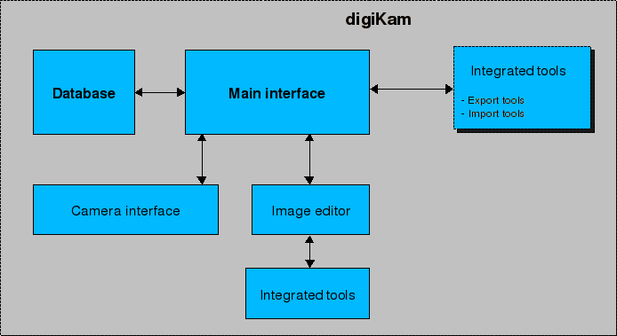

.. meta::
   :description: Introduction to digiKam Photo Management Program
   :keywords: digiKam, documentation, user manual, photo management, open source, free, learn, easy

.. metadata-placeholder

   :authors: - Gilles Caulier <caulier dot gilles at gmail dot com>

   :license: Creative Commons License SA 4.0

.. _introduction_root:

Introduction
============

.. contents::

Background
----------

**digiKam** is an advanced digital photo management application for Linux, MacOS and Windows desktop. It provides a simple interface which makes importing and organizing digital photographs a "snap". digiKam enables you to manage large numbers of digital photographs in Albums and to organize these photographs for easy retrieval using tags (keywords), captions, collections, dates, geolocation and searches. It has many features for viewing, organizing, processing and sharing your images. Thus, digiKam is a formidable :ref:`Digital Asset Management <using_dam>` (DAM) software including powerful image editing functions.

An easy-to-use Camera interface is provided, that will connect to your digital camera and download photographs directly into digiKam Albums. `More than 1000 digital cameras <http://www.gphoto.org/proj/libgphoto2/support.php>`_ are supported by the gphoto2 library. Of course, any media or card reader supported by your operating system will interface with digiKam.

digiKam incorporates a fast Image Editor with many image editing tools. You can use the Image Editor to view your photographs, comment and rate them, correct, enhance and alter them. The images post processing can be easily done by a set of tools though the Batch Queue Manager, or by many import and export tools dedicated to work with remote web services. 

While digiKam remains easy to use, it provides professional level features by the dozens. It is fully 16 bit enabled including all available tools, supports RAW format conversion through libraw, DNG export and ICC color management :ref:`work flow <rawprocessing_workflow>`. 

Reporting Bugs
--------------

digiKam is an Open Source project. This means that it relies on its users to play their part by, at least, reporting problems and suggesting possible improvements.

digiKam makes it as easy as possible for you to report bugs or suggest improvements. Wherever you are in the application the Help menu will include a Report Bugs option. This will display a message box with a highlighted link. Click on the link and your web browser will open the page for the reporting system. All the information required will already be filled in, just follow the instructions for completing your report.

Support
-------

digiKam is a community supported project, which means that users and developers support one another. If you become a regular user of digiKam you are encouraged to join the digiKam Users Mailing List. You can start off by asking questions to other digiKam users and hopefully soon you will be answering the support questions of others.

`digiKam Users Mailing List joining instructions <https://mail.kde.org/mailman/listinfo/digikam-users>`_.

You can also visit the `digiKam Home Page <https://www.digikam.org/>`_ for news of new releases and other digiKam related information.

Getting Involved
----------------

There are many ways that you can get involved with the continued development of digiKam. You do not need to be a software developer. You can help with documentation, translation and user interface design or just contribute really good ideas to the wish-list. You can also get involved by testing early development code as it is being developed and providing feedback to the developers. Of course, if you are a software developer then you can help to make digiKam the best digital photograph application there is.

The best way to start getting involved with digiKam is to join the Developers Mailing List.

`digiKam Developer Mailing List joining instructions <https://mail.kde.org/mailman/listinfo/digikam-devel>`_.
