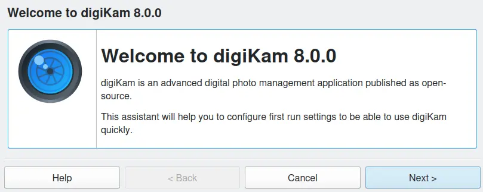
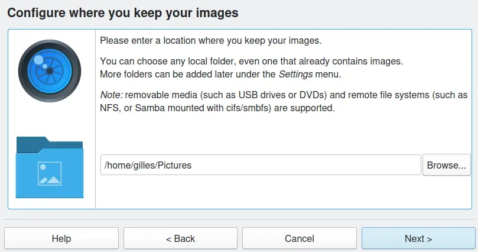
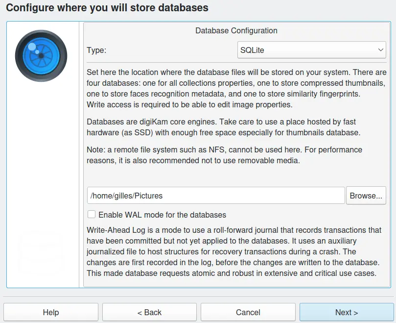
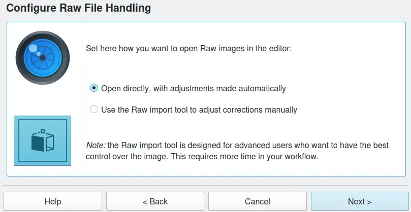
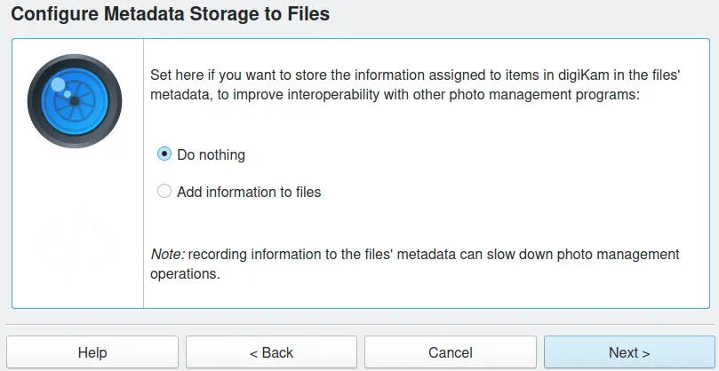
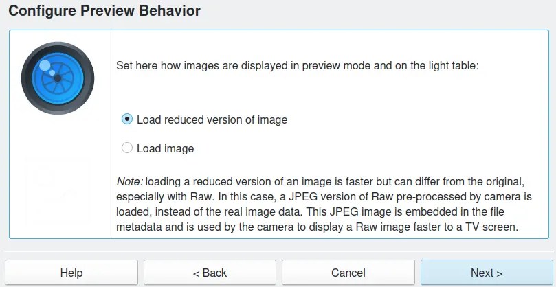
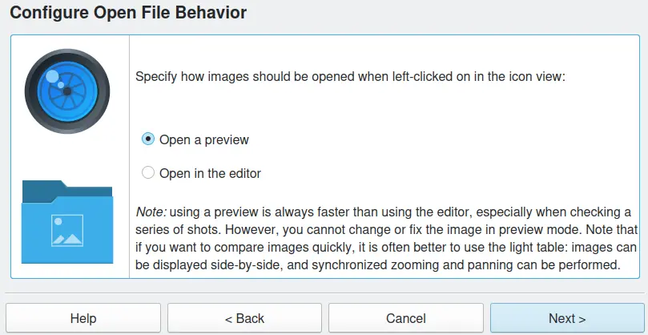
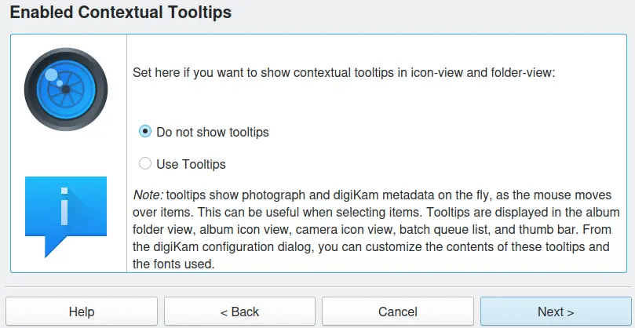
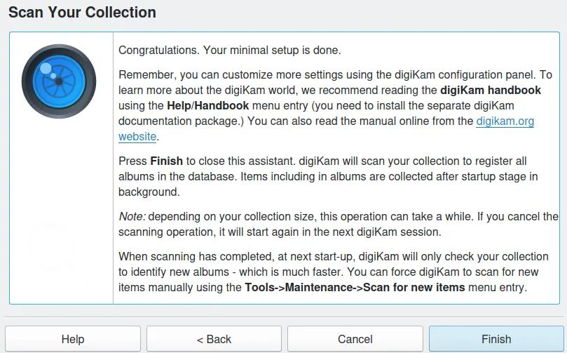
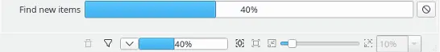

.. meta::
   :description: How to quickly start using the digiKam photo management program
   :keywords: digiKam, documentation, user manual, photo management, open source, free, learn, easy, first-run, scan, setup

.. metadata-placeholder

   :authors: - digiKam Team

   :license: see Credits and License page for details (https://docs.digikam.org/en/credits_license.html)

.. _quick_start:

:ref:`Quick Start <getting_started>`
====================================

    digiKam First Run Assistant Welcome Page

When you start digiKam for the very first time it will ask you a series of questions to customize the application for your setup. Do not panic if you are uncertain of the answer to any of these questions! All of these options can be changed at a later date.

digiKam will first ask where you store your photographs. You can choose any local, remote or removable folder. Just type in the path name of a folder or click on the **Browse...** icon to select a folder from the dialog.

Later on you can add as many locations as you like to the album library. Additional locations can be added using the menu :menuselection:`Settings --> Configure digiKam --> Collections`

    digiKam First Run Assistant Collection Path

.. index:: single: SQLite

The next step is to specify a local folder on your computer for digiKam to store the database files it uses to track all of your images. You must also select the type of database digiKam will use. If you have a local installation and a collection of less than 100.000 photographs you should probably accept the default setting of SQLite. For more information about the database type selection refer to the :ref:`digiKam Database <database_intro>` section of this manual.

    digiKam First Run Assistant Database Setup

The next step is to choose the way you would like to open RAW files – either with automatic adjustments or with the digiKam RAW import tool that allows you to make manual adjustments. If you don't know what a RAW file is, or if your camera doesn't support RAW files, you should keep the default setting and skip this step.

    digiKam First Run Assistant Raw File Behavior

The next step is to specify whether you want to have digiKam automatically store metadata info into your image files. If you plan to work with another photo management program, you may want to choose **Add information to files**. But if you don't want to alter your pictures, keep the default setting: **Do nothing**.

    digiKam First Run Assistant Metadata Behavior

The next step is to choose how digiKam will load images in preview mode and in the light table. Reduced versions will load faster but at the cost of display quality.

    digiKam First Run Assistant Preview Behavior

The next step is to choose how digiKam will open images with a click of the right mouse button. Previews  load faster but select **Open in the editor** if you want to most easily edit your pictures.

    digiKam First Run Assistant Open-File Behavior

The next step is to choose whether you want to use contextual tooltips. Tooltips are a fast and easy way to display important information about a photograph, they popup as the mouse hovers over a thumbnail.

    digiKam First Run Assistant Tooltips Behavior

Click on **Finish**, and digiKam will start to scan for photographs. Or you can click on **Cancel** to cancel the first run assistant.

    digiKam First Run Assistant Last Page

None of these options will alter your photographs in any way. During folder scanning, a progress bar is displayed in the lower right corner like this:

    digiKam First Start Scan Process to Populate the Database

.. note::

    digiKam will recurse the library path to its full depth. You cannot exclude (prune) any sub-path unless you make that sub-path hidden. You have to do that from outside of digiKam by putting a dot in front of the sub-path. Later in the digiKam configuration panel, you can list folders to exclude with the :ref:`Ignored Directories <ignored_directories>` setting.

Since digiKam directly accesses images in the folders on your hard disk, it is possible for other applications like file managers to remove one or more albums outside of a digiKam session. When this happens, the next time digiKam is run it will ask you whether all of the albums that have been removed from the digiKam photographs root path should be deleted from the albums database. If you want to move folders around and don't want to do that in digiKam, we suggest you do that while digiKam is running, so the database will be kept in sync and you do not lose any metadata.

When you use an existing folder of photographs as the Album Library folder, you will notice that the Albums in the Album list do not have photographs as their icons. You can add a photo to any album icon by dragging a photograph in the Album onto the folder icon in the left sidebar. See :ref:`the Albums section <albums_view>` for details on how to change the Album icon.

digiKam uses a dedicated database to store thumbnails produced with an optimized wavelet compression algorithm (PGF). There is no way of hiding non-standard thumbnail folders created by another application from the **Albums** list. If you want to keep them, you could create an Album Category that just contains all the thumbnail Folders and then view your Albums in :menuselection:`View --> Sort Albums --> By Category` order. See :ref:`the Albums section <albums_view>` for more information about Album Categories.

Once you have configured the Album Library Folder you can set up digiKam to work with your digital camera, refer to :ref:`the Camera section <camera_devices>` for more details. Good next steps would be to learn how to use :ref:`Albums <albums_view>` and :ref:`Tags  <tags_view>` to arrange and find your photographs.

.. _firstrun_downloads:

.. important::

    When first run, digiKam will ask to download several large files from the Internet. These files are the deep-learning models used for facial recognition, red eye removal, and the image quality sorting features. If you skip downloading these files, these features will not work properly. But you can always download these files later from the :ref:`Setup/Miscs/System <system_settings>` dialog.

    .. figure:: images/models_downloader.webp
        :alt:
        :align: center

        digiKam First Run Dialog to Download Deep-learning Model Files
