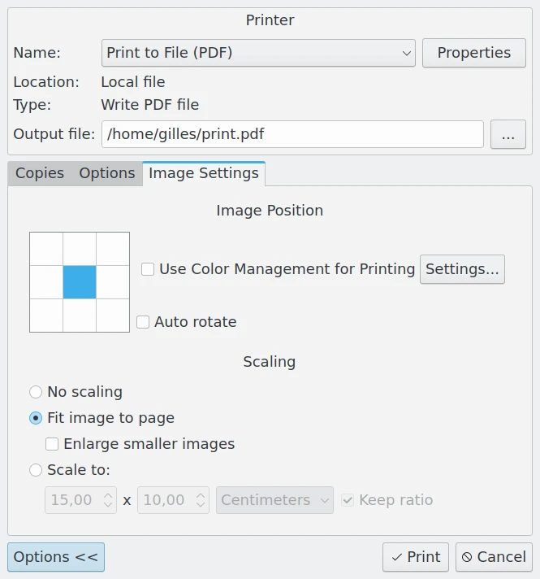

.. meta::
   :description: Basic Operations With digiKam Image Editor
   :keywords: digiKam, documentation, user manual, photo management, open source, free, learn, easy, image, editor, revert, undo, redo, print, review

.. metadata-placeholder

   :authors: - digiKam Team

   :license: see Credits and License page for details (https://docs.digikam.org/en/credits_license.html)

.. _basic_operations:

:ref:`Basic Operations <image_editor>`
======================================

.. contents::

Revert to Original Photograph
-----------------------------

The editing functions of the Image Editor will make changes to your photograph, but none of the editing functions will change the original photograph unless you select :menuselection:`File --> Save` or click the **Save** button in the tool bar. Note that once you have saved the changed version, you will not be able to recover the original photograph.

You might prefer to make a copy of your photograph before you make any changes. You can use :menuselection:`File --> Save As...` to save a working copy.

At any time before you save your photograph, you can restore the view to the original image by selecting :menuselection:`File --> Revert` or clicking the **Revert** button on the tool bar. You will lose any changes that you have made to the photograph since it was last saved.

Undoing and Redoing Actions
---------------------------

Almost anything you do to an image in Image Editor can be undone and redone. You can undo the most recent action by choosing :menuselection:`Edit --> Undo`, and redo by :menuselection:`Edit --> Redo`.

Undo and redo are such common actions, that you'll find it convenient to memorize the keyboard shortcuts, :kbd:`Ctrl+Z` to undo an action, and :kbd:`Ctrl+Shift+Z` to redo an action.

Hold down the left mouse button over the undo or redo icon in the tool bar for a moment to display a context menu that lists prior actions. If you choose an action from the context menu, all undo or redo actions until the chosen action are undone or redone.

Moving Between Photographs
--------------------------

Once the Image Editor has been opened, you can move between photographs in the same view you started from by using the navigator buttons on the toolbar, :kbd:`PgUp`, :kbd:`PgDn` or the **Back** and **Forward** entries in the **File** menu. If you have made any changes to the current photograph, you will be asked if you want to save them.

Changing the View
-----------------

You can zoom in and out of a photograph using the **Ctrl-scroll** wheel, the status bar icons or the entries in the View menu.

To make a photograph fit the window use the **Zoom to Window** icon on the status bar.

:menuselection:`View --> Full Screen Mode` will display the photograph using the full screen mode. You can move back to the normal view by pressing the :kbd:`Esc` key. By default the toolbar is still displayed even in Full Screen Mode. If you would prefer that the toolbar is not displayed you can turn it off using the full screen options found at :menuselection:`Settings --> Configure digiKam... --> Image Editor page --> Editor Window tab`.

Printing Images
---------------

When you want to print the current image from the Image Editor, select :menuselection:`File --> Print image...` :kbd:`Ctrl+P` and you get the standard Print dialog to adjust the settings before printing your photograph.

    Standard Print Dialog from image Editor

.. note::

    Under Windows, at least one printer module must be installed on your system to support this function.

From the main window view you can print single images or selected sets of images. Entire thumbnail pages can be printed with your selection. All you need to do is select images in the standard way, then select :menuselection:`Tools --> Print Creator...`. Then follow the instructions as explained in the :ref:`Print Creator <print_creator>` section of the manual.
