.. meta::
   :description: digiKam Image Editor Colors Tools
   :keywords: digiKam, documentation, user manual, photo management, open source, free, learn, easy, image, editor, color, depth, space, correction, auto, black, white, filters, emulation, infrared, invert, negative, balance, curves, levels, hue, saturation, lightness, channel, mixer

.. metadata-placeholder

   :authors: - digiKam Team

   :license: see Credits and License page for details (https://docs.digikam.org/en/credits_license.html)

.. _colors_tools:

:ref:`Color Tools <image_editor>`
=================================

.. contents::

.. _color_depth:

Encoding Depth
--------------

The digiKam **Convert to 8 bits** and **Convert to 16 bits** tools allow you to change the encoding depth per color channel of the edited image. 8-bit encoding is the common JPEG format, 16-bit encoding is better suited for high quality images, but this format uses more storage space and calculation time. 16-bit encoding is currently available only with PNG, PGF, TIFF, and JPEG-2000 formats. There are no parameters to adjust for either of these tools, so no dialog appears.

.. note::

    When you re-encoding an image from 8-bit to 16-bit, uniformly distributed noise is introduced to prevent histogram holes due to color range expansion.

.. important::

    HEIF, AVIF, JPX formats can encode as 8 bits or 12 bits. WEBP is limited to 8 bits. These limitations may change in the future.

.. _color_cm:

Color Space Convertor
---------------------

The digiKam **Color Space Convertor** tool allows you to convert an image from one color space to another. You can also use it to assign a color profile to an image. For detailed instructions on the use of color profiles, please refer to the :ref:`Color Management <color_management>` and :ref:`Color Management Settings <cm_settings>` sections of the manual.

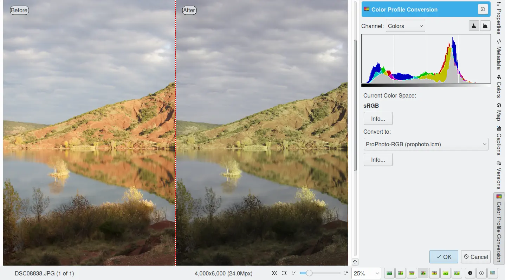

    The Image Editor Color Space Convertor Tool

.. _color_auto:

Color Auto-Correction
---------------------

The digiKam **Color Auto-Correction** tool allows you to apply one of five automatic corrections that will in most cases improve an image. You may want to apply this tool before making more detailed manual adjustments.

The **Auto Levels**, **Normalize**, **Equalize**, **Stretch Contrast**, and **Auto Exposure** available from :menuselection:`Color --> Auto-Correction...` menu entry menu will attempt to work out the best color levels automatically. You will need to experiment with the effects of these functions to see what works best with your photograph.

   - **Auto Levels**: This option maximizes the tonal range in the Red, Green, and Blue channels. It searches the image shadow and highlight limit values and adjusts the Red, Green, and Blue channels to a full histogram range.

   - **Normalize**: This option scales brightness values across the selected image so that the darkest point becomes black, and the brightest point becomes as bright as possible without altering its hue. This is often a "magic fix" for images that are dim or washed out.

   - **Equalize**: This option adjusts the brightness of colors across the selected image so that the histogram for the Value channel is as flat as possible, that is, so that each possible brightness value appears in about the same number of pixels as each other value. Sometimes Equalize works wonderfully at enhancing the contrast of an image. Other times it gives garbage. It is a very powerful operation, which can either work miracles on an image or ruin it.

   - **Stretch Contrast**: This option enhances the contrast and brightness of the RGB values of an image by stretching the lowest and highest values to their fullest range, adjusting everything in between. This is noticeable only with washed-out images and can be a good fix-it tool for bad photographs.

   - **Auto Exposure**: This option enhances the contrast and brightness of the RGB values of an image to calculate optimal exposure and black level using image histogram properties.

The results of any adjustments you make will not be saved until you save your photograph.

    The Image Editor to Color Auto-Correction Tool

Black & White
-------------

The digiKam **Black & White** tool converts your color images to beautiful black & white. Black & white photography has always been fascinating because of its abstract nature. With the advent of digital photography, black & white has almost become a desktop activity, as color images can be easily converted on the computer into black & white. digiKam even provides a set of vintage film roll profiles to make your images look like monochrome film. This filter is also able to simulate traditional infrared film material.

.. _color_bw:

Legacy Film Emulation
~~~~~~~~~~~~~~~~~~~~~

digiKam comes with a couple of black & white filters that you can apply to your photographs to achieve that classic black & white chemical toning from film photography. The controls come on four drop-down items: **Film**, **Lens Filters**, **Tone** and **Luminosity** as shown on the screenshot below. Film, filters and color toning can be applied independently of each other, which means they can be used in combination. The filters actually influence the RGB channel mixing, whereas the toning adds a uniform monochromatic tint to the black & white photograph. In the lightness tab you will find a tonal adjustment tool (like curve adjust), a contrast tool and an over-exposure indicator to improve the black & white rendering.

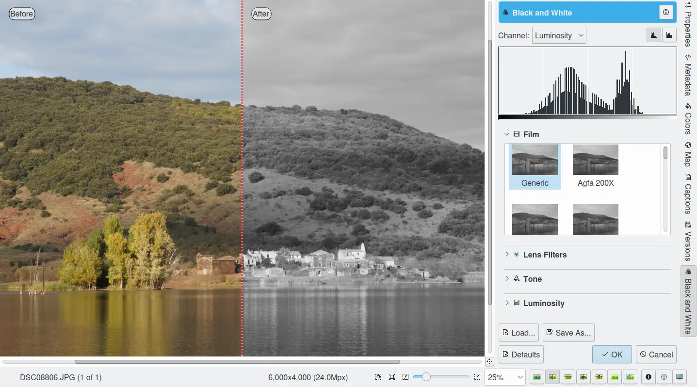

    The Image Editor Black and White Tool

The **Film** setting allows you to emulate a number of famous black & white photographic films such as:

    - **Generic**.
    - **Agfa**: 200X, Pan 25, Pan 100, Pan 400.
    - **Ilford**: Delta 100, Delta 400, Delta 400 Pro 3200, FP4 Plus, HP5 Plus, PanF Plus, XP2 Super.
    - **Kodak**: Tmax 100, Tmax 400, TriX.

With **Lens Filters** setting, the effect of a color filter placed in front of lens can be simulated:

    - **No Lens Filter**: simulate black & white neutral film exposure.
    - **Green Filter**: simulates black & white film exposure with green lens filter. This will enhance all scenic images, and is especially suited for portraits taken against the sky (similar to 004 Cokin(tm) Green filter).
    - **Orange Filter**: simulates black & white film exposure with an orange lens filter. This will enhance landscapes, marine scenes and aerial photography (similar to 002 Cokin(tm) Orange filter).
    - **Red Filter**: simulates black & white film exposure with red lens filter. Creates dramatic sky effects and can simulate moonlight scenes in daytime (similar to 003 Cokin(tm) Red filter).
    - **Yellow Filter**: simulates black & white film exposure with yellow lens filter. Provides most natural tonal correction, and improves contrast. Ideal for landscapes (similar to 001 Cokin(tm) Yellow filter).

The **Tone** setting applies a color tint to the image:

    - **Sepia Filter**: gives a warm highlight and mid-tone while adding a bit of coolness to the shadows - very similar to the process of bleaching a print and re-developing in a sepia toner (typical for your grandmother's photographs). Similar to 005 Cokin(tm) Sepia filter.
    - **Brown Filter**: similar to Sepia Tone filter, but less pronounced.
    - **Cold Filter**: start subtle and replicate printing on a cold tone black & white paper such as a bromide enlarging paper.
    - **Selenium Filter**: effect that replicates traditional selenium chemical toning done in the darkroom.
    - **Platinum Filter**: effect that replicates traditional platinum chemical toning done in the darkroom.

.. _color_infrared:

Simulate Infrared Film
~~~~~~~~~~~~~~~~~~~~~~

Simulating classical infrared film material (the effect is rendered in black and white) is an interesting alien-like effect that is even stronger and more dramatic than pure black and white conversion. It is like taking an image in black and white with a red filter on the camera lens. Areas which reflect little red light, e.g. the sky, will show as low density, dark areas. Areas which are excellent reflectors of red light, e.g. most green foliage, will be high density areas. And snow landscapes become really dramatic.

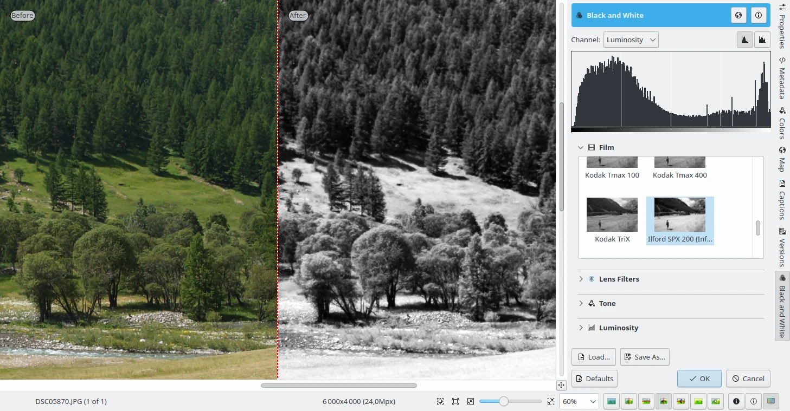

    Using the Image Editor Black & White Tool to Emulate Infrared Films

The filter tries to reproduce the famous Ilford(tm) SFX and Kodak Tmax infrared film series. These films had a sensitivity range of 200-800 ISO:

    - **Ilford**: SPX 200, SPX 400, SPX 800.
    - **Kodak**: HIE.

.. note::

    Because the filter mixes color channels to reproduce infrared film (with emphasis on the green channel), one cannot simulate the infrared effect from a Black & White original photograph -- the key color information is missing.

.. _color_invert:

Invert
------

The digiKam **Invert** tool, inverts an image as if it was a color negative. While digiKam is first and foremost an application for processing and organizing digital photos, it also features tools for working with `film negatives <https://en.wikipedia.org/wiki/Negative_(photography)>`_.

Before you can process negatives in digiKam, you need to digitize them. If you don't have access to a film scanner or a lab that offers film scanning services, you can digitize film using a DSLR camera (there are plenty of tutorials on how to do this on the Web, such as `this one <https://petapixel.com/2013/03/25/digitizing-your-film-using-your-dslr/>`_).

When color film negatives are digitized, the colors will appear inverted compared to reality. This tool allows you to reverse the colors into their respective `complementary colors <https://en.wikipedia.org/wiki/Complementary_colors>`_. Complementary colors appear opposite each other on a color wheel: cyan as the opposite color of red, yellow as opposite color for blue, and magenta as the opposite color of green.

The **Invert** tool flips these colors, and inverts luminosity so dark areas become bright and bright areas become dark. This is basically the same process that occurs when light shines through a color negative to produce a positive print.

The simplest way to process a digitized negative in digiKam is to open the RAW file containing the film negative in the editor. Crop the original file and if necessary apply a lens correction. Choose :menuselection:`Color --> Invert` to transform the negative into a positive image. While the converted image is now positive, it most likely requires some additional tweaking. First of all, the converted image is likely to have a strong blue tint. The easiest way to remove it is to use digiKam’s **Auto-Correction** tool. Choose :menuselection:`Color --> Auto-Correction` and select one of the presets. In many cases, the **Auto Levels** or **Equalize** presets do a decent job of correcting the colors. If the colors still look slightly off, you can adjust them further using the :menuselection:`Colors --> Color Balance` tool.

.. _color_negative:

Color Negative
--------------

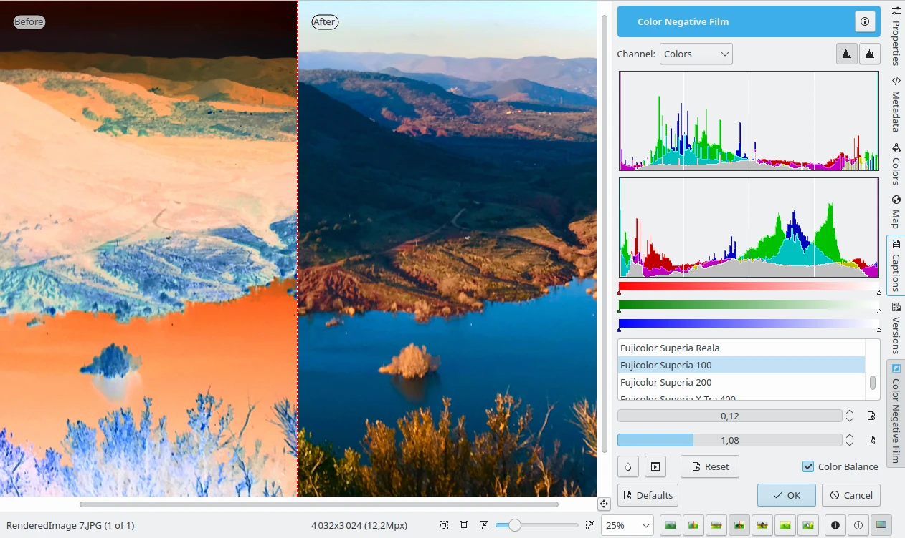

    The Color Negative Tool

The digiKam **Color Negative** tool is an even more powerful tool specifically for processing color negatives. The Color Negative interface contains several handy features that can help you to convert the negative to a positive and tweak the resulting image. While the **Invert** tool uses a generic profile for converting negatives, the Color Negative interface offers profiles for many popular film types. So the first step is to select the appropriate profile. For better results, try also enabling the **Color Balance** option. If the film is not in the list, you can default to the **Neutral** profile.

Although choosing the matching film profile may yield a better result, the converted image may still require some work. In most cases, you may need to adjust the white point to remove the remaining blue tint. You can do this either manually or automatically using the appropriate tools. Usually, the automatic white point adjustment does the job, but the resulting image may also need to be brightened up by adjusting the **Exposure** and the **Gamma** sliders.

.. _color_balance:

Color Balance
-------------

The digiKam **Color Balance** tool allows you to adjust the individual color channels in an image. This tool can be used to correct for a color tint in an image. You can see any adjustments you make reflected in the preview image.

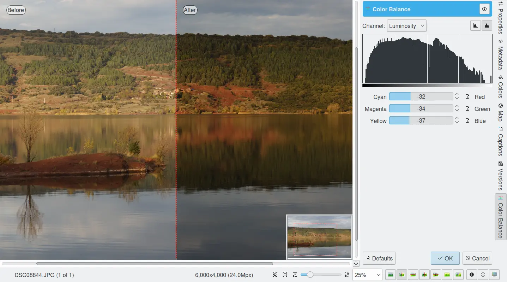

    The Image Editor Color Balance Tool

When you are happy with the results, press OK and the changes will take effect.

.. _color_curves:

Curves Adjust
-------------

The digiKam **Curves Adjust** tool is used to apply non-linearly adjustments to luminosity and color channels.

The Curves Adjust tool is the most sophisticated tool available to adjust an image's tonality. Start by selecting :menuselection:`Color --> Curves Adjust...` from the Image Editor menu. The tool allows you to click and drag control points on a curve to create a smooth function that maps input brightness levels to output brightness levels. The Adjust Curves tool can replicate any effect you can achieve with **Brightness/Contrast/Gamma** or the **Adjust Levels** tool, though it is more powerful than either one of them. But this tool can do more for you -- it can also help you to improve the tonal quality of your photographs to reproduce very finely stepped gray scales. And do not forget that the better the photographs are (good exposure, lossless format, 24 or 32-bit depth) the more you can improve them.

To learn more about the power of the Curves Adjust tool to improve your photographs, we recommend you read the article `Tonal quality and dynamic range in digital cameras <http://www.normankoren.com/digital_tonality.html>`_ by Norman Koren. The section entitled "Achieving ultimate tonal quality" is particularly informative.

The Curves Adjust tool remaps the intensity values of the specified channel based on an adjustable nonlinear curve. The tool displays two histograms: the histogram of the original image is shown on the bottom, and the histogram of the output image, after remapping, is shown on the top. The adjustable nonlinear curve used to remap the data is overplotted on the lower histogram as a blue curve with red control points.

In **Curve smooth mode**, you change the curve's shape by adding or deleting control points from the curve, or by moving the control points, including the end points. Alternatively, you can draw the curve manually in **Curve free mode**. In either case, the effect of changing the curve is immediately displayed in the image preview area to the left and in the upper histogram displayed in the tool. As for all tools, the preview area can be configured by clicking on the preview comparison style icons in the status bar.

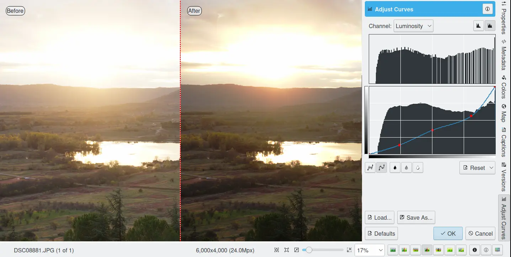

    The Image Editor Curves Adjust Tool

There are series of controls contained within the tool.

- The **Channel** combo box selects the specific channel to be modified by the tool:

    - **Luminosity**: changes the intensity of all pixels.

    - **Red**: changes the Red saturation of all pixels.

    - **Green**: changes the Green saturation of all pixels.

    - **Blue**: changes the Blue saturation of all pixels.

    - **Alpha**: changes the transparency of all pixels.

  Separate curves can be defined for each of these 5 channels.

- Next to this box are two icons to select **Linear** or **Logarithmic** **Histogram** displays. The linear mode is usually the most useful for images taken with a digital camera. However, a logarithmic histogram can be more useful for images containing substantial areas of constant color.

- The **Main Curves Editing Area** contains the transfer curve overplotted on the histogram of the original image. The horizontal bar (x-axis) represents input values, typically ranging from 0 to 255. The vertical bar (y-axis) is a scale for the output values of the selected channel, with the same 0 to 255 range. The control curve is overplotted, crossing the histogram diagonally. Each point of the curve represents an 'x' input value translated into a 'y' output level.

  If you click on the curve, a control point is created. You can move a control point to bend the curve. If you click outside the curve, a control point is also created, and the curve includes it automatically. Right clicking on a control point, deletes that point. The pointer's x/y position is permanently displayed in the lower right corner of the histogram.

- Curve **Type** for channel: The left two icons below the editing area determine whether the curve can be edited using **Curve free mode** or **Curve smooth mode**. Smooth mode constrains the curve type to a smooth line with tension and provides a realistic rendering. Free mode lets you draw your curve free-hand with the mouse. You can use this mode to scatter curve segments all over the grid, which can produce surprisingly interesting results.

- The three **Tone Color Picker** buttons will automatically create control points on the curve in all channels for shadow, middle, and highlight tones. Enable the color picker button that you want to use, and click on the original image preview area to produce control points on each of the Red, Green, Blue, and Luminosity control curves.

- **Reset**: this button allows you to either reset all curve values for all channels, or just reset the curve for just the currently selected channel. Resetting a curve, deletes all control points from the curve, except for both end points.

- **Save As** and **Load**: these buttons are used to do just that. Any curves that you have set can be saved to a file and loaded later. Curves are saved in the Gimp Curves file format.

- **Defaults**: resets the entire tool to all default values.

The curves tool has several additional features that facilitate the positioning of points on the control curves.

- The original photo preview has a red marker on it. If you place this marker in a zone you want to modify, a corresponding line will be drawn on the curve grid indicating the original value. Create a point on that line and move it up or down to adjust it to your pleasing.

- Clicking the mouse button in the original image preview area produces a vertical dotted bar in the graph area of the curves tool. The bar position corresponds to the pixel value the mouse cursor is over in the image window. Clicking and dragging the mouse button interactively updates the position of the vertical bar. In this way, it is possible to see where different pixel values in the image are located on the control curve and helps to discover the locations of shadow, midtone, and highlight pixels.

To understand the power of the Curves Adjust tool, just play with the curves and watch the results. If you move a curve segment to the right, i.e. towards highlights in the image, you can see that these highlights are correspondingly shifted to darker output tones and that image pixels corresponding to this curve segment will get darker. With color channels, moving right will decrease saturation up to the point of reaching a complementary color. You can even solarize the image over part of its tonal range by drawing a curve that is inverted in some part.

.. _color_levels:

Levels Adjust
-------------

The digiKam **Levels Adjust** tool is used to manually adjust the histogram channels of an image. The Levels Adjust tool is situated in complexity and power between the more sophisticated Curves Adjust tool and the simpler **Brightness/Contrast/Gamma** tool. Although the dialog for this tool looks very complicated, only the three sliders in the **Input Levels** area just below the histogram are required for basic usage.

The tool works by sequentially applying three remappings of the input data: a two-parameter linear remapping of the input data, a single parameter gamma correction, and a two-parameter linear remapping of the output data. These five parameters define a curve that is used to remap the input values for the selected channel into output values. The figure below illustrates how the two input parameters (input min and max), one gamma parameter, and two output parameters (output min and max) effect the remapping curve.

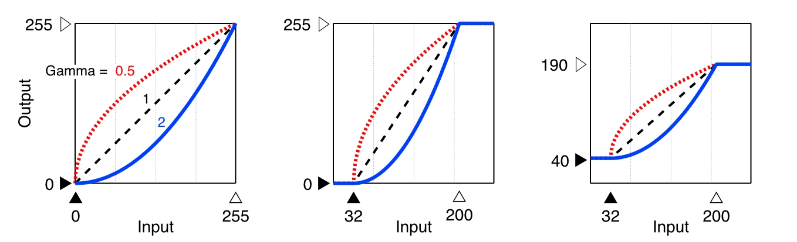

    Different Remapping Curves Achievable with the Levels Adjust Tool

The left panel illustrates the impact of gamma on the remapping curve, when the min and max values for input and output are set to 0 and 255. The panel illustrates that the gamma parameter mainly impacts the mid tones in the image. The middle panel shows the impact of adjusting the input min and max values. The input values are often adjusted to center the histograms and increase contrast. And the right panel shows the impact of adjusting the output min and max values. The output parameters are used less frequently, but a smaller range of output values can be set to create a bleached image to use as a background for some other subject placed in the foreground.

The tool displays two histograms: the histogram of the original image is shown on the bottom, and the histogram of the output image, after level adjustment, is shown on the top. There are five sliders below the histograms that can be clicked on and dragged to adjust the input, gamma, and output parameters. The target preview and histogram are updated dynamically based on the slider positions.

    The Image Editor Levels Adjust Tool

There are series of controls contained within the tool.

- The **Channel** combo box selects the specific channel to be modified by the tool:

    - **Luminosity**: changes the intensity of all pixels.

    - **Red**: changes the Red saturation of all pixels.

    - **Green**: changes the Green saturation of all pixels.

    - **Blue**: changes the Blue saturation of all pixels.

    - **Alpha**: changes the transparency of all pixels.

    - **Colors**: changes the saturation of all three color channels.

  Separate curves can be defined for each of these 5 channels.

- Next to this box are two icons to select **Linear** or **Logarithmic** **Histogram** displays. The linear mode is usually the most useful for images taken with a digital camera. However, a logarithmic histogram can be more useful for images containing substantial areas of constant color.

- **Input Levels**: the top slider adjusts the two min/max parameters that specify the input remapping. Any input value equal to or below the min value set on the range slider are mapped to 0, any input value between the min and max values are linearly mapped to a range between 0 and 255, and any input value equal to or greater than the max value set on the range slider are mapped to 255. Thus the input slider controls are used to adjust the span of input values that are used to cover the full range from 0 to max intensity.

  The min parameter can be adjusted by dragging the solid black triangle left or right along the color bar, dragging the mouse left or right over the left numeric text box, typing a number into the left numeric text box, or by clicking on the left up or down arrow buttons. The max parameter can be adjusted in the same manner using the white triangle and the right controls.

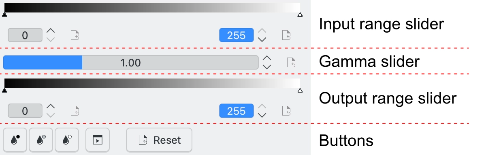

    Slider Controls for the Levels Adjust Tool

- **Gamma Slider**: the middle slider adjusts a single parameter that controls the nonlinear gamma correction.

- **Output Levels**: the bottom slider adjusts the two min/max parameters that specify the output remapping. Any output value equal to or below the min value set on the range slider are mapped to 0, any output value between the min and max values are linearly mapped to a range between 0 and 255, and any output value equal to or greater than the max value set on the range slider are mapped to 255. Thus the output slider controls are used to adjust the span of output values. Unless you want to deliberately produce an image with limited dynamic range, the output levels are normally left at 0 and 255.

  The Output Levels control operates just like the Input Levels control.

- **Color Picker**: these three buttons will automatically adjust input min, gamma, and input max settings for shadow, midtone and highlights. Enable the color picker button that you want to use, and click on the original image preview area to set the parameters.

- **Adjust All Levels Automatically**: this button automatically sets the levels based on an analysis of the pixel intensities in the image.

- **Reset**: this button resets all Input Levels and Output Levels values for the selected channel.

- **Save As** and **Load**: these buttons are used to do just that. Any Levels that you have set can be saved to the filesystem and loaded later. The used file format is compatible with **The Gimp** Levels format.

- **Defaults**: resets all Input Levels and Output Levels values for all channels.

The Adjust Levels tool has several features to facilitate the positioning input levels sliders. Clicking the mouse button in the original image preview area produces a vertical dotted bar in the graph area of the histogram. The bar position corresponds to the pixel value under the mouse cursor in the image window. Clicking and dragging the mouse button interactively updates the position of the vertical bar. In this way it is possible to see where different pixel values in the image are located on the input levels sliders, helping you to discover the locations of shadow, midtone, and highlight pixels.

**Over Exposure Indicator** option checks all color channel to see if more than one channel in a pixel is over-exposed, and you will see the combined color resulting of channel level settings. This feature is available as an indicator in the target preview area and has no effect on final rendering.

.. _color_bcg:

Brightness / Contrast / Gamma
-----------------------------

The digiKam **Brightness/Contrast/Gamma** tool is used for the correcting exposure in an image. It is the simplest tool for correcting exposure, but also the least powerful. Still, in many cases it does everything you need. This tool is often useful for images that are overexposed or underexposed; it is not useful for correcting color casts. The tool gives you three sliders to adjust **Brightness**, **Contrast** and **Gamma**. You can see any adjustments you make reflected in the preview image. When you are happy with the results, press **Ok** and they will take effect.

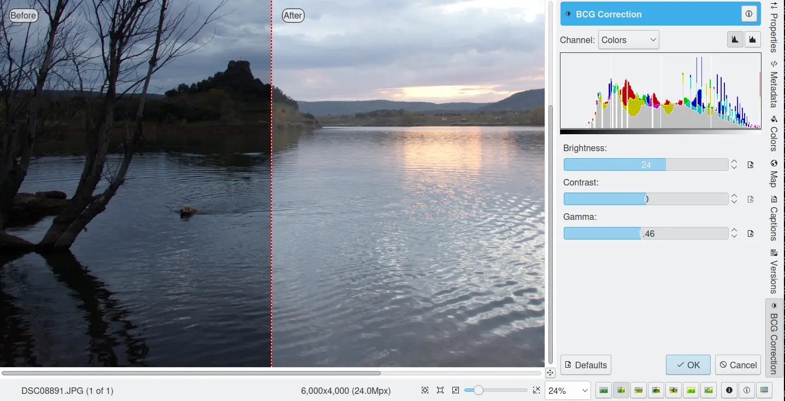

    The Image Editor Tool Correcting Exposure

.. note::

    Another important tool called **Levels Adjust** supports exposure correction and also enables you to save and load the level settings so they cab be applied to multiple photographs. This can be useful if your camera or scanner often makes the same mistakes and so you regularly want to apply the same corrections. See the dedicated :ref:`Levels Adjust <color_levels>` section of the manual for more information. The **Curves Adjust** tool, described in the :ref:`Curves Adjust <color_curves>` section of the manual, provides an even more powerful way of correcting exposures.

.. _color_hsl:

Hue / Saturation / Lightness
----------------------------

The digiKam **Hue / Saturation / Lightness** tool is used to adjust hue, saturation, vibrance, and lightness levels in the current image. (The tool should have been called *Hue / Saturation / Vibrance / Lightness*, but that seemed way too long!)

The tool settings are simple:

    - A Hue / Saturation color map consisting of a shaded gray rectangle above a thin color bar. Click and drag on the shaded gray rectangle to set the **Hue** and **Saturation** values. These values are also reflected in the sliders below the map.

    - **Hue**: This slider selects a hue in the color circle (-180, 180) to adjust the colors in the image.

    - **Saturation**: This slider adjusts the saturation (-100, 100) of the colors in the image. If your image is washed out (which can easily happen when you take images in bright light), increasing the saturation will probably make the image look better. In some cases, it is useful to adjust the lightness at the same time. When you take images in low light conditions, try reducing the saturation instead of increasing it.

    - **Vibrance**: This slider adjusts the vibrance of the image. Vibrance selectively adjusts saturation, acting predominantly on less saturated colors to avoid clipping. This control is often used with skin tones.

    - **Lightness**: This slider selects a luminosity value (-100, 100). Lightness changes in this tool only affect the selected color channel, unlike luminosity in the **Curves Adjust** and **Levels Adjust** tools which works on all color channels. If you change the Red lightness with this tool, only the red pixels will be changed.

 You can see any adjustments you make reflected in the preview image. When you are happy with the results, press **OK** to apply the changes.

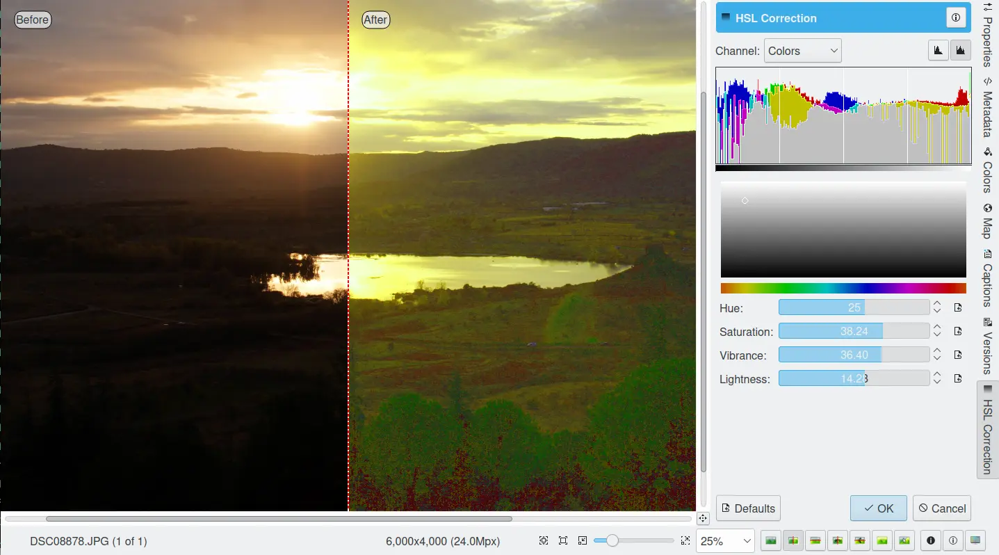

    The Image Editor Tool Correcting Colors

.. _color_mixer:

Channel Mixer
-------------

The digiKam **Channel Mixer** tool allows you to remix the color channels to improve or modify the color tonality within a photograph.

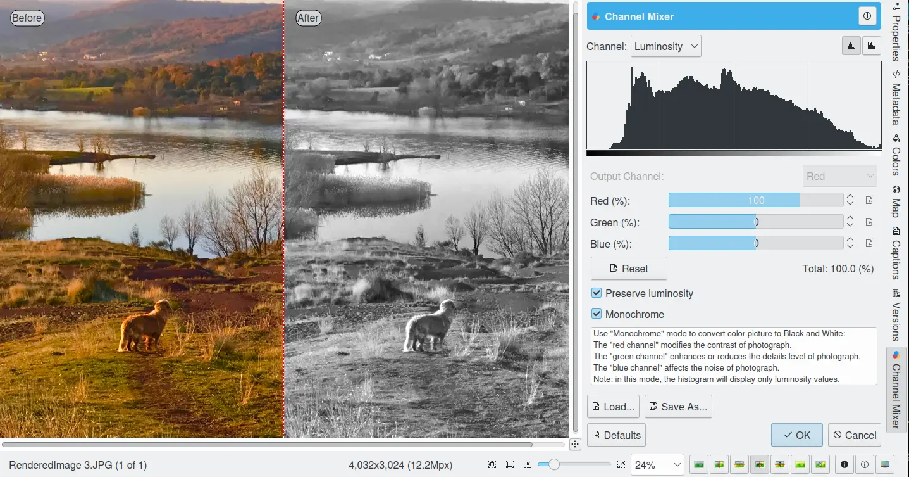

    The Image Editor Channel Mixer Tool

The **Channel** combo box selects which channel or channels to display in the histogram. The histogram gives a first hint of how to correct the channels based on their relative distribution and amplitude.

the **Output Channel** combo box selects the primary color channel to be modified by the tool. You can modify more than one channel by selecting and modifying each output channel in turn.

The **Red**, **Green** and **Blue** slider controls enable you to mix the channels. If you check **Preserve Luminosity** the image will retain its overall luminosity despite any changes you make to its color components.

The **Monochrome** option converts the output into a Black & White image. This is a great tool for converting your photographs to Black & White. The Preserve Luminosity option is particularly useful when used with the **Monochrome** option. Try to reduce the green channel for Black & White portraits.

The effects of color mixing are immediately displayed in the image preview area to the left and in the histogram displayed in the tool. As for all tools, the preview area can be configured by clicking on the preview comparison style icons in the status bar.

The target photo preview has a red marker available. If you place this marker somewhere in the image, a corresponding vertical bar will be drawn in the histogram indicating the color level value in the currently selected channel.

.. note::

    Sometimes, especially when doing **Monochrome** mixing, reducing one color channel may increase visible noise, which actually originates in the chroma noise. Chroma noise means that the little noise specs do not appear at the same location in all the color channels, but the noise patterns looks different in every channel. If that is the case you can improve the monochrome conversion by reducing the chroma noise first.

**Save As** and **Load** buttons are used to do just that. Any mixer settings that you have set can be saved to a file and reloaded later. The mixer settings are stored in the Gimp channel mixer file format.

**Over Exposure Indicator** option adds up the colors if more than one channel in a pixel is over-exposed, allowing you to see the combined color resulting from channel gain settings. The over exposure indicator only appears in the target preview area, it does not affect the final rendering.

**Reset All** button resets all channel mixer settings to default values.

.. _color_wb:

White Balance
-------------

The digiKam **White Balance** tool is used to adjust the white-balance of a photograph.

Getting the correct white balance setting is a common challenge for digital still cameras. In the 'good old days' of film, the white balance compensation was done by the photolab. Nowadays the digital camera has to guess what is white and what is black. Most of the time, what the camera chooses as the white point, is not of the correct shade or hue. This tool makes it is easy to correct this problem. It provides a variety of parameters that can be adjusted to more accurately capture the right colors in your photographs.

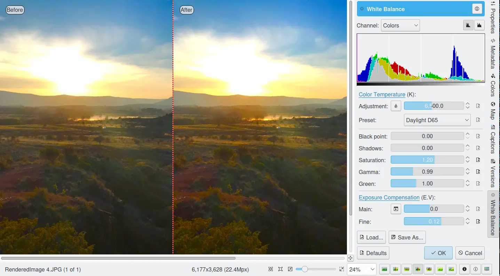

    The Image Editor White Balance Tool

.. note::

    White balance corrections applied to 8-bit images can often produce over exposed regions. This even occurs even if the corrections depart too much from an original 16-bit image. So white balance corrections are best applied during the conversion of RAW data, when the margin for correction will be greater.

The effects of white balance corrections are immediately displayed in the image preview area to the left. As for all tools, the preview area can be configured by clicking on the preview comparison style icons in the status bar.

To the top right, the widget displays a histogram that is dynamically updated when changing the parameters. This histogram is very instructive as it shows that even in well exposed photos, most of the pixels have very small luminosity. With a button you can select to show either one of the 3 colors (or the sum of it which is called luminosity).

We describe the rest of the controls, from the bottom up.

With **Exposure Compensation** you can digitally change the exposure of the photo. Increasing the exposure may make the pixel noise more visible and saturate the highlights. Check the **Over exposure indicator** in the lower right status bar to check for saturation. The **Black Point** adjustment can be used to adjust the left said of the histogram. If your photograph looks foggy and the histogram has empty space on the left, you probably need to use this option. The **Exposure** and **Black Point** adjustments can be automatically estimated by pressing the **Auto Exposure Adjustments** button. This quite accurately sets the black point.

The contrast of your output depends on the **Shadows**, **Saturation**, and **Gamma** parameters. The **Shadows** adjustment lets you enhance or diminish the shadow details in your photo.

Increasing the contrast of your photograph can have the side effect of reducing the apparent **Saturation** of the photo. Use a value larger than 1 to increase the saturation and a value of less than 1 to desaturate the photo. A value of 0 will give you a black and white photo. Don't be shy to bump up the saturation of your photos a little. The general rule is that for higher contrast (lower **Gamma**) you need to apply more **Saturation**.

The next set of options is the mainstay of White Balance settings that control the relative proportion of the three color channels. Here you can set the **Color Temperature**, making your image warmer (more red) or colder (more blue). Higher temperatures will result in a warmer tint. Setting the ratio between the three color channels requires two adjustments. Since the temperature adjustment mostly controls the ratio between the red and the blue channels, it is natural that the second adjustment will control the intensity of the **Green** channel.

Instead of fiddling around with the above controls, you can simply use the **Temperature Tone Color Picker** button. Press on this button and click anywhere on the original preview image that should be white or gray to automatically set the **Temperature** and **Green** values.

In addition you can set the White Balance using the preset list. These are the white color balance temperature presets available:

=================== =========================================================== =======
Color Temperature   Description                                                 Kelvin
=================== =========================================================== =======
**40W**             40 Watt incandescent lamp.                                  2680
**200W**            200 Watt incandescent lamp, studio lights, photo floods.    3000
**Sunrise**         Sunrise or sunset light.                                    3200
**Tungsten**        Tungsten lamp or light at 1 hour from dusk or dawn.         3400
**Neutral**         Neutral color temperature.                                  4750
**Xenon**           Xenon lamp or light arc.                                    5000
**Sun**             Sunny daylight around noon.                                 5500
**Flash**           Electronic photo flash.                                     5600
**Sky**             Overcast sky light.                                         6500
=================== =========================================================== =======

**Color Temperature** is a simplified way to characterize the spectral properties of a light source. While in reality the color of light is determined by how much each point on the spectral curve contributes to its output, the result can still be summarized on a linear scale. This value is useful e.g. for determining the correct white balance in digital photography, and for specifying the right light source types in architectural lighting design. Note, however, that light sources of the same color (metamers) can vary widely in the quality of light emitted.

Low Color Temperature implies more yellow-red light while high color temperature implies more blue light. Daylight has a rather low color temperature near dawn, and a higher one during the day. Therefore it can be useful to install an electrical lighting system that can supply cooler light to supplement daylight when needed, and fill in with warmer light at night. This also correlates with human feelings towards the warm colors of light coming from candles or an open fireplace at night. Standard unit for color temperature is Kelvin (K).

.. note::

  Technically, the concept of color temperature comes from the blackbody spectrum, which is the spectrum of light emitted by a perfect thermal emitter. The blackbody spectrum is a good model for direct sunlight or moonlight when those bodies are high in the sky. It is also a good model for most incandescent bulbs, but a poor model for most other forms of man-made illumination.

**Over Exposure Indicator** option adds up the colors if more than one channel in a pixel is over-exposed, allowing you to see the combined color resulting from white balance corrections. The over exposure indicator only appears in the target preview area, it does not affect the final rendering.

**Save As** and **Load** buttons are used to do just that. Any White Color Balance settings that you have set can be saved to a text file and reloaded later.

**Reset All** button resets all filter settings to default values corresponding to Neutral White Balance color. Note that even the neutral setting may be quite different from your original photograph. So if you save an image after a resetting all settings, the white balance will likely be changed.
