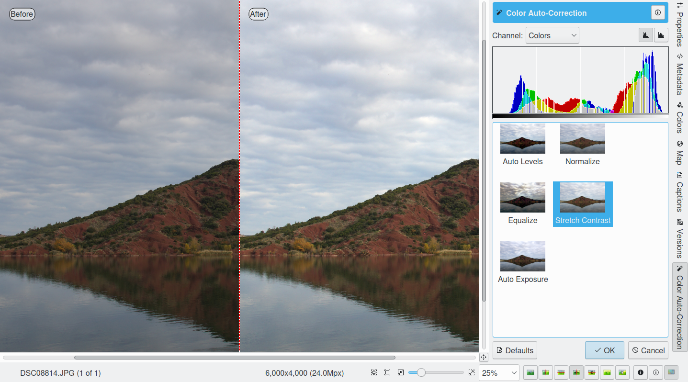

.. meta::
   :description: digiKam Image Editor Colors Tools
   :keywords: digiKam, documentation, user manual, photo management, open source, free, learn, easy

.. metadata-placeholder

   :authors: - Gilles Caulier <caulier dot gilles at gmail dot com>

   :license: Creative Commons License SA 4.0

.. _colors_tools:

Colors Tools
============

.. contents::

Encoding Depth
--------------

Here you can change the encoding depth per color channel of the edited image. 8 bit encoding is the common JPEG format, 16 bit encoding is better suited for high quality images, but this format needs more storage space, calculation time and is currently available with PNG, PGF, TIFF, and JPEG-2000 formats only.

Color Management
----------------

This tool allows to convert image from one color space to another one. Its use is the change and assignment of color profiles to an image. For detailed instructions on the use of color profiles, please refer to Color Management Settings chapter.

Auto-Correction
---------------

This tool set provides five automatic correction levels that will improve an image in most cases. Use this tool before going into the more involved manual adjustments.

The Auto Levels, Normalize, Equalize, Stretch Contrast, and Auto Exposure available from Correct → Auto-Correction... menu entry menu will attempt to work out the best color levels automatically. You will need to experiment with the effects of these functions to see what works best with your photograph. 

   - Auto Levels: This option maximizes the tonal range in the Red, Green, and Blue channels. It searches the image shadow and highlight limit values and adjusts the Red, Green, and Blue channels to a full histogram range.

   - Normalize: this method scales brightness values across the selected image so that the darkest point becomes black, and the brightest point becomes as bright as possible without altering its hue. This is often a “magic fix” for images that are dim or washed out. 

   - Equalize: this method adjusts the brightness of colors across the selected image so that the histogram for the Value channel is as flat as possible, that is, so that each possible brightness value appears at about the same number of pixels as each other value. Sometimes Equalize works wonderfully at enhancing the contrasts of an image. Other times it gives garbage. It is a very powerful operation, which can either work miracles on an image or destroy it.

   - Stretch Contrast: this method enhances the contrast and brightness of the RGB values of an image by stretching the lowest and highest values to their fullest range, adjusting everything in between. This is noticeable only with washed-out images and can be a good fix-it tool for bad photographs.

   - Auto Exposure: This option enhances the contrast and brightness of the RGB values of an image to calculate optimal exposition and black level using image histogram properties.

The results of any adjustments you make will not be remembered until you save your photograph.

Black and White Conversion Filters
----------------------------------

Black & White photography has always been fascinating in its abstraction capability. With the advent of digital photography, B&W has almost become a desktop activity, as color images can be easily converted on the computer into black and white, even providing a set of vintage film roll profiles. This filter is also able to simulates traditional infrared film material.

The Legacy Black and White Films Emulation
~~~~~~~~~~~~~~~~~~~~~~~~~~~~~~~~~~~~~~~~~~

digiKam comes with a couple of black & white filters that you can use on your photographs. Under the Color → Black & White... menu you will find classic black & white chemical toning used in analog photography. The controls come on four drop-down items: Film, Lens Filters, Tone and Lightness as shown on the screenshot below. Film, filters and color toning can be applied independently of each other (on top of each other). The filters actually influence the RGB channel mixing, whereas the toning purely adds a uniform monochromatic tint to the black & white photograph. In the lightness tab you will find a tonal adjustment tool (like curve adjust), a contrast tool and an over-exposure indicator to improve the b&w rendering.

Specific settings allows to emulate a number of famous black & white photographic films as:

    - Generic.
    - Agfa 200X, Agfa Pan 25, Agfa Pan 100, Agfa Pan 400.
    - Ilford Delta 100, Ilford Delta 400, Ilford Delta 400 Pro 3200, Ilford FP4 Plus, Ilford HP5 Plus, Ilford PanF Plus, Ilford XP2 Super.

A color filter can be simulated as placed on front of lens:

    - No Lens Filter: simulate black & white neutral film exposure. 
    - Green Filter: simulates black & white film exposure with green lens filter. This comes good with all scenic images, especially suited for portraits taken against the sky (similar to 004 Cokin(tm) Green filter).
    - Orange Filter: simulates black & white film exposure with an orange lens filter. This will enhance landscapes, marine scenes and aerial photography (similar to 002 Cokin(tm) Orange filter).
    - Red Filter: simulates black & white film exposure with red lens filter. Creates dramatic sky effects and can simulate moonlight scenes in daytime (similar to 003 Cokin(tm) Red filter).
    - Yellow Filter: simulates black & white film exposure with yellow lens filter. Most natural tonal correction, improves contrast. Ideal for landscapes (similar to 001 Cokin(tm) Yellow filter).

A color tint can be applied to the image:

    - Sepia Filter: gives a warm highlight and mid-tone while adding a bit of coolness to the shadows - very similar to the process of bleaching a print and re-developing in a sepia toner (typical for your grandmothers photographs). Similar to 005 Cokin(tm) Sepia filter.
    - Brown Filter: similar to Sepia Tone filter, but less pronounced.
    - Cold Filter: start subtle and replicate printing on a cold tone black & white paper such as a bromide enlarging paper.
    - Selenium Filter: effect that replicates traditional selenium chemical toning done in the darkroom.
    - Platinum Filter: effect that replicates traditional platinum chemical toning done in the darkroom.

Simulate Infrared Film
~~~~~~~~~~~~~~~~~~~~~~

Simulating classical infrared film material (the effect is rendered in black and white) is an interesting alienation effect that is even stronger and more dramatic than pure black and white conversion. Contrast and an abstract touch are improved, which can underpin the expression of the photographer as an artist. It is like taking an image in black and white with a red filter on the camera lense. Areas which reflect little red light, e.g. the sky, will show as low density, dark areas. Areas which are excellent reflectors of red light, e.g. most green foliage, will be high density areas. And snow landscapes are really dramatic.

The filter tries to reproduce the famous Ilford(tm) SFX and Kodak Tmax infrared film series. These films has a sensitivity range of 200-800 ISO.

    - Ilford SPX 200 (Infrared), Ilford SPX 400 (Infrared), Ilford SPX 800 (Infrared).
    - Kodak Tmax 100, Kodak Tmax 400, Kodak TriX, Kodak HIE (Infrared).

Because the filter mixes color channels to reproduce infrared film (with emphasis on green channel), one can not simulate infrared effect from black and white original photograph, since the color information is missing.

Correcting Colors
-----------------

Digital cameras often have problems with lighting conditions and it is not unusual to want to correct the color contrast and brightness of a photograph. You can experiment with altering the levels of different aspects of your photographs using the tools under the Color menu. You can see any adjustments you make reflected in the preview. When you are happy with the results, press Ok and they will take effect. 

If your image is washed out (which can easily happen when you take images in bright light) try the Hue/Saturation/Lightness tool, which gives you four sliders to manipulate, for Hue, Saturation, Vibrance, and Lightness. Raising the saturation will probably make the image look better. In some cases, it is useful to adjust the lightness at the same time. ("Lightness" here is similar to "Brightness" in the Brightness/Contrast/Gamma tool, except that they are formed from different combinations of the red, green, and blue channels).

When you take images in low light conditions, you could get the opposite problem: too much saturation. In this case the Hue/Saturation tool is again a good one to use, only by reducing the saturation instead of increasing it. You can see any adjustments you make reflected in the preview image. When you are happy with the results, press Ok and they will take effect.

