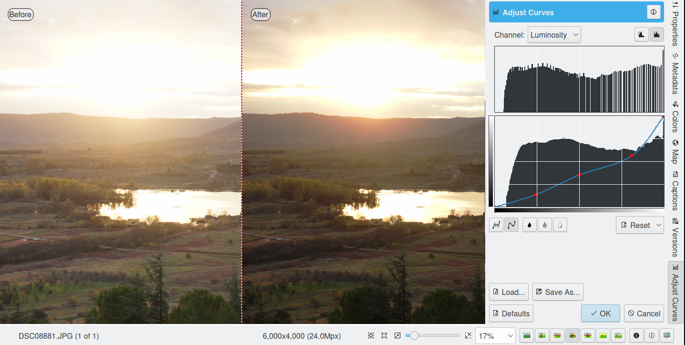
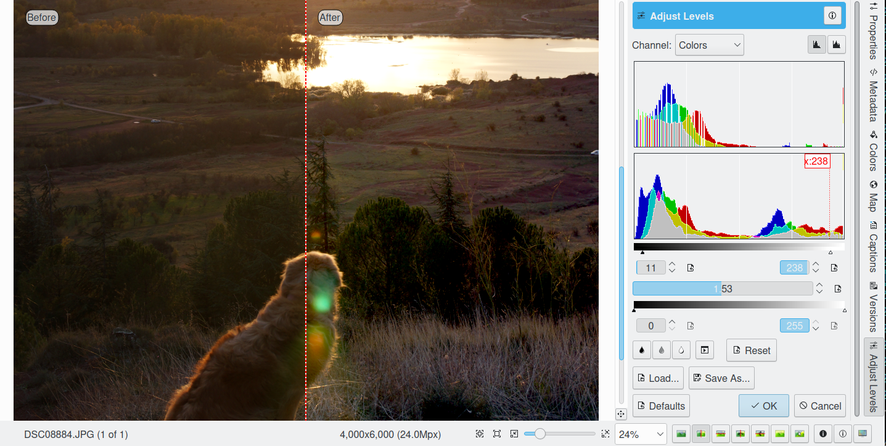

.. meta::
   :description: digiKam Image Editor Colors Tools
   :keywords: digiKam, documentation, user manual, photo management, open source, free, learn, easy

.. metadata-placeholder

   :authors: - Gilles Caulier <caulier dot gilles at gmail dot com>

   :license: Creative Commons License SA 4.0

.. _colors_tools:

Colors Tools
============

.. contents::

Encoding Depth
--------------

Here you can change the encoding depth per color channel of the edited image. 8 bit encoding is the common JPEG format, 16 bit encoding is better suited for high quality images, but this format needs more storage space, calculation time and is currently available with PNG, PGF, TIFF, and JPEG-2000 formats only.

Color Management
----------------

This tool allows to convert image from one color space to another one. Its use is the change and assignment of color profiles to an image. For detailed instructions on the use of color profiles, please refer to Color Management Settings chapter.

.. figure:: images/editor_profile_converter.png

Auto-Correction
---------------

This tool set provides five automatic correction levels that will improve an image in most cases. Use this tool before going into the more involved manual adjustments.

The Auto Levels, Normalize, Equalize, Stretch Contrast, and Auto Exposure available from Correct → Auto-Correction... menu entry menu will attempt to work out the best color levels automatically. You will need to experiment with the effects of these functions to see what works best with your photograph. 

   - Auto Levels: This option maximizes the tonal range in the Red, Green, and Blue channels. It searches the image shadow and highlight limit values and adjusts the Red, Green, and Blue channels to a full histogram range.

   - Normalize: this method scales brightness values across the selected image so that the darkest point becomes black, and the brightest point becomes as bright as possible without altering its hue. This is often a “magic fix” for images that are dim or washed out. 

   - Equalize: this method adjusts the brightness of colors across the selected image so that the histogram for the Value channel is as flat as possible, that is, so that each possible brightness value appears at about the same number of pixels as each other value. Sometimes Equalize works wonderfully at enhancing the contrasts of an image. Other times it gives garbage. It is a very powerful operation, which can either work miracles on an image or destroy it.

   - Stretch Contrast: this method enhances the contrast and brightness of the RGB values of an image by stretching the lowest and highest values to their fullest range, adjusting everything in between. This is noticeable only with washed-out images and can be a good fix-it tool for bad photographs.

   - Auto Exposure: This option enhances the contrast and brightness of the RGB values of an image to calculate optimal exposition and black level using image histogram properties.

The results of any adjustments you make will not be remembered until you save your photograph.

.. figure:: images/editor_auto_corrections.png

Black and White Conversion Filters
----------------------------------

Black & White photography has always been fascinating in its abstraction capability. With the advent of digital photography, B&W has almost become a desktop activity, as color images can be easily converted on the computer into black and white, even providing a set of vintage film roll profiles. This filter is also able to simulates traditional infrared film material.

The Legacy Black and White Films Emulation
~~~~~~~~~~~~~~~~~~~~~~~~~~~~~~~~~~~~~~~~~~

digiKam comes with a couple of black & white filters that you can use on your photographs. Under the Color → Black & White... menu you will find classic black & white chemical toning used in analog photography. The controls come on four drop-down items: Film, Lens Filters, Tone and Lightness as shown on the screenshot below. Film, filters and color toning can be applied independently of each other (on top of each other). The filters actually influence the RGB channel mixing, whereas the toning purely adds a uniform monochromatic tint to the black & white photograph. In the lightness tab you will find a tonal adjustment tool (like curve adjust), a contrast tool and an over-exposure indicator to improve the b&w rendering.

.. figure:: images/editor_bw_filters.png

Specific settings allows to emulate a number of famous black & white photographic films as:

    - Generic.
    - Agfa 200X, Agfa Pan 25, Agfa Pan 100, Agfa Pan 400.
    - Ilford Delta 100, Ilford Delta 400, Ilford Delta 400 Pro 3200, Ilford FP4 Plus, Ilford HP5 Plus, Ilford PanF Plus, Ilford XP2 Super.

A color filter can be simulated as placed on front of lens:

    - No Lens Filter: simulate black & white neutral film exposure. 
    - Green Filter: simulates black & white film exposure with green lens filter. This comes good with all scenic images, especially suited for portraits taken against the sky (similar to 004 Cokin(tm) Green filter).
    - Orange Filter: simulates black & white film exposure with an orange lens filter. This will enhance landscapes, marine scenes and aerial photography (similar to 002 Cokin(tm) Orange filter).
    - Red Filter: simulates black & white film exposure with red lens filter. Creates dramatic sky effects and can simulate moonlight scenes in daytime (similar to 003 Cokin(tm) Red filter).
    - Yellow Filter: simulates black & white film exposure with yellow lens filter. Most natural tonal correction, improves contrast. Ideal for landscapes (similar to 001 Cokin(tm) Yellow filter).

A color tint can be applied to the image:

    - Sepia Filter: gives a warm highlight and mid-tone while adding a bit of coolness to the shadows - very similar to the process of bleaching a print and re-developing in a sepia toner (typical for your grandmothers photographs). Similar to 005 Cokin(tm) Sepia filter.
    - Brown Filter: similar to Sepia Tone filter, but less pronounced.
    - Cold Filter: start subtle and replicate printing on a cold tone black & white paper such as a bromide enlarging paper.
    - Selenium Filter: effect that replicates traditional selenium chemical toning done in the darkroom.
    - Platinum Filter: effect that replicates traditional platinum chemical toning done in the darkroom.

Simulate Infrared Film
~~~~~~~~~~~~~~~~~~~~~~

Simulating classical infrared film material (the effect is rendered in black and white) is an interesting alienation effect that is even stronger and more dramatic than pure black and white conversion. Contrast and an abstract touch are improved, which can underpin the expression of the photographer as an artist. It is like taking an image in black and white with a red filter on the camera lense. Areas which reflect little red light, e.g. the sky, will show as low density, dark areas. Areas which are excellent reflectors of red light, e.g. most green foliage, will be high density areas. And snow landscapes are really dramatic.

The filter tries to reproduce the famous Ilford(tm) SFX and Kodak Tmax infrared film series. These films has a sensitivity range of 200-800 ISO.

    - Ilford SPX 200 (Infrared), Ilford SPX 400 (Infrared), Ilford SPX 800 (Infrared).
    - Kodak Tmax 100, Kodak Tmax 400, Kodak TriX, Kodak HIE (Infrared).

Because the filter mixes color channels to reproduce infrared film (with emphasis on green channel), one can not simulate infrared effect from black and white original photograph, since the color information is missing.

Colors Balance
--------------

Digital cameras often have problems with lighting conditions and it is not unusual to want to correct the color contrast and brightness of a photograph. You can experiment with altering the levels of different aspects of your photographs using the tools under the Color menu. You can see any adjustments you make reflected in the preview. When you are happy with the results, press Ok and they will take effect. 

.. figure:: images/editor_colors_balance.png

If your image is washed out (which can easily happen when you take images in bright light) try the Hue/Saturation/Lightness tool, which gives you four sliders to manipulate, for Hue, Saturation, Vibrance, and Lightness. Raising the saturation will probably make the image look better. In some cases, it is useful to adjust the lightness at the same time. ("Lightness" here is similar to "Brightness" in the Brightness/Contrast/Gamma tool, except that they are formed from different combinations of the red, green, and blue channels).

When you take images in low light conditions, you could get the opposite problem: too much saturation. In this case the Hue/Saturation tool is again a good one to use, only by reducing the saturation instead of increasing it. You can see any adjustments you make reflected in the preview image. When you are happy with the results, press Ok and they will take effect.

Adjust Curves
-------------

The digiKam Adjust Curves is a tool to non-linearly adjust luminosity graduation and color channels.

The Adjust Curves tool is the most sophisticated tool available to adjust the images' tonality. Start it from the Color → Curves Adjust... Image Editor menu. It allows you to click and drag control points on a curve to create a free function mapping input brightness levels to output brightness levels. The Adjust Curves tool can replicate any effect you can achieve with Brightness/Contrast/Gamma or the Adjust Levels tool, though it is more powerful than either one of them. But this tool can do more for you, it helps you to improve the tonal quality of your photographs to very finely stepped gray scales. And do not forget that the better the photographs are (good exposure, lossless format, 24 or 32 bit deep) the more you can improve them. Navigate to the "Achieving ultimate tonal quality" section of this instructive page: Tonal quality and dynamic range in digital cameras by Norman Koren. Use Adjust Curves tool to do just the same!

This tool provides visual curves to modify the intensity values of the active layer displayed as a histogram non-linearily. In Curve smooth mode, you change the curves shape by adding new points to the curve or by moving end point positions. Another way, is to draw all the curve manually in Curve free mode. In both cases the effect is immediately displayed in the image preview area to the left, where the preview can be configured by clicking on the top left icons.

To the left, half of the original and the target preview image is shown. The target preview is updated dynamically according to the widget settings. On the right side the following options are available:

    Modify Channel: with this combo box you can select the specific channel to be modified by the tool:

    Luminosity: changes the intensity of all pixels.

    Red: changes the Red saturation of all pixels.

    Green: changes the Green saturation of all pixels .

    Blue: changes the Blue saturation of all pixels.

    Alpha: changes the transparency of all pixels.

    Next to this box are two icons to select linear or logarithmic histogram display. For images taken with a digital camera the linear mode is usually the most useful. However, for images containing substantial areas of constant color, a linear histogram will often be dominated by a single bar. In this case a logarithmic histogram will be more appropriate.

    Main Curves Editing Area: the horizontal bar (x-axis) represents input values (they are value levels from 0 to 255). The vertical bar (y-axis) is only a scale for output colors of the selected channel. The control curve is drawn on a grid and crosses the histogram diagonally. The pointer x/y position is permanently displayed above the grid. If you click on the curve, a control point is created. You can move it to bend the curve. If you click outside the curve, a control point is also created, and the curve includes it automatically. So each point of the curve represents an 'x' translated into a 'y' output level.

    Curve Type for channel: below the editing area are several icons that determine whether the curve can be edited using a Curve smooth mode curve or a Curve free mode. Smooth mode constrains the curve type to a smooth line with tension and provides a realistic rendering. Free mode lets you draw your curve free-hand with the mouse. With curve segments scattered all over the grid, result will be surprising but hardly repeatable. A reset-to-defaults button is also available. If, for example, you move a curve segment to the right, i.e. to highlights, you can see that these highlights are corresponding to darker output tones and that image pixels corresponding to this curve segment will go darker. With color channels, moving right will decrease saturation up to reaching complementary color. To delete all control points (apart from both end points), click on the Reset button. To delete only one point, move it onto another point. Just ply with the curves and watch the results. You even can solarize the image on part of its tonal range. This happens when the curve is inverted in some part. The original photo preview has a red marker on it. If you place this marker to a zone you want to modify, a corresponding line will be drawn on the curve grid indicating the original value. Create a point on that line and move it up or down to adjust it to your pleasing.

    Save As... and Load...: these buttons are used to do just that. Any curves that you have set can be saved to the filesystem and loaded later. The used file format is The Gimp Curves format.

    Reset: this button resets all curve values for all channels. 

The curves tool has several features that facilitate the positioning of points on the control curves. Clicking the mouse button in the original image preview area produces a vertical doted bar in the graph area of the curves tool. The bar position corresponds to the pixel value the mouse cursor is over in the image window. Clicking and dragging the mouse button interactively updates the position of the vertical bar. In this way, it is possible to see where different pixel values in the image are located on the control curve and helps to discover the locations of shadow, midtone, and highlight pixels.

Using this way and the three Tone Color Picker buttons will automatically create control points on the curve in all channels for shadow, middle, and highlight tones. Enable the color picker button that you want to use, and click on the original image preview area to produce control points on each of the Red, Green, Blue, and Luminosity control curves.

Adjust Levels
-------------

The digiKam Adjust Levels is a tool to manually adjust the histogram channels of an image.

Situated between the more sophisticated Adjust Curves tool and the simpler Brightness/Contrast/Gamma Image Editor tool is this Adjust Levels tool for improving exposure. Although the dialog for this tool looks very complicated, for the basic usage we have in mind here, the only part you need to deal with is the Input Levels area, concretely the 3 sliders that appear below the histogram.

This widget contains a visual graph of the intensity values of the active layer or selection (histogram). Below the graph are five sliders that can be clicked into and dragged to constrain and change the intensity level for the image. The left sliders position represents the dark areas and similarly, the right position represents the light areas.

Actually the easiest way to learn how to use it is to experiment by moving the three sliders around, and watching how the image is affected.

On the right, both an original and a target preview image is available. The target preview is updated dynamically according to the slider positions. On the left, the following options are available:

    Modify levels for Channel : this combo box allows the selection of the specific channel that will be modified by the tool:

        Luminosity: this option makes intensity changes against all pixels in the image.

        Red: this option makes Red saturation changes against all pixels in the image.

        Green: this option makes Green saturation changes against all pixels in the image.

        Blue: this option makes Blue saturation changes against all pixels in the image.

        Alpha: this option makes transparency changes against all pixels in the image.

    Set Scale for channel: this combo controls whether the histogram will be displayed using a linear or logarithmic amplitude. For images taken with a digital camera, the linear mode is usually the most useful. However, for images that contain substantial areas of constant color a linear histogram will often be dominated by a single bar. In this case a logarithmic histogram will often be more useful.

    Input Levels: the input levels allow manual adjustments to be selected for each of the ranges. The main area is a graphic representation of image dark, mid and light tones content. They are on abscissa from level 0 (black) to level 255 (white). Pixel number for a level is on ordinate axis. The curve surface represents all the pixels of the image for the selected channel (histogram). A well balanced image is an image with levels (tones) distributed all over the whole range. An image with a predominant blue color, for example, will produce a histogram shifted to the left in Green and Red channels, manifested by green and red color lacking on highlights. The level ranges can be modified in three ways:

        Three sliders: the first on the top for dark tones, the second one for light tones, and the last one on the bottom for midtones (often called Gamma value).

        Three input boxes to enter values directly.

        Three Color Picker buttons using the original photo preview to automatically adjust inputs levels settings for shadow, midtone and highlights. There is also a fully automated adjustment button available next to the reset button. 

    Output Levels: the output levels allow manual selection of a narrowed-down output level range. There are also two sliders located here that can be used to interactively change the output levels like Input Levels. This output level compression may, for example, be used to create a bleached image as a background for some other subject to put into the foreground.

    Auto: this button performs an automatic setting of the levels based on the pixel intensities of the image.

    Save As... and Load...: these buttons are used to do just that. Any Levels that you have set can be saved to the filesystem and loaded later. The used file format is The Gimp Levels format.

    Reset All: this button reset all Input Levels and Output Levels values for all channels.

The Adjust Levels tool has several features to facilitate the positioning input levels sliders. Clicking the mouse button in the original image preview area produces a vertical doted bar in the graph area of the histogram. The bar position corresponds to the pixel value under the mouse cursor in the image window. Clicking and dragging the mouse button interactively updates the position of the vertical bar. In this way it is possible to see where different pixel values in the image are located on the input levels sliders and helps to discover the locations of shadow, midtone, and highlight pixels.

Using in this mode and the three Color Picker buttons will automatically adjust input levels settings in all channels for shadow, middle, and highlight tones. Enable the color picker button that you want use, and click on the original image preview area to set input levels on each of the Red, Green, Blue, and Luminosity histogram channels.

Over Exposure Indicator option checks all color channel to see if more than one channel in a pixel is over-exposed, and you will see the combined color resulting of channel level settings. This feature is available as an indicator in the target preview area and has no effect on final rendering.

