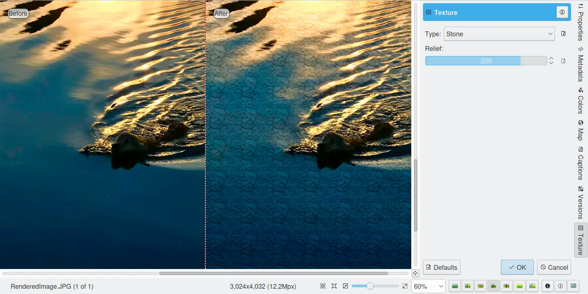
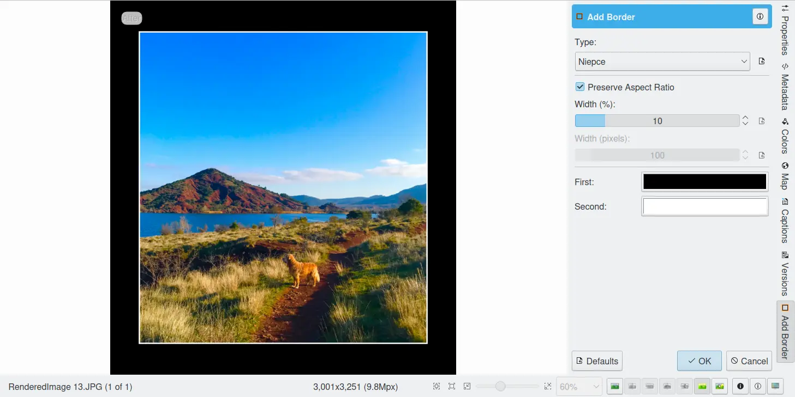

.. meta::
   :description: digiKam Image Editor Decorate Tools
   :keywords: digiKam, documentation, user manual, photo management, open source, free, learn, easy

.. metadata-placeholder

   :authors: - digiKam Team

   :license: see Credits and License page for details (https://docs.digikam.org/en/credits_license.html)

.. _decorate_tools:

Decorate Tools
==============

.. contents::

Apply Texture
-------------

The digiKam Apply Texture is a tool for applying decorative textures to an image.

By adding texture to your image, whether color or black and white, you can make it look like an oil painting on canvas, an Old Masters etching, a Pop Art portrait composed of enlarged half-tone dots, or even a mural on a brick wall. The Decorate --> Apply Texture Image Editor menu can be used for that. 

Two options give you control over the texture applying on image:

    Type: this option specifies the decorative texture style to apply under the image.

    Relief: dragging this option to the right increases the appearance of depth or three-dimensionality of the texture on image.

Add Border
----------

The digiKam Add Border is a tool to frame an image with decorative borders.

Keeping the viewer's interest within the confines of the edges of a photograph is not a simple task. One of the simplest ways to hold the attention on an image is to incorporate a decorative frame around an image. It acts as a kind of psychological barrier to the straying eye. The Image --> Add Border Image Editor menu can be used for that.

Four options give you control over the decorative frame rendering:

    Type: this option specifies the decorative frame style to apply around the image. Solid style just surrounds the image with a colored line, Niepce style surrounds the image with a fine line and a large border (ideal for black and white images), Beveled style adds a neat dimension to your image (ideal to create a button effect), and Decorative style adds an ornamental border using patterns.

    Width: this option specifies the border width in percents of image size. The border is added around the image. The width range is limited between 1% and 50%.

    First: this option specifies the first color to use with the current border type.

    Second: this option specifies the second color to use with the current border type.

Click on the OK button to apply the border around the current image.

.. note::

    The border decorated target image will be bigger than the original, but it will retain the same aspect ratio. This is important for printing images, especially if you have used the Aspect Ratio Crop tool before.

Insert Text
-----------

The digiKam Insert Text is a tool for adding text to an image.

This is a handy tool as it lets you add formatted text easily to an image wherever you want, at several places when needed.

.. figure:: images/editor_insert_text.webp

This tool seems very intuitive to use. Type in your text and place it with the mouse. Use the block settings as you please. Choose the orientation, color from a color space, and fonts with all their properties. You will have to scale the font size to the image size, the larger the image, the larger the font has to be! Finally choose to add a border around the text and/or a semitransparent background. Voilà, it's finished!

Any text setting you have chosen can always be changed as long as you don't click the OK button. In saved and reloaded images the text has become part of the image, it cannot be changed anymore.
