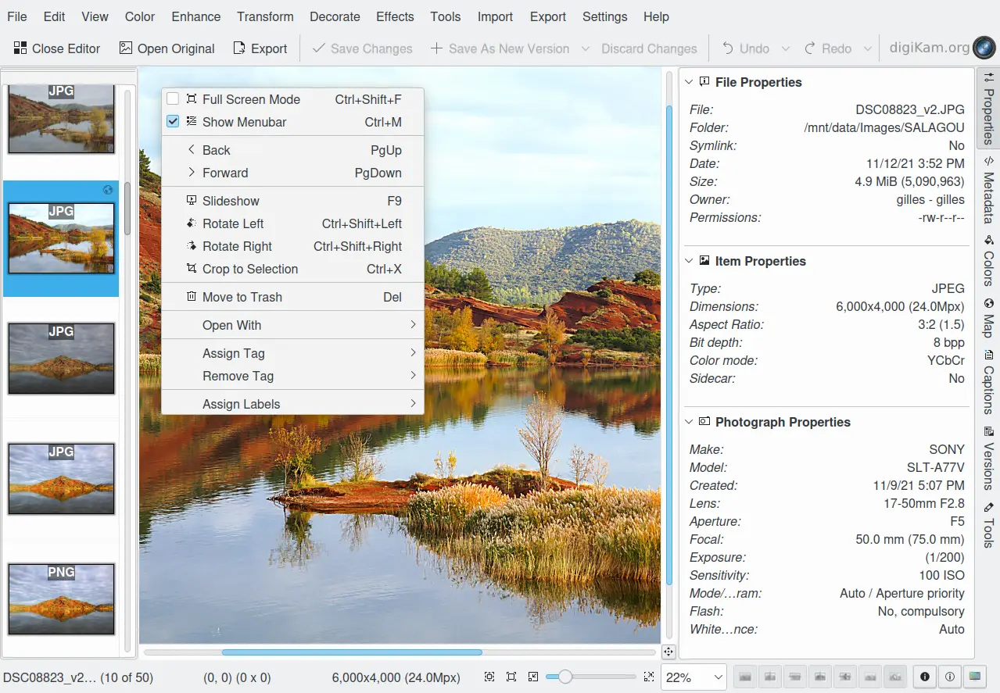

.. meta::
   :description: Overview to digiKam Image Editor
   :keywords: digiKam, documentation, user manual, photo management, open source, free, learn, easy, image, editor

.. metadata-placeholder

   :authors: - digiKam Team

   :license: see Credits and License page for details (https://docs.digikam.org/en/credits_license.html)

.. _editor_overview:

Overview
========

.. contents::

digiKam incorporates a fast Image Editor with a few basic yet powerful image editing tools. You can use the Image Editor to view your photographs and to make corrections and alterations. The Image Editor can be accessed either by clicking on a thumbnail in the Image Window or by clicking with the right mouse button over a thumbnail and selecting **Edit** from the context menu.

The Image Editor provides a number of powerful tools that use you to adjust a photograph.

    The digiKam Image Editor Main Window

The image editor has just one main window with:

    - A status bar at the bottom which shows the filename, the current file number, the current zoom level, and the current image size.

    - A menu bar across the top and below that a tool bar that provides quick access to some commonly used functions.

    - A thumb bar located on left of canvas (optional - see :menuselection:`Settings --> Show Thumbbar` menu entry) can be relocated on top, right, or bottom side. An anchor on the left side of thumb bar allows to move it with the mouse at the wanted place.

    .. figure:: videos/editor_thumbbar.gif
        :width: 500px
        :alt:
        :align: center

        Screencast of Image Editor Thumbbar Placed at Different Canvas Sides

Form left to right, the Image Editor Toolbar includes these actions:

    1. Close image editor Window.

    2. Open original image from the versionning stack.

    3. Export image to a new file format.

    4. Save changes in versionning stack using default format.

    5. Save the modified image in a new version using specific format.

    6. Cancel all modifications done on image.

    7. Undoing last action.

    8. Redoing previous action.

    The digiKam Image Editor Toolbar
