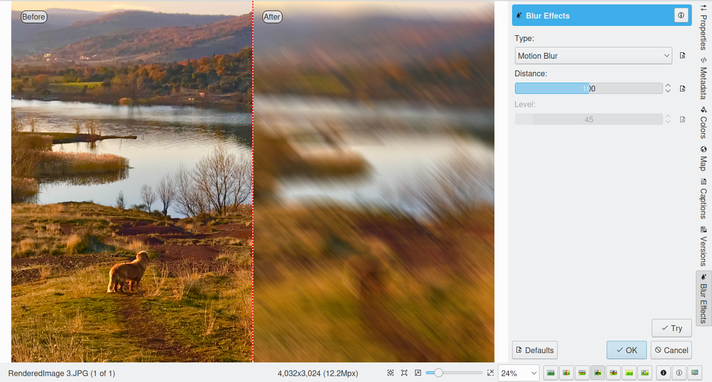
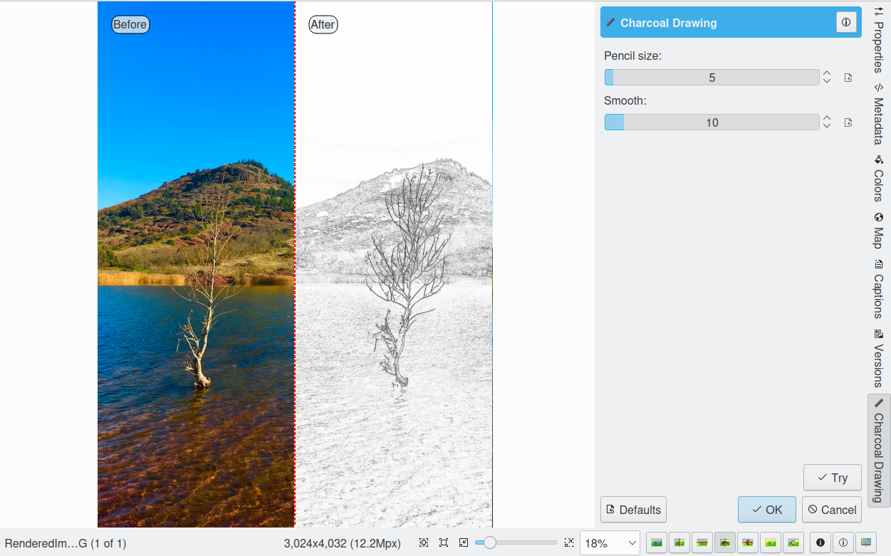
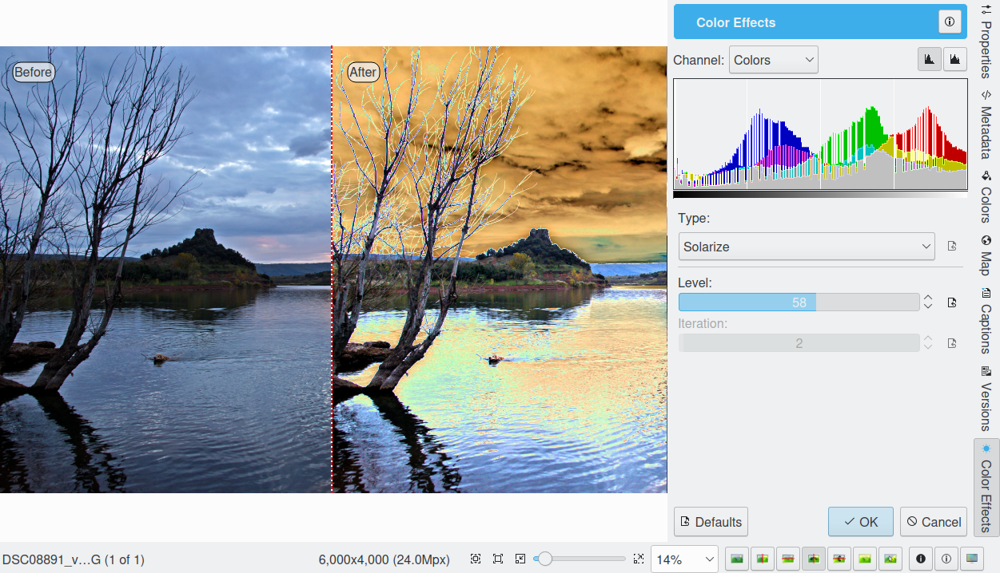
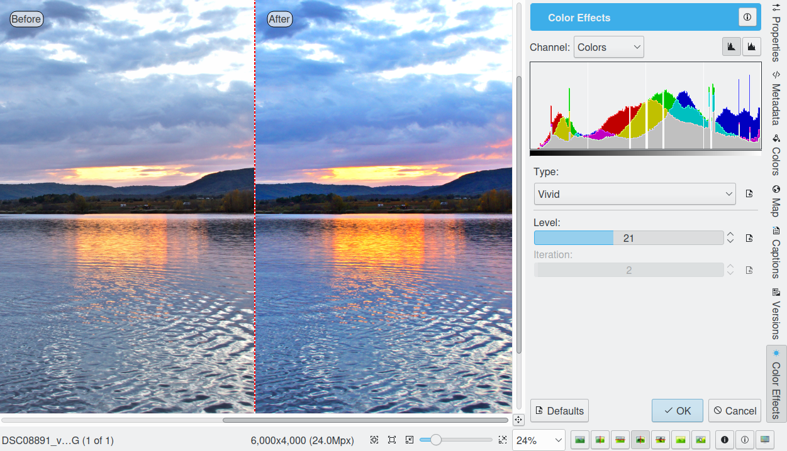
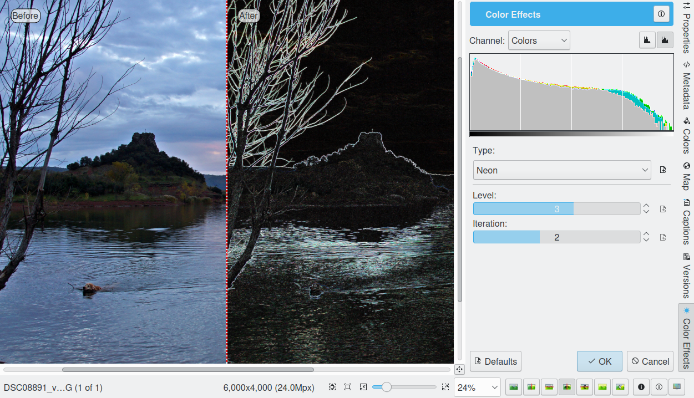
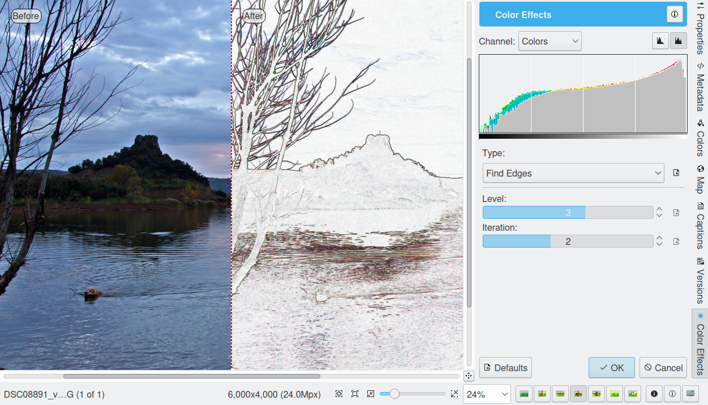
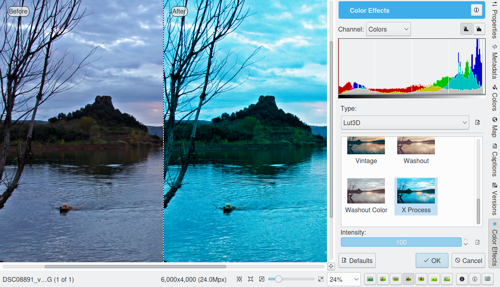
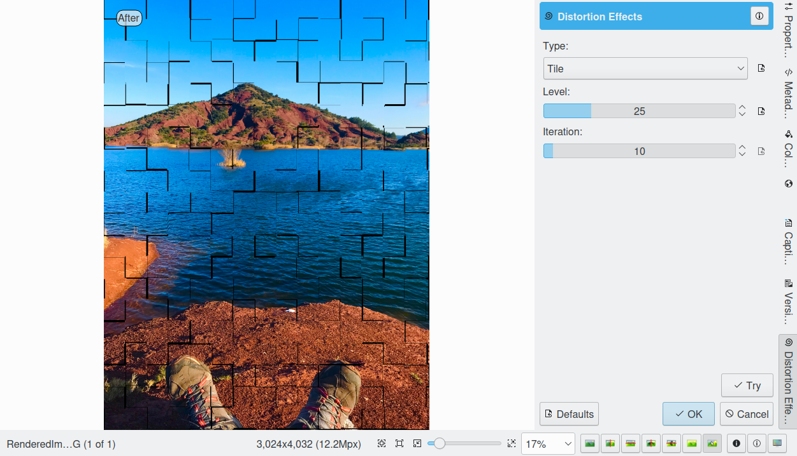

.. meta::
   :description: digiKam Image Editor Effects Tools
   :keywords: digiKam, documentation, user manual, photo management, open source, free, learn, easy

.. metadata-placeholder

   :authors: - Gilles Caulier <caulier dot gilles at gmail dot com>

   :license: Creative Commons License SA 4.0

.. _effects_tools:

Effects Tools
=============

.. contents::

Blur FX
-------

The digiKam Blur FX is a series of blurring effects for digital still images.

With this filter set, you can transform an ordinary photograph into a work of art suitable for framing using blurring operations.

These are the blurring effects available:

    **Zoom Blur**: blurs the image along radial lines starting from a specified center point. This simulates the blur of a zooming camera, thereby giving the photograph a dynamic expression as often seen in sport photography.

    **Radial Blur**: blurs the image by rotating the pixels around the specified center point. This simulates the blur of a rotating camera.

    **Far Blur**: blurs the image to simulate the effect of an unfocused camera lens. The subject seems to recede into the background.

    **Motion Blur**: blurs the image by swishing the pixels horizontally. This simulates the blur of a linearly moving camera, i.e. like a shot taken from a car or train.

    **Focus Blur**: blurs the image corners to reproduce the astigmatism distortion of a lens.

    **Softener Blur**: blurs the image softly in the darker tones and strongly in the high lights. This gives photographs a dreamy and glossy soft focus effect (Hamilton effect). It's ideal for creating romantic portraits, glamour photography, or adding a warm and subtle glow.

    **Shake Blur**: blurs the image by randomly moving the pixels simulating the blur of an arbitrarily moving camera.

    **Smart Blur**: finds the edges of color in photograph and blurs them without muddying the rest of the image.

    **Frost Glass**: blurs the image by simulating randomly dispersing light filtering through hoarse frosted glass.

    **Mosaic**: blurs the image by dividing the photograph into rectangular cells and then recreates it by filling those cells with average pixel value.

.. warning::

    Some effects can take a long time to run and cause high CPU load. You can always abort an effect by pressing the Abort button during preview rendering.

Charcoal Drawing
----------------

The digiKam Charcoal is an effect filter that creates a charcoal sketch-like result.

The digiKam Charcoal filter uses the gradients of color and luminosity to produce a grey scale charcoal sketch. The lines defining the outline of the image are pronounced. Images with slowly changing gradients are not ideal for this effect. It is helpful to imagine what scene you would pick to do as a hand sketch yourself, in order to choose the image to start with.

There are two sliders to control the effect on a scale of 1-100. The upper slider selects the pencil size, whereas the second slider adjusts the contrast (smoothness).

.. note ::

    The result can be improved by adjusting the luminosity levels.

Color Filter Effects
--------------------

The digiKam Color Effects tool provides four color effects: a Solarization effect, a Velvia filter, Neon effect, Edge filter, and Lut3D.

In the age of chemical image processing, solarizing (also known as Sabatier) was an effect created by exposing a partially developed print to a brief flash of light, then completing the development. The colored, darker areas shield the additional light from the sensitive photo layers, which has the net effect of making the lighter areas darker and colors being inverted during the second exposure. The result resembles a partially negative image. The tool allows to adjust the interesting effect smoothly.

The Solarization Effect
~~~~~~~~~~~~~~~~~~~~~~~

The Intensity control helps to preview the solarization by simply increasing it. At about 50% intensity the image shows what was once chemically possible. If you further increase the effect it will finally become a negative image, a stage of inversion not achievable on photographic paper.

The Vivid Effect
~~~~~~~~~~~~~~~~

The vivid filter simulates what is known as "Velvia" effect. It is different from saturation in that it has a more pronounced contrast effect that bring colors brilliantly alive and glowing. Try it, it renders beautiful for many subjects!

Velvia is a brand of daylight-balanced color reversal film produced by the Japanese company Fujifilm. The name is a contraction of "Velvet Media", a reference to its smooth image structure. Velvia has very saturated colors under daylight, high contrast. These characteristics make it the slide film of choice for most nature photographers. Velvia's highly saturated colors are, however, considered overdone by some photographers, especially those who don't primarily shoot landscapes. 

The Neon Effect
~~~~~~~~~~~~~~~~

The neon filter simulates neon light along the contrast edges. The level parameter controls the lightness of the result, whereas the interaction slider determines the thickness of the neon light. With big images, the filter might eat the CPU time for a moment.

The Find Edges Effect
~~~~~~~~~~~~~~~~

The find edges filter detects the edges in a photograph and their strength.

The Lut3D Effect
~~~~~~~~~~~~~~~~

The Lut3D filter coloring images by applying transformation based on a 3D lookup table. 

In the film industry, 3D lookup tables are used to map one color space to another. They are commonly used to calculate preview colors for a monitor or digital projector of how an image will be reproduced on another display device, typically the final digitally projected image or release print of a movie. A 3D LUT is a 3D lattice of output RGB color values that can be indexed by sets of input RGB colour values. Each axis of the lattice represents one of the three input color components and the input color thus defines a point inside the lattice. Since the point may not be on a lattice point, the lattice values must be interpolated; most products use trilinear interpolation.

Distortion FX
-------------

The digiKam Distortion FX is a series of distorting effects for digital still images.

With this filter set, you can transform an ordinary photograph into a work of art suitable for framing using distorting operations.

These are the distorting effects available:

    **Fish Eyes**: warps the photograph around a 3D spherical shape to reproduce the common photograph 'Fish Eyes' effect.  

    **Twirl**: spins the photograph to produce a Twirl pattern.     

    **Cylinder Horizontal**: warps the photograph around a horizontal cylinder.     

    **Cylinder Vertical**: warps the photograph around a vertical cylinder.     

    **Cylinder H/V**: warps the photograph around a 2 cylinders, vertical and horizontal.   

    **Caricature**: distorts photograph with 'Fish Eyes' effect inverted.   

    **Multiple Corners**: splits the photograph like a multiple corners pattern.    

    **Waves Horizontal**: distorts the photograph with horizontal waves.    

    **Waves Vertical**: distorts the photograph with vertical waves.    

    **Block Waves 1**: divides the image into cells and makes it look as if it is being viewed through glass blocks.    

    **Block Waves 2**: like Block Waves 1 but with another version of glass blocks distortion.  

    **Circular Waves 1**: distorts the photograph with circular waves.  

    **Circular Waves 2**: other variation of Circular Waves effect.     

    **Polar Coordinates**: converts the photograph from rectangular to polar coordinates.   

    **Unpolar Coordinates**: Polar Coordinate effect inverted.  

    **Tiles**: splits the photograph into square blocks and move them randomly inside the image.    

.. warning::

    Some effects can take a long time to run and cause high CPU load. You can always abort an effect by pressing Abort button during preview rendering. 