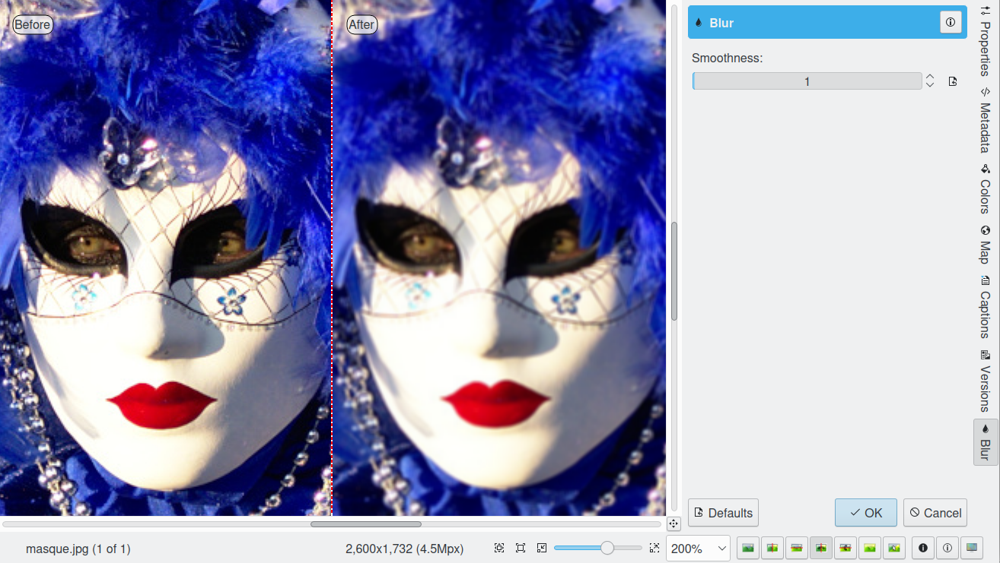
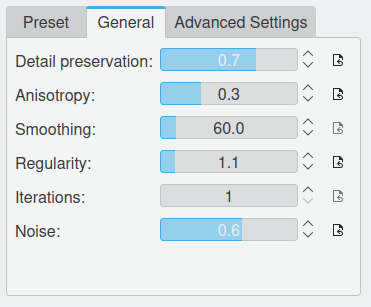
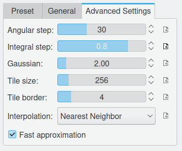
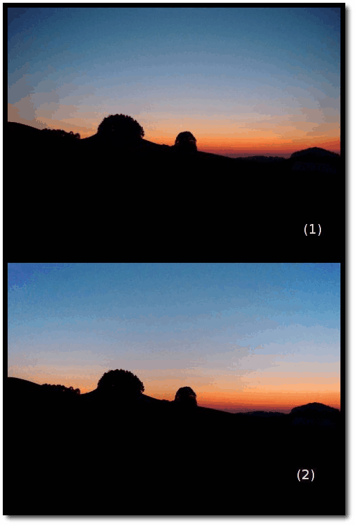

.. meta::
   :description: digiKam Image Editor Enhancement Tools
   :keywords: digiKam, documentation, user manual, photo management, open source, free, learn, easy

.. metadata-placeholder

   :authors: - Gilles Caulier <caulier dot gilles at gmail dot com>

   :license: Creative Commons License SA 4.0

.. _enhancement_tools:

Enhancement Tools
=================

.. contents::

Lens Distortion Correction
--------------------------

digiKam The Lens Distortion is a tool to correct spherical lens aberrations on the photos.

Barrel distortion is associated with wide angle (or minimal zoom) lenses. It causes the images to appear slightly spherical (curved outward) like a barrel. You can notice this when you have straight features close to the image's peripheral sides. Pincushion distortion is the opposite defect and is associated with Telephoto lenses (maximum zoom) or underwater images. The images appear pinched (bent inward) toward the center. The Pincushion is often less noticeable than barrel but are equally visible near the edges. These distortions can easily be eliminated without visible loss in quality with this tool.

.. note::

    This tool treats the geometrical distortions. Chromatic aberrations will not be corrected by this tool. 

The following figures explain the main types of geometrical distortions:

    (1): pincushion distortion.

    (2): no distortion.

    (3): barrel distortion.

.. figure:: images/editor_geometrical_distortions.png

.. note::

    A bit of explanation first. The geometrical corrections use 4th-order polynomial coefficients:

        The 1st-order coefficient changes the size of the image. The tool calls this Zoom.

        The 2nd-order coefficient treats the main geometrical distortion of lenses and can correct the convex or concave shape of the image.

        The 3rd-order coefficient has a similar rounding effect but levels off towards the edges. This correction is not employed in the tool.

        The 4th-order coefficient corrects the far edges inversely to the 2nd-order rounding. Combining it with the 2nd-order correction the geometrical distortions can be almost completely eliminated.

.. figure:: images/editor_lens_distortion.png

Four sliders let you set the distortion correction filter:

    Main: this value controls the amount of 2nd-order distortion. Negative values correct barrel distortions, while positive values correct pincushion distortion.

    Edge: this value controls the amount of 4th-order distortion. The Edge control has more effect at the edges of the image than at the center. For most lenses, the Edge parameter has the opposite sign of the Main parameter.

    Zoom: this value rescales the overall image size (1st-order correction). Negative values zoom out of the image, while positive values zoom in.

    Brighten: this control adjusts the brightness in image corners. Negative values decrease the brightness image corners, while positive values increase it.

To help you to choose the best filter settings, the widget dialog illustrates with a thumbnail preview the distortion correction applied to a crossed mesh pattern. The values you apply to your image will be saved and come up with the same values as default the next time you call the tool.

.. note::

    The barrel-pincushion correction should be done before any crop or size changes (including perspective correction). In fact the Barrel-Pincushion corrections should be the very first step on the original image. If you crop the image and then use barrel correction the effect would be obviously wrong.

To help you finding the best correction the tool provides a vertical and horizontal guide. Move the mouse cursor in the image preview to display the dashed lines guide. Move the cursor to an important place in the image like the sea level or a building border and press the left mouse button for freeze the dashed lines position. Now, adjust the barrel/pincushion correction to align with the guide.

When using pincushion correction the resulting image will have a black border in the corner. You will need to cut this out with a crop tool available in Transform → Crop Image Editor menu or via the zoom slider of this dialog.

On most images using the barrel correction is enough, however with some shots such as front images, frames, paintings, the next logical step is to use perspective correction to make all the angles 90 degrees. Note that when you hold your camera by hand you almost always introduce some kind of slight perspective distortion.

Hot Pixels Correction
---------------------

Overview
~~~~~~~~

digiKam The Hot Pixels tool facilitates removing hot pixels from photographs taken with a CCD camera. It uses algorithms from the JPEGPixi project which are copyrighted by Martin Dickopp.

Most current digital cameras produce images with several brightly colored "bad pixels" when using slow shutter speeds. Night images can be ruined by these "bad pixels". There are three different types of "bad pixels":

    Stuck pixels: it's a pixel that always reads high or is always on to maximum power on all exposures. This produces a bright pixel usually of red, blue or green color in the final image. A stuck pixel will occur regardless of shutter speed, aperture size or any other user settings. It will occur on a normal exposure and tends to be more obvious under bright condition.

    Dead pixels: it's a pixel that reads zero or is always off on all exposures. This state produces a black pixel in the final image. Similar to stuck pixel, a dead pixel will occur regardless of shutter speed, aperture size or any other user settings.

    Hot pixels: it's a pixel that reads high (bright) on longer exposures as white, red, or green color. The longer the exposure time, the more visible hot pixels will become. These pixels will not be visible in bright conditions.

Note that stuck or dead pixels will occur at the same location for all images. If the location of the stuck or dead pixel occurs at different locations, it may be a Hot Pixel.

Stuck, dead or hot pixels are a problem in particular when shooting in high quality raw mode since many cameras have built-in hot pixel suppression applied automatically when JPEG compression is used (which is mostly the case).

This tool can be used to fix the "Hot pixels" and "Stuck Pixels" on a photograph using a black frame subtraction method. There is no yet a manual editor to select bad pixels.

Create the Black Frames
~~~~~~~~~~~~~~~~~~~~~~~

The Black Frame subtraction method is the most accurate "Hot Pixels" and "Stuck Pixels" removal. First you have to create a "Black Frame" as a reference. This is easy to do. When you finish taking your long exposure shots, put a lens cap on the camera and take one "dark" image with the same exposure time as the images before. This image will be all dark, but with close examination you will see that it has the Hot and Stuck Pixels (colored dots). These are positioned at the same places as on your previous shots.

Load this file to the widget using the Black Frame button. The tool will process an automatic detection of Hot and Stuck Pixels. They will be highlighted in the control panel preview areas.

.. warning::

    If you use an old digital camera, it is important to re-shoot the Black Frame next time you are taking a long exposure images to detect new Hot and Stuck Pixels on CCD defects.

Using the hotpixel tool
~~~~~~~~~~~~~~~~~~~~~~~

.. figure:: images/editor_hot_pixels.png

At first, as explained in the previous section, you need to load a Black Frame corresponding to the image to correct. An automatic parsing will be processed on the Black Frame to find bad pixels. Note that the widget will remember the previous Black Frame used on the last session and it will be re-opened automatically with the next session.

The image panel and the original preview help you to pan within the image. The preview window shows the filter output using the current settings. Bad Pixels are highlighted on all preview areas.

Select an area to see bad pixels on preview and the filter result using 'Separate View' options of image panel. Choose the best Filter method to interpolate pixels or pixel blocks. These are the available filters:

    Average: the pixels adjacent to the pixel block are averaged. The resulting color is assigned to all pixels in the block. For 1-dimensional interpolation, this is done separately for one pixel-wide, horizontal or vertical stripes.

    Linear: the pixels which have a distance of 1 from the pixel block are used to calculate a bi-linear surface (2-dim), or a group of linear curves (1-dim), which is then used to assign interpolated colors to the pixels in the block.

    Quadratic: this is the default filtering method. The pixels which have a distance of 2 or less from the pixel block are used to calculate a bi-quadratic surface (2-dim), or a group of quadratic curves (1-dim), which is then used to assign interpolated colors to the pixels in the block.

    Cubic: the pixels which have a distance of 3 or less from the pixel block are used to calculate a bi-cubic surface (2-dim), or a group of cubic curves (1-dim), which is then used to assign interpolated colors to the pixels in the block.

Local Contrast Tool
-------------------

The Local Contrast tool render pseudo-HDR image.

There are multiple ways to render HDR image to improve photos containing under or overexposed areas. With camera devices, usual tools let you merge multiple shots with different exposures into one perfectly exposed photo. This work nicely but require some limitation, as for example the necessity to shot static subjects. But what if you have just in case of single image, or with dynamic subjects? You might want to give a try to the Local Contrast feature. It’s based on the LDR Tonemapping utility which is designed to improve the dynamic range of the photo by reducing its global contrast and increasing the local contrast. It does so by generating a desaturated and blurred version of the photo. It then combines the RGB channels of the original photo with the desaturated blurred image using either the Linear or Power function. Sounds complicated? Don’t worry, the Local Contrast tool is rather straightforward to use, so you don’t have to understand all its intricacies in order to achieve pleasing results.

.. figure:: images/editor_local_contrast.png

Open the photo you want in the editor and choose Enhance → Local Contrast. The tool lets you apply up to four tonemapping operations called stages. Each stage offers two parameters for you to tweak: Power and Blur. The former allows you to specify the desaturation level, while the latter lets you adjust the affected areas on the photo. To preview the result, hit the Try button. Once you are satisfied with the result, press OK to apply the process to the photo.

While the Local Contrast tool may sound like an easy way to fix photos, you should use it with care: sometimes it can do more damage than good, producing unnaturally looking photos.

Noise Reduction
---------------

digiKam The Noise Reduction is a powerful tool to reduce the image noise.

This tool provides selectable image filters to remove specks or other artifacts caused by junk such as dust or hair on the lens. It also can be used to remove Sensor Noise from the camera that maybe caused by high ISO settings, as well as the so-called Moiré Patterns on scanned images from books or magazines.

If you want more information about what's digital camera sensor noise, please take a look in this tutorial.

.. figure:: images/editor_noise_reduction.png

The above screenshot shows a typical scene taken with an digital camera using a high sensitivity ISO setting. It shows grainy noise which can be reduced successfully with this tool.

The re-sizeable image panel with the original preview helps you to pan within the image. Move the red rectangle around to select the area that lets you judge on the optimal filter settings. The preview window shows the filter output using the current settings. It can be rearranged in four different combinations as depicted in the icons below the original preview. This screenshot shows the first arrangement where the same cutout is shown for comparison. On the bottom of preview area, you can see Zoom Factor settings to magnify an area of the image.

You can see below a full description of all parameters:

    Estimate Noise: compute automatically all noise reduction settings by a parse of noise contained in image. By default it recommended to turn on this option and check the result. If reduction of noise is not enough efficient or danamge the image, turn off this option, and adjust the Luminance, Chrominance Blue, and Chrominance Red settings manually.

    Threshold: use the slider for coarse adjustment, and the spin control for fine adjustment.
    The threshold is the value below which everything is considered noise. This value should be set so that edges and details are clearly visible and noise is smoothed out. These settings exists for the Luminance, Chrominance Blue, and Chrominance Red channels. Simply adjust it and watch the preview. Adjustment must be made carefully, because the gap between noisy, smooth, and blur is very small. Adjust it as carefully as you would adjust the focus of a camera.

    Softness: use the slider for coarse adjustment, and the spin control for fine adjustment. The softness adjusts the level of the thresholding (soft as opposed to hard thresholding). The higher the softness the more noise remains in the image. These settings exists for the Luminance, Chrominance Blue, and Chrominance Red channels. Simply adjust it and watch the preview. As for the Threshold settings, adjustment must be made carefully, because the gap between noisy, smooth, and blur is very small. Adjust it as carefully as you would adjust the focus of a camera.

    Save As... and Load...: these buttons are used to do just that. Any Noise Reduction parameters that you have set can be saved to the filesystem and loaded later.

    Defaults: this button resets all settings to default values.

Blur Tool
---------

The Blur Tool is dedicated to soft an image.

Sometimes an image is too crisp for your purposes. The solution is to blur it a bit: fortunately blurring an image is much easier than sharpening it. Select the Blur Tool with the Enhance → Blur menu entry and experiment with the level. The preview window on the right of the dialog shows the effect of the operation on your photograph.

Photograph Restoration
----------------------

digiKam The Photograph Restoration is definitely one of the most advanced tools to reduce photograph artifacts.

This fantastic restoration filter is a development providing unprecedented possibilities in the public domain to remove lots of unwanted stuff from your images. It is well adapted to deal with degraded images suffering from Gaussian noise, film grain, scratches or compression artifacts and local degradations usually encountered in digital (original or digitized) images. The smoothing happens along the image curvatures, thus preserving the meaningful content much alike our human eye would want it.

.. figure:: images/editor_restoration.png

The tool comes with several presets as starting points and to simplify the restoration. The preset settings available are listed below:

    None: Using most common default filter settings not optimized for any particular purpose.

    Reduce Uniform Noise: Optimum settings for image noise due to sensors.

    Reduce JPEG Artifacts: JPEG's compression is not perfect, in fact for some types of images it is far from it. As a lossy compression algorithm, there are some compression "artifacts" - slight defaults showing in the decompressed image. This setting aims at correcting this problem.

    Reduce Texturing: Optimized to remove artifacts from scanning, digitizing or Moire patterns.

If you want to set filter parameters for finer adjustments, use Smoothing Settings and Advanced Settings tabs:

    Detail Preservation p [0, 100]: this controls the preservation of the curvatures (features). A low value forces an equal smoothing across the image, whereas bigger values preferably smooth the homogeneous regions and leaves the details sharper. A value of 0.9 should well preserve details so that no sharpening is required afterwards. Note that Detail Preservation must be always inferior to Anisotropy.

    Anisotropy alpha [0, 100]: a low value smooths equally in all directions, whereas a value close to 1 smooths in one direction only. If you have film grain or CCD kind of noise a high value will result in wave-like pattern, whereas JPEG artifacts are suited for values close to 1.

    Smoothing [0, 500]: this sets the maximum overall smoothing factor (when p defines the relative smoothing). Set it according to the noise level.

    Regularity [0, 100]: this parameter is concerned with the uniformity of the smoothing. Imagine the smoothing process as a combing of the image. Then the Regularity would correspond to the size of the comb. The bigger this value, the more even the overall smoothing will be. This is necessary when much noise is present since it is then difficult to estimate the local geometry. Also if you want to achieve a 'van Gogh' turbulence effect, setting it higher than 3 is recommended.

    Filter Iterations: number of times the blurring algorithm is applied. Usually 1 or 2 is sufficient.

    Angular Step da [5, 90]: angular integration of the anisotropy alpha. If alpha is chosen small, da should also be chosen small. But beware, small angles result in long runs! Choose it as large as you can accept.

    Integral Step [0.1, 10]: spatial integration step width in terms of pixels. Should remain less than 1 (sub-pixel smoothing) and never be higher than 2.

    Use Linear Interpolation: The gain in quality if you select this option is only marginal and you lose a factor of 2 in speed. Our recommendation is to leave it off.

Save As... and Load... buttons are used to do just that. Any Photograph Restoration filter settings that you have set can be saved to the filesystem in a text file and loaded later.

.. warning::

    Photograph restoration is (comparatively) very fast in what it is doing, but it can take a long time to run and cause high CPU load. You may always abort computation by pressing Abort button during preview rendering.

Vignetting Correction
---------------------

Overview
~~~~~~~~

digiKam The Vignetting correction is a tool to correct image vignetting (under-exposure in the corners).

Wide angle lenses, especially those used in medium and large format photography, frequently do not uniformly illuminate the entire sensor plane. Instead, they "vignette" (shade) the edges and corners of the image, substantially reducing the light reaching the sensor there. But telelenses may show vignetting too.

The traditional solution for this is to attach a "center filter" to the lens. This is a neutral density filter with maximum density at the optical axis of the lens, clear at the periphery, with density varying inversely to the vignetting of the lens. A center filter has many advantages: not only does it automatically correct for full-frame images but, since it's fixed to the front of the lens, it also compensates for the off-center vignetting which occurs when camera movements are employed for perspective or plane of focus adjustment.

But there are disadvantages as well. Many center filters require a 1.5 or 2 f-stop filter factor adjustment, which may in turn necessitate a shutter speed so slow (since wide angle lenses, even with center filters, are best used at apertures of f/16 or smaller) that hand-holding the camera is impossible and motion blur becomes a problem when photographing moving objects.

With the wide exposure range of present-day film and the color (or grey-scale) depth of digital camera or film scanners, it is possible to simulate the effect of a center filter by applying an equivalent transform to a raw image taken without the filter.

Using the vignetting correction tool
~~~~~~~~~~~~~~~~~~~~~~~~~~~~~~~~~~~~

Five sliders give you control over the vignetting correction filter, and three more over the target image exposure:

    Amount: this option controls the degree of luminosity attenuation by the filter at its point of maximum amount. The default amount is 2.0, which corresponds to an optical filter with a 1 f-stop filter factor (or, by no coincidence, a factor of 2 in luminosity). Increase the amount to compensate for a greater degree of vignetting; reduce it for less.

    Feather: this option determines the rate at which the filter intensity falls off from the point of maximum amount toward the edges, expressed as a power factor. The default of 1 yields a linear reduction in filter amount with distance from the center. Power factors greater than 1.0 cause a faster fall-off (for example, a power of 2 causes the amount to decrease as the square of the distance from the center) and causes the effect of the filter to be concentrated near the center. Powers less than 1 spread out the amount of the filter toward the edges; a power of 0.5 causes the amount to fall as the square root of the distance from the center.

    Radius: this option specifies the radius, as a multiple of the half diagonal measure of the image, at which the amount of the filter falls off to zero (or, in other words, becomes transparent). The default value of 1.0 specifies a filter which is transparent at its corners. A radius specification greater than 1 extends the effect of the center filter beyond the edges of the image, while a radius less than one limits the filter's action to a region smaller than the image. When compensating for vignetting by lenses used with large format and some medium format cameras, the default radius factor of 1 is rarely correct! These lenses often "cover" an image circle substantially larger than the film to permit camera movements to control perspective and focus, and consequently have a vignetting pattern which extends well beyond the edges of the film, requiring a radius setting greater than 1 to simulate a center filter covering the entire image circle.

    X offset and Y offset settings: these options moves respectively the center of the filter horizontally or vertically up to the border of the image by the specified percentage. A negative value for the X offset will shift the filter to the left while a positive value will shift it to the right. A negative value for the Y offset will move the filter up, and finally a positive value will move it down.

    Add Vignetting: many photographs looks flat because of a distracting background or another composition matter. While most of time you will want to remove vignetting it is a fact that a selective vignetting could improve the readability of a photograph and draw the eyes to the intended subject. As an artist you may choose this option, ticking it will invert the filter thus darkening the corners of a photograph.

The only way to be sure which settings of Amount, Feather, and Radius best compensate for the actual optical characteristics of a given lens is to expose a uniformly illuminated scene (for example, a grey card lit by diffuse light) and perform densitometry on the resulting image (for example with Adjust Level tool histogram position bar). Failing that, or specifications by the lens manufacturer giving the precise degree of vignetting at one or more working apertures, you may have to experiment with different settings to find those which work best for each of your lenses. For help you in this task, the widget dialog provide a thumbnail mask rendering applied on the image. Fortunately, the response of the human eye is logarithmic, not linear like most digital imaging sensors, so you needn't precisely compensate for the actual vignetting to create images which viewers will perceive as uniformly illuminated.

.. note::

    If you want a finer exposure re-adjustment of the target image, use the Adjust Curve tool from Image Editor available under Color → Adjust Curve menu entry.

The vignetting correction tool in action
~~~~~~~~~~~~~~~~~~~~~~~~~~~~~~~~~~~~~~~~

This is an example of an anti vignetting correction applied to an image. The original image (1) shows vignetting in the corners, the corrected image (2) much less. A brightness and contrast correction is also applied to the target image by this tool.

The values used for this example are:

    Density = 2.6.

    Power = 0.9.

    Radius = 1.1.

