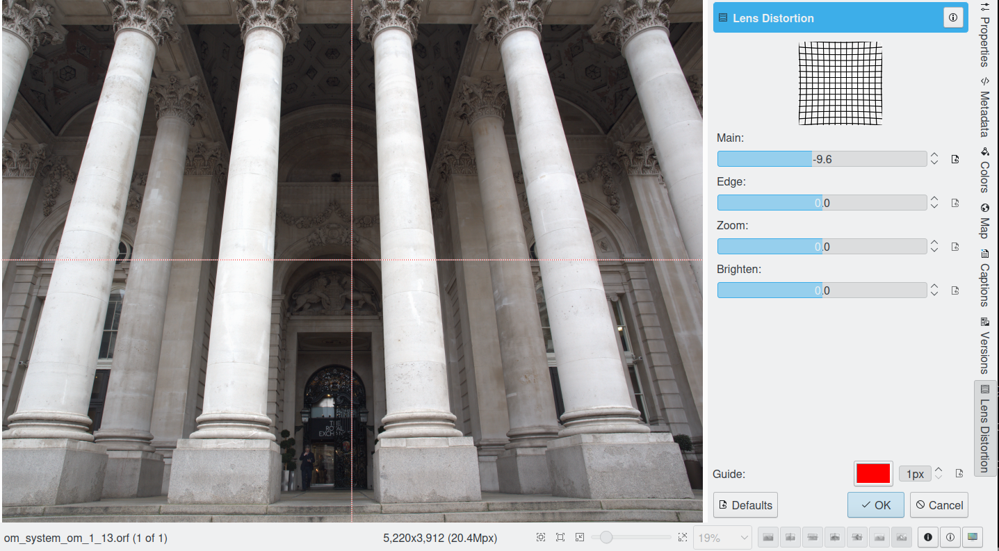

.. meta::
   :description: digiKam Image Editor Enhancement Tools
   :keywords: digiKam, documentation, user manual, photo management, open source, free, learn, easy

.. metadata-placeholder

   :authors: - Gilles Caulier <caulier dot gilles at gmail dot com>

   :license: Creative Commons License SA 4.0

.. _enhancement_tools:

Enhancement Tools
=================

.. contents::

Lens Distortion Correction
--------------------------

digiKam The Lens Distortion is a tool to correct spherical lens aberrations on the photos.

Barrel distortion is associated with wide angle (or minimal zoom) lenses. It causes the images to appear slightly spherical (curved outward) like a barrel. You can notice this when you have straight features close to the image's peripheral sides. Pincushion distortion is the opposite defect and is associated with Telephoto lenses (maximum zoom) or underwater images. The images appear pinched (bent inward) toward the center. The Pincushion is often less noticeable than barrel but are equally visible near the edges. These distortions can easily be eliminated without visible loss in quality with this tool.

.. note::

    This tool treats the geometrical distortions. Chromatic aberrations will not be corrected by this tool. 

The following figures explain the main types of geometrical distortions:

    (1): pincushion distortion.

    (2): no distortion.

    (3): barrel distortion.

.. figure:: images/editor_geometrical_distortions.png

.. note::

    A bit of explanation first. The geometrical corrections use 4th-order polynomial coefficients:

        The 1st-order coefficient changes the size of the image. The tool calls this Zoom.

        The 2nd-order coefficient treats the main geometrical distortion of lenses and can correct the convex or concave shape of the image.

        The 3rd-order coefficient has a similar rounding effect but levels off towards the edges. This correction is not employed in the tool.

        The 4th-order coefficient corrects the far edges inversely to the 2nd-order rounding. Combining it with the 2nd-order correction the geometrical distortions can be almost completely eliminated.

Four sliders let you set the distortion correction filter:

    Main: this value controls the amount of 2nd-order distortion. Negative values correct barrel distortions, while positive values correct pincushion distortion.

    Edge: this value controls the amount of 4th-order distortion. The Edge control has more effect at the edges of the image than at the center. For most lenses, the Edge parameter has the opposite sign of the Main parameter.

    Zoom: this value rescales the overall image size (1st-order correction). Negative values zoom out of the image, while positive values zoom in.

    Brighten: this control adjusts the brightness in image corners. Negative values decrease the brightness image corners, while positive values increase it.

To help you to choose the best filter settings, the widget dialog illustrates with a thumbnail preview the distortion correction applied to a crossed mesh pattern. The values you apply to your image will be saved and come up with the same values as default the next time you call the tool.

.. note::

    The barrel-pincushion correction should be done before any crop or size changes (including perspective correction). In fact the Barrel-Pincushion corrections should be the very first step on the original image. If you crop the image and then use barrel correction the effect would be obviously wrong.

To help you finding the best correction the tool provides a vertical and horizontal guide. Move the mouse cursor in the image preview to display the dashed lines guide. Move the cursor to an important place in the image like the sea level or a building border and press the left mouse button for freeze the dashed lines position. Now, adjust the barrel/pincushion correction to align with the guide.

When using pincushion correction the resulting image will have a black border in the corner. You will need to cut this out with a crop tool available in Transform → Crop Image Editor menu or via the zoom slider of this dialog.

On most images using the barrel correction is enough, however with some shots such as front images, frames, paintings, the next logical step is to use perspective correction to make all the angles 90 degrees. Note that when you hold your camera by hand you almost always introduce some kind of slight perspective distortion.

Hot Pixels Correction
---------------------

Overview
~~~~~~~~

digiKam The Hot Pixels tool facilitates removing hot pixels from photographs taken with a CCD camera. It uses algorithms from the JPEGPixi project which are copyrighted by Martin Dickopp.

Most current digital cameras produce images with several brightly colored "bad pixels" when using slow shutter speeds. Night images can be ruined by these "bad pixels". There are three different types of "bad pixels":

    Stuck pixels: it's a pixel that always reads high or is always on to maximum power on all exposures. This produces a bright pixel usually of red, blue or green color in the final image. A stuck pixel will occur regardless of shutter speed, aperture size or any other user settings. It will occur on a normal exposure and tends to be more obvious under bright condition.

    Dead pixels: it's a pixel that reads zero or is always off on all exposures. This state produces a black pixel in the final image. Similar to stuck pixel, a dead pixel will occur regardless of shutter speed, aperture size or any other user settings.

    Hot pixels: it's a pixel that reads high (bright) on longer exposures as white, red, or green color. The longer the exposure time, the more visible hot pixels will become. These pixels will not be visible in bright conditions.

Note that stuck or dead pixels will occur at the same location for all images. If the location of the stuck or dead pixel occurs at different locations, it may be a Hot Pixel.

Stuck, dead or hot pixels are a problem in particular when shooting in high quality raw mode since many cameras have built-in hot pixel suppression applied automatically when JPEG compression is used (which is mostly the case).

This tool can be used to fix the "Hot pixels" and "Stuck Pixels" on a photograph using a black frame subtraction method. There is no yet a manual editor to select bad pixels.

Create the Black Frames
~~~~~~~~~~~~~~~~~~~~~~~

The Black Frame subtraction method is the most accurate "Hot Pixels" and "Stuck Pixels" removal. First you have to create a "Black Frame" as a reference. This is easy to do. When you finish taking your long exposure shots, put a lens cap on the camera and take one "dark" image with the same exposure time as the images before. This image will be all dark, but with close examination you will see that it has the Hot and Stuck Pixels (colored dots). These are positioned at the same places as on your previous shots.

Load this file to the widget using the Black Frame button. The tool will process an automatic detection of Hot and Stuck Pixels. They will be highlighted in the control panel preview areas.

.. warning::

    If you use an old digital camera, it is important to re-shoot the Black Frame next time you are taking a long exposure images to detect new Hot and Stuck Pixels on CCD defects.

Using the hotpixel tool
~~~~~~~~~~~~~~~~~~~~~~~

.. figure:: images/editor_hot_pixels.png

At first, as explained in the previous section, you need to load a Black Frame corresponding to the image to correct. An automatic parsing will be processed on the Black Frame to find bad pixels. Note that the widget will remember the previous Black Frame used on the last session and it will be re-opened automatically with the next session.

The image panel and the original preview help you to pan within the image. The preview window shows the filter output using the current settings. Bad Pixels are highlighted on all preview areas.

Select an area to see bad pixels on preview and the filter result using 'Separate View' options of image panel. Choose the best Filter method to interpolate pixels or pixel blocks. These are the available filters:

    Average: the pixels adjacent to the pixel block are averaged. The resulting color is assigned to all pixels in the block. For 1-dimensional interpolation, this is done separately for one pixel-wide, horizontal or vertical stripes.

    Linear: the pixels which have a distance of 1 from the pixel block are used to calculate a bi-linear surface (2-dim), or a group of linear curves (1-dim), which is then used to assign interpolated colors to the pixels in the block.

    Quadratic: this is the default filtering method. The pixels which have a distance of 2 or less from the pixel block are used to calculate a bi-quadratic surface (2-dim), or a group of quadratic curves (1-dim), which is then used to assign interpolated colors to the pixels in the block.

    Cubic: the pixels which have a distance of 3 or less from the pixel block are used to calculate a bi-cubic surface (2-dim), or a group of cubic curves (1-dim), which is then used to assign interpolated colors to the pixels in the block.

Local Contrast Tool
-------------------

The Local Contrast tool render pseudo-HDR image.

There are multiple ways to render HDR image to improve photos containing under or overexposed areas. With camera devices, usual tools let you merge multiple shots with different exposures into one perfectly exposed photo. This work nicely but require some limitation, as for example the necessity to shot static subjects. But what if you have just in case of single image, or with dynamic subjects? You might want to give a try to the Local Contrast feature. It’s based on the LDR Tonemapping utility which is designed to improve the dynamic range of the photo by reducing its global contrast and increasing the local contrast. It does so by generating a desaturated and blurred version of the photo. It then combines the RGB channels of the original photo with the desaturated blurred image using either the Linear or Power function. Sounds complicated? Don’t worry, the Local Contrast tool is rather straightforward to use, so you don’t have to understand all its intricacies in order to achieve pleasing results.

Open the photo you want in the editor and choose Enhance → Local Contrast. The tool lets you apply up to four tonemapping operations called stages. Each stage offers two parameters for you to tweak: Power and Blur. The former allows you to specify the desaturation level, while the latter lets you adjust the affected areas on the photo. To preview the result, hit the Try button. Once you are satisfied with the result, press OK to apply the process to the photo.

While the Local Contrast tool may sound like an easy way to fix photos, you should use it with care: sometimes it can do more damage than good, producing unnaturally looking photos.

