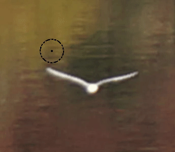

.. meta::
   :description: digiKam Image Editor Enhancement Tools
   :keywords: digiKam, documentation, user manual, photo management, open source, free, learn, easy, image, editor, healing, clone, lens, distortion, sharpen, blur, red, eyes, local, contrast, noise, reduction, hot, pixels, restoration, vignetting

.. metadata-placeholder

   :authors: - digiKam Team

   :license: see Credits and License page for details (https://docs.digikam.org/en/credits_license.html)

.. _enhancement_tools:

Enhancement Tools
=================

.. contents::

.. _enhance_lensdistortion:

Lens Distortion Correction
--------------------------

The Lens Distortion is a tool to correct spherical lens aberrations on the photos.

Barrel distortion is associated with wide angle (or minimal zoom) lenses. It causes the images to appear slightly spherical (curved outward) like a barrel. You can notice this when you have straight features close to the image's peripheral sides. Pincushion distortion is the opposite defect and is associated with Telephoto lenses (maximum zoom) or underwater images. The images appear pinched (bent inward) toward the center. The Pincushion is often less noticeable than barrel but are equally visible near the edges. These distortions can easily be eliminated without visible loss in quality with this tool.

.. note::

    This tool treats the geometrical distortions. Chromatic aberrations will not be corrected by this tool. See the **Lens Auto Correction** tool instead.

The following figures explain the main types of geometrical distortions:

    (1): Pincushion distortion.

    (2): No distortion.

    (3): Barrel distortion.

.. figure:: images/editor_geometrical_distortions.webp
    :alt:
    :align: center

    The Geometrical Distortion Types

.. note::

    A bit of explanation first. The geometrical corrections use 4th-order polynomial coefficients:

        - The 1st-order coefficient changes the size of the image. The tool calls this **Zoom**.

        - The 2nd-order coefficient treats the main geometrical distortion of lenses and can correct the convex or concave shape of the image.

        - The 3rd-order coefficient has a similar rounding effect but levels off towards the edges. This correction is not employed in the tool.

        - The 4th-order coefficient corrects the far edges inversely to the 2nd-order rounding. Combining it with the 2nd-order correction the geometrical distortions can be almost completely eliminated.

.. figure:: images/editor_lens_distortion.webp
    :alt:
    :align: center

    The Image Editor Lens Distortion Tool

Four sliders let you set the distortion correction filter:

    - **Main**: this value controls the amount of 2nd-order distortion. Negative values correct barrel distortions, while positive values correct pincushion distortion.

    - **Edge**: this value controls the amount of 4th-order distortion. The Edge control has more effect at the edges of the image than at the center. For most lenses, the **Edge** parameter has the opposite sign of the **Main** parameter.

    - **Zoom**: this value rescales the overall image size (1st-order correction). Negative values zoom out of the image, while positive values zoom in.

    - **Brighten**: this control adjusts the brightness in image corners. Negative values decrease the brightness image corners, while positive values increase it.

To help you to choose the best filter settings, the widget dialog illustrates with a thumbnail preview the distortion correction applied to a crossed mesh pattern. The values you apply to your image will be saved and come up with the same values as default the next time you call the tool.

.. note::

    The barrel-pincushion correction should be done before any crop or size changes (including perspective correction). In fact the Barrel-Pincushion corrections should be the very first step on the original image. If you crop the image and then use barrel correction the effect would be obviously wrong.

To help you finding the best correction the tool provides a vertical and horizontal guide. Move the mouse cursor in the image preview to display the dashed lines guide. Move the cursor to an important place in the image like the sea level or a building border and press the left mouse button for freeze the dashed lines position. Now, adjust the barrel/pincushion correction to align with the guide.

When using pincushion correction the resulting image will have a black border in the corner. You will need to cut this out with a crop tool available in :menuselection:`Transform --> Crop` Image Editor menu or via the zoom slider of this dialog.

On most images using the barrel correction is enough, however with some shots such as front images, frames, paintings, the next logical step is to use perspective correction to make all the angles 90 degrees. Note that when you hold your camera by hand you almost always introduce some kind of slight perspective distortion.

.. _enhance_vignetting:

Vignetting Correction
---------------------

Overview
~~~~~~~~

digiKam The Vignetting correction is a tool to correct image vignetting (under-exposure in the corners).

Wide angle lenses, especially those used in medium and large format photography, frequently do not uniformly illuminate the entire sensor plane. Instead, they *vignette* (shade) the edges and corners of the image, substantially reducing the light reaching the sensor there. But telelenses may show vignetting too.

The traditional solution for this is to attach a *center filter* to the lens. This is a neutral density filter with maximum density at the optical axis of the lens, clear at the periphery, with density varying inversely to the vignetting of the lens. A center filter has many advantages: not only does it automatically correct for full-frame images but, since it's fixed to the front of the lens, it also compensates for the off-center vignetting which occurs when camera movements are employed for perspective or plane of focus adjustment.

But there are disadvantages as well. Many center filters require a 1.5 or 2 f-stop filter factor adjustment, which may in turn necessitate a shutter speed so slow (since wide angle lenses, even with center filters, are best used at apertures of f/16 or smaller) that hand-holding the camera is impossible and motion blur becomes a problem when photographing moving objects.

With the wide exposure range of present-day film and the color (or grey-scale) depth of digital camera or film scanners, it is possible to simulate the effect of a center filter by applying an equivalent transform to a raw image taken without the filter.

Using the vignetting correction tool
~~~~~~~~~~~~~~~~~~~~~~~~~~~~~~~~~~~~

.. figure:: images/editor_vignetting_correction.webp
    :alt:
    :align: center

    The Vignetting Correction Types

Five sliders give you control over the vignetting correction filter, and three more over the target image exposure:

    - **Amount**: this option controls the degree of luminosity attenuation by the filter at its point of maximum amount. The default amount is 2.0, which corresponds to an optical filter with a 1 f-stop filter factor (or, by no coincidence, a factor of 2 in luminosity). Increase the amount to compensate for a greater degree of vignetting; reduce it for less.

    - **Feather**: this option determines the rate at which the filter intensity falls off from the point of maximum amount toward the edges, expressed as a power factor. The default of 1 yields a linear reduction in filter amount with distance from the center. Power factors greater than 1.0 cause a faster fall-off (for example, a power of 2 causes the amount to decrease as the square of the distance from the center) and causes the effect of the filter to be concentrated near the center. Powers less than 1 spread out the amount of the filter toward the edges; a power of 0.5 causes the amount to fall as the square root of the distance from the center.

    - **Radius**: this option specifies the radius, as a multiple of the half diagonal measure of the image, at which the amount of the filter falls off to zero (or, in other words, becomes transparent). The default value of 1.0 specifies a filter which is transparent at its corners. A radius specification greater than 1 extends the effect of the center filter beyond the edges of the image, while a radius less than one limits the filter's action to a region smaller than the image. When compensating for vignetting by lenses used with large format and some medium format cameras, the default radius factor of 1 is rarely correct! These lenses often "cover" an image circle substantially larger than the film to permit camera movements to control perspective and focus, and consequently have a vignetting pattern which extends well beyond the edges of the film, requiring a radius setting greater than 1 to simulate a center filter covering the entire image circle.

    - **X offset** and **Y offset** settings: these options moves respectively the center of the filter horizontally or vertically up to the border of the image by the specified percentage. A negative value for the X offset will shift the filter to the left while a positive value will shift it to the right. A negative value for the Y offset will move the filter up, and finally a positive value will move it down.

    - **Add Vignetting**: many photographs looks flat because of a distracting background or another composition matter. While most of time you will want to remove vignetting it is a fact that a selective vignetting could improve the readability of a photograph and draw the eyes to the intended subject. As an artist you may choose this option, ticking it will invert the filter thus darkening the corners of a photograph.

The only way to be sure which settings of **Amount**, **Feather**, and **Radius** best compensate for the actual optical characteristics of a given lens is to expose a uniformly illuminated scene (for example, a grey card lit by diffuse light) and perform densitometry on the resulting image (for example with Adjust Level tool histogram position bar). Failing that, or specifications by the lens manufacturer giving the precise degree of vignetting at one or more working apertures, you may have to experiment with different settings to find those which work best for each of your lenses. For help you in this task, the widget dialog provide a thumbnail mask rendering applied on the image. Fortunately, the response of the human eye is logarithmic, not linear like most digital imaging sensors, so you needn't precisely compensate for the actual vignetting to create images which viewers will perceive as uniformly illuminated.

.. note::

    If you want a finer exposure re-adjustment of the target image, use the Adjust Curve tool from Image Editor available under :menuselection:`Color --> Adjust Curve` menu entry.

The vignetting correction tool in action
~~~~~~~~~~~~~~~~~~~~~~~~~~~~~~~~~~~~~~~~

This is an example of an anti vignetting correction applied to an image. The original image on the top shows vignetting in the corners, the corrected image on the bottom much less. The values used for this example are:

    - Density = 2.6.

    - Power = 0.9.

    - Radius = 1.1.

.. figure:: images/editor_antivignetting_preview.webp
    :alt:
    :align: center

    The Image Editor Anti-Vignetting Tool

.. _enhance_lensauto:

Lens Auto Correction
--------------------

No lens is optically perfect. Even the most expensive lenses have there own imperfections, however digiKam can correct lens imperfections such as **Distortion**, **Chromatic aberration**, **Vignetting**, and **Geometry**.

.. figure:: images/editor_lens_auto.webp
    :alt:
    :align: center

    The Lens Auto-Correction Tool from digiKam Image Editor

From Image Editor go to :menuselection:`Enhance --> Lens --> Auto Corrections` menu entry to start the automatic lens correction tool. This feature uses lens data from the `Lensfun library <https://lensfun.github.io/>`_ and it has a very much up to date database of lenses which are available. It has more than a hundred lenses in its current databases. It also uses the **Metadata** from the image to find-out which lens is used.

If the exact used to take the picture is available it will mention that it matches with the metadata (annoted in **Green**), however if the exact match is not available it will choose the settings from the most closes match (annoted in **Orange**). In this case it also allows users to select the lens themselves. If metadata do not match at all, it will be annoted in **Red**.

.. figure:: images/editor_lens_auto_metadata_match.webp
   :alt:
   :align: center

   Metadata Match with LensFun Database

.. figure:: images/editor_lens_auto_metadata_partial.webp
   :alt:
   :align: center

   Metadata Match Partially with LensFun Database

.. figure:: images/editor_lens_auto_metadata_none.webp
   :alt:
   :align: center

   Metadata do not Match with LensFun Database

You can either enable or disable the helper **Grid** lines to visualise how the geometrical distortion are corrected on image.

.. figure:: images/editor_lens_auto_grid.webp
    :alt:
    :align: center

    The Lens Auto-Correction Tool Displaying the Helper Grid over the Canvas

Select the corrections you want to apply move you mouse inwards and outwards of the preview window which will show you before and after. When you are satisfied with the result press **OK**.

.. _enhance_hotpixels:

Hot Pixels Correction
---------------------

Overview
~~~~~~~~

digiKam The Hot Pixels tool facilitates removing hot pixels from photographs taken with a camera electronic sensor.

Most current digital cameras produce images with several brightly colored **Bad Pixels** when using slow shutter speeds. Night images can be ruined by these Bad Pixels. There are three different types of Bad Pixels:

    - **Stuck pixels**: it's a pixel that always reads high or is always on to maximum power on all exposures. This produces a bright pixel usually of red, blue or green color in the final image. A stuck pixel will occur regardless of shutter speed, aperture size or any other user settings. It will occur on a normal exposure and tends to be more obvious under bright condition.

    - **Dead pixels**: it's a pixel that reads zero or is always off on all exposures. This state produces a black pixel in the final image. Similar to stuck pixel, a dead pixel will occur regardless of shutter speed, aperture size or any other user settings.

    - **Hot pixels**: it's a pixel that reads high (bright) on longer exposures as white, red, or green color. The longer the exposure time, the more visible hot pixels will become. These pixels will not be visible in bright conditions.

Note that stuck or dead pixels will occur at the same location for all images. If the location of the stuck or dead pixel occurs at different locations, it may be a Hot Pixel.

Stuck, dead or hot pixels are a problem in particular when shooting in high quality raw mode since many cameras have built-in hot pixel suppression applied automatically when JPEG compression is used (which is mostly the case).

This tool can be used to fix the **Hot pixels** and **Stuck Pixels** on a photograph using a **Black Frame** subtraction method. There is not a manual editor to select Bad Pixels.

Create the Black Frames
~~~~~~~~~~~~~~~~~~~~~~~

The Black Frame subtraction method is the most accurate "Hot Pixels" and "Stuck Pixels" removal. First you have to create a "Black Frame" as a reference. This is easy to do. When you finish taking your long exposure shots, put a lens cap on the camera and take one "dark" image with the same exposure time as the images before. This image will be all dark, but with close examination you will see that it has the Hot and Stuck Pixels (colored dots). These are positioned at the same places as on your previous shots.

Load this file to the widget using the **Black Frame** button. The tool will process an automatic detection of Hot and Stuck Pixels. They will be highlighted in the control panel preview areas.

.. warning::

    If you use an old digital camera, it is important to re-shoot the Black Frame next time you are taking a long exposure images to detect new Hot and Stuck Pixels on sensor defects.

Using the hotpixel tool
~~~~~~~~~~~~~~~~~~~~~~~

.. figure:: images/editor_hotpixels_fixer.webp
    :alt:
    :align: center

    The Image Editor Hot Pixels Tool

At first, as explained in the previous section, you need to load a Black Frame corresponding to the image to correct. An automatic parsing will be processed on the Black Frame to find bad pixels. Note that the widget will remember the previous Black Frame used on the last session and it will be re-opened automatically with the next session.

The image panel and the original preview help you to pan within the image. The preview window shows the filter output using the current settings. Bad Pixels are highlighted on preview area.

Select an area to see bad pixels on preview and the filter result using *Separate View* options of image panel. Choose the best **Filter** method to interpolate pixels or pixel blocks. These are the available filters:

    - **Average**: the pixels adjacent to the pixel block are averaged. The resulting color is assigned to all pixels in the block. For 1-dimensional interpolation, this is done separately for one pixel-wide, horizontal or vertical stripes.

    - **Linear**: the pixels which have a distance of 1 from the pixel block are used to calculate a bi-linear surface (2-dim), or a group of linear curves (1-dim), which is then used to assign interpolated colors to the pixels in the block.

    - **Quadratic**: this is the default filtering method. The pixels which have a distance of 2 or less from the pixel block are used to calculate a bi-quadratic surface (2-dim), or a group of quadratic curves (1-dim), which is then used to assign interpolated colors to the pixels in the block.

    - **Cubic**: the pixels which have a distance of 3 or less from the pixel block are used to calculate a bi-cubic surface (2-dim), or a group of cubic curves (1-dim), which is then used to assign interpolated colors to the pixels in the block.

.. _enhance_localcontrast:

Local Contrast Tool
-------------------

The Local Contrast tool render pseudo-HDR image.

There are multiple ways to render HDR image to improve photos containing under or overexposed areas. With camera devices, usual tools let you merge multiple shots with different exposures into one perfectly exposed photo. This work nicely but require some limitation, as for example the necessity to shot static subjects. But what if you have just in case of single image, or with dynamic subjects? You might want to give a try to the Local Contrast feature. It uses a Low Dynamic Range `Tonemapping <https://en.wikipedia.org/wiki/Tone_mapping>`_ which is designed to improve the dynamic range of the photo by reducing its global contrast and increasing the local contrast. It does so by generating a desaturated and blurred version of the photo. It then combines the RGB channels of the original photo with the desaturated blurred image using either the Linear or Power function. Sounds complicated? Don’t worry, the Local Contrast tool is rather straightforward to use, so you don’t have to understand all its intricacies in order to achieve pleasing results.

.. figure:: images/editor_local_contrast.webp
    :alt:
    :align: center

    The Image Editor Local Contrast Tool

Open the photo you want in the editor and choose :menuselection:`Enhance --> Local Contrast`. The tool lets you apply up to four tonemapping operations called stages. Each **Stage** offers two parameters for you to tweak: **Power** and **Blur**. The former allows you to specify the desaturation level, while the latter lets you adjust the affected areas on the photo. To preview the result, hit the **Try** button. Once you are satisfied with the result, press **OK** to apply the process to the photo.

While the Local Contrast tool may sound like an easy way to fix photos, you should use it with care: sometimes it can do more damage than good, producing unnaturally looking photos.

.. _enhance_nr:

Noise Reduction
---------------

digiKam The Noise Reduction is a powerful tool to reduce the image noise.

This tool provides selectable image filters to remove specks or other artifacts caused by junk such as dust or hair on the lens. It also can be used to remove Sensor Noise from the camera that maybe caused by high ISO settings, as well as the so-called Moiré Patterns on scanned images from books or magazines.

If you want more information about what's digital camera sensor noise, please take a look in `this tutorial <https://www.cambridgeincolour.com/tutorials/image-noise.htm/>`_.

.. figure:: images/editor_noise_reduction.webp
    :alt:
    :align: center

    The Image Editor Noise Reduction Tool

The above screenshot shows a typical scene taken with an digital camera using a high sensitivity ISO setting. It shows grainy noise which can be reduced successfully with this tool.

The re-sizeable image panel with the original preview helps you to pan within the image. Move the red rectangle around to select the area that lets you judge on the optimal filter settings. The preview window shows the filter output using the current settings. It can be rearranged in four different combinations as depicted in the icons below the original preview. This screenshot shows the first arrangement where the same cutout is shown for comparison. On the bottom of preview area, you can see **Zoom Factor** settings to magnify an area of the image.

You can see below a full description of all parameters:

    - **Estimate Noise**: compute automatically all noise reduction settings by a parse of noise contained in image. By default it recommended to turn on this option and check the result. If reduction of noise is not enough efficient or damage the image, turn off this option, and adjust the **Luminance**, **Chrominance Blue**, and **Chrominance Red** settings manually.

    - **Threshold**: use the slider for coarse adjustment, and the spin control for fine adjustment. The threshold is the value below which everything is considered noise. This value should be set so that edges and details are clearly visible and noise is smoothed out. These settings exists for the **Luminance**, **Chrominance Blue**, and **Chrominance Red** channels. Simply adjust it and watch the preview. Adjustment must be made carefully, because the gap between noisy, smooth, and blur is very small. Adjust it as carefully as you would adjust the focus of a camera.

    - **Softness**: use the slider for coarse adjustment, and the spin control for fine adjustment. The softness adjusts the level of the thresholding (soft as opposed to hard thresholding). The higher the softness the more noise remains in the image. These settings exists for the **Luminance**, **Chrominance Blue**, and **Chrominance Red** channels. Simply adjust it and watch the preview. As for the Threshold settings, adjustment must be made carefully, because the gap between noisy, smooth, and blur is very small. Adjust it as carefully as you would adjust the focus of a camera.

    - **Save As** and **Load**: these buttons are used to do just that. Any Noise Reduction parameters that you have set can be saved to the filesystem and loaded later.

    - **Defaults**: this button resets all settings to default values.

.. _enhance_blur:

Blur Tool
---------

The Blur Tool is dedicated to soft an image.

Sometimes an image is too crisp for your purposes. The solution is to blur it a bit: fortunately blurring an image is much easier than sharpening it. Select the **Blur Tool** with the :menuselection:`Enhance --> Blur` menu entry and experiment with the level. The preview window on the right of the dialog shows the effect of the operation on your photograph.

.. figure:: images/editor_blur.webp
    :alt:
    :align: center

    The Image Editor Blur Tool

.. _enhance_restoration:

Photograph Restoration
----------------------

digiKam The Photograph Restoration is definitely one of the most advanced tools to reduce photograph artifacts.

This fantastic restoration filter is a development providing unprecedented possibilities in the public domain to remove lots of unwanted stuff from your images. It is well adapted to deal with degraded images suffering from Gaussian noise, film grain, scratches or compression artifacts and local degradations usually encountered in digital (original or digitized) images. The smoothing happens along the image curvatures, thus preserving the meaningful content much alike our human eye would want it.

.. figure:: images/editor_restoration.webp
    :alt:
    :align: center

    The Image Editor Restoration Tool

The tool comes with several presets as starting points and to simplify the restoration. The preset settings available are listed below:

    - **None**: Using most common default filter settings not optimized for any particular purpose.

    - **Reduce Uniform Noise**: Optimum settings for image noise due to sensors.

    - **Reduce JPEG Artifacts**: JPEG's compression is not perfect, in fact for some types of images it is far from it. As a lossy compression algorithm, there are some compression "artifacts" - slight defaults showing in the decompressed image. This setting aims at correcting this problem.

    - **Reduce Texturing**: Optimized to remove artifacts from scanning, digitizing or Moire patterns.

If you want to set filter parameters for finer adjustments, use **SGeneral** and **Advanced Settings** tabs:

    .. figure:: images/editor_restoration_settings1.webp
        :alt:
        :align: center

        The Image Editor Restoration Tool Preset Settings

    - **Detail Preservation** p [0, 100]: this controls the preservation of the curvatures (features). A low value forces an equal smoothing across the image, whereas bigger values preferably smooth the homogeneous regions and leaves the details sharper. A value of 0.9 should well preserve details so that no sharpening is required afterwards. Note that **Detail Preservation** must be always inferior to **Anisotropy**.

    - **Anisotropy alpha** [0, 100]: a low value smooths equally in all directions, whereas a value close to 1 smooths in one direction only. If you have film grain or CCD kind of noise a high value will result in wave-like pattern, whereas JPEG artifacts are suited for values close to 1.

    - **Smoothing** [0, 500]: this sets the maximum overall smoothing factor (when p defines the relative smoothing). Set it according to the noise level.

    - **Regularity** [0, 100]: this parameter is concerned with the uniformity of the smoothing. Imagine the smoothing process as a combing of the image. Then the Regularity would correspond to the size of the comb. The bigger this value, the more even the overall smoothing will be. This is necessary when much noise is present since it is then difficult to estimate the local geometry. Also if you want to achieve a 'van Gogh' turbulence effect, setting it higher than 3 is recommended.

    - **Filter Iterations**: number of times the blurring algorithm is applied. Usually 1 or 2 is sufficient.

    .. figure:: images/editor_restoration_settings2.webp
        :alt:
        :align: center

        The Image Editor Restoration Tool Advanced Settings

    - **Angular Step** da [5, 90]: angular integration of the anisotropy alpha. If alpha is chosen small, da should also be chosen small. But beware, small angles result in long runs! Choose it as large as you can accept.

    - **Integral Step** [0.1, 10]: spatial integration step width in terms of pixels. Should remain less than 1 (sub-pixel smoothing) and never be higher than 2.

    - **Use Linear Interpolation**: The gain in quality if you select this option is only marginal and you lose a factor of 2 in speed. Our recommendation is to leave it off.

**Save As** and **Load** buttons are used to do just that. Any Photograph Restoration filter settings that you have set can be saved to the filesystem in a text file and loaded later.

.. warning::

    Photograph restoration is (comparatively) very fast in what it is doing, but it can take a long time to run and cause high CPU load. You may always abort computation by pressing **Abort** button during preview rendering.

.. _enhance_redeyes:

Remove Red Eyes
---------------

Red eyes are caused when the camera flashlight is used to take photographs of people. The red is the reflection from the back of the eye which can be seen because the pupil cannot react quickly enough to the flash. By the way, with a separate flash light the red eye effect is less likely because of the different viewing angle of flash and lens. You can correct some of the worst effect of Red Eye by selecting the area of the eye on the photograph, in the same way as described for cropping above. Then select :menuselection:`Enhance --> Red Eye Reduction`.

How it works

    - Set the preview mode to your liking. Adjust region of image to the eyes of face to fix.

    - A neural network engine parse the image contents to localize automatically eyes and the red pupils.

    - The **Red Level** setting adjusts the amount of red eyes removal, in aggressive mode or not.

.. figure:: images/editor_redeyes_correction.webp
    :alt:
    :align: center

    The Image Editor Red Eyes Removal

.. _enhance_sharpen:

Image Sharpening
----------------

Overview
~~~~~~~~

digiKam provides three different tools for sharpening, with each having merits in a different area.

    - **Simple Sharp** is a traditional sharpening tool, which is very fast and easy, but may quickly produce grainy images, in particular in dark areas.

    - **Unsharp Mask** works on the edge contrast to make an image appear sharper, but it actually does not sharpen at all, it works rather psychovisually. It can be used to remove atmospheric haze, and here it does a real good job. The algorithm was taken from the Gimp, and it is copyrighted by Winston Chang.

    - **Refocus** is probably the best of the three because it actually improves sharpness. It is a bit more involved in its application as is has several parameters to play with. 

Out-of-focus photographs, as well as most digitized images, need correction of sharpness. This is due to the digitizing process that must chop up a color continuum in points with slightly different colors: elements thinner than sampling frequency will be averaged into an uniform color. Thus, sharp borders are rendered a little blurred. The same phenomenon appears when printing color dots on paper. SLR cameras need even more sharpening on a regular basis than consumer cameras.

Whereas JPEG images have some camera-internal sharpening applied, RAW format images always need sharpening in their workflow.

Some scanners apply a sharpen filter while scanning. It's worth to disable it so that you keep control over your image.

Adjusting Sharpness
~~~~~~~~~~~~~~~~~~~

If the camera focus is not set perfectly or if the camera is moving when the image is taken the result is a blurred photograph. If there is a lot of blurring, you probably will not be able to do much about it with any technique. If there is only a moderate amount, you should be able to improve the image. Many good SLR cameras apply less image processing to the images than simpler cameras (which tend to artificially increase the contrast to make the images look crisp). This kind of slight blur can be easily improved with tools.

In some situations, you may be able to get useful results by sharpening an photograph using the Sharpen tool by the :menuselection:`Enhance --> Sharpen` menu entry and the **Sharpen** option from **Method** setting.

.. figure:: images/editor_sharpen.webp
    :alt:
    :align: center

    The Image Editor Sharpen Tool

You should be careful with this though, or the results will not look very natural: sharpening increases the apparent sharpness of edges in the photograph, but also amplifies noise. Generally, the most useful technique for sharpening a fuzzy photograph is the Refocus tool. You can access it with the **Refocus** option from **Method** setting. Look at Refocus for more information and a comparison of all the sharpening techniques.

Reducing Graininess In a Photograph
~~~~~~~~~~~~~~~~~~~~~~~~~~~~~~~~~~~

When you take a photograph in low-light conditions or with a very fast exposure time, the camera does not get enough data to make good estimates of the true color at each pixel, and consequently the resulting photograph looks grainy. You can "smooth out" the graininess by blurring the image, but then you will also lose sharpness. Probably the best approach - if the graininess is not too bad - is to use the filter **Noise Reduction** tool, and you can access it by the :menuselection:`Enhance --> Noise Reduction` menu entry.

Softening a Photograph
~~~~~~~~~~~~~~~~~~~~~~

Sometimes you have the opposite problem: an image is too crisp. The solution is to blur it a bit: fortunately blurring an image is much easier than sharpening it. Select the **Blur Tool** with the :menuselection:`Enhance --> Blur` menu entry and experiment with the level. The preview window on the right of the dialog shows the effect of the operation on your photograph.

The Unsharp Mask Filter
~~~~~~~~~~~~~~~~~~~~~~~

.. note::

    The **Unsharp Mask** filter is an excellent tool to remove haze from your photographs.

.. figure:: images/editor_unsharpen_mask.webp
    :alt:
    :align: center

    The Image Editor Unsharpen Mask Tool

The image panel and the original preview help you to pan within the image. The preview window shows the filter output using the current settings.

There are two important parameters, **Radius** and **Amount**. The default values often work pretty well, so you should try them first. Increasing either the **Radius** or the **Amount** increases the strength of the effect. Don't get carried away, though: if you make the unsharp mask too strong, it will amplify noise in the image and create the impressions of ridges next to sharp edges.

The **Radius** allows you to set how many pixels on either side of an edge that will be affected by sharpening. High resolution images allow higher radius. You'd better always sharpen an image at its final resolution.

The **Amount** control is the percentage of the difference between the original and the blur image that is added back into the original. It allows you to set strength of sharpening.

The **Threshold** control is a fraction of the maximum RGB value, needed to apply the difference amount. It allows you to set the minimum difference in pixel values that indicates an edge where sharpening should be applied. That way, you can protect areas of smooth tonal transition from sharpening, and avoid creation of blemishes in face, sky or water surface.

Refocus a Photograph
~~~~~~~~~~~~~~~~~~~~

The Refocus is a tool to refocus an image by enhancing the sharpness. It uses the deconvolution Filter algorithm.

This tool attempts to "refocus" an image by undoing the defocussing. This is better than just trying to sharpen a photograph. It is employing a technique called FIR Wiener Filtering. The traditional technique for sharpening images is to use unsharp masking. Refocus generally produces better results than Unsharp masking. Start it from the :menuselection:`Enhance --> Sharpen` menu entry and **Refocus** option.

The Refocus technique works differently from **Unsharp Mask** and is also unlike the **Sharpen** Filter which both increase the contrast of the edges of an image. Refocus rather reverses the process by which the image got blurred by the circular aperture of the camera. This method gives you as much of the original "in focus" image as possible. Refocus uses a very powerful deconvolution algorithm that will reclaim the data that has been mixed up. In mathematical terms, blurring is usually the result of a convolution, a deconvolution will reverse the process, this is exactly what Refocus is doing. Furthermore, the FIR filter technique allows to remove much of the noise and granularity that often gets accentuated in the sharpening process of all sharpening filters.

.. figure:: images/editor_refocus.webp
    :alt:
    :align: center

    The Image Editor Refocus Tool

The image panel and the original preview help you to pan within the image. The preview window shows the filter output using the current settings.

In most cases (blurring by camera) a circular convolution caused the image degradation, but there are two convolutions available:

    - The **Circular convolution**: this one spreads each source point uniformly across a small disk with a fixed radius. Technically this describes the effects of using a (ideal) lens that is not correctly focused.

    - The **Gaussian convolution**: this one is mathematically similar to the normal distribution, with its bell-shaped curve. Originates rather from unnatural blurring (software blurring). From a theoretical point of view the mathematical justification for using the Gaussian convolution is that when you a apply a large number of independent random convolutions the results will always approach a Gaussian convolution.

The refocus tool supports both the Circular and the Gaussian convolution plus mixtures of both.

In practice, in most cases the Circular convolution works much better than the Gaussian convolution. The Gaussian convolution has a very long tail, so mathematically the result of the convolution also depends on source pixels at a large distance from the original source pixel. The FIR Wiener inverse of a Gaussian convolution in most cases is heavily influenced by source pixels at a large distances, and in most cases this produces undesirable results.

To set correctly the deconvolution filter, the plug-in has the following parameters:

    - **Circular Sharpness**: This is the radius of the Circular convolution filter. It is the most important parameter for using the plug-in. With most images the default value of 1 should give good results. Select a higher value when your image is very blurred, but beware of producing halos.

    - **Correlation**: Increasing the Correlation may help reducing artifacts. The correlation can range from 0-1. Useful values are 0.5 and values close to 1, e.g. 0.95 and 0.99. Using a high value for the correlation will reduce the sharpening effect of the plug-in.

    - **Noise filter**: Increasing the Noise filter parameter helps reducing artifacts. The Noise can range from 0-1 but values higher than 0.1 are rarely helpful. When the Noise value is too low, e.g. 0 the image quality will be horrible. A useful value is 0.03. Using a high value for the Noise will even blur the image further.

    - **Gaussian Sharpness**: This is the radius for the Gaussian convolution filter. Use this parameter when your blurring is Gaussian (mostly due to previous blur filtering). In most cases you should leave this parameter to 0, because it causes nasty artifacts. When you use non-zero values you will probably have to increase the Correlation and/or Noise filter parameters, too.

    - **Matrix size**: This parameter determines the size of the transformation matrix. Increasing the Matrix Size may give better results, especially when you have chosen large values for Circular Sharpness or Gaussian Sharpness. Note that the plug-in will become very slow when you select large values for this parameter. In most cases you should select a value in the range 3-10.

    - **Save As** and **Load**: these buttons are used to do just that. Any Refocus parameters that you have set can be saved to the filesystem and loaded later.

    - **Defaults**: this button resets all settings to default values.

Below, you can see few hints to help you work with the refocus tool:

    - Preferably perform all cropping, color and intensity curve corrections on the image before using this plug-in.

    - Otherwise use this plug-in before performing any other operations on the image. The reason is that many operations on the image will leave boundaries that are not immediately visible but that will leave nasty artifacts.

    - When you are scanning images and compress them, e.g. to JPEG, you should use the plug-in on the uncompressed image.

Refocus comparison with other techniques
~~~~~~~~~~~~~~~~~~~~~~~~~~~~~~~~~~~~~~~~

Comparison to two other techniques frequently used to enhance images are:

    - **Simple Sharp** Filter.
    - **Unsharp Mask**.

Sharpening applies a small convolution matrix that increases the difference between a source pixel and its immediate neighbors. FIR Wiener filtering is a more general technique because it allows a much larger neighborhood and better parameterizations. Sharpening only works when your images are very slightly blurred. Furthermore, for high values of the sharpening parameter the results frequently looks "noisy". With FIR Wiener filtering this noise can be greatly reduced by selecting higher values for the **Correlation** and **Noise filter** parameters.

Unsharp masking is another very popular image enhancement technique. From a mathematical point of view its justification is a bit obscure but many people are very fond of it. The first step is to create a blurred copy of the source image. Then the difference between the source image and the blurred image is subtracted from the source image, hence the name unsharp masking. If fact, unsharp masking is more of a contrast enhancement on the important image feature than a sharpening. It does not undo the aperture pattern interference of the camera diaphragm as refocus does.

In general, unsharp masking produces better results than sharpening. This is probably caused by the fact that unsharp masking uses a larger neighborhood than sharpening.

From a theoretical point of view unsharp masking must always introduce artifacts. Even under optimal circumstances it can never completely undo the effect of blurring. For Wiener filtering it is possible to prove that it is the optimal linear filter. In practice, in all cases the results of the FIR Wiener filter were at least as good as those of unsharp masking. The FIR Wiener filter is frequently better in restoring small details.

Below, you can see a comparison of different filter apply on a small unfocused image:

.. figure:: images/editor_refocus_notsharpened.webp
   :width: 300px
   :alt:
   :align: center

   Original blurred color image to fix.
   This image have been taken with an analog still camera.
   The unfocusing result of an insufficient light for the auto-focus lens.

.. figure:: images/editor_refocus_sharped.webp
   :width: 300px
   :alt:
   :align: center

   Fixed image using simple sharpening filter.
   Sharpness setting is 80.

.. figure:: images/editor_refocus_unsharpmask.webp
   :width: 300px
   :alt:
   :align: center

   Fixed image using unsharp mask filter.
   Settings are: Radius=50, Amount = 5, and Threshold=0.

.. figure:: images/editor_refocus_refocus.webp
   :width: 300px
   :alt:
   :align: center

   Fixed image using Refocus filter.
   Settings are: Circular Sharpness=1.3, Correlation=0.5,
   Noise Filter=0.020, Gaussian Sharpness=0 and Matrix Size=5.

.. note::

    For more information about correction of sharpness methods used in digital imagery, you can find a technical comparison at `this url <http://www.optarc.co.uk/bialith//Research/BARclockblur.htm>`_.

.. _enhance_clone:

Healing Clone Tool
------------------

The healing tool aims to copy pixel colors from a specific portion of the image, and paste them in another portion of the image using a brush, then apply smoothing. This helps fix artifacts in images, like unwanted spots on someone’s face that can be replaced with more clear skin from a close region of face.

The tool settings view on the right side provide a toolbar with 5 buttons. From left to right:

    - Select Source Point.
    - Polygon Selection With Lasso.
    - Move Image.
    - Undo clone operation.
    - Redo clone operation.

Below the toolbar, two sliders allows to tune the clone tool properties. First one select the **Brush Radius** to adjust the size of cloned area from the canvas. A radius of 0 has no effect, 1 and above determine the brush radius configuring the size of parts copied in the image.

Second one is the amount of **Radius Blur** effect in percent applied on data cloned over the canvas. A percent of 0 has no effect, values above 0 represent a factor for mixing the destination color with source color this is done radially i.e. the inner part of the brush radius is totally from source and mixing with destination is done gradually till the outer part of the circle.

.. figure:: images/editor_healing_clone.webp
    :alt:
    :align: center

    The Image Editor Healing Clone Tool to Remove Unwanted Artifacts

To select the source of image to clone, press **S**, or the **Source selection** button from the toolbar on the top of settings view. The cursor will change to aim-shape, to let you decide the central source button where you will start cloning from.

    Screencast of Image Editor Healing Clone Fixing an Artifact with Spot Tool

The tool provide also a **Lasso** and **Polygon** selector for the healing clone operations. You can either press :kbd:`L` or the **Lasso selector** button from the toolbar on the top of settings view. The cursor will change to a pen shape, and you can select discrete points as you like. The polygon edges will be drawn, you just need to press and move your mouse to complete the selection form. You don’t have to draw all the region in one time. The polygon will close on itself if you press :kbd:`L` again.

Now only cloning inside the selected region will happens, cloning outside will be ignored, unless you press :kbd:`L` again or :kbd:`Esc` to deactivate the lasso mode. Once you do that, you can clone anywhere in the screen as usual. Also pressing **ESC** while in the process of drawing the lasso polygon will cancel the lasso operation. Here is a screenshot of a lasso polygon selection, and a large portion of the image cloned inside this lasso portion. Of course pressing :kbd:`L` or :kbd:`Esc` again will remove the lasso boundary, keeping the cloned pixels in place, as expected.

.. figure:: videos/editor_clone_lasso.gif
    :width: 600px
    :alt:
    :align: center

    Screencast of Image Editor Healing Clone Fixing an Area Using Lasso

You can undo and redo using toolbar buttons from the toolbar on the top of settings view. Two keyboard shortcuts are assigned to the tool: :kbd:`Ctrl+Z` for undo and :kbd:`Ctrl+Shift+Z` for redo. You can undo and redo without limitation.
