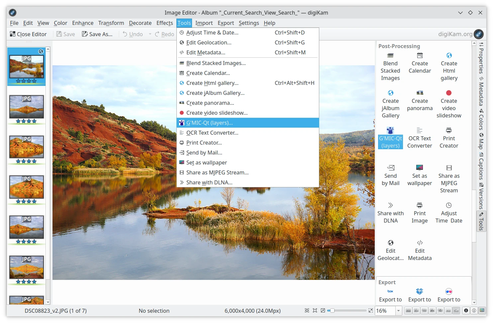
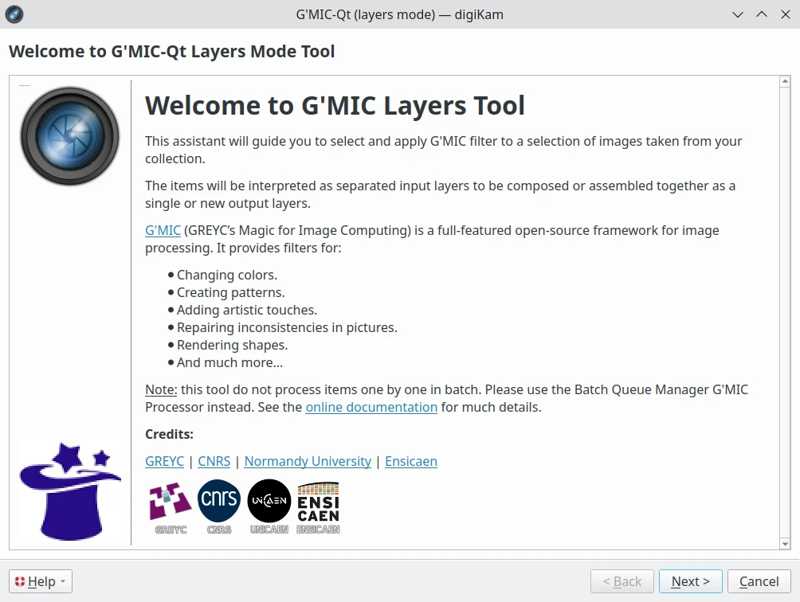
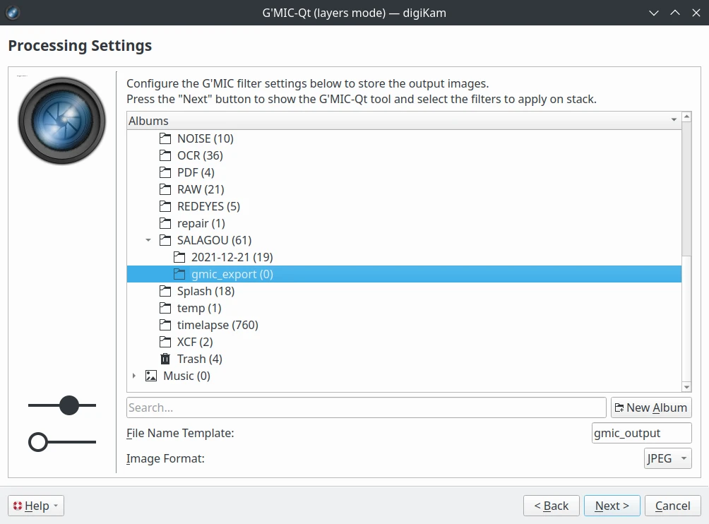

.. meta::
   :description: digiKam Image Editor Enhancement Tools
   :keywords: digiKam, documentation, user manual, photo management, open source, free, learn, easy, image, editor, healing, clone, lens, distortion, sharpen, blur, red, eyes, local, contrast, noise, reduction, hot, pixels, restoration, vignetting

.. metadata-placeholder

   :authors: - digiKam Team

   :license: see Credits and License page for details (https://docs.digikam.org/en/credits_license.html)

.. _enhancement_tools:

:ref:`Enhancement Tools <image_editor>`
=======================================

.. contents::

.. _enhance_lensdistortion:

Distortion
----------

The digiKam **Distortion** tool corrects an image for common lens distortions.

Barrel distortion is associated with wide angle, short focal length lenses. It causes the images to appear slightly spherical (curved outward) like a barrel. You can notice this when you have straight features close to the image's peripheral sides. Pincushion distortion is the opposite defect and is associated with telephoto, long focal length lenses or underwater images. The images appear pinched (bent inward) toward the center. Pincushion distortion is often less noticeable than barrel distortion but are equally visible near the edges. This tool can easily eliminate these distortions without much visible loss in quality.

.. note::

    This tool only treats geometrical distortions. Chromatic aberrations will not be corrected by this tool. The **Lens Auto Correction** tool corrects both distortions and chromatic aberrations.

The following figures explain the main types of geometrical distortions:

    (1): Pincushion distortion.

    (2): No distortion.

    (3): Barrel distortion.

.. figure:: images/editor_geometrical_distortions.webp
    :alt:
    :align: center

    The Geometrical Distortion Types

.. note::

    The geometrical corrections use 4th-order polynomial coefficients:

        - The 1st-order coefficient changes the size of the image. The tool calls this **Zoom**.

        - The 2nd-order coefficient treats the main geometrical distortion of lenses and can correct the convex or concave shape of the image.

        - The 3rd-order coefficient has a similar rounding effect but levels off towards the edges. This correction is not employed in the tool.

        - The 4th-order coefficient corrects the far edges inversely to the 2nd-order rounding. Combining it with the 2nd-order correction can almost completely eliminate the geometrical distortions.

.. figure:: images/editor_lens_distortion.webp
    :alt:
    :align: center

    The Image Editor Lens Distortion Tool

Four sliders let you set the distortion correction filter:

    - **Main**: this value controls the amount of 2nd-order distortion. Negative values correct barrel distortions, while positive values correct pincushion distortion.

    - **Edge**: this value controls the amount of 4th-order distortion. The Edge control has more effect at the edges of the image than at the center. For most lenses, the **Edge** parameter has the opposite sign of the **Main** parameter.

    - **Zoom**: this value rescales the overall image size (1st-order correction). Negative values zoom out of the image, while positive values zoom in.

    - **Brighten**: this control adjusts the brightness in image corners (vignetting). Negative values decrease the brightness image corners, while positive values increase it.

To help you to choose the best filter settings, the tool provides a thumbnail preview of the distortion correction applied to a crossed mesh pattern. The values you apply to your image will be saved and tool will default to the same values the next time it is called.

.. note::

    The barrel-pincushion correction should be done before any crop or size changes (including perspective correction). In fact the Barrel-Pincushion corrections should be the very first step performed on the original image. If you crop the image and then use barrel correction the effect would be obviously wrong.

To help you find the best correction, the tool provides a vertical and horizontal guide. Move the mouse cursor in the image preview to display the dashed lines guide. Move the cursor to an important place in the image like the level of the sea or the edge of a building and press the left mouse button to freeze the position of the dashed lines. Now, adjust the barrel/pincushion correction to align with the guide.

Applying pincushion corrections can produce a black border in the corners of the image. You will need to cut out the corners with a crop tool available in the Image Editor menu :menuselection:`Transform --> Crop` or via the zoom slider of this dialog.

Barrel correction is enough for most images, however with some shots such as the front of buildings or paintings may also benefit from perspective correction to make all the angles 90 degrees. Note that when you hold your camera by hand you almost always introduce some kind of slight perspective distortion. See :ref:`Perspective Adjustment <transform_perspective>` for more information.

.. _enhance_vignetting:

Vignetting Correction
---------------------

Overview
~~~~~~~~

The digiKam **Vignetting Correction** tool corrects image vignetting, which is the technical term for under-exposure in the corners.

Wide angle lenses, especially those used in medium and large format photography, frequently do not uniformly illuminate the entire sensor plane. Instead, they *vignette* (shade) the edges and corners of the image, substantially reducing the light reaching the corners of the sensor. Some telephoto lenses may also suffer from vignetting.

The traditional solution for vignetting is to attach a *center filter* to the lens. This is a neutral density filter with maximum density at the optical axis of the lens, clear at the periphery, with density varying inversely to the vignetting of the lens. A center filter has many advantages: not only does it automatically correct for full-frame images but, since it's fixed to the front of the lens, it also compensates for the off-center vignetting which occurs when camera movements are employed for perspective or plane of focus adjustment.

But there are disadvantages as well. Many center filters require a 1.5 or 2 f-stop filter factor adjustment, which may in turn necessitate a slow shutter speed, especially since wide angle lenses, even with center filters, are best used at apertures of f/16 or smaller. This combination may make the shutter speed slow enough that hand-holding the camera is impossible, and motion blur becomes a problem when photographing moving objects.

With the wide exposure range of present-day film and the color (or grey-scale) depth of digital cameras or film scanners, it is possible to simulate the effect of a center filter by applying an equivalent transform to a raw image taken without the filter.

Using the vignetting correction tool
~~~~~~~~~~~~~~~~~~~~~~~~~~~~~~~~~~~~

.. figure:: images/editor_vignetting_correction.webp
    :alt:
    :align: center

    The Vignetting Correction Types

Five sliders give you control over the vignetting correction filter, and three more over the target image exposure:

    - **Amount**: this option controls the degree of luminosity attenuation by the filter at its point of maximum attenuation. The default amount is 2.0, which corresponds to an optical filter with a 1 f-stop filter factor (equivalent to a factor of 2 reduction in luminosity). Increase the amount to compensate for a greater degree of vignetting; reduce it for less.

    - **Feather**: this option determines the rate at which the filter intensity falls off from the point of maximum attenuation toward the edges, expressed as a power factor. The default of 1 yields a linear reduction in filter amount with distance from the center. Power factors greater than 1.0 cause a faster fall-off (for example, a power of 2 causes the amount to decrease as the square of the distance from the center) and causes the effect of the filter to be concentrated near the center. Powers less than 1 spread out the amount of the filter toward the edges; a power of 0.5 causes the amount to fall as the square root of the distance from the center.

    - **Radius**: this option specifies the radius, as a multiple of the half diagonal measure of the image, at which the amount of the filter falls off to zero (or, in other words, becomes transparent). The default value of 1.0 specifies a filter which is transparent at its corners. A radius specification greater than 1 extends the effect of the center filter beyond the edges of the image, while a radius less than one limits the filter's action to a region smaller than the image. When compensating for vignetting by lenses used with large format and some medium format cameras, the default radius factor of 1 is rarely correct! These lenses often "cover" an image circle substantially larger than the film to permit camera movements relative to the lens to control perspective and focus, and consequently have a vignetting pattern which extends well beyond the edges of the film, requiring a radius setting greater than 1 to simulate a center filter covering the entire image circle.

    - **X offset** and **Y offset** settings: these options move the center of the filter horizontally or vertically up to the border of the image by the specified percentage. A negative value for the X offset will shift the filter to the left while a positive value will shift it to the right. A negative value for the Y offset will move the filter up, and finally a positive value will move it down.

    - **Add Vignetting**: many photographs look flat because of a distracting background or another composition matter. While most of time you will want to remove vignetting, it is a fact that selective vignetting can improve the look of a photograph, drawing the eyes to the intended subject. As an artist you may choose this option. Ticking it will invert the filter, thus darkening the corners of a photograph.

The only way to be sure which settings of **Amount**, **Feather**, and **Radius** best compensate for the actual optical characteristics of a given lens is to expose a uniformly illuminated scene (for example, a grey card lit by diffuse light) and then measure any vignetting in the resulting image (for example with Adjust Level tool histogram position bar). Without such measurements, or specifications by the lens manufacturer giving the precise degree of vignetting at one or more working apertures, you may have to experiment with different settings to find those which work best for each of your lenses. To help you in this task, the tool dialog provides a thumbnail mask rendering applied to the image. Fortunately, the response of the human eye is logarithmic, not linear like most digital imaging sensors, so you needn't precisely compensate for the actual vignetting to create images which viewers will perceive as uniformly illuminated.

.. note::

    If you need to re-adjust the exposure of the target image, use the Adjust Curve tool from Image Editor available under :menuselection:`Color --> Adjust Curve` menu entry.

The vignetting correction tool in action
~~~~~~~~~~~~~~~~~~~~~~~~~~~~~~~~~~~~~~~~

This is an example of a vignetting correction applied to an image. The original image on the top shows vignetting in the corners, the corrected image on the bottom much less. The values used for this example are:

    - Density = 2.6.

    - Power = 0.9.

    - Radius = 1.1.

.. figure:: images/editor_antivignetting_preview.webp
    :alt:
    :align: center

    The Image Editor Anti-Vignetting Tool

.. _enhance_lensauto:

Lens Auto-Correction
--------------------

The digiKam **Lens Auto-Correction** tool can correct lens imperfections such as **Distortion**, **Chromatic aberration**, **Vignetting**, and **Geometry**, and do so automatically for hundreds of common lenses.

No lens is optically perfect. Even the most expensive lenses have their own unique imperfections. This tool corrects for those imperfections.

.. figure:: images/editor_lens_auto.webp
    :alt:
    :align: center

    The Lens Auto-Correction Tool from the digiKam Image Editor

The Lens Auto-Correction tool uses lens data from the `Lensfun library <https://lensfun.github.io/>`_, an up-to-date database of hundreds of lenses and their characteristics. The tool also uses the **Metadata** from the image to find-out which lens was used for a particular image.

If the exact lens used to take the picture is available in the LensFun library, the tool will display **(exact match found)** in green. However if an exact match is not available, the tool will choose settings based on the closest match and display **(partial match found)** in orange. In this case, the user is allowed to select a different lens. If no match is found, the tool displays **(no match found)** in red.

.. figure:: images/editor_lens_auto_metadata_match.webp
   :alt:
   :align: center

   Metadata with Match in the LensFun Database

.. figure:: images/editor_lens_auto_metadata_partial.webp
   :alt:
   :align: center

   Metadata with a Partial Match in the LensFun Database

.. figure:: images/editor_lens_auto_metadata_none.webp
   :alt:
   :align: center

   Metadata with no Match in the LensFun Database

You can either enable or disable the helper **Grid** lines to visualize how the geometrical distortions are corrected on image.

.. figure:: images/editor_lens_auto_grid.webp
    :alt:
    :align: center

    The Lens Auto-Correction Tool Displaying the Helper Grid over the Canvas

Select the corrections you want to apply. The corrections are immediately displayed in the image preview area to the left. As for all tools, the preview area can be configured by clicking on the preview comparison style icons in the status bar. When you are satisfied with the result press **OK**.

.. _enhance_hotpixels:

Hot Pixels
----------

Overview
~~~~~~~~

The digiKam **Hot Pixels** tool facilitates removing hot pixels from photographs taken with a digital camera.

Most current digital cameras produce images with several brightly colored **Bad Pixels** when using slow shutter speeds. Night images can be ruined by these Bad Pixels. There are three different types of Bad Pixels:

    - **Stuck pixels**: are pixels that always reads high or are always set to a maximum value on all exposures. This produces a bright pixel usually of red, blue or green color in the final image. A stuck pixel will occur regardless of shutter speed, aperture size or any other user settings. It will occur on a normal exposure and tends to be more obvious under bright conditions.

    - **Dead pixels**: are pixels that read zero or are always off on all exposures. This state produces a black pixel in the final image. Similar to stuck pixel, a dead pixel will occur regardless of shutter speed, aperture size or any other user settings.

    - **Hot pixels**: are pixels that read high (bright) on longer exposures as white, red, or green color. The longer the exposure time, the more visible hot pixels will become. These pixels will not be visible in bright conditions.

Note that stuck or dead pixels will occur at the same location for all images. If the location of the stuck or dead pixel occurs at different locations, it may be a Hot Pixel.

Stuck, dead or hot pixels are a problem in particular when shooting in high quality raw mode since many cameras have built-in hot pixel suppression applied automatically when JPEG compression is used (which is mostly the case).

This tool can be used to fix the **Hot pixels** and **Stuck Pixels** on a photograph using a **Black Frame** subtraction method. digiKam does not have a manual editor for selecting Bad Pixels.

Create the Black Frames
~~~~~~~~~~~~~~~~~~~~~~~

The Black Frame subtraction method is the most accurate approach to the removal of "Hot Pixels" and "Stuck Pixels". First you have to create a "Black Frame" as a reference. This is easy to do. When you finish taking your long exposure shots, put a lens cap on the camera and take one "dark" image with the same exposure time as the prior images. This image will be all dark, but with close examination you will see that it has the Hot and Stuck Pixels (colored dots). These are positioned at the same places as on your previous shots.

Load this file into the tool using the **Black Frame** button. The tool will process the image, automatically detecting the Hot and Stuck Pixels. They will be highlighted in the control panel preview areas.

.. warning::

    If you use an old digital camera, it is important to re-shoot the Black Frame next time you are taking long exposure images to detect new Hot and Stuck Pixels on sensor defects.

Using the Hot Pixels Tool
~~~~~~~~~~~~~~~~~~~~~~~~~

.. figure:: images/editor_hotpixels_fixer.webp
    :alt:
    :align: center

    The Image Editor Hot Pixels Tool

At first, as explained in the previous section, you need to load a Black Frame corresponding to the image to correct. An automatic analysis of the Black Frame will run to find the bad pixels. Note that the tool will remember the previous Black Frame used in the last session, and that frame will be re-opened automatically in the next session.

The image panel and the original preview help you to pan within the image. The preview window shows the filter output using the current settings. Bad Pixels are highlighted in preview area.

Select an area to see bad pixels in the preview and the filtered result using one of the preview comparison types that display the same image region. Choose the best **Filter** method to compute the values used to fill in the bad pixels or pixel blocks. The available filters are:

    - **Average**: the pixels adjacent to the pixel block are averaged. The resulting color is assigned to all pixels in the block. For 1-dimensional interpolation, this is done separately for one pixel-wide, horizontal or vertical stripes.

    - **Linear**: the pixels which have a distance of 1 from the pixel block are used to calculate a bi-linear surface (2-dim), or a group of linear curves (1-dim), which is then used to assign interpolated colors to the pixels in the block.

    - **Quadratic**: this is the default filtering method. The pixels which have a distance of 2 or less from the pixel block are used to calculate a bi-quadratic surface (2-dim), or a group of quadratic curves (1-dim), which is then used to assign interpolated colors to the pixels in the block.

    - **Cubic**: the pixels which have a distance of 3 or less from the pixel block are used to calculate a bi-cubic surface (2-dim), or a group of cubic curves (1-dim), which is then used to assign interpolated colors to the pixels in the block.

.. _enhance_localcontrast:

Local Contrast
--------------

The digiKam **Local Contrast** tool renders pseudo-HDR images.

There are multiple ways to render HDR images to improve photos containing under or overexposed areas. The usual approach is to take multiple shots with different exposures. digiKam's :ref:`Blend Stacked Images <expo_blending>` tool can then be used to combined the images into an HDR image. This works nicely but suffers from some limitation. For example, the approach only works with static subjects. But what if you want an HDR effect from a single image, including images taken of dynamic subjects?

The **Local Contrast** tool uses a Low Dynamic Range `Tonemapping <https://en.wikipedia.org/wiki/Tone_mapping>`_ to improve the dynamic range of a photo by reducing its global contrast and increasing its local contrast. It does so by first generating a desaturated and blurred version of the photo. It then combines the RGB channels of the original photo with the desaturated blurred image using either a linear or power function. Sounds complicated? Don’t worry, the Local Contrast tool is rather straightforward to use, so you don’t have to understand all of its intricacies in order to achieve pleasing results.

.. figure:: images/editor_local_contrast.webp
    :alt:
    :align: center

    The Image Editor Local Contrast Tool

Using the Local Contrast Tool
~~~~~~~~~~~~~~~~~~~~~~~~~~~~

1. Open the photo you want in the Image editor and choose :menuselection:`Enhance --> Local Contrast`.

2. The tool lets you apply up to four tonemapping operations called stages. Each **Stage** offers two parameters for you to tweak: **Power** and **Blur**.

   - **Power**: This parameter allows you to specify the desaturation level. Higher values will result in more desaturation.

   - **Blur**: This parameter lets you adjust the affected areas on the photo. Higher values will affect larger areas.

3. To preview the result, hit the **Try** button. Once you are satisfied with the result, press **OK** to apply the process to the photo.

Tips for Best Results
~~~~~~~~~~~~~~~~~~~~

- **Start with Low Values**: Begin with low values for both Power and Blur, then gradually increase them to see the effect.

- **Use Multiple Stages**: Experiment with multiple stages to achieve more complex effects.

- **Avoid Overprocessing**: Be careful not to overprocess your images, as this can lead to unnatural looking photos.

Parameters
~~~~~~~~~~

- **Function**: Specifies the type of function used for tonemapping. Options include **Power** function and **Linear** function.

- **High Saturation**: Controls the saturation of the image. Higher values result in more saturated colors.

- **Low Saturation**: Controls the saturation of the image in areas where the brightness is increased. Lower values result in less saturation in these areas.

- **Stretch Contrast**: If enabled, the filter will stretch the contrast of the image to improve the dynamic range.

Examples
~~~~~~~~

- **Landscape Photos**: For landscape photos, try using a low Power value and a moderate Blur value to enhance the details in the sky and foreground.

- **Portrait Photos**: For portraits, use a higher Power value to bring out the details in the face while keeping the background soft.

While the Local Contrast tool may sound like an easy way to fix photos, you should use it with care: sometimes it can do more damage than good, producing unnatural looking photos.

.. _enhance_nr:

Noise Reduction
---------------

The digiKam **Noise Reduction** tool is a powerful tool for reducing image noise.

This tool provides selectable image filters to remove specks or other artifacts caused by junk such as dust or hair on the lens. It also can be used to remove sensor noise from the camera that may be caused by high ISO settings, as well as the so-called Moiré Patterns on scanned images from books or magazines.

If you want more information about what causes digital camera sensor noise, please take a look at `this tutorial <https://www.cambridgeincolour.com/tutorials/image-noise.htm/>`_.

.. figure:: images/editor_noise_reduction.webp
    :alt:
    :align: center

    The Image Editor Noise Reduction Tool

The above screenshot shows a typical scene taken with a digital camera using a high sensitivity ISO setting. It shows grainy noise which can be reduced successfully with this tool.

Noise is most evident when zoomed in enough to see individual pixels. The re-sizeable image panel within the original preview helps you to pan within the image. Move the red rectangle around to select an area that will let you judge the optimal filter settings. Then switch to one of the preview comparison types that display the same image region, as illustrated in this screenshot.

The tool supports the following parameters:

    - **Estimate Noise**: automatically computes all noise reduction settings based on an analysis of the noise contained in the image. It is a good idea to turn this option on, and check the result. If the degree of noise reduction is insufficient or the filter damages the image, turn off this option, and adjust the **Luminance**, **Chrominance Blue**, and **Chrominance Red** settings manually.

    - **Threshold**: use the slider for coarse adjustment, and the spin control for fine adjustment. The threshold is the value below which everything is considered noise. This value should be set so that edges and details are clearly visible and noise is smoothed out. These settings exist for the **Luminance**, **Chrominance Blue**, and **Chrominance Red** channels. Simply adjust it and hit the Try button to see the results. (This tool does not automatically update the preview window when making manual adjustments.) Adjustment must be made carefully, because the gap between noisy, smooth, and blur is very small. Adjust it as carefully as you would adjust the focus of a camera.

    - **Softness**: use the slider for coarse adjustment, and the spin control for fine adjustment. The softness adjusts the level of the thresholding (soft as opposed to hard thresholding). The higher the softness the more noise remains in the image. These settings exist for the **Luminance**, **Chrominance Blue**, and **Chrominance Red** channels. Simply adjust it and hit the Try button to see the results. As for the Threshold settings, adjustment must be made carefully, because the gap between noisy, smooth, and blur is very small. Adjust it as carefully as you would adjust the focus of a camera.

    - **Save As** and **Load**: these buttons are used to do just that. Any Noise Reduction parameters that you have set can be saved to the filesystem and loaded later.

    - **Try**: applies the current tool settings to the preview image. The preview does not automatically update when manual adjustments are made.

    - **Defaults**: this button resets all settings to default values.

.. _enhance_blur:

Blur
----

The digiKam **Blur** tool is used to blur or soften an image.

Sometimes an image is too sharp for your purposes. The solution is to blur it a bit: fortunately blurring an image is much easier than sharpening it. Select the **Blur Tool** with the :menuselection:`Enhance --> Blur` menu entry and experiment with the Smoothness level. The preview window shows the effect of the operation on your photograph.

.. figure:: images/editor_blur.webp
    :alt:
    :align: center

    The Image Editor Blur Tool

.. _enhance_restoration:

Restoration
-----------

The digiKam **Restoration** tool is an advanced tool for reducing artifacts in photographs.

This fantastic restoration filter is a public domain tool developed to remove lots of unwanted stuff from your images. It is well adapted to deal with degraded images suffering from Gaussian noise, film grain, scratches or compression artifacts and local degradations usually encountered in digital (original or digitized) images. The smoothing used by the tool is applied along the image features, thus preserving the most meaningful image content.

.. figure:: images/editor_restoration.webp
    :alt:
    :align: center

    The Image Editor Restoration Tool

The tool comes with several presets as starting points and to simplify restoration. The preset settings available are listed below:

    - **None**: Sets most common default filter settings not optimized for any particular purpose.

    - **Reduce Uniform Noise**: Optimum settings for reducing image noise due to sensors.

    - **Reduce JPEG Artifacts**: JPEG's compression is not perfect, in fact for some types of images it is far from it. As a lossy compression algorithm, there are some compression "artifacts" - slight defects showing in the decompressed image. This setting aims at reducing these artifacts.

    - **Reduce Texturing**: Optimized to remove artifacts from scanning, digitizing or Moire patterns.

If you want to set filter parameters for finer adjustments, use the **General** and **Advanced Settings** tabs:

    .. figure:: images/editor_restoration_settings1.webp
        :alt:
        :align: center

        The Image Editor Restoration Tool Preset Settings

    - **Detail Preservation** [0, 1]: this controls the preservation of features in the image. A low value forces an equal smoothing across the image, whereas bigger values preferably smooth the homogeneous regions, leaving sharper details. A value of 0.9 does a good job of preserving details so that no sharpening is required afterwards. Note that **Detail Preservation** setting must be always less than the **Anisotropy** setting.

    - **Anisotropy alpha** [0, 1]: a low value smooths equally in all directions, whereas a value close to 1 smooths in one direction only. If you have film grain or CCD kind of noise a high value will result in wave-like pattern, whereas JPEG artifacts are suited for values close to 1.

    - **Smoothing** [0, 500]: this sets the maximum overall smoothing factor, while **Detail Preservation** defines the relative smoothing. Set this value based on the noise levels in the image.

    - **Regularity** [0, 100]: this parameter is concerned with the uniformity of the smoothing. Imagine the smoothing process as a combing of the image. Then the Regularity would correspond to the size of the comb. The bigger this value, the more even the overall smoothing will be. This term is required when there is a lot of noise in the image, making it difficult to estimate the local features in the scene. Setting a Regularity value higher than 3 produces an interesting 'van Gogh' turbulence effect.

    - **Filter Iterations**: number of times the blurring algorithm is applied. Usually 1 or 2 is sufficient.

    .. figure:: images/editor_restoration_settings2.webp
        :alt:
        :align: center

        The Image Editor Restoration Tool Advanced Settings

    - **Angular Step** [5, 90]: angular integration of the anisotropy alpha. If alpha is chosen small, the Angular Step should also be chosen small. But beware that small angles result in long runs! So choose a value as large as you can accept.

    - **Integral Step** [0.1, 10]: spatial integration step width in terms of pixels. Should remain less than 1 (sub-pixel smoothing) and never be higher than 2.

    - **Use Linear Interpolation**: The gain in quality if you select this option is only marginal and you lose a factor of 2 in speed. Our recommendation is to leave it off.

**Save As** and **Load** buttons are used to do just that. Any Photograph Restoration filter settings that you have set can be saved to the files in a text file and reloaded later.

.. warning::

    Photograph restoration is comparatively fast given what it is doing, but it can take a long time to run and cause high CPU load. You may always abort computation by pressing the **Abort** button during preview rendering.

.. _enhance_redeyes:

Red Eye
-------

The digiKam **Red Eye** tool is a red eye removal tool. Red eyes are caused when a camera flash is used to take photographs of people. The red is the reflection from the back of the eye which can be seen because the pupil cannot react quickly enough to the flash. By the way, the red eye effect is less likely with a separate flash because of the different viewing angles of the flash and the lens. You can correct some of the worst effects of Red Eye by:

    - Select :menuselection:`Enhance --> Red Eye...`.

    - Set the preview mode to display the portion of the image with the eyes that need to be fixed.

    - A neural network engine parses the image contents to automatically localize eyes and the red pupils.

    - The **Red Level** setting adjusts the amount of red eye removal.

.. figure:: images/editor_redeyes_correction.webp
    :alt:
    :align: center

    The Image Editor Red Eyes Removal

.. _enhance_sharpen:

Sharpen
-------

The digiKam **Sharpen** tool provides three different tools for sharpening, each with unique advantages and disadvantages.

    - **Simple Sharp** is a traditional sharpening tool that is very fast and easy, but that may produce grainy images, particularly in dark areas.

    - **Unsharp Mask** works on the contrast of edges to make an image appear sharper, but it actually does not sharpen at all, but works by enhancing edges. It does a real good job at removing atmospheric haze. The algorithm was taken from the Gimp, and it is copyrighted by Winston Chang.

    - **Refocus** is probably the best of the three algorithms because it actually improves sharpness. It is a bit more involved in its application as it uses several adjustable parameters.

Out-of-focus photographs, as well as most digitized images, benefit from some sharpness correction. This is partly due to the digitizing process that must chop up a continuous scene into pixels with finite size and spacing, so elements thinner than the sampling frequency will be averaged together. Thus, sharp borders are rendered a little blurred. The same phenomenon appears when printing color dots on paper. High-resolution cameras need even more sharpening on a regular basis than consumer cameras.

Whereas JPEG images have some camera-internal sharpening applied, RAW format images always need sharpening in their workflow.

Some scanners apply a sharpen filter while scanning. It's usually worthwhile to disable automatic sharpening so that you keep control over your image.

Adjusting Sharpness
~~~~~~~~~~~~~~~~~~~

If the camera focus is not set perfectly or if the camera is moving when the image is taken the result is a blurred photograph. If there is a lot of blurring, you probably will not be able to do much about it with any technique. But you can often improve the image, if there is only a moderate amount of blurring. Many good SLR cameras apply less image processing to the images than simpler cameras (which tend to artificially increase the contrast to make the images look crisp). This kind of slight blur can be easily improved with tools.

In some situations, you may be able to get useful results by sharpening an photograph using the Sharpen tool by the :menuselection:`Enhance --> Sharpen` menu entry and the **Sharpen** option from **Method** setting.

.. figure:: images/editor_sharpen.webp
    :alt:
    :align: center

    The Image Editor Sharpen Tool

You should be careful with this though, because the results may not look very natural. Sharpening increases the apparent sharpness of edges in the photograph, but also amplifies noise. Generally, the most useful technique for sharpening a fuzzy photograph is the Refocus tool. You can access it with the **Refocus** option from **Method** setting. Look at Refocus for more information and a comparison of all the sharpening techniques.

Reducing Graininess In a Photograph
~~~~~~~~~~~~~~~~~~~~~~~~~~~~~~~~~~~

When you take a photograph in low-light conditions or with a very fast exposure time, the camera does not get enough data to make good estimates of the true color at each pixel, and consequently the resulting photograph looks grainy. You can "smooth out" the graininess by blurring the image, but then you will also lose sharpness. Probably the best approach - if the graininess is not too bad - is to use the **Noise Reduction** tool, and you can access it by the :menuselection:`Enhance --> Noise Reduction` menu entry.

Softening a Photograph
~~~~~~~~~~~~~~~~~~~~~~

Sometimes you have the opposite problem: an image is too crisp. The solution is to blur it a bit: fortunately blurring an image is much easier than sharpening it. Select the **Blur Tool** with the :menuselection:`Enhance --> Blur` menu entry and experiment with the level. The preview window on the right of the dialog shows the effect of the operation on your photograph.

The Unsharp Mask Filter
~~~~~~~~~~~~~~~~~~~~~~~

.. note::

    The **Unsharp Mask** filter is an excellent tool to remove haze from your photographs.

.. figure:: images/editor_unsharpen_mask.webp
    :alt:
    :align: center

    The Image Editor Unsharpen Mask Tool

The image panel and the original preview help you to pan within the image. The preview window shows the filter output using the current settings.

There are two important parameters, **Radius** and **Amount**. The default values often work pretty well, so you should try them first. Increasing either the **Radius** or the **Amount** increases the strength of the effect. Don't get carried away, though: if you make the unsharp mask too strong, it will amplify noise in the image and create the impressions of ridges next to sharp edges.

The **Radius** allows you to set how many pixels on either side of an edge that will be affected by sharpening. High resolution images allow higher radius. It is always best to sharpen an image at its final resolution.

The **Amount** control is the percentage of the difference between the original and the blur image that is added back into the original. It allows you to set the strength of the sharpening.

The **Threshold** control is threshold measured as a fraction of the maximum RGB value that needs to be exceeded to apply the sharpening. It allows you to set the minimum difference in pixel values that indicates an edge where sharpening should be applied. That way, you can protect areas of smooth tonal transition from sharpening, and avoid creation of facial blemishes, or artifacts in the sky or water surfaces.

Refocus a Photograph
~~~~~~~~~~~~~~~~~~~~

The Refocus tool uses a deconvolutional filter to refocus an image by enhancing sharpness. In plain language, this tool attempts to "refocus" an image by undoing the defocusing. This is better than just trying to sharpen a photograph. It employs a technique called Finite-Impulse-Response Wiener Filtering. While the traditional technique for sharpening images is to use unsharp masking, refocus generally produces better results. Start it from the :menuselection:`Enhance --> Sharpen` menu entry and the **Refocus** option.

The Refocus technique works differently from **Unsharp Mask** and is also unlike the **Sharpen** Filter which both increase the contrast of the edges of an image. Refocus rather reverses the process by which the image got blurred by the circular aperture of the camera. This method gives you as much of the original "in focus" image as possible. Refocus uses a very powerful deconvolutional algorithm that will reclaim the data that has been mixed up. In mathematical terms, blurring is usually the result of a convolution, so a deconvolution will reverse the process. This is exactly what Refocus is doing. Furthermore, the FIR filter technique allows the tool to remove much of the noise and granularity that often gets accentuated in the sharpening process with other sharpening filters.

.. figure:: images/editor_refocus.webp
    :alt:
    :align: center

    The Image Editor Refocus Tool

The image panel and the original preview help you to pan within the image. The preview window shows the filter output using the current settings.

In most cases, image blurring by a camera can be modeled as convolution with a circular blur disc. But the refocus tool supports deblurring of two types of convolutional blurring:

    - The **Circular convolution**: this is the term used in this manual to describe the type of blurring that spreads each source point uniformly across a small disk with a fixed radius. (Not to be confused with the definition of circular convolution as used in time series analysis.)

    - The **Gaussian convolution**: this one is blurring that is mathematically based on the normal distribution, with its bell-shaped curve. Image blurring of this type is normally associated with software blurring. From a theoretical point of view the mathematical justification for using the Gaussian convolution is that when you a apply a large number of independent random convolutions the results will always approach a Gaussian convolution.

The refocus tool supports both the Circular and the Gaussian convolution plus mixtures of both.

In practice, in most cases the Circular convolution works much better than the Gaussian convolution. The Gaussian convolution has a very long tail, so mathematically the result of the convolution also depends on source pixels at a large distance from the original source pixel. The FIR Wiener inverse of a Gaussian convolution in most cases is heavily influenced by source pixels at a large distance, and in most cases this produces undesirable results.

The deconvolution filter plug-in has the following parameters:

    - **Circular Sharpness**: This is the radius of the Circular convolution filter. It is the most important parameter for using the plug-in. With most images the default value of 1 should give good results. Select a higher value when your image is very blurred, but beware of producing halos.

    - **Correlation**: Increasing the Correlation may help reduce artifacts. The correlation can range from 0-1. Useful values are 0.5 and values close to 1, e.g. 0.95 and 0.99. Using a high value for the correlation will reduce the sharpening effect of the plug-in.

    - **Noise filter**: Increasing the Noise filter parameter helps to reduce artifacts. The Noise can range from 0-1 but values higher than 0.1 are rarely helpful. When the Noise value is too low, e.g. 0 the image quality will be horrible. A useful value is 0.03. Using a high value for the Noise will even blur the image further.

    - **Gaussian Sharpness**: This is the radius for the Gaussian convolution filter. Use this parameter when your blurring is Gaussian (mostly due to previous blur filtering). In most cases you should leave this parameter set to 0, because it causes nasty artifacts. When you use non-zero values you will probably also have to increase the Correlation and/or Noise filter parameters.

    - **Matrix size**: This parameter determines the size of the transformation matrix. Increasing the Matrix Size may give better results, especially when you have chosen large values for Circular Sharpness or Gaussian Sharpness. Note that the plug-in will become very slow when you select large values for this parameter. In most cases you should select a value in the range 3-10.

    - **Save As** and **Load**: These buttons are used to do just that. Any Refocus parameters that you have set can be saved to a file and reloaded later.

    - **Defaults**: This button resets all settings to default values.

Below, you can see few hints to help you work with the refocus tool:

    - it is best to perform all cropping, color and intensity curve corrections on the image before using this plug-in.

    - Otherwise use this plug-in before performing other operations on the image. The reason is that many operations on the image will leave boundaries that are not immediately visible but that will leave nasty artifacts after sharpening.

    - When you are scanning images and compressing them, e.g. to JPEG, you should apply the plug-in to the uncompressed image.

Refocus Comparison with Other Techniques
~~~~~~~~~~~~~~~~~~~~~~~~~~~~~~~~~~~~~~~~

it is worth comparing **Refocus** with **Simple Sharp** and **Unsharp Mask**.

All types of sharpening work by applying a small convolution matrix that increases the difference between a source pixel and its immediate neighbors. FIR Wiener filtering is a more general technique because it allows a much larger neighborhood and better parameterizations. Sharpening only works when your images are very slightly blurred. Furthermore, for high values of the sharpening parameter the results frequently looks "noisy". With FIR Wiener filtering this noise can be greatly reduced by selecting higher values for the **Correlation** and **Noise filter** parameters.

Unsharp masking is another very popular image enhancement technique. From a mathematical point of view it is an ad hoc form of high-pass filter. The first step is to create a blurred copy of the source image. Then the difference between the source image and the blurred image is subtracted from the source image, hence the name unsharp masking. In fact, unsharp masking is more of a contrast enhancement on the important image features than a general approach to sharpening. It does not undo the blurring effects of diffraction caused by the camera's finite aperture, as refocus does.

In general, unsharp masking produces better results than sharpening. This is probably caused by the fact that unsharp masking uses a larger neighborhood than sharpening.

From a theoretical point of view unsharp masking must always introduce artifacts. Even under optimal circumstances it can never completely undo the effect of blurring. But it has been proved that Wiener filtering is the optimal linear filter. In practice, the results of the FIR Wiener filter are always at least as good as those of unsharp masking. And the FIR Wiener filter is frequently better in restoring small details.

Below, you can see a comparison of different filters applied to a small unfocused image:

.. figure:: images/editor_refocus_notsharpened.webp
   :width: 300px
   :alt:
   :align: center

   Original blurred color image to fix.
   This image have been taken with an analog still camera.
   The unfocusing result of an insufficient light for the auto-focus lens.

.. figure:: images/editor_refocus_sharped.webp
   :width: 300px
   :alt:
   :align: center

   Fixed image using simple sharpening filter.
   Sharpness setting is 80.

.. figure:: images/editor_refocus_unsharpmask.webp
   :width: 300px
   :alt:
   :align: center

   Fixed image using unsharp mask filter.
   Settings are: Radius=50, Amount = 5, and Threshold=0.

.. figure:: images/editor_refocus_refocus.webp
   :width: 300px
   :alt:
   :align: center

   Fixed image using Refocus filter.
   Settings are: Circular Sharpness=1.3, Correlation=0.5,
   Noise Filter=0.020, Gaussian Sharpness=0 and Matrix Size=5.

.. note::

    For more information about sharpening methods used in digital imagery, you can find a technical comparison at `this url <http://www.optarc.co.uk/bialith//Research/BARclockblur.htm>`_.

.. _enhance_clone:

Healing Clone
-------------

The digiKam **Healing Clone** tool copies pixel colors from a specific portion of the image, and pastes them into another portion of the image using a brush, then applies smoothing. This helps fix artifacts in images, like unwanted spots on someone’s face that can be replaced with more clear skin from a nearby region of the face.

The tool settings view on the right side provides a toolbar with 5 buttons. From left to right:

    - Select Source Point.
    - Polygon Selection With Lasso.
    - Move Image.
    - Undo clone operation.
    - Redo clone operation.

Below the toolbar, two sliders allow you to adjust the clone tool properties. The **Brush Radius** slider adjusts the size of the cloned area. A radius of 0 has no effect. Values of 1 and above set the brush radius that controls the size of the regions that are copied from the image.

The **Radius Blur** slider controls the smoothing/mixing effect applied to the data cloned onto the canvas. A percent of 0 has no effect. Values above 0 represents the radius of circle that is used to mix the source color that is mixed into the destination color. This mixing is applied radially i.e. the inner part of the brush radius is totally from the source and the percentage of source vs destination decreases linearly until the outer radius of the circle is 100% destination.

.. figure:: images/editor_healing_clone.webp
    :alt:
    :align: center

    The Image Editor Healing Clone Tool to Remove Unwanted Artifacts

To select the source of image to clone, press **S**, or the **Source selection** button from the toolbar on the top of settings view. The cursor will change to a cross-hair symbol. Click on the location where you will start cloning from. The tool then switches to a circular brush. Move the brush to another location and click and drag to clone.

.. figure:: videos/editor_clone_spot.webp
    :width: 300px
    :alt:
    :align: center

    Screencast of Image Editor Healing Clone Fixing an Artifact with Spot Tool

The tool also provide a **Lasso** and **Polygon** selector for the healing clone operations. You can either press :kbd:`L` or the **Lasso selector** button from the toolbar on the top of settings view. The cursor will change to a pen shape, and you can select discrete points as you like. The polygon edges will be drawn, you just need to press and move your mouse to complete the selection area. You don’t have to draw all the region at one time. The polygon will close itself if you press :kbd:`L` again. Pressing :kbd:`Esc` while in the process of drawing the lasso polygon will cancel the lasso operation.

Now the tool will only clone inside the selected region, cloning outside will be ignored, unless you press :kbd:`L` again or :kbd:`Esc` to deactivate the lasso mode. Once you do that, you can clone anywhere in the screen as usual.  Here is a screenshot of a lasso polygon selection, and a large portion of the image cloned inside this lasso portion. Of course pressing :kbd:`L` or :kbd:`Esc` again will remove the lasso boundary, keeping the cloned pixels in place, as expected.

.. figure:: videos/editor_clone_lasso.webp
    :width: 600px
    :alt:
    :align: center

    Screencast of Image Editor Healing Clone Fixing an Area Using Lasso

You can undo and redo using toolbar buttons from the toolbar on the top of settings view. Two keyboard shortcuts are assigned to the tool: :kbd:`Ctrl+Z` for undo and :kbd:`Ctrl+Shift+Z` for redo. You can undo and redo without limitation.

.. _enhance_gmicqt:

G'MIC-Qt Tool
-------------

Features
~~~~~~~~

G'MIC-Qt is 3rd-party image editing tool provided as a plug-in. It is named **G'MIC** for **GREYC’s Magic for Image Computing**, `an open-source image processing framework <https://gmic.eu/>`_. The full list of G'MIC features is long and cannot be detailed here as it comes with over 500 interesting functions to explore. It comes with filters for changing colors, creating patterns, adding artistic touches, repairing inconsistencies in pictures, rendering shapes, and much more. The plugin is highly customizable, with the ability to set favorites and even add your own filters.

G'MIC-Qt is not included in the digiKam source code. Rather, it is a 3rd-party plugin included in binary distributions of digiKam, as the Windows, macOS, and Linux bundles. It can be started from the :menuselection:`Enhance --> G'MIC-Qt` menu entry or use the icons accessible from the Tools tab in the Right sidebar. G’MIC-Qt can be used like other filters, the main difference is that instead of opening a specific filter tab on the right sidebar, it opens up a window where you can pick through any of the pre-defined filters.

    The Image Editor G'MIC-Qt Tool Running the Artistic/Bokeh Filter

Filter Categories
~~~~~~~~~~~~~~~~~

The categories of **Available filters** in the list are listed below:

    - **About**: these entries are not filters, but just show different information about G'MIC-Qt on the settings view. The **About/Download External Data** entry allows you to load new filter definitions from the internet.

    - **Array and tiles**: this filter collection transforms photos into toys, puzzles, maps, and decorative shapes.

    .. figure:: images/editor_gmicqt_arraytiles_puzzle.webp
        :alt:
        :align: center

        The Image Editor G'MIC-Qt Tool Running the Array-and-Tiles/Puzzle Filter

    - **Artistic**: this filter collection applies a number of traditional effects that transform a photograph into a drawing or painting.

    .. figure:: images/editor_gmicqt_artistic_rodilus.webp
        :alt:
        :align: center

        The Image Editor G'MIC-Qt Tool Running the Artistic/Rodilius Filter

    - **Black and White**: this filter collection is dedicated to processing images in gray-scale style, including converting to gray-scale, the inverse process of colorizing an image, reducing the color map, or simulating fusain drawing.

    .. figure:: images/editor_gmicqt_bw_colorize.webp
        :alt:
        :align: center

        The Image Editor G'MIC-Qt Tool Running the Black-and-White/Colorize Filter

    - **Colors**: this filter collection allows the user to define transformation functions operating in different color-spaces, apply LUTs, mix/adjust channels or correct tones by content analysis.

    .. figure:: images/editor_gmicqt_colors_mixerlab.webp
        :alt:
        :align: center

        The Image Editor G'MIC-Qt Tool Running the Colors/Mixer-Lab Filter

    - **Contours**: this filter collection applies the pixel's neighborhood local transformations over the whole photo.

    .. figure:: images/editor_gmicqt_contours_super_pixels.webp
        :alt:
        :align: center

        The Image Editor G'MIC-Qt Tool Running the Contours/Super-Pixels Filter

    - **Deformations**: this filter collection applies physical distortions to the photo.

    .. figure:: images/editor_gmicqt_deformations_drop_water.webp
        :alt:
        :align: center

        The Image Editor G'MIC-Qt Tool Running the Deformations/Drop Water Filter

    - **Degradations**: this filter collection reproduces photographic alterations such as blur, noise, grain, and lens aberrations.

    .. figure:: images/editor_gmicqt_degradations_chromatic_aberrations.webp
        :alt:
        :align: center

        The Image Editor G'MIC-Qt Tool Running the Degradations/Chromatic-Aberrations Filter

    - **Details**: this filter collection enhances the details in your photos with an armada of multi-scale enhancement algorithms to bring out details and colors of different sizes in photos.

    .. figure:: images/editor_gmicqt_details_mighty.webp
        :alt:
        :align: center

        The Image Editor G'MIC-Qt Tool Running the Details/Mighty Filter

    - **Frames**: one other artistic filter collection dedicated to decorating your photo with ornaments.

    .. figure:: images/editor_gmicqt_frames_droste.webp
        :alt:
        :align: center

        The Image Editor G'MIC-Qt Tool Running the Frames/Droste Filter

    - **Frequencies**: this filter collection is based on Fourier Transforms analysis.

        .. figure:: images/editor_gmicqt_frequencies_bandpass.webp
            :alt:
            :align: center

            The Image Editor G'MIC-Qt Tool Running the Frequencies/Bandpass Filter

    - **Layers**: this filter collection works on layers or export contents to separate layers. As layers are not supported by Image Editor, usage of these filters is limited.

        .. figure:: images/editor_gmicqt_layers_tiles_to_layers.webp
            :alt:
            :align: center

            The Image Editor G'MIC-Qt Tool Running the Layers/Tiles-to-Layers Filter

    - **Lights and Shadows**: this filter collection allows adjustment of under-exposed and over-exposed contents from a photo. It's also possible to patch the image with a supplemental source of light.

        .. figure:: images/editor_gmicqt_lights_shadows_pop_shadows.webp
            :alt:
            :align: center

            The Image Editor G'MIC-Qt Tool Running the Lights-and-Shadows/Pop-Shadows Filter

    - **Patterns**: this filter collection is a set of recursive image generation methods which can produce original and interesting geometric forms.

        .. figure:: images/editor_gmicqt_patterns_halftone.webp
            :alt:
            :align: center

            The Image Editor G'MIC-Qt Tool Running the Patterns/Halftone Filter

    - **Renderings**: this filter collection superimposes artificially-generated forms based on mathematical solutions.

    .. figure:: images/editor_gmicqt_rendering_lightning.webp
            :alt:
            :align: center

            The Image Editor G'MIC-Qt Tool Running the Rendering/Lightning Filter

    - **Repair**: this filter collection includes advanced algorithms to help with image noise/glitch/objects/artifacts/compression removal. This kind of filter tries to fix very challenging problems that have occupied image-processing researchers for several generations.

        .. figure:: images/editor_gmicqt_repair_denoise.webp
            :alt:
            :align: center

            The Image Editor G'MIC-Qt Tool Running the Repair/Denoise Filter based on convolutional neural networks

    - **Sequences**: this filters collection generates animation from photos.

        .. figure:: images/editor_gmicqt_sequences_3d_image_object.webp
            :alt:
            :align: center

            The Image Editor G'MIC-Qt Tool Running the Sequences/3D_Image-Object Filter

    - **Silhouettes**: this filter collection superimposes forms such as animal finger-print, icons, nature shapes, etc.

        .. figure:: images/editor_gmicqt_silhouettes_nature_barnsley_fern.webp
            :alt:
            :align: center

            The Image Editor G'MIC-Qt Tool Running the Silhouettes/Nature/Barnsley-Fern Filter

    - **Stereoscopic 3D**: this filter collection renders photos in relief.

        .. figure:: images/editor_gmicqt_stereoscopic_3d_stereo_image.webp
            :alt:
            :align: center

            The Image Editor G'MIC-Qt Tool Running the Stereoscopic-3D/Stereo-Image Filter

    - **Testing**: this filter collection groups all tools under development. Take care: these filters can be unstable and give weird effects.

    - **Various**: this filters collection groups tools which cannot be categorized in others collections. A G'MIC code editor can be found to create and test new filters.

        .. figure:: images/editor_gmicqt_various_custom_code.webp
            :alt:
            :align: center

            The Image Editor G'MIC-Qt Tool Running the Various/Custom-Code Filter

Dialog Layout
~~~~~~~~~~~~~

The default layout of G'MIC-Qt is quite simple (this can be changed in the G'MIC-Qt **Settings** dialog). See below the description of each pane:

    - On the left, there is the preview. With some filters, the whole image is displayed, and with other filters it will be shown at a 100% crop detail, depending on the kind of effect to be activated.

    - In the middle, there is the useful search bar at the top, with a list of groups of effects below. Each group can be opened with a double click or by clicking the small arrow to the left of the name.

    - On the right would appear the settings of the selected filter, if we had selected one below. To confirm changes, there are the **Apply** and the **Ok** buttons. The **Cancel** button stops all current processing and returns to the Image Editor.

You can search a filter using their groups, but the fastest way to find them is to use the **Search** bar at the top of the list. If the filter categories look a bit daunting, it's possible to add the most used filters to a favorites list and to apply a color tag using the filters tree-view context menu. On the bottom, the **Add Fave** button allows appending an entry in the first section named **Faves** on the list.

    The Image Editor G'MIC-Qt Tool Filters Tree-View and the Favorites Context Menu

Some keywords to know in your filter searches:

    - Frame: to add a border on your image.
    - Blend: to merge images together.
    - Sharp: to enhance details on your image.
    - Upscale: to enlarge your image.
    - Smooth: to cleanup your image.

Common Filter Behaviors
~~~~~~~~~~~~~~~~~~~~~~~

The following behaviors are supported by most of the G'MIC-Qt filters:

    - When you render the filter on whole data from the Image Editor by pressing the **Apply** or **Ok** buttons, the processing time can be quite long, especially with many megapixel images. A **Progress Bar** on the bottom of the G'MIC-Qt dialog will indicate the computation progress.

    .. figure:: images/editor_gmicqt_progress.webp
        :alt:
        :align: center

        The Image Editor G'MIC-Qt Tool Progress Bar

    - If you previously select an area on the editor canvas before to launch G'MIC-Qt, filters will be applied on this region instead of the whole image.

    - If a filter has many parameter settings, some may not be visible; use the scroll bar to access more settings. Also, it's possible to enlarge the G'MIC-Qt dialog if necessary, or switch to **Fullscreen** with the button on the bottom.

    - Depending on the filter, some parameters can require many iterations on the image which increases processing time. Adjust the settings carefully, as the times can increase exponentially before seeing any result.

    - The filter preview can be adjusted to compare the results before and after the effect. **Preview Type** settings are available in the parameters pane.

    .. figure:: images/editor_gmicqt_preview_type.webp
        :alt:
        :align: center

        The Image Editor G'MIC-Qt Tool Preview Type Settings From the Colors/Color-Blindness Filter

Tool Configuration
~~~~~~~~~~~~~~~~~~

The **Settings** button on the bottom left will show the G'MIC-Qt configuration dialog with three tabs:

    - The **Interface** tab is used to customize the G'MIC-Qt interface, including the layout of the tool panes, the language to enable, the preview behavior, and the native dialog to use.

    .. figure:: images/editor_gmicqt_settings_interface.webp
        :alt:
        :align: center

        The Image Editor G'MIC-Qt Tool Settings/Interface Dialog Tab

    - The **Filter sources** tab set up where to obtain filter updates and where to store them on your computer.

    .. figure:: images/editor_gmicqt_settings_filter_sources.webp
        :alt:
        :align: center

        The Image Editor G'MIC-Qt Tool Settings/Filter-Sources Dialog Tab

    - The cleverly-named **Other** tab adjusts other parameters, such as when to check for online updates, and the debug verbosity on the console which is useful for filter developers.

    .. figure:: images/editor_gmicqt_settings_other.webp
        :alt:
        :align: center

        The Image Editor G'MIC-Qt Tool Settings/Other Dialog Tab

We suggest you explore all the available effects in G'MIC-Qt, as you can find interesting artistic solutions for your photo. See `this online review <https://jpfleury.github.io/gfo-demos/demos/fruits-400/index.html>`_ of all G'MIC-Qt filters for details.

.. _enhance_gmicqt_layers:

Layers Mode Tool
~~~~~~~~~~~~~~~~

The G'MIC-Qt tool is available to run over a stack of images to assemble items together for example. This tool version is available from the :menuselection:`Tools --> G'MIC-Qt (layers)` menu entry or use the icons accessible from the Tools tab in the Right sidebar.

.. note::

    This tool do not process items one by one in batch. Please use the Batch Queue Manager :ref:`G'MIC Processor <bqm_gmictools>` instead.

Open files to process together in Image Editor and start the **G'MIC-Qt (layers)** tool.

    The Image Editor G'MIC-Qt (layers) Tool Menu Entry

A wizard dialog appears where the first page introduce the G'MIC framework usage.

    The Image Editor G'MIC-Qt (layers) Tool Introduction Page

The second page allows you to customize the images corresponding to the **Input** layers. The first layer handled by the G'MIC filter is on the top of the list, the last one on the bottom.

.. figure:: images/editor_gmicqt_layers_settings_input.webp
    :alt:
    :align: center

    The Image Editor G'MIC-Qt (layers) Tool Input Settings Page

The next page allows you to customize the place where the **Output** files generated by the G'MIC filter will be stored, the **File Name Template**, and the file **Image Format**. Depending on the filter selected, more than one file can be generated. In this case, an automatic index is appended to the template file name. The **JPEG** format always produces lossy compressed images in 8 bits color depth. On the other hand, choosing **PNG** or **TIFF** will support lossless compression in 16 bits color depth but files will be larger. These last options must be preferred if you work with RAW files.

.. warning::

    If files with the same names already exist on the destination directory, they will be overridden.

    The Image Editor G'MIC-Qt (layers) Tool Output Settings Page

The next page shows the G'MIC-Qt tool to select a filter working with layers. Not all G'MIC-Qt filters support this mode. In the example below, the **Montage** filter is used to compose a mosaic of selected images.

.. figure:: images/editor_gmicqt_layers_filter_mode.webp
    :alt:
    :align: center

    The Image Editor G'MIC-Qt Montage Tool Generating a Mosaic of Selected Images

Press **Next** button and the final post processing page will show the list of all tasks to complete the generated images stored in the target directory.

    The Image Editor G'MIC-Qt Layers Post Processing Dialog

The target images can be visualized in image editor after closing the wizard dialog. Below you can see the **Montage** G'MIC filter result.

    The Image Editor G'MIC-Qt Layers Post Processing Result

.. warning::

    The G'MIC filter used in layer mode will load all necessary images in memory to be processed. Working on a large amount of files at the same time will consume a lot of RAM on your computer and can fail to achieve if your hardware have not enough free memory available.

.. tip::

    The **G'MIC-Qt (layers)** tool is also available by the same menu entry in **Album Icon-View** and **Light-Table**. For the first one, the stack can be prepared by selecting items from the icon-view. For the second one, the stack will correspond to the items placed in the Light-Table.

    .. figure:: images/editor_gmicqt_layers_iconview.webp
        :alt:
        :align: center

        The G'MIC-Qt Layers Tool Available from Album Icon-View

.. _enhance_backgroundblur:

Background Blur
---------------

Overview
~~~~~~~~

The Background Blur tool allows you to create a `depth-of-field effect <https://en.wikipedia.org/wiki/Depth_of_field>`_ by blurring the background of an image while keeping the subject sharp. This effect is particularly useful for portrait photography, product photography, or any situation where you want to emphasize the subject by reducing distractions in the background.

The tool uses a combination of `GrabCut Segmentation <https://en.wikipedia.org/wiki/GrabCut>`_ and `Gaussian Blur <https://en.wikipedia.org/wiki/Gaussian_blur>`_ to create a professional-looking depth-of-field effect. You can control the intensity of the blur and the transition between the sharp subject and the blurred background.

Features
~~~~~~~~

- Interactive subject selection using a rectangular marquee.
- Adjustable blur radius for controlling the intensity of the background blur.
- Progressive blur transition for natural-looking results.
- Adjustable number of segmentation iterations for better subject isolation accuracy.
- Real-time preview of the segmentation mask.
- Support for both 8-bit and 16-bit images.
- Non-destructive editing.

Accessing the Tool
~~~~~~~~~~~~~~~~~~

1. Open an image in the digiKam editor.

2. From the canvas, select a rectangle area around the subject.

3. Select :menuselection:`Enhance --> Background Blur`.

4. The tool interface will appear in the right sidebar.

Tool Interface
~~~~~~~~~~~~~~

   Background Blur Interface

The Tool interface consists of:

1. **Selection Controls**: before launching the tool, use your mouse over the editor canvas to draw a rectangle around the subject you want to keep sharp. The selected area will be protected from blurring.

2. **Blur Controls**: **Smoothness** controls the intensity of the background blur (1-100). **Progressive Transition** controls how gradually the blur transitions from subject to background (0-100). **Subject Isolation** controls the accuracy of the subject segmentation (1-20).

3. **Subject Mask**: shows a real-time preview of the segmentation mask using a green overlay. It helps you verify that the subject is properly selected. This preview is zoomable using the mouse wheel or the buttons on the toolbar from the top-left corner, and allow to re-adjust the zone as desired.

Using the Tool
~~~~~~~~~~~~~~

1. **Select the Subject**: click and drag to draw a rectangle around your subject. The tool will automatically create a segmentation mask.

2. **Adjust the Blur**: use the **Smoothness** slider to control the blur intensity. Higher values create a stronger blur effect. Typical values range from 5 to 20 for most images.

3. **Adjust the Transition**: use the **Progressive Transition** slider to control how gradually the blur fades in. Lower values create a sharper transition between subject and background. Higher values create a more gradual transition.

4. **Refine the Subject Isolation**: use the **Subject Isolation** slider to improve the accuracy of the subject detection and isolation. Higher values (10-20) work better for complex subjects like hair or fur. Lower values (1-5) are sufficient for simple subjects with clear edges.

5. **Adjust the Subject Area**: use the mouse over the **Subject Mask** preview widget to zoom / pan the canvas and adjust the desired zone surrounding the subject.

6. **Preview the Result**: the green overlay shows which areas will remain sharp. Adjust your selection or parameters as needed.

7. **Apply the Effect**: click **OK** to apply the effect to your image. Click **Cancel** to discard your changes.

   The Mask View Allow to Edit the Rectangle Surrounding the Subject.

Parameters
~~~~~~~~~~

.. list-table::
   :widths: 20 80
   :header-rows: 1

   * - Parameter
     - Description
   * - Smoothness
     - Controls the strength of the background blur. Higher values create more pronounced blur effects.
   * - Progressive Transition
     - Controls how gradually the blur transitions from the subject to the background. Higher values create a more natural, gradual transition.
   * - Subject Isolation
     - Controls the accuracy of the subject segmentation algorithm. Higher values provide better results for complex subjects but require more processing time.

Tips for Best Results
~~~~~~~~~~~~~~~~~~~~~

1. **Subject Selection**: include a small margin around your subject in the selection. For complex subjects (like hair), use higher Iterations values (15-20). For simple subjects with clear edges, lower Iterations values (5-10) are sufficient.

2. **Blur Settings**: start with a moderate **Smoothness** (around 10) and adjust as needed. Use higher **Progressive Transition** values (50-80) for more natural-looking results. For portraits, try to keep some sharpness in the edges of the subject.

3. **Image Types**: works best with images that have clear separation between subject and background. For busy backgrounds, use higher **Smoothness** values to create more separation. For portraits, position the selection to include all of the person's hair.

4. **Performance**: higher iteration values for the **Subject Isolation** require more processing time. For large images, you may need to be patient while the tool processes.

Technical Details
~~~~~~~~~~~~~~~~~

The Background Blur tool uses the following processing pipeline:

1. **Subject Isolation**: uses OpenCV's GrabCut algorithm to separate the subject from the background. The number of iterations can be adjusted for better accuracy with complex subjects using the **Subject Isolation** parameter.

2. **Mask Refinement**: to smooth the segmentation mask, you can optionally dilates the mask to include more of the subject.

3. **Background Blurring**: applies Gaussian blur to the background while preserving the subject. Uses a distance transform to create smooth transitions between blurred and sharp areas. The blur effect is controlled by the **Smoothness** parameter.

4. **Progressive Blur**: creates a gradual transition from sharp to blurred areas. The transition effect is controlled by the **Progressive Transition** parameter.

Limitations
~~~~~~~~~~~

- The tool works best when there's a clear contrast between the subject and background.

- Complex backgrounds with similar colors to the subject may require manual adjustments.

- Very fine details (like individual hair strands) may not be perfectly preserved.

- The preview shows an approximation of the final result.

Examples
~~~~~~~~

.. figure:: videos/editor_backgroundblur_sample1.webp
    :alt:
    :align: center

    Screencast of the Tool to Increase the Depth-of-Field from an HEIF photo taken with an iphone 15 pro.

.. figure:: videos/editor_backgroundblur_sample2.webp
    :alt:
    :align: center

    Screencast of the Tool processing a 16 bits color depth DNG image.

Advanced Usage
~~~~~~~~~~~~~~

For more control over the effect:

1. **Multiple Applications**: you can apply the tool multiple times with different settings. Use lower **Smoothness** values for subtle effects, higher values for dramatic effects.

2. **Combining with Other Tools**: use with the :ref:`Local Contrast <enhance_localcontrast>` tool to enhance the subject after blurring the background. Combine with the :ref:`Vignetting Correction <enhance_vignetting>` tool to further emphasize the subject.

Troubleshooting
~~~~~~~~~~~~~~~

- **Subject not properly detected**: try increasing the **Subject Isolation** value. Make sure your selection includes all of the subject. For complex subjects, you may need to manually adjust the selection.

- **Blur effect too strong/weak**: adjust the **Smoothness** parameter. For subtle effects, use lower values (3-8).

- **Unnatural transition**: increase the **Progressive Transition** value for smoother effect. Try adjusting your selection to better isolate the subject.

- **Performance issues**: reduce the **Subject Isolation** value for faster processing. Note also that the tool consumes a lot of memory to work with large images.

See Also
~~~~~~~~

- :ref:`Local Contrast <enhance_localcontrast>`
- :ref:`Sharpen (sharpen, unsharp mask, refocus) <enhance_sharpen>`
- :ref:`Vignetting Correction <enhance_vignetting>`
