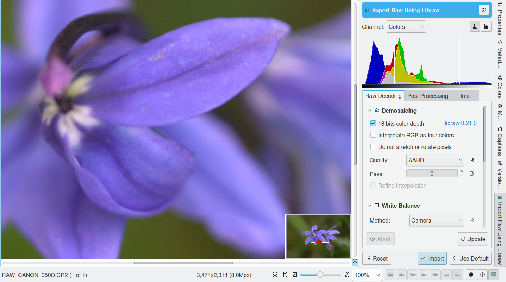

.. meta::
   :description: digiKam Image Editor RAW Workflow
   :keywords: digiKam, documentation, user manual, photo management, open source, free, learn, easy

.. metadata-placeholder

   :authors: - Gilles Caulier <caulier dot gilles at gmail dot com>

   :license: Creative Commons License SA 4.0

.. _raw_workflow:

RAW Workflow
============

.. contents::

A typical RAW workflow with digiKam may follow these steps:

    Setting up the RAW conversion and color management preferences:

        Get the ICC color profiles for the camera, display and printer.

        Setup digiKam correctly defining a color work space.

    Camera whitepoint setting.

    Demosaicing (includes interpolation, noise filtering and chromatic aberration correction).

    Conversion to a color space.

    Gamma correction, tone mapping.

    Color profile assignment.

    Dynamic range expansion (optional).

    Continue with standard workflow.

From there everything is simple, select a RAW image and open it in the editor. The Raw Import tool will be displayed after the image has been processed in order to adjust color rendering. Without color management all images are very dark, this is normal. You can experiment the various profiles you have in order to select the best input profile according to your image (some tends to be very neutral, even a bit dull, some gives more saturated results, etc.).

