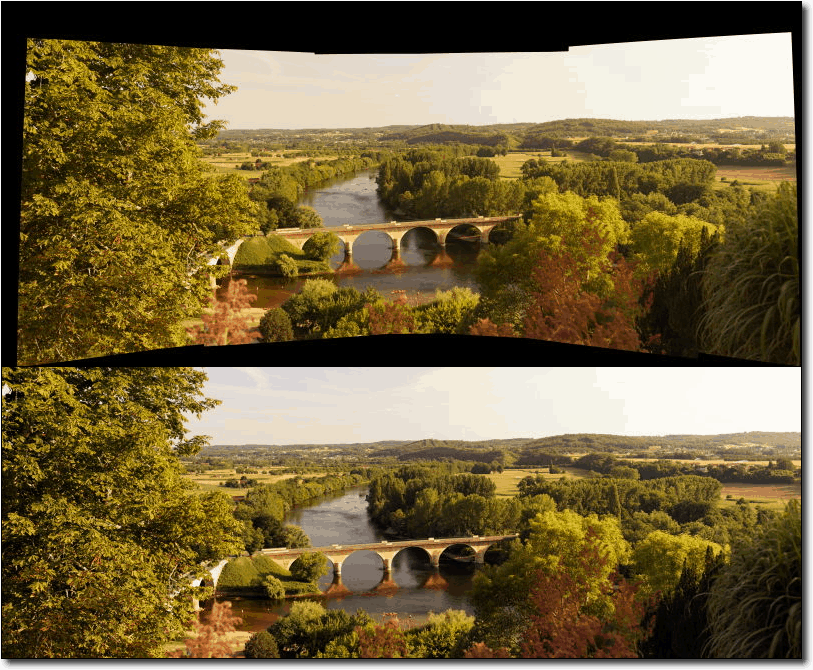

.. meta::
   :description: digiKam Image Editor Transform Tools
   :keywords: digiKam, documentation, user manual, photo management, open source, free, learn, easy

.. metadata-placeholder

   :authors: - Gilles Caulier <caulier dot gilles at gmail dot com>

   :license: Creative Commons License SA 4.0

.. _transform_tools:

Image Transformation Tools
==========================

.. contents::

Cropping a Photograph
---------------------

Manual Crop
~~~~~~~~~~~

Cropping a photograph is not only a common operation, but an often underestimated photographer's tool to compose an image. The Image Editor makes it very easy. To crop a photograph simply drag a rectangle over the image by holding down the left mouse button and moving the mouse. You will see a wire frame rectangle appear as you move the mouse. 

.. figure:: images/editor_crop_selection.png

When you release the button the area of the photograph that will be removed by a crop operation is greyed out. This allows you to get a good view of how your photograph will look once you have cropped it. You can change the size of the cropped area by dragging the corners of the rectangle, and you can create a new crop area simply by dragging out another rectangle.

Once you are happy with the crop, click on the The Image Editor Crop Button button on the toolbar and the photograph will be cropped (Ctrl+X). Use the File → Save or File → Save As... entries in the File menu to save the newly cropped photograph. 

.. note::

    The Histogram tab from the right sidebar will recompute the color statistics accordingly with the current selection on image.

Auto Crop
~~~~~~~~~

The Auto Crop tool removes the borders from an image. It searches the largest possible border area that is all the same color, and then crops this area from the image, as if you had used the Crop tool.

This tool can be used for example to crop a stitched panorama, assembly with many images, which generate black borders around.

See below a stitched Panorama Processed With Auto Crop.

Proportional Crop
~~~~~~~~~~~~~~~~~

The Aspect Ratio Crop tool goes further. While you are editing digital images, it is often necessary to create a compatible format with, for example, your photo album or paper formats. If you print an image from your digital camera and then try to put it in your photo album, you may notice that the camera has a different width or height ratio than a normal photographic film format so you need to crop your digital images in a predefined ratio (for example 5:7 or 2:3 which is a standard photo ratio). 

In the preview area you can resize the cropping rectangle by moving the corners with the mouse. It will keep the ratio value set in the bottom of dialog.

In the Aspect Ratio Crop tool settings, you specify the Orientation as Portrait or Landscape. Portrait will always have the larger size assigned to the Height and Landscape to the Width.

Aspect Ratio Crop tool uses a relative ratio. That means it is the same if you use centimeters or inches and it doesn't specify the physical size. For example, you can see below a correspondence list of traditional photographic paper sizes and aspect ratio crop.

=============================================================== =================
Standard Photograph Paper Size                                  Aspect Ratio Crop
=============================================================== =================
10x15cm 20x30cm 30x45cm 3.5x5" 4x6" 8x12" 12x18" 16x24" 20x30"  2:3
6x8cm 15x20cm 18x24cm 30x40cm 3.75x5" 4.5x6" 6x8" 7.5x10" 9x12" 3:4
20x25cm 40x50cm 8x10" 16x20"                                    4:5
15x21cm 30x42cm 5x7"                                            5:7
21x30cm 42x60cm                                                 7:10
=============================================================== =================

At the far right of the dialog two buttons are available to move the crop selection automatically to the horizontal or vertical center of the image.

At the very bottom line of the dialog, the Max. Ratio button lets you set the crop area size to the maximum size according to the current aspect ratio settings and orientation.

.. note::

    The Aspect Ratio Crop tool remembers the settings depending on image orientation (horizontal or vertical). When you use the crop tool next time, these settings will be used as default values depending on the image orientation. The changed image dimensions are stored into the EXIF tables so that the EXIF data reflects the cropped image and not the original one.

