.. meta::
   :description: digiKam Image Editor Transform Tools
   :keywords: digiKam, documentation, user manual, photo management, open source, free, learn, easy

.. metadata-placeholder

   :authors: - digiKam Team

   :license: see Credits and License page for details (https://docs.digikam.org/en/credits_license.html)

.. _transform_tools:

Transform Tools
===============

.. contents::

Cropping a Photograph
---------------------

.. _transform_crop:

Manual Crop
~~~~~~~~~~~

Cropping a photograph is not only a common operation, but an often underestimated photographer's tool to compose an image. The Image Editor makes it very easy. To crop a photograph simply drag a rectangle over the image by holding down the left mouse button and moving the mouse. You will see a wire frame rectangle appear as you move the mouse. 

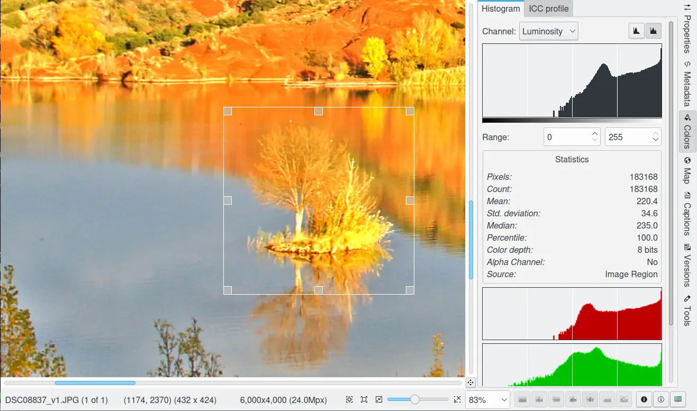

    A Region from Image Editor Canvas Ready for Manual Crop

When you release the button the area of the photograph that will be removed by a crop operation is greyed out. This allows you to get a good view of how your photograph will look once you have cropped it. You can change the size of the cropped area by dragging the corners of the rectangle, and you can create a new crop area simply by dragging out another rectangle.

Once you are happy with the crop, click on the Image Editor Crop button on the toolbar and the photograph will be cropped (Ctrl+X). Use the File --> Save or File --> Save As... entries in the File menu to save the newly cropped photograph. 

.. note::

    The Histogram tab from the right sidebar will recompute the color statistics accordingly with the current selection on image.

.. _transform_autocrop:

Auto Crop
~~~~~~~~~

The Auto Crop tool removes the borders from an image. It searches the largest possible border area that is all the same color, and then crops this area from the image, as if you had used the Crop tool.

This tool can be used for example to crop a stitched panorama, assembly with many images, which generate black borders around.

See below a stitched Panorama Processed With Auto Crop.

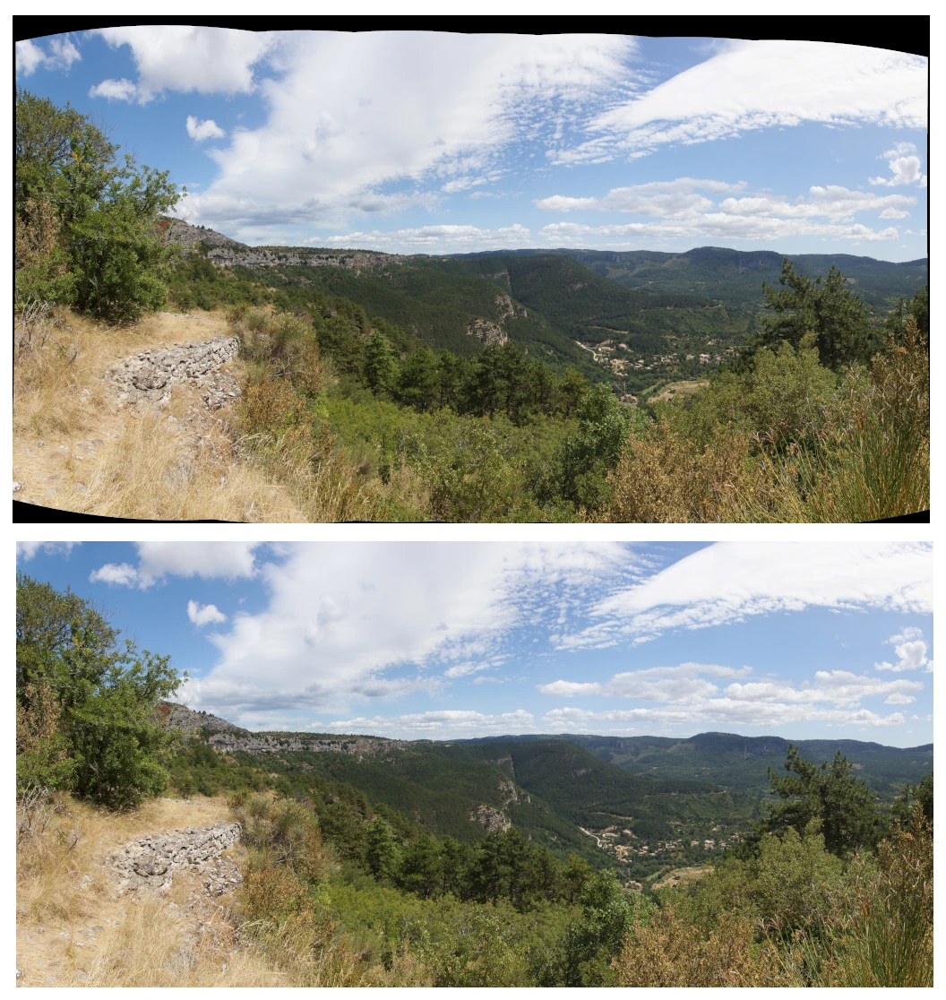

    A Panorama Processed by Auto-Crop to Drop the Black Frame Around the Image

.. _transform_proportionalcrop:

Proportional Crop
~~~~~~~~~~~~~~~~~

The Aspect Ratio Crop tool goes further. While you are editing digital images, it is often necessary to create a compatible format with, for example, your photo album or paper formats. If you print an image from your digital camera and then try to put it in your photo album, you may notice that the camera has a different width or height ratio than a normal photographic film format so you need to crop your digital images in a predefined ratio (for example 5:7 or 2:3 which is a standard photo ratio). 

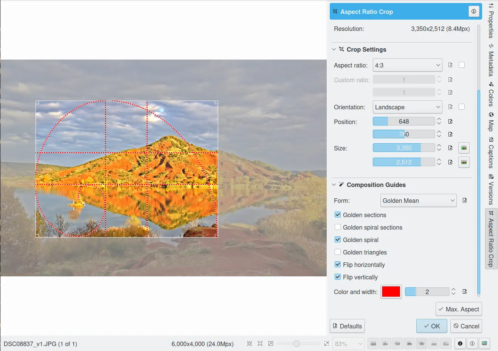

    The digiKam Image Editor Ratio Crop Tool

In the preview area you can resize the cropping rectangle by moving the corners with the mouse. It will keep the ratio value set in the bottom of dialog.

In the Aspect Ratio Crop tool settings, you specify the Orientation as Portrait or Landscape. Portrait will always have the larger size assigned to the Height and Landscape to the Width.

Aspect Ratio Crop tool uses a relative ratio. That means it is the same if you use centimeters or inches and it doesn't specify the physical size. For example, you can see below a correspondence list of traditional photographic paper sizes and aspect ratio crop.

=============================================================== =================
Standard Photograph Paper Size                                  Aspect Ratio Crop
=============================================================== =================
10x15cm 20x30cm 30x45cm 3.5x5" 4x6" 8x12" 12x18" 16x24" 20x30"  2:3
6x8cm 15x20cm 18x24cm 30x40cm 3.75x5" 4.5x6" 6x8" 7.5x10" 9x12" 3:4
20x25cm 40x50cm 8x10" 16x20"                                    4:5
15x21cm 30x42cm 5x7"                                            5:7
21x30cm 42x60cm                                                 7:10
=============================================================== =================

At the far right of the dialog two buttons are available to move the crop selection automatically to the horizontal or vertical center of the image.

At the very bottom line of the dialog, the Max. Ratio button lets you set the crop area size to the maximum size according to the current aspect ratio settings and orientation.

.. note::

    The Aspect Ratio Crop tool remembers the settings depending on image orientation (horizontal or vertical). When you use the crop tool next time, these settings will be used as default values depending on the image orientation. The changed image dimensions are stored into the Exif tables so that the Exif data reflects the cropped image and not the original one.

.. _transform_composition:

Composition Guide
~~~~~~~~~~~~~~~~~

When first looking at an image, the eye of the viewer rarely settles at the center of the image, but moves instead from the top left to the right, and then from the lower left to the right again. This pattern is unconscious but has been well documented. It is probably associated with the western reading pattern. From the photographer's point of view, the goal then becomes to guide the gaze of the viewer to the subject, being aware of the way many people perceive an image.

The Composition Guide settings provides guiding elements to better compose your images. These guides are:

    - **Rule of Thirds**: a grid that divides the image into thirds in every direction (that makes for 9 parts). These proportions are close to the golden rule and are derived from the field of view of the human eye. They are often used with slight variations throughout a large number of commonly used objects. Within that frame there are precise areas where the important parts of the image should be placed. The same principle is used to determine the position of the horizon and the proportion of ground to sky. Many photographers and artists are aware of the Rule of Thirds, where an image is divided into three sections vertically and horizontally and the points of intersection represent places to position important visual elements. Moving a horizon in a landscape to the position of one third is often more effective than placing it in the middle, but it could also be placed near the bottom one quarter or sixth. There is nothing obligatory about applying the Rule of Thirds. In placing visual elements for effective composition, one must assess many factors including color, dominance, size and balance together with proportion. Often a certain amount of image balance or tension can make a composition more effective.

    - **Harmonious Triangles**: harmonious divisions rely on the principle of similarity. Like the Rule of Thirds guide, Harmonious Triangles are another division of the image using a rectangle into equiangular harmonious triangles aligned with the diagonal.

    - **Golden Mean**: the Golden Mean is a ratio underlying numerous growth patterns throughout nature (from the spiral of a Nautilus shell to the petals of a sunflower), it has an uncanny way of showing up in all kinds of things we deem beautiful. The Golden Ratio is the irrational number 1.618033988..., and it is usage dates back to the ancient Egyptians and Greeks who used it in the construction of their temples and pyramids. Artists and architects throughout time have used the Golden Ratio when composing their paintings, buildings, and even photographs, in order to give their creations a sense of natural order and beauty. The ratio is inherent in the Fibonacci series: 1, 1, 2, 3, 5, 8, 13, 21, 34 etc.., where each succeeding number after 1 is equal to the sum of the two preceding numbers. The ratio formed 1:1.618 is the Golden Mean. A composition following this rule is considered visually harmonious. The Golden Mean provides more fluid guidelines when used to compose an image. These guides are listed below:

        - The **Golden Spiral** guide will increase your odds of getting captivating results in your photographs. As opposed to Rule of Thirds, the Golden Spiral forms a fluid line for the eye to trace through the image. This style of composition will invite the viewer's gaze into the image along the line of the spiral, creating a more symmetrical visual flow, and an overall compelling viewing experience. See below an image composition example using golden spiral.

        - One more rule is a **Golden Spiral Sections** (or Golden Rectangles). These rectangles are used to build the Golden Spiral. There should be something leading the eye to the center of the composition. It could be a line or several subjects. This "something" could just be there without leading the eyes, but it would make its job.

        - The **Golden Triangles** is a derivative of the Golden Spiral discussed above. Its vertices are the midpoints of the sides of the Golden Rectangle. Note that unlike Harmonious Triangles, Golden Triangles aren't equiangular triangles. Placing diagonals along these lines can make an otherwise static subject appear more dynamic. When you use Golden Triangles to break up your frame, you're creating an effect professional photographic experts call Dynamic Symmetry. Try to keep your focal subject on one of the intersecting points, and place other visual information into the triangles you've already divided out. The result will be a very attractive composition you may not have otherwise attained.

        - Like the Rule of **Thirds the Golden Sections** affects the ratio of an image size as well as the placement of the main subjects on the photo. This ratio is close to the 35mm ratio, so you don't need to change the size of the photo in most cases. But you need to consider the composition: the main subject should lie on one of the four lines or four intersections (subject's eye for example). Truthfully speaking, these rules are not the same. Rule of Thirds is a simplified version of the Golden Mean.

The Flip Horizontal and Flip Vertical options can be used to apply flip transformation to the harmonious divisions.

The Color button lets you set the guidelines color. If you have an high color contrast image, the guidelines may become invisible. By the way, you can adapt the color guide to the current image.

.. _transform_freerotation:

Free Rotation
-------------

The digiKam Free Rotation is a tool for image rotation by any arbitrary angle.

When taking an image it is all too easy to hold the camera not quite perfectly vertical or horizontal, resulting in an image where things are tilted at an angle. The way to fix this with the digiKam Image Editor is to use the Free Rotation tool. Select Transform --> Free Rotation and adjust to the target angle.

Rotate your image by using the Angle slider (value in degrees). Press to Reset Values for reset the slider to zero. A rotating effect preview is available on the right side of the dialog. The new target image dimensions in pixels are shown.

For better orientation, the Free Rotation tool provides a vertical and horizontal guide. Move the mouse cursor under image preview to display the dashed line guide. Move the cursor to an supposedly vertical or horizontal feature in the image like the sea or a building border and press the left mouse button for freeze the dashed lines position. Now, adjust the angle accordingly with the guide.

.. warning::

    After rotating the image, you often find that things are better but not quite perfect. One solution is to rotate a bit more, but there is a disadvantage to that approach. Each time you rotate an image, because the rotated pixels don't line up precisely with the original pixels, the image inevitably gets blurred a little bit. For a single rotation, the amount of blurring is quite small, but two rotations cause twice as much blurring as one, and there is no reason to blur things more than you have to. Sure, the guide tool available in the Free Rotation preview can help you to apply correctly at the first time an angle adjustment to an image.

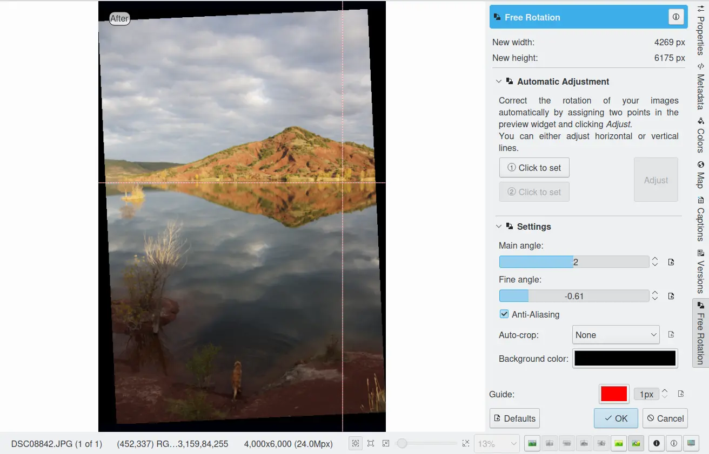

    The digiKam Image Editor Free Rotation Tool

After you have rotated an image, there will be unpleasant triangular "holes" at the corners. One way to fix them is to crop the image with Transform --> Crop Image Editor menu.

A more elegant way to crop the rotated image is to use the Auto-crop function. Choose anyone of the following options from the combo-box to your preference:

    - Widest area This option crops the rotated image to the widest possible (width) rectangular section.

    - Largest area This options crops the rotated image to the biggest surface.

Hold the mouse over the combo-box and scroll with the wheel between the two possibilities.

The Anti-aliasing checkbox will smooth the image a bit after rotation. Please read the warning above.

.. _transform_perspective:

Perspective Adjustment
----------------------

The digiKam Perspective Adjustment is a tool for adjusting the image's perspective.

With this tool you can work on the perspective in a photograph. This is very useful when working with photographs that contain keystone distortion. Keystone distortion occurs when an object is photographed from an angle rather than from a straight-on view. For example, if you take an image of a tall building from ground level, the edges of the building appear to meet each other at the far end. On the other hand you can use this tool to introduce a new perspective that is not a face-on view but to give the image a creative spin.

All perspective transformations are performed around a fixed point called the reference point. This point is at the center of the item you are transforming and is displayed by a red circle.

To change the perspective, use the square areas at the image corners for dragging. The perspective preview is rendered automatically. On the right of the dialog you'll find a set of information witch help you to control the perspective change:

    New Width: show the new image width in pixels including the empty area around the image resulting from the geometrical transformation.

    New Height: show the new image height in pixels including the empty area around the image resulting from the geometrical transformation.

    Top Left Angle: show the current angle in degrees at the top left corner of the perspective area.

    Top Right Angle: show the current angle in degrees at the top right corner of the perspective area.

    Bottom Left Angle: show the current angle in degrees at the bottom left corner of the perspective area.

    Bottom Right Angle: show the current angle in degrees at the bottom right corner of the perspective area.

.. warning::

    After applying the perspective adjustment, the image inevitably gets blurred a little bit. For a single adjustment, the amount of blurring is quite small, but two adjustments cause twice as much blurring as one, and there is no reason to blur things more than you have to.

After you have adjusted the perspective of an image there will be unpleasant triangular "holes" at the corners. One way to fix them is to crop the image with Transform --> Crop Image Editor menu.

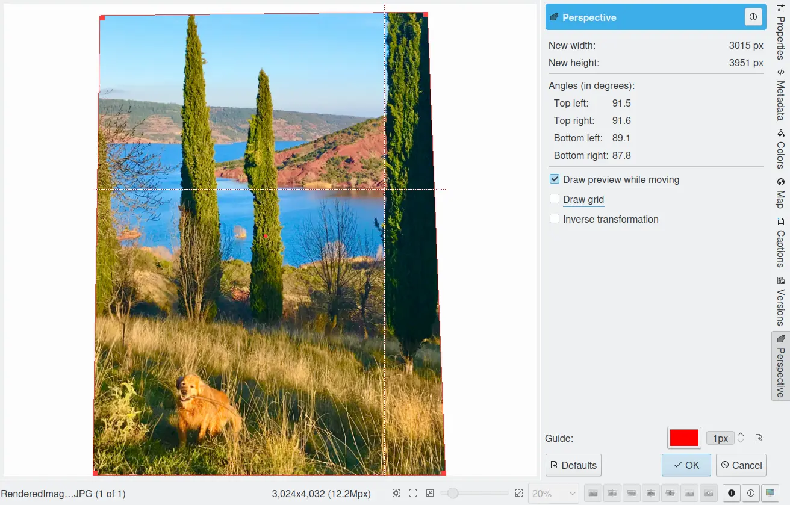

    The digiKam Image Editor Perspective Tool

.. _transform_resize:

Change The Image Size
---------------------

Overview
~~~~~~~~

The digiKam resize Photograph is definitely one of the most advanced tools to increase a photograph's size with minimal loss in image quality.

Rescaling an image to make it smaller is easy. The big question is: how can you blow up an image and keep the details sharp? How can one zoom in when the resolution boundary has been reached? How can one reinvent or guess the missing information to fill in the necessarily coarse image after upsizing? Well, the algorithm we use here does an excellent job, try it out and see for yourself!

Resizing a Photograph
~~~~~~~~~~~~~~~~~~~~~

If the photograph has the wrong size, you can scale it to the size you would like by using Transform Resize tool. Select Transform --> Resize and adjust the target values. The Resize tool dialog is available below.

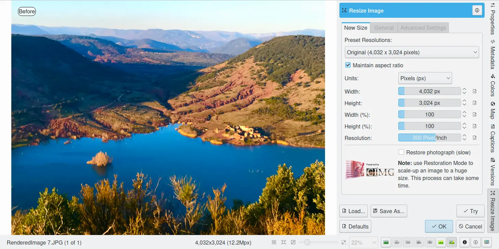

    The digiKam Image Editor Resize Tool

This image resizing tool uses a standard linear interpolation method to approximate pixels. If you want to up-size a small image with a better quality, try the Blowup tool.

Increasing Image Size (Restoration)
~~~~~~~~~~~~~~~~~~~~~~~~~~~~~~~~~~~

Many image editing programs use some kind of interpolation e.g. spline interpolation to scale-up an image. digiKam uses a more sophisticated approach.

You have to tell the tool about the resizing you want to do. These settings are available in New Size tab and are listed below:

    Maintain Aspect Ratio: if this option is enabled, setting the new image size will preserve the aspect ratio of the original image.

    Width: the new image width to use for blowing up.

    Height: the new image height to use for blowing up.

If you want to set filter parameters for finer adjustments, use Smoothing Settings and Advanced Settings tabs:

Photograph Resize Smoothing Settings:

    Detail Preservation p [0, 100]: this controls the preservation of the curvatures (features). A low value forces an equal smoothing across the image, whereas bigger values preferably smooth the homogeneous regions and leaves the details sharper. A value of 0.9 should well preserve details so that no sharpening is required afterwards. Note that Detail Preservation must be always inferior to Anisotropy.

    Anisotropy alpha [0, 100]: a low value smooths equally in all directions, whereas a value close to 1 smooths in one direction only. If you have film grain or CCD kind of noise a high value will result in wave-like pattern, whereas JPEG artifacts are suited for values close to 1.

    Smoothing [0, 500]: this sets the maximum overall smoothing factor (when p defines the relative smoothing). Set it according to the noise level.

    Regularity [0, 100]: this parameter is concerned with the bigger structures. The bigger this value, the more even the overall smoothing will be. This is necessary when much noise is present since it is then difficult to estimate the geometry. Also if you want to achieve a 'van Gogh' turbulence effect, setting it higher than 3 is recommended.

    Filter Iterations: number of times the blurring algorithm is applied. Usually 1 or 2 is sufficient.

Photograph Resize Advanced Settings:

    Angular Step da [5, 90]: angular integration of the anisotropy alpha. If alpha is chosen small, da should also be chosen small. But beware, small angles result in long runs! Choose it as large as you can accept.

    Integral Step [0.1, 10]: spatial integration step width in terms of pixels. Should remain less than 1 (sub-pixel smoothing) and never be higher than 2.

    Use Linear Interpolation: The gain in quality if you select this option is only marginal and you lose a factor of 2 in speed. Our recommendation is to leave it off.

Save As... and Load... buttons are used to do just that. Any Blowup Photograph filter settings that you have set can be saved to the filesystem in a text file and loaded later.

.. warning::

    Resize Photograph is very fast in what it is doing, but it can take a long time to run and cause high CPU load. You may always abort computation by pressing Cancel button during rendering.

.. _transform_rotationflip:

Rotating or Flipping a Photograph
---------------------------------

If the photograph shows a wrong orientation you can Flip or Rotate it to the orientation you would like by using Transform Flip/Rotate tools available in Transform --> Rotate and Transform --> Flip menus.

With flipping options, you can flip or turn over the image horizontally or vertically like a card deck. With the rotating options, you can rotate the image in 90 degrees steps clockwise. It can be used to change the display mode to Portrait or Landscape. Be aware that this rotation is not lossless when using JPEG format. You also can rotate more accurately to a finer degree by using the Free Rotation tool. You can access it by the Transform --> Free Rotation menu entry. See the dedicated Free Rotation manual for more information.

.. _transform_shear:

Shearing Image
--------------

The digiKam Shearing Image is a tool for shearing an image horizontally or vertically.

The Shear tool is used to shift one part of an image to one direction and the other part to the opposite direction. For instance, a horizontal shearing will shift the upper part to the right and the lower part to the left. This is not a rotation: the image is distorted. In other words, it will turn a rectangle into a parallelogram. This tool is available from Transform --> Shear menu.

Shear your image by using the Horizontal Angle and Vertical Angle sliders (values in degrees). You can shear along either Horizontally and vertically at the same time. Click on the Reset Values reset. A shearing effect preview is shown on the center of dialog window. The new target image dimensions in pixels are displayed at the right side of dialog.

To assist you in aligning, the tool provides a vertical and horizontal guide. Move the mouse cursor under image preview for display the dashed lines guide. Move the cursor to an important place in the image like the sea or a building border and press the left mouse button for freeze the dashed lines position. Now, adjust the shear correction according with the guide.

.. warning::

    After applying a shearing adjustment, the image inevitably gets blurred a little bit. For a single shearing, the amount of blurring is quite small, but two shears cause twice as much blurring as one, and there is no reason to blur things more than you have to.

After you have sheared an image, there will be unpleasant triangular "holes" at the corners. One way to fix them is to crop the image with Transform --> Crop Image Editor menu.

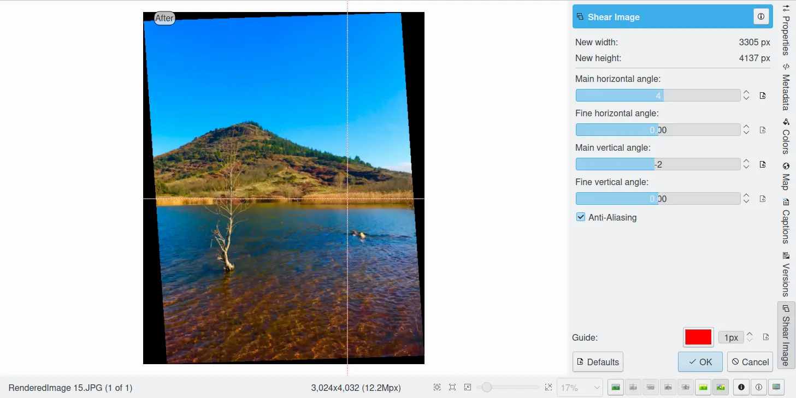

    The digiKam Image Editor Shear Tool

.. _transform_liquidrescale:

Liquid Rescale
--------------

Overview
~~~~~~~~

This tool is an Image Editor using the `Seam Carving method <https://en.wikipedia.org/wiki/Seam_carving>`_.

The Seam Carving procedure aims at resizing pictures non uniformly while preserving their features, i.e. avoiding distortion of the important parts. The tool supports manual feature selection, and can also be used to remove portions of the picture in a consistent way.

It works both ways, shrinking and enlarging, and it can use **masks** to select which features of the image should be preserved and which should be discarded.

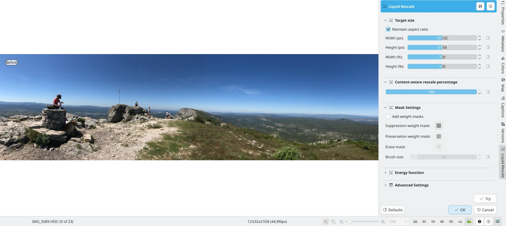

    A Sample Image Before Resizing Using Liquid Rescale Tool

Target Size
~~~~~~~~~~~

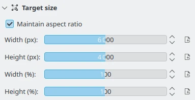

    The digiKam Liquid Rescale Tool Size Settings

In this section, it is possible to choose the final size. It is advisable to rescale always in one direction at a time. If both the **width** and the **height** are changed, rescaling is performed by default on the width first, then on the height. You can also **Preserve aspect ratio** from the original image. Dimensions can be set in pixels (**px**) or in **percents**.

Rescale Percentage
~~~~~~~~~~~~~~~~~~

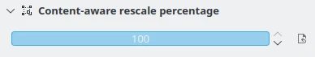

    The digiKam Liquid Rescale Tool Percentage Settings

In this section, you can specify here your desired content-aware rescaling percentage. This option sets the maximum enlargement which will be performed in a single rescale step. When the final size is greater than this, the tool will automatically stop and restart the rescaling as many times as needed. You might need to reduce this value if you have large preservation masks. Note that in this case, the same areas will be affected over and over by the rescaling.

The Feature Masks
~~~~~~~~~~~~~~~~~

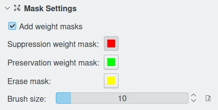

    The digiKam Liquid Rescale Tool Mask Settings

The masks are the easiest way to manually select the features of the image that you want to protect or discard. Turn on the **Add weight masks** option switch in mask edit mode.

To discard portion of image, press the **Suppresion weight mask** button and paint the mask over the canvas. The mask is a virtual transparent layer using **Red** color, with 50% opacity to indicate the area to discard.

To protect portion of image, press the **Preservation weight mask** button and paint the mask over the canvas. The mask is a virtual transparent layer using **Green** color, with 50% opacity to indicate the area to protect.

You can change the **Brush size** to paint masks on the canvas. To change a mask regions, use the **Erase mask** button and clean desired portion of masks over the canvas.

.. note::

    Object removal is only possible when shrinking. By default, feature discard masks are ignored when enlarging, because in that case the masked areas would be inflated rather then removed. If you actually want to get this effect, you need to unset the corresponding option in the **Advanced Settings** tab.

    Preservation of features is not possible if enlarging too much, because the inflation process is the exact reverse of the shrinking process, so the maximum amount of pixels you can add to a layer corresponds to the amount of pixels which are not protected. For example, if you have a 1000 pixel wide image and you have marked a 800 pixel wide area for protection, the final width should be less than 1200.

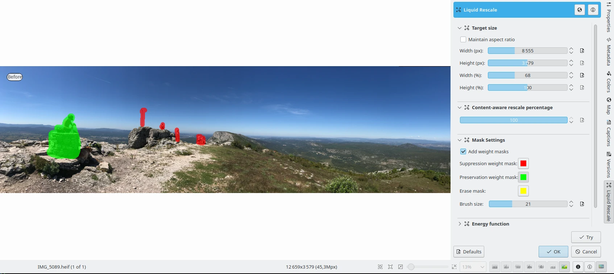

    Liquid Rescale Preservation and Suppression Masks Applied Over the Sample Image Before Resizing

Energy Function
~~~~~~~~~~~~~~~

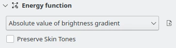

    The digiKam Liquid Rescale Energy Function Settings

In this section, you can choose a gradient function applied while rescaling. This function is used to determine which pixels should be removed or kept. Possible values are listed below:

    - **Norm of brightness gradient**.
    - **Sum of absolute values of brightness gradients**.
    - **Absolute value of brightness gradient**.
    - **Norm of luma gradient**.
    - **Sum of absolute values of luma gradients**.
    - **Absolute value of luma gradient**.

The **Preserve Skin Tones** option allows to preserve pixels whose color is close to a skin tone.

Advanced Settings
~~~~~~~~~~~~~~~~~

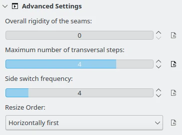

    The digiKam Liquid Rescale Advanced Settings

In this section, you can tune some advanced values to tweak the tool.

**Overall rigidity of the seams**: Use this value to give a negative bias to the seams which are not straight. May be useful to prevent distortions in some situations, or to avoid artifacts from pixel skipping (it is better to use low values in such case). This setting applies to the whole selected layer if no rigidity mask is used.

.. note::

    The bias is proportional to the difference in the transversal coordinate between each two successive points, elevated to the power of 1.5, and summed up for the whole seam.

**Maximum number of transversal steps**: This option lets you choose the maximum transversal step that the pixels in the seams can take. In the standard algorithm, corresponding to the default value step = 1, each pixel in a seam can be shifted by at most one pixel with respect to its neighbors. This implies that the seams can form an angle of at most 45 degrees with respect to their base line. Increasing the step value lets you overcome this limit, but may lead to the introduction of artifacts. In order to balance the situation, you can use the rigidity setting.

**Side switch frequency**: During the carving process, at each step the optimal seam to be carved is chosen based on the relevance value for each pixel. However, in the case where two seams are equivalent (which may happen, for instance, when large portions of the image have the same color), the algorithm always chooses the seams from one side.  In some cases, this can pose problems, e.g. an object centered in the original image might not be centered in the resulting image. In order to overcome this effect, this setting allows the favored side to be switched automatically during rescaling, at the cost of slightly worse performance.

**Resize Order**: Here you can set whether to resize **horizontally first** or **vertically first**.

More Details About the Seam Carving Technique
~~~~~~~~~~~~~~~~~~~~~~~~~~~~~~~~~~~~~~~~~~~~~

The tool works by finding so-called *seams* over an image, i.e. continuous, zig-zagged lines transversing the image from top to bottom (*vertical* seams), or from left to right (*horizontal* seams). When one such seam, say a vertical one, is removed from an image (the *carving* operation), the width of the image is reduced by one pixel. Removing horizontal seams reduces the height. Iterating such operations (find a seam and remove it), one can reduce the image size at will. Collecting together all the seams which were carved from an image, in their respective order, constitutes what is called a *seams map*.

Mirroring the carving process, by inserting additional seams besides the ones which are found by the algorithm, instead of removing them, image enlargement can be obtained, too. The meaning of the seam map is reversed in this case.

In order to get good results form this technique, the main issue is finding which are the most suitable seams to carve or to insert. If the aim is simply to change the proportions of the image without affecting too much the content, for example, *good* seams will be those which don't cross important features of the image, and instead pass through a background landscape.

By default, the tool tries to find the seams which cross the lowest-contrast areas (how this happens exactly is specified by the energy function settings). Therefore, each pixel of the image is assigned a so-called *energy value*, as the higher the contrast, the higher the energy, and seams are less likely to cross high-energy areas.

Since in many cases this simple contrast-based method is not optimal, the energy function can be *biased* by the user, who can decide that some areas should have a higher energy (using a preservation masks) or, on the contrary, that they should have a lower energy (using a suppression mask), and therefore effectively *drive* the seams and the whole process.

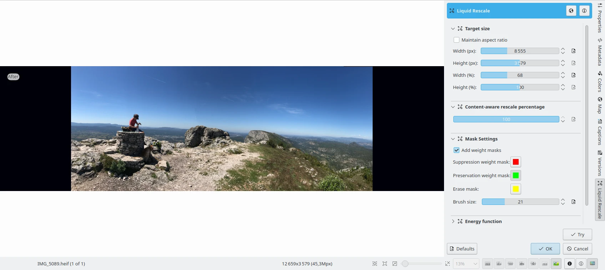

    The Sample Image Width Resized Down Using Liquid Rescale Tool
