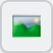
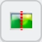
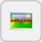
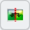
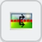
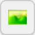
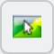
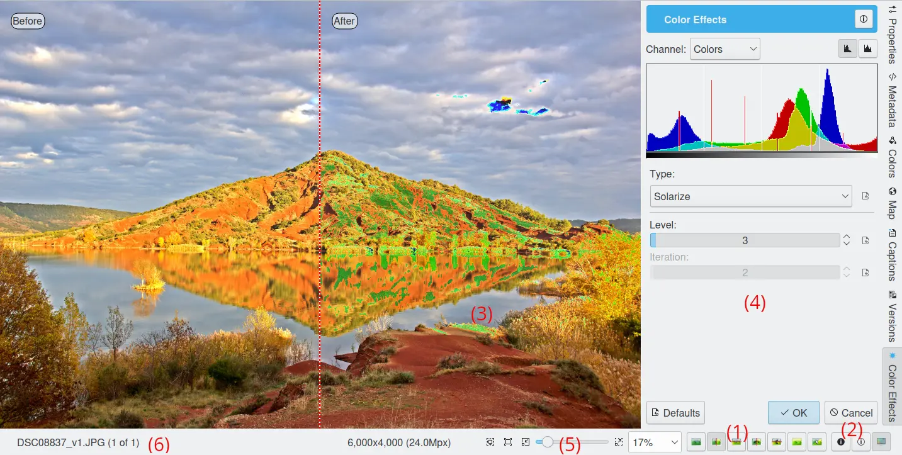
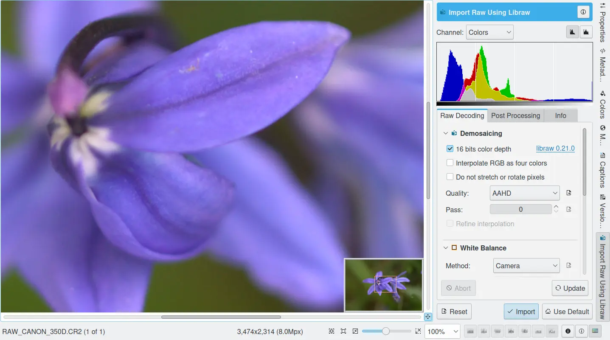

.. meta::
   :description: digiKam Image Editor Workflow Tools
   :keywords: digiKam, documentation, user manual, photo management, open source, free, learn, easy, image, editor, workflow, tools, color, enhance, transform, effects, decorate

.. metadata-placeholder

   :authors: - digiKam Team

   :license: see Credits and License page for details (https://docs.digikam.org/en/credits_license.html)

.. _workflow_tools:

:ref:`Workflow Tools <image_editor>`
====================================

.. contents::

.. _standard_workflow:

A Standard Workflow
-------------------

The basic workflow for editing images adjusts the following parameters, using the referenced digiKam tools:

    1. Exposure: :ref:`White Balance <color_wb>`.

    2. Color: :ref:`White Balance <color_wb>`.

    3. Black and white points: :ref:`White Balance <color_wb>` or :ref:`Adjust Levels <color_levels>`.

    4. Contrast: :ref:`Adjust Curves <color_levels>`.

    5. Saturation: :ref:`White Balance <color_wb>`, :ref:`Vivid <effects_color>` or :ref:`Hue/Saturation/Lightness <color_hsl>`.

    6. Resizing (interpolation): :ref:`Change Size <transform_resize>`.

    7. :ref:`Sharpening <enhance_sharpen>`.

    8. :ref:`Digital Asset Management <organize_find>` (applying tags, captions, rating, geolocation, save under new name).

We recommend this sequence of image editing steps to ensure the optimum photographic quality of the end product. In particular, sharpening should be one of the last steps performed on an image. We also recommend using a lossless format like PNG or TIFF for storing photographs. Otherwise you'll lose a bit every time you save the results. If you can afford the space, use 16 bit/channel for your best shots. If you want to change your working color space, in particular if you want to work in CIEL*a*b, 16-bits per channel is required to avoid truncation effects.

If you swap steps 4 and 5, which is quite possible when the initial contrast is already very good, you can perform all of the first 4 adjustment in the **White Balance** tool.

Most of the tools you may need for photographic editing are included with digiKam. These tools are described in the following sections.

Common Editing Tool Features
----------------------------

All Image Editor tools like Sharpen, Blur, Noise Reduction, Refocus, Unsharp Mask, etc. use a common dialog style that previews the effect before applying the filter to the current image. The figure below illustrates this common dialog layout with the **Solarize** feature of the **Color Effects** tool.

    Applying the Solarize Effect of the **Color Effects** Tool

The areas that are common to all tools are listed below. The numbers indicate the locations of common areas in the figure above.

- (1): Seven colored buttons in the status bar select the comparison style of the preview area. In all cases the words the view areas are correctly labelled with "Before" or "After". From left-to-right the modes are:

    - **Original** image |original|.

    - **Split vertically without duplication** |split_v_wo|: The left view area shows the original whereas the right view area shows the filter applied to the adjacent portion of the original.

    - **Split horizontally without duplication** |split_h_wo|: The top view area shows the original whereas the lower view area shows the filter applied to the adjacent portion of the original.

    - **Split vertically** |icon_split_v|: The left view area shows the original whereas the right view area shows the filter applied to the same portion of the original.

    - **Split horizontally** |icon_split_h|: The top view area shows the original whereas the lower view area shows the filter applied to the same portion of the original.

    - **Effect preview** |effect_preview|: This is a live effect preview without comparison.

    - **Mouse over** style |mouse_over|: Preview when the mouse is off the preview, otherwise shows original.

- (2): There are two buttons that can be toggled to show **over-exposure** |over_exposure| or **under-exposure** |under_exposure|. The colors used to indicate over or under exposure can be customized in the :ref:`Editor Window Settings <editor_settings>` from Setup dialog.

- (3): The **preview** area. The preview area is updated when changes are made to most tool settings. Click and drag with the mouse to move the image when it is zoomed.

- (4): The filter or tool **settings** area.

- (5): The **zoom** slider and buttons to change the canvas and preview zoom level.

- (6): A **progress indicator** and a Cancel button is displayed here for tools that require a long period of processing. Otherwise, the current **file-name** is displayed.

The Image Editor tools are available as plugins loaded dynamically at startup and are configurable using the :ref:`Setup dialog <plugins_settings>`. The list of tools is given below:

    - Image Color Corrections:

        - :ref:`Encoding Depth <color_depth>`

        - :ref:`Color Space Converter <color_cm>`

        - :ref:`Color Auto-Correction <color_auto>`

        - :ref:`Brightness / Contrast / Gamma <color_bcg>`

        - :ref:`Hue / Saturation / Lightness <color_hsl>`

        - :ref:`Color Balance <color_balance>`

        - :ref:`Levels Adjust <color_levels>`

        - :ref:`White Balance <color_wb>`

        - :ref:`Curves Adjust <color_curves>`

        - :ref:`Channel Mixer <color_mixer>`

        - :ref:`Black and White <color_bw>`

        - :ref:`Simulate Infrared Film <color_infrared>`

        - :ref:`Color Negative <color_negative>`

        - :ref:`Invert Colors <color_invert>`

    - Image Enhancement:

        - :ref:`Sharpen (sharpen, unsharp mask, refocus) <enhance_sharpen>`

        - :ref:`Blur <enhance_blur>`

        - :ref:`Red Eye Removal <enhance_redeyes>`

        - :ref:`Local Contrast <enhance_localcontrast>`

        - :ref:`Noise Reduction <enhance_nr>`

        - :ref:`Hot Pixels <enhance_hotpixels>`

        - :ref:`Distortion <enhance_lensdistortion>`

        - :ref:`Restoration <enhance_restoration>`

        - :ref:`Vignetting Correction <enhance_vignetting>`

        - :ref:`Lens Auto-Correction <enhance_lensauto>`

        - :ref:`Healing Clone <enhance_clone>`

    - Image Transformation Tools:

        - :ref:`Crop Tools <transform_crop>`

        - :ref:`Resize <transform_resize>`

        - :ref:`Liquid Rescale <transform_liquidrescale>`

        - :ref:`Rotating or Flipping <transform_rotationflip>`

        - :ref:`Free Rotation <transform_freerotation>`

        - :ref:`Perspective Adjustment <transform_perspective>`

        - :ref:`Shear <transform_shear>`

    - Image Decoration Tools:

        - :ref:`Add Border <decorate_border>`

        - :ref:`Apply Texture <decorate_texture>`

        - :ref:`Insert Text <decorate_inserttext>`

    - Special Effect Filters:

        - :ref:`Color Effects <effects_color>`

        - :ref:`Add Film Grain <effects_filmgrain>`

        - :ref:`Oil Paint <effects_oilpaint>`

        - :ref:`Charcoal Drawing <effects_charcoal>`

        - :ref:`Emboss <effects_emboss>`

        - :ref:`Distortion Effects <effects_distortion>`

        - :ref:`Blur Effects <effects_blur>`

        - :ref:`Raindrops <effects_raindrops>`

.. note::

    All these tools are also available in the **Tools** tab in the Image Editor right sidebar.

    .. figure:: images/editor_tools_sidebar.webp
        :alt:
        :align: center

        The digiKam Tools Tab in the Image Editor Right Sidebar

.. _rawprocessing_workflow:

Raw Workflow
------------

A typical RAW workflow with digiKam might follow these steps:

    - Set up the RAW conversion and color management preferences:

        - Set the ICC color profiles for the camera, display and printer.

        - Set the color working space.

    - Camera whitepoint setting.

    - Demosaicing (includes interpolation, noise filtering and chromatic aberration correction).

    - Conversion to a working color space.

    - Gamma correction, tone mapping.

    - Color profile assignment.

    - Dynamic range expansion (optional).

    - Continue with :ref:`standard workflow <standard_workflow>`.

From there on everything is simple: select a RAW image and open it in the editor. The Raw Import tool will be displayed after the image has been processed and color rendered. Without color management, it will be normal for all images to be very dark. You can experiment with various camera profile you have in order to select the best input profile for your image. Some profiles tend to be very neutral, even a bit dull, while some give more saturated results.

    Using the RAW Import Tool to Load a Digital Negative into Image Editor
