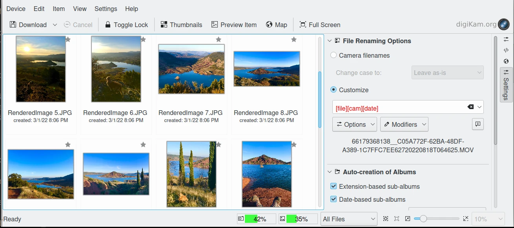

.. meta::
   :description: How to Import New Items in Your Collections With digiKam
   :keywords: digiKam, documentation, user manual, photo management, open source, free, help, learn, import, camera, scanner, remote, computer, import, google

.. metadata-placeholder

   :authors: - digiKam Team

   :license: see Credits and License page for details (https://docs.digikam.org/en/credits_license.html)

.. _import_tools:

############
Import Tools
############

This section explain how to import new items in the digiKam collections.

.. toctree::
   :maxdepth: 2
   :caption: Contents:
   :glob:

   import_tools/import_overview.rst
   import_tools/camera_import.rst
   import_tools/advanced_import.rst
   import_tools/scanner_import.rst
   import_tools/remote_import.rst
   import_tools/google_import.rst
