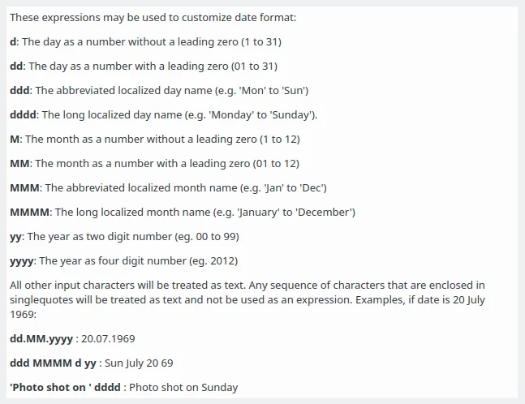

.. meta::
   :description: digiKam Advanced Settings to Import From Digital Camera
   :keywords: digiKam, documentation, user manual, photo management, open source, free, learn, easy, import, camera

.. metadata-placeholder

   :authors: - digiKam Team

   :license: see Credits and License page for details (https://docs.digikam.org/en/credits_license.html)

.. _advanced_import:

Advanced Import Settings
========================

.. contents::

The Settings tab of the Right Sidebar in the Import Interface opens five sections with advanced options for the import processing. 

File Renaming Options
---------------------

Cameras often do not use very meaningful filenames for photographs. The filenames are usually reused once the photographs have been deleted from the camera. This can lead to filename clashes if you download photographs from many shootings into the same Album. It can also be useful to include the date and time that an image was taken into the filename.

.. figure:: images/camera_settings_files_rename.webp
    :alt:
    :align: center

    The Import Tool File Renames Advanced Settings

The file **Camera filenames** allows to use the file names provided by camera. You can file names case with option **Change case to** where choice can be **Leave-as-is**, **Upper** case, or **Lower** case.

The file **Customize** renaming view is mostly the same than **Advanced Rename** tool available in **Main Window**. See the full description in :ref:`this section <renaming_photograph>` of this manual.

The new filename that digiKam will use for the photographs when they are downloaded can be shown underneath the **Customize** settings. Changing item selection from the icon-view will update these information. The renaming settings will be remembered the next time you use the camera interface.

.. caution::

    At the moment digiKam cannot read metadata of RAW files during the import. You might want to import the files while preserving camera filenames first and then rename them after the import using the rename function (F2).

Auto-Creation of Albums
-----------------------

.. figure:: images/camera_settings_auto_albums.webp
    :alt:
    :align: center

    The Import Tool Albums Auto-Creation Advanced Settings

Check Extension-based sub-albums and digiKam will create subalbums based on the file extensions of the imported images in the target album. digiKam will open a dialog where you can choose the target album once you click one of the download options either from the toolbar or from the Item menu. If you want to create a new Album, into which you could download the photographs, click the New Album button. The new Album will be created as a sub-folder of the Album that is currently selected in the existing Album list. This means that if you do not want your new Album to be a sub-folder of an existing folder you must first select the collection where you want to create the new album. Collections are indicated by the icon.

If your camera provides information about the date of the photograph's taking or, if you import from a USB device or a folder, the images contain Exif metadata with date/time information, digiKam can use this to automatically create subalbums in the target album during import. Subalbums names will be based on the image dates. All images which have the same date will be downloaded into the same subalbum if you check Date-based sub-albums. Not all cameras include this information. See the sidebar Metadata section for more detail about information your camera may have embedded in your photographs.

    The Import Tool Albums Auto-Creation Helper Dialog

On the Fly Operations
---------------------

.. figure:: images/camera_settings_on_the_fly.webp
    :alt:
    :align: center

    The Import Tool on the Fly Operations Advanced Settings

This section of the Settings tab offers several options for JPEG images. The Template: drop-down field lets you choose one of your metadata templates you customized in Templates Settings. You can access the Template Manager also with the edit button to the right of the drop-down field.

Write the document name to Exif and Fix internal date & time writes this information into the respective Exif tags and XMP fields.

If you check the next box digiKam will perform the auto-rotate/flip action described in Lossless Image Rotation.

Convert to lossless file format allows you to convert the images to PNG, TIFF, PGF or JPEG2000 during import.

DNG Convert Options
-------------------

.. figure:: images/camera_settings_dng_convert.webp
    :alt:
    :align: center

    The Import Tool DNG Convert Advanced Settings

This section allows to enable the DNG conversion of RAW images by checking Convert RAW images to DNG container and to select options for that conversion. To learn more about Digital Negative (DNG) use the link “DNG container”.

- Embed original file: Embeds the original RAW file into the DNG container.

- Lossless Compression: Enables lossless compression. The difference between lossy and lossless compression is said to be practically indistinguishable with DNG.

- JPEG preview: Choose whether you want a medium or full size JPEG preview to be embedded into the DNG container or none at all. 

Scripting
---------

.. figure:: images/camera_settings_scripting.webp
    :alt:
    :align: center

    The Import Tool Scripting Advanced Settings

This last section of the Settings tab offers to run scripts to manipulate the images during import. You can type the filename of the script into the input field or search for it using the Browse... button. Check out the info button for additional expressions to customize the command line!
