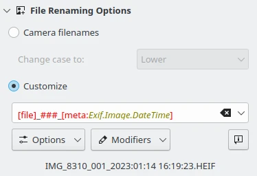
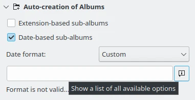
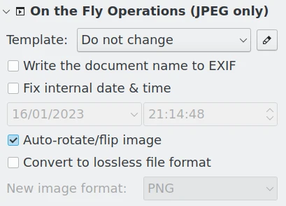
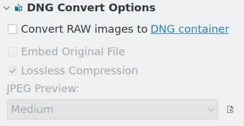

.. meta::
   :description: digiKam Advanced Settings to Import From Digital Camera
   :keywords: digiKam, documentation, user manual, photo management, open source, free, learn, easy, import, camera, advanced, convert, rename, scripting

.. metadata-placeholder

   :authors: - digiKam Team

   :license: see Credits and License page for details (https://docs.digikam.org/en/credits_license.html)

.. _advanced_import:

:ref:`Advanced Import Settings <import_tools>`
==============================================

.. contents::

The **Settings** tab of the Right Sidebar in the Import Tool interface contains five sections with advanced options for import processing.

File Renaming Options
---------------------

Cameras often do not use very meaningful filenames for photographs, and the filenames are sometimes reused once the photographs have been deleted from the camera. This can lead to filename conflicts if you download photographs from many sessions into the same Album. These options allow you to rename files during import to avoid filename conflicts. They can also be used to include the date and time that an image was taken into the filename.

    The Import Tool File Renaming Options

If you select **Camera filenames** and Change case to: **Leave as-is** the image filenames will not be altered. But you also have the option to change the case of the filenames to **upper** or **lower** case with the **Change case to** drop down field.

If you select **Customize** you can specify a renaming pattern using metadata fields from the **Options** drop down menu. The **Modifier** drop down menu allows you to customize each metadata field appended to the renaming pattern. The custom file **Renaming Options** and **Modifier** options are mostly the same as in the **Advanced Rename** tool available in the **Main Window**. See the full description in :ref:`this section <renaming_photograph>` of this manual.

.. important::

    The file renaming operations require the ability to read **file metadata** from the camera. When using the USB Mass Storage driver, the **Use file metadata** option must be enabled in the :ref:`Camera behavior dialog <camera_behavior_use_file_metadata>` for file renaming to work. Be aware that enabling this option will slow down the transfer of data from the camera.

The new filename that digiKam will use for downloaded images will be shown underneath the **Customize** settings. Changing item selections from the icon-view will update this information. The renaming settings are retained for the next time you use the import capability.

.. caution::

    Issues with the gPhoto2 drivers mean that digiKam cannot currently read metadata from RAW files when importing from a camera. You might want to first import the files while preserving camera filenames, and then using the rename function (:kbd:`F2`) to rename them after the import.

    Another solution is to instead import using a memory card reader and the USB Mass Storage driver.

.. _camera_autoalbums:

Auto-Creation of Albums
-----------------------

    The Import Tool Albums Auto-Creation Advanced Settings

Check **Extension-based sub-albums** to have digiKam create sub-albums based on the file extensions of the imported images in the target album. At the point where you :ref:`download from your camera to your computer <camera_download>`, digiKam will open a dialog allowing you to choose the target album once you click one of the download options either from the toolbar or from the **Item** menu. If you want to create a new Album into which you can download the photographs, click the **New Album** button. The new Album will be created as a sub-folder of the Album that is currently selected in the existing Album list. This means that if you do not want your new Album to be a sub-folder of an existing folder, you must first select the collection where you want to create the new album. Collections are indicated on the top level of the album hierarchy.

If your camera provides information about the date of the photograph, or if you import images containing Exif date metadata from a USB device or a folder, digiKam can use the date to automatically create sub-albums in the target album during import. Check **Date-based sub-albums** to create sub-album names based on the image dates. All images with the same date will be downloaded into the same sub-album. Not all cameras include this information. See the :ref:`earlier section <camera_import>` in this chapter for more detail about information your camera may have embedded in your photographs.

The date format for automatically creating albums can be set to **ISO** (e.g. '2023-08-13''), **Full text** (e.g. 'Sun Aug 13 2023''), **Local Settings** (taken from your desktop settings), or **Custom**. Custom date formats are specified in the Date format text box using the date descriptors described in the associated help dialog. An annotation below the text box will either show an example album name, or warn that the custom data format is not valid.

These expressions may be used to customize date format:

======================= =============================================================================================================================================================================
Options                 Description
======================= =============================================================================================================================================================================
d                       The day as a number without a leading zero (1 to 31)
dd                      The day as a number with a leading zero (01 to 31)
ddd                     The abbreviated localized day name (e.g. 'Mon' to 'Sun')
dddd                    The long localized day name (e.g. 'Monday' to 'Sunday')
M                       The month as a number without a leading zero (1 to 12)
MM                      The month as a number with a leading zero (01 to 12)
MMM                     The abbreviated localized month name (e.g. 'Jan' to 'Dec')
MMMM                    The long localized month name (e.g. 'January' to 'December')
yy                      The year as two digit number (eg. 00 to 99)
yyyy                    The year as four digit number (eg. 2012)
======================= =============================================================================================================================================================================

All other input characters will be treated as text. Using a path separator in a custom date format will create nested sub-albums. Any sequence of characters that are enclosed in singlequotes will be treated as text and not be used as an expression. Examples, if date is 20 July 1969:

======================= =============================================================================================================================================================================
Options                 Description
======================= =============================================================================================================================================================================
dd.MM.yyyy              20.07.1969
ddd MMMM d yy           Sun July 20 69
yyyy/MM/dd              1969/07/20
'Photo shot on ' dddd   Photo shot on Sunday
======================= =============================================================================================================================================================================

.. _camera_onthefly:

On the Fly Operations
---------------------

    The Import Tool on the Fly Operations Advanced Settings

This section of the Settings tab offers several options for making changes to JPEG images during import. The **Template** drop-down field lets you choose one of the metadata templates you customized in :ref:`Templates Settings <templates_settings>`. You can also access the **Template Manager** with the edit button to the right of the drop-down field.

**Write the document name to Exif** and **Fix internal date and time** writes this information into the respective Exif tags and XMP fields.

The **Auto-rotate/flip image** checkbox will perform the auto-rotate/flip action described in :ref:`Lossless Image Rotation <lossless_rotation>`.

**Convert to lossless file format** allows you to convert the images to PNG, TIFF, PGF, HEIF, WEBP, AVIF, or JPEG 2000 during import. To learn more about these file formats, see :ref:`this section <image_formats>` of the manual.

.. _camera_dngconvert:

DNG Convert Options
-------------------

    The Import Tool DNG Convert Advanced Settings

Checking **Convert RAW images to DNG** in this section enables the automatic conversion of imported RAW files into DNG files. Several options can be selected for that conversion.

- **Embed original file**: Embeds the original RAW file into the DNG container.

- **Lossless Compression**: Enables lossless compression. The difference between lossy and lossless compression is said to be practically indistinguishable with DNG.

- **JPEG preview**: Choose whether you want a medium or full size JPEG preview to be embedded into the DNG container, or none at all.

Reasons for converting to DNG files are provided in :ref:`this section <dng_converter>` of the manual. To learn more about the Digital Negative (DNG) format, use the link `DNG container <https://en.wikipedia.org/wiki/Digital_Negative>`_.

.. _camera_scripting:

Scripting
---------

.. figure:: images/camera_settings_scripting.webp
    :alt:
    :align: center

    The Import Tool Scripting Advanced Settings

The last section of the Settings tab allows you to run scripts to manipulate the images during import. You can type the filename of the script into the input field or search for the script using the **Browse** button. Check out the info button for additional expressions to use for customizing the command line. These expressions may be used to customize the command line:

======================= =============================================================================================================================================================================
Options                 Description
======================= =============================================================================================================================================================================
%file                   Full path of the imported file
%filename               File name of the imported file
%path                   Path of the imported file
%orgfilename            Original file name
%orgpath                Original path
======================= =============================================================================================================================================================================

If there are no expressions full path is added to the command.

Post-Processing and Metadata
----------------------------

The camera drivers used to import images cannot always read the file metadata directly from the camera. But digiKam can read all of the metadata in the image file after it has been downloaded. So the metadata information displayed in the import tool, i.e. metadata viewer of the sidebar, date in the thumbnail, etc., may be incomplete before download. But the import uses the file metadata read *after* download to perform all file renaming and album creation operations. So be aware that there can be a difference between the information displayed in the import view and the actual metadata used to import and organize your collections.

