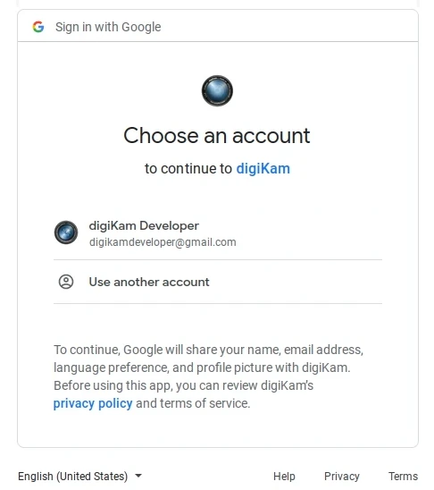
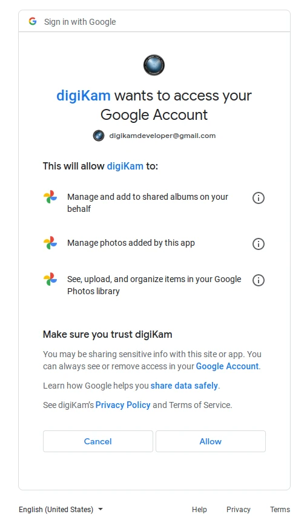
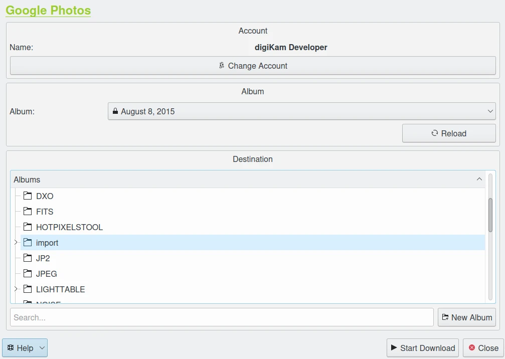

.. meta::
   :description: digiKam Import from Google Web-Service
   :keywords: digiKam, documentation, user manual, photo management, open source, free, learn, easy, google, impport

.. metadata-placeholder

   :authors: - digiKam Team

   :license: see Credits and License page for details (https://docs.digikam.org/en/credits_license.html)

.. _google_import:

Import from Google
==================

.. contents::

Overview
--------

This tool allows the user to upload photos to the `Google Photo <https://en.wikipedia.org/wiki/Google_Photos>`_ web services.

**Google Photos** is a photo sharing which automatically analyzes photos, identifying various visual features and subjects. Users can search for anything in photos including faces and group similar ones together.

The tool can be used to download files the remote Google server to the image collections on your computer using the Internet. Use the :menuselection:`Import --> Impport from Google Photo` :kbd:`Alt+Shift+P` menu entry to access to this tool, or uses the icon from **Tools** in Right sidebar.

Login to your Account
---------------------

When accessing the tool for the first time you are taken through the process of obtaining a token which is used for authentication purposes. The following dialog will popup and a browser window will be launched you will log in to Google:

    The Google Dialog to Select Account

After successful signup digiKam will be allowed to send photos to the Google website. You will be presented with the following page on successful signup:

    The Google Dialog to Authorize Application

Then, simply authorize application and close the web browser. Return to the host application dialog, you will see the interface used to upload photos to Google.

.. note::

    When the tool is invoked for second time, it will remember the previous account automatically.

Download from your Account
--------------------------

The download dialog for **Google Photo** web-service is presented below:

    The Google Photo Import Dialog

By default, the tools proposes to export the currently selected items from the icon-view. The **+** Photos button can be used to append more items on the list.

With the **Album** options, you can select the online folder to get files to download. You can **Reload** the list on the combo-box if online contents have been changed in Google web interface.

Below, the main dialog propose the hierarchy of physical **Albums** from your collection. Selected one target entry to import files, or if you want a new one, just press **New Album** button to create a nested entry in the tree-view.

Press **Start Donload** button to transfer items. You can click on the **Close** button to abort the uploading of photos.
