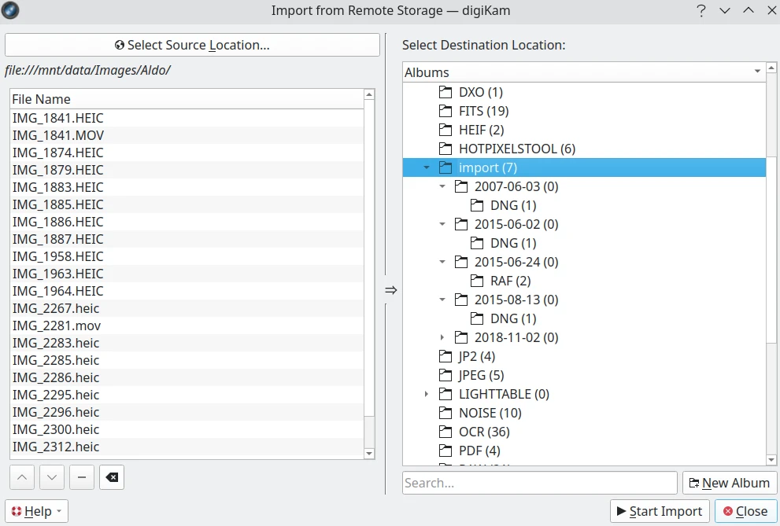
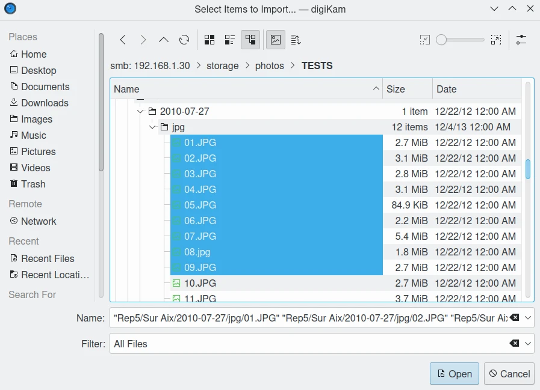

.. meta::
   :description: digiKam Import from Remote Computer
   :keywords: digiKam, documentation, user manual, photo management, open source, free, learn, easy, remote, computer, import

.. metadata-placeholder

   :authors: - digiKam Team

   :license: see Credits and License page for details (https://docs.digikam.org/en/credits_license.html)

.. _remote_import:

:ref:`Import from Remote Computer <import_tools>`
=================================================

Introduction
------------

This tool downloads files into your collections from a remote networked computer. It is available from the :menuselection:`Import --> Import from remote storage` :kbd:`Alt+Shift+K` menu entry or the corresponding icon from the **Tools** tab in the Right Sidebar.

    The Import from Remote Computer Dialog

KIO-Slaves Protocols
--------------------

The tool uses the KDE KIO-slaves in the background to communicate with the remote source. See :ref:`this section <kio_protocols>` of this documentation for the list of usable protocols.

How to use this tool
--------------------

To choose files to import, press **Select Source Location** on the left side of the dialog. A native desktop URLs selector will appear allowing you to see remotely connected devices listed in the network section:

    The URLs Selector Dialog Under Linux Choosing Files from a NAS Sharing Contents through Samba File System.

In this dialog, to be connected to the remote device, you can use a protocol in the **Source Location** url field such as:

    - **fish://user_name@remote_computer**: connect to the *remote_computer* with *user_name* using SSH protocol (Secure SHell).
    - **ftp://user_name@remote_computer**: connect to the *remote_computer* with *user_name* using FTP protocol (File Transfer Protocol).

An alternative will be to use the native desktop url selector by pressing the **Select Import Location** button. A dialog will appear where you can see and select remote devices in the network section of the dialog:

.. note::

    The native URLs selector dialog is only available if you turn on the right option from the `Settings --> Configure digiKam... --> Miscellaneous page --> Appearance tab`. See  :ref:`this section <appearance_settings>` of the manual for more details.

After selecting the files to import and closing the native desktop URLs selector, the selected files will appear in the list below the **Select Source Location** button.

On the right, the main dialog displays the hierarchy of **Albums** in your collection. Specify the destination location where the files should be imported, or press the **New Album** button to create a new album for the downloaded files.

After selecting the target album to download the files, press the **Start Import** button to process files. You can abort the operation by pressing the **Close** button.
