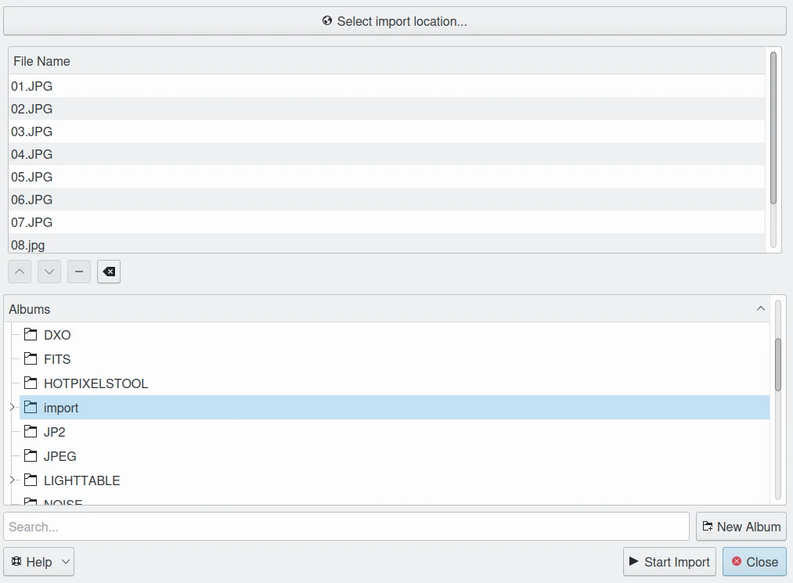

.. meta::
   :description: digiKam Import from Remote Computer
   :keywords: digiKam, documentation, user manual, photo management, open source, free, learn, easy, remote, computer, import

.. metadata-placeholder

   :authors: - digiKam Team

   :license: see Credits and License page for details (https://docs.digikam.org/en/credits_license.html)

.. _remote_import:

Import from Remote Computer
===========================

.. contents::

This tool downloads files into your collections from a remote networked computer. It is available from the :menuselection:`Import --> Import from remote storage` :kbd:`Alt+Shift+K` menu entry or the corresponding icon from the **Tools** tab in the Right Sidebar.

    The Import from Remote Computer Dialog

To choose files to import, press **Select Import Location**. A native desktop URLs selector will appear allowing you to see remotely connected devices listed in the network section:

.. figure:: images/import_remote_selection.webp
    :alt:
    :align: center

    The URLs Selector Dialog Under Linux Choosing Files from a NAS Sharing Contents through Samba File System.

In this dialog, you can use protocols such as **fish** (ssh), **ftp**, **smb**, etc, to connect to the remote computer. For example,

    - **fish://user_name@remote_computer**: connect to the *remote_computer* with *user_name* using SSH protocol (Secure SHell).
    - **ftp://user_name@remote_computer**: connect to the *remote_computer* with *user_name* using FTP protocol (File Transfer Protocol).

.. note::

    The native URLs selector dialog is only available if you turn on the right option from the **Misc/Appearance** section of the :ref:`configuration panel <appearance_settings>`.

After selecting the files to import and closing the native desktop URLs selector, the selected files will appear in the list below the **Select import location** button.

Below this list of files, the main dialog displays the hierarchy of **Albums** in your collection. Specify the target Album where the files should be imported, or press the **New Album** button to create a new album for the downloaded files.

After selecting the target album to download the files, press the **Start Import** button to process files. You can abort the operation by pressing the **Close** button.
