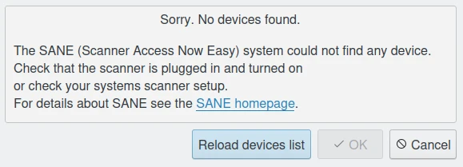
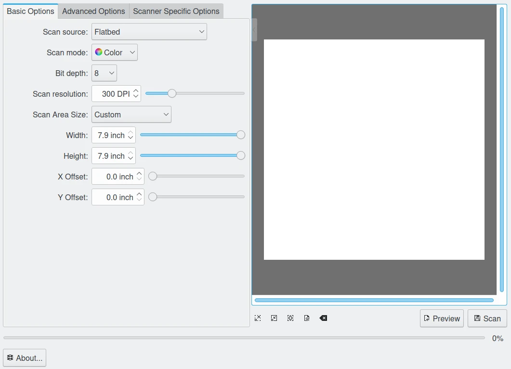
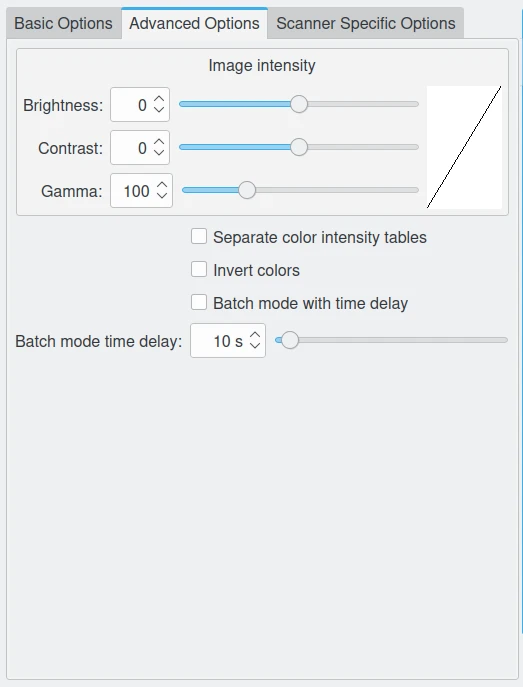
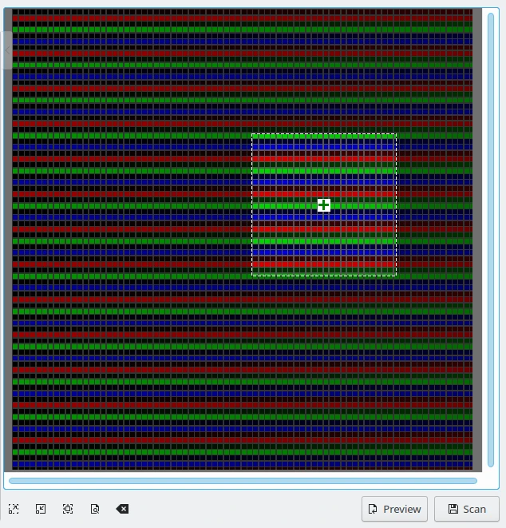
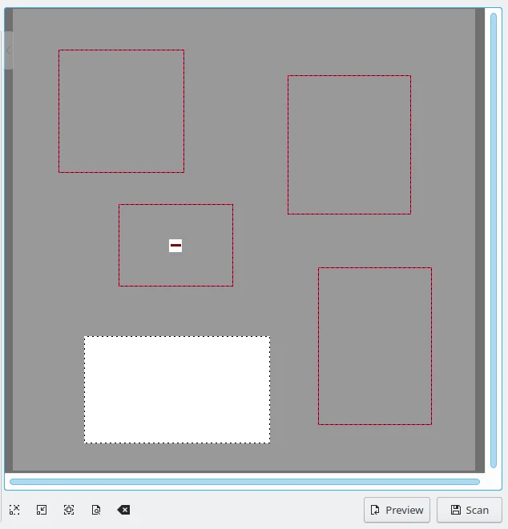

.. meta::
   :description: digiKam Import From Digital Scanner
   :keywords: digiKam, documentation, user manual, photo management, open source, free, learn, easy, scanner, import

.. metadata-placeholder

   :authors: - digiKam Team

   :license: see Credits and License page for details (https://docs.digikam.org/en/credits_license.html)

.. _scanner_import:

Import From Scanner
===================

.. contents::

This tool is dedicated to scan images using a flat scanner. It uses an interface for `SANE Library <http://sane-project.org/>`_ to control scanner devices. It can save images in all main image containers that digiKam support.

.. note::

    You can check the status of your scanner support from the SANE project website by using `this manufacturers list <http://www.sane-project.org/sane-mfgs.html>`_.

If the selected scanner cannot be opened or if no default scanner is provided, a scanner selection dialog is opened.

The user can choose the scanner to be used and press **OK** to open the scanner. Pressing **Cancel** will cause the tool to exit.

In case no devices were found, maybe because the scanner is not plugged in or switched off, correct that. Then the **Reload device list** can be used to reload the list of scanners.

    The Scanner Import Error Dialog

.. note::

    Not all drivers or backends support this feature. In that case quit the tool, connect your scanner and restart digiKam.

    The Basic Options View from Scanner Import Dialog

In the main window, the user has two sets of scan options: Basic, Advanced, or Specific Options. The **Basic Options** tab contains the most common parameters that the SANE scanner backends provide, the **Advanced Options** contains the analog gamma tables, while the **Scanner Specific Options** tab contains all the options of the backend. The options listed here depend on SANE support for your driver: the interface should be able to display most of the types of parameters that SANE provides. 

    The Advanced Options View from Scanner Import Dialog

The **Scanner specific options** contains more detailed options of the backends. The tool does not have any special handling for these options.

.. figure:: images/scanner_specific_options.webp
    :alt:
    :align: center

    The Specific Options View from Scanner Import Dialog

If you are satisfied with your settings, you can use the little arrow on the top of the options splitter. When clicked it collapses or expands the options. The collapser can overlap the preview area, but fades away when the mouse cursor moves out of the collapser.

To scan an image, the user can start with a preview scan and then select the part of the scan area to do the final scan on. The preview scan is started by pressing the **Preview** button.

    The Digital Preview from Scanner Import Dialog

When the preview is scanned the area for the final image can be selected. When the image is selected the final image can be acquired by pressing the final **Scan** button. You will see the progress of the scan.

Sometimes you need only certain parts of an image. Instead of scanning the whole picture and then using the Image Editor to save the different image parts into separate files, use the tool multiple selection feature.

    The Multiple Selection over Preview from Scanner Import Dialog

Scan a preview and then use the left mouse button to select the first part of the image in the preview. Hover the selected area with mouse cursor and click on the **Green Cross** to select the area. Selected areas are indicated by a red border. Now select the next parts of the image in the same way.

To remove a single selection hover the area with the mouse cursor and click on the **Red Cross**. With **Clear Selections** from the context menu launched with the right mouse button all selections in a preview can be removed.

If you placed two separate images or photos on you scanner and started a preview the tool automatically preselect the different areas.

If you are satisfied with your choice starting the final batch scan of all selections. The selected parts of the image are scanned and saved separately into different files.
