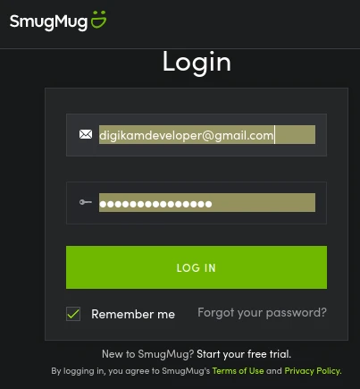
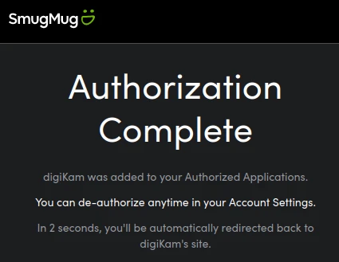
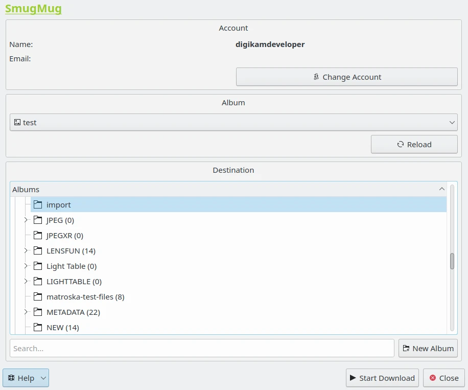

.. meta::
   :description: digiKam Import from SmugMug Web-Service
   :keywords: digiKam, documentation, user manual, photo management, open source, free, learn, easy, smugmug, import

.. metadata-placeholder

   :authors: - digiKam Team

   :license: see Credits and License page for details (https://docs.digikam.org/en/credits_license.html)

.. _smugmug_import:

Import from SmugMug
===================

.. contents::

This tool allows the user to download photos from the SmugMug web-service.

`SmugMug <https://en.wikipedia.org/wiki/SmugMug>`_ is an image sharing, image hosting service, and online video platform on which users can upload photos and videos. The company also facilitates the sale of digital and print media for amateur and professional photographers.

The tool can be used to download files from the remote SmugMug server to the image collections on your computer using the Internet. Use the :menuselection:`Import --> Import from SmugMug` :kbd:`Alt+Shift+S` menu entry to access to this tool, or uses the icon from **Tools** in Right Sidebar. You will be taken through the process of obtaining a token which is used for authentication purposes. The following dialog will popup and a browser window will be launched you will log in to SmugMug:

    The SmugMug Login Dialog

After successful sign-up digiKam will be allowed to send photos to the SmugMug website. You will be presented with the following page:

    The SmugMug Authorize Dialog

Then, simply authorize application and close the web browser. Return to the host application dialog, you will see the interface used to download photos from SmugMug.

    The SmugMug Import Tool Dialog

By default, the tool proposes to export the currently selected items from the icon-view. The **+** Photos button can be used to append more items on the list.

With the **Album** options, you can select the online folder to store files to upload. You can **Create** new one and **Reload** the list on the combo-box if online contents have been changed in SmugMug web interface.

If the **Resize photos before uploading** option is selected, the photos will be resized before transferring to SmugMug. The values will be read from the **JPEG quality** and **Maximum Dimension** settings, which can be used to adjust the maximum height and the compression. The width calculation will be done so as to have the aspect ratio conserved.

Press **Start Upload** button to transfer items. You can click on the **Cancel** button to abort the uploading of photos.
