.. meta::
   :description: The digiKam User Manual
   :keywords: digiKam, documentation, user manual, photo management, open source, free, help, learn

.. metadata-placeholder

   :authors: - digiKam Team

   :license: see Credits and License page for details (https://docs.digikam.org/en/credits_license.html)

###############
digiKam Manual
###############

Welcome to the manual for `digiKam <https://www.digikam.org>`_, the free and open source photo management program.

The current digiKam version you get `here <https://www.digikam.org/download/>`_.

You can download this manual as an `EPUB <https://docs.digikam.org/en/epub/DigikamManual.epub>`_.

###############
Getting Started
###############
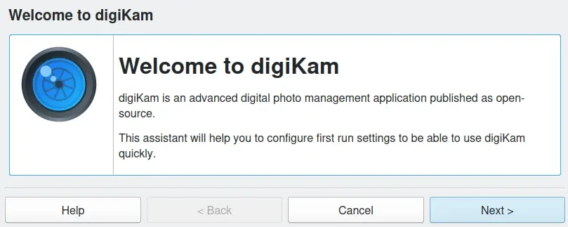

    Do Your First Steps in digiKam Photo Management Program

.. container:: toctile

    .. container:: tile no-descr

        :ref:`application_intro`

    .. container:: tile no-descr

        :ref:`application_install`

    .. container:: tile no-descr

        :ref:`quick_start`

    .. container:: tile no-descr

        :ref:`database_intro`

.. toctree::
   :maxdepth: 2
   :hidden:

   getting_started

###################
Supported Materials
###################
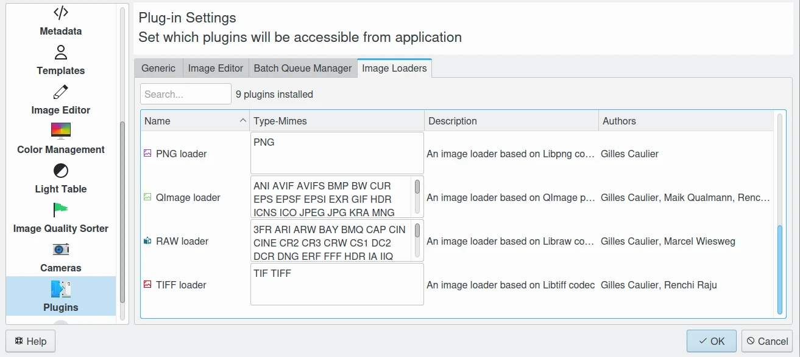

    File Formats and Devices Supported in digiKam

.. container:: toctile

    .. container:: tile no-descr

        :ref:`image_formats`

    .. container:: tile no-descr

        :ref:`movie_formats`

    .. container:: tile no-descr

        :ref:`camera_devices`

.. toctree::
   :maxdepth: 2
   :hidden:

   supported_materials

###########
Main Window
###########
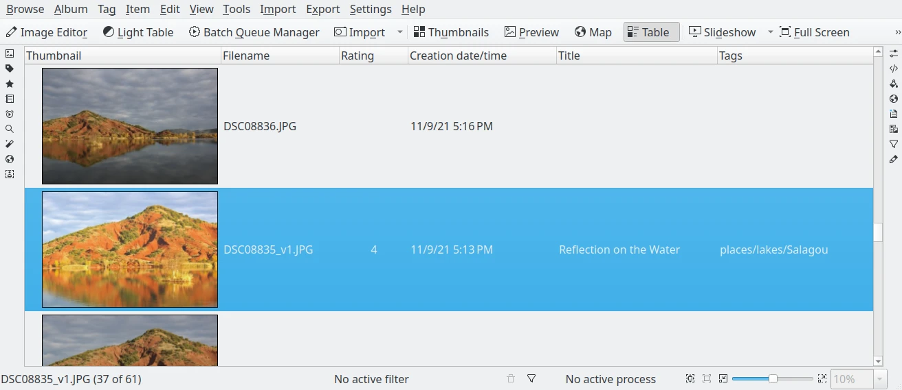

    Using the digiKam Main Window to Show Collection Contents

.. container:: toctile

    .. container:: tile no-descr

        :ref:`interface_layout`

    .. container:: tile no-descr

        :ref:`image_view`

    .. container:: tile no-descr

        :ref:`albums_view`

    .. container:: tile no-descr

        :ref:`tags_view`

    .. container:: tile no-descr

        :ref:`search_view`

    .. container:: tile no-descr

        :ref:`similarity_view`

    .. container:: tile no-descr

        :ref:`mapsearch_view`

    .. container:: tile no-descr

        :ref:`people_view`

.. toctree::
   :maxdepth: 2
   :hidden:

   main_window

#############
Right Sidebar
#############
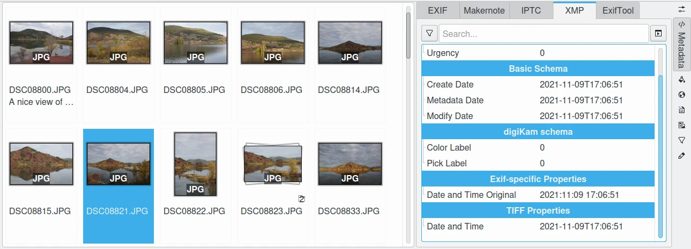

    Using the digiKam Right Sidebar to Play with Item Properties

.. container:: toctile

    .. container:: tile no-descr

        :ref:`sidebar_overview`

    .. container:: tile no-descr

        :ref:`properties_view`

    .. container:: tile no-descr

        :ref:`metadata_view`

    .. container:: tile no-descr

        :ref:`colors_view`

    .. container:: tile no-descr

        :ref:`maps_view`

    .. container:: tile no-descr

        :ref:`captions_view`

    .. container:: tile no-descr

        :ref:`versions_view`

    .. container:: tile no-descr

        :ref:`filters_view`

    .. container:: tile no-descr

        :ref:`tools_view`

.. toctree::
   :maxdepth: 2
   :hidden:

   right_sidebar

###########
Light Table
###########
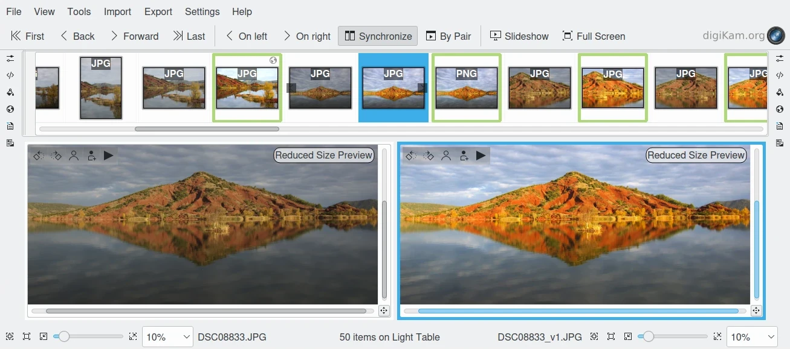

    Using the digiKam Light Table to Compare Items Side by Side

.. container:: toctile

    .. container:: tile no-descr

        :ref:`lighttable_overview`

    .. container:: tile no-descr

        :ref:`lighttable_advanced`

.. toctree::
   :maxdepth: 2
   :hidden:

   light_table

###################
Batch Queue Manager
###################
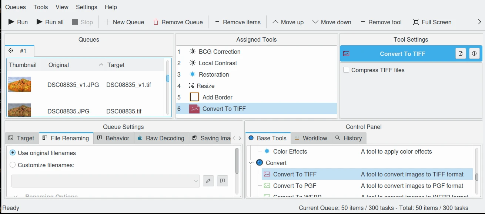

    Using the digiKam Batch Queue Manager To Process Items in Parallel

.. container:: toctile

    .. container:: tile no-descr

        :ref:`batchqueue_overview`

    .. container:: tile no-descr

        :ref:`raw_converter`

    .. container:: tile no-descr

        :ref:`base_tools`

    .. container:: tile no-descr

        :ref:`custom_script`

.. toctree::
   :maxdepth: 2
   :hidden:

   batch_queue

############
Import Tools
############
.. figure:: images/index_import_tools.webp
    :width: 300px
    :alt:
    :target: import_tools.html

    How to Import New Items in Your Collections With digiKam

.. container:: toctile

    .. container:: tile no-descr

        :ref:`import_overview`

    .. container:: tile no-descr

        :ref:`camera_import`

    .. container:: tile no-descr

        :ref:`advanced_import`

    .. container:: tile no-descr

        :ref:`scanner_import`

.. toctree::
   :maxdepth: 2
   :hidden:

   import_tools

########################
Digital Asset Management
########################
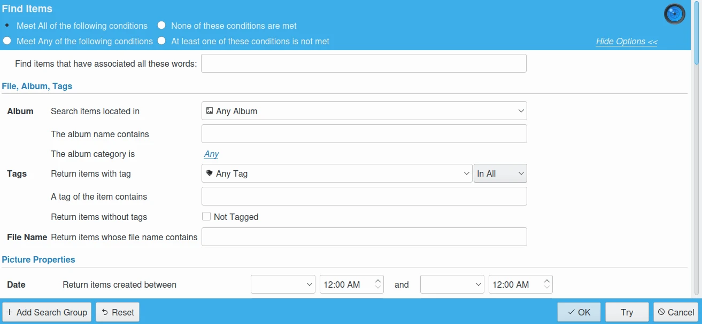

    Learn The Basis to Handle Safety Large Digital Photography Collections In Time

.. container:: toctile

    .. container:: tile no-descr

        :ref:`dam_overview`

    .. container:: tile no-descr

        :ref:`organize_find`

    .. container:: tile no-descr

        :ref:`authorship_copyright`

    .. container:: tile no-descr

        :ref:`data_protection`

    .. container:: tile no-descr

        :ref:`dam_workflow`

.. toctree::
   :maxdepth: 2
   :hidden:

   asset_management

################
Color Management
################
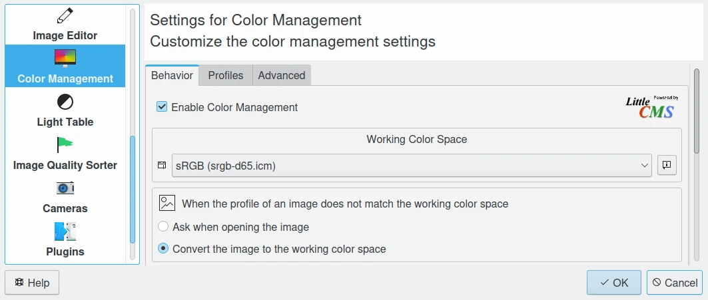

    Learn The Fundamental Rules of Color Management

.. container:: toctile

    .. container:: tile no-descr

        :ref:`basis_knowledge`

    .. container:: tile no-descr

        :ref:`working_space`

    .. container:: tile no-descr

        :ref:`monitor_profiles`

    .. container:: tile no-descr

        :ref:`camera_profiles`

    .. container:: tile no-descr

        :ref:`printer_profiles`

.. toctree::
   :maxdepth: 2
   :hidden:

   color_management

############
Image Editor
############
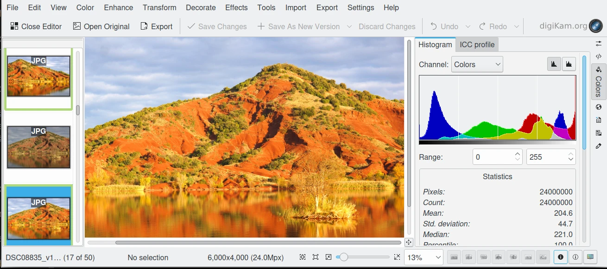

    Using digiKam to Edit and Improve Your Photographs

.. container:: toctile

    .. container:: tile no-descr

        :ref:`editor_overview`

    .. container:: tile no-descr

        :ref:`basic_operations`

    .. container:: tile no-descr

        :ref:`workflow_tools`

    .. container:: tile no-descr

        :ref:`colors_tools`

    .. container:: tile no-descr

        :ref:`enhancement_tools`

    .. container:: tile no-descr

        :ref:`transform_tools`

    .. container:: tile no-descr

        :ref:`decorate_tools`

    .. container:: tile no-descr

        :ref:`effects_tools`

.. toctree::
   :maxdepth: 2
   :hidden:

   image_editor

#################
Setup Application
#################
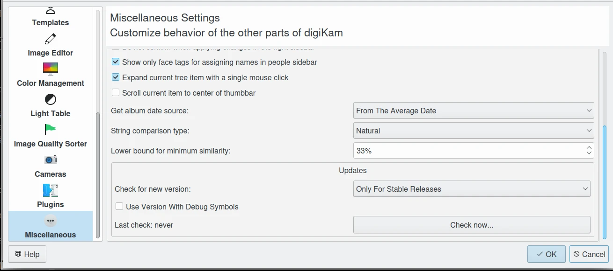

    Using the digiKam Configuration Panel to Customize Application

.. container:: toctile

    .. container:: tile no-descr

        :ref:`config_overview`

    .. container:: tile no-descr

        :ref:`database_settings`

    .. container:: tile no-descr

        :ref:`collections_settings`

    .. container:: tile no-descr

        :ref:`views_settings`

    .. container:: tile no-descr

        :ref:`tooltip_settings`

    .. container:: tile no-descr

        :ref:`metadata_settings`

    .. container:: tile no-descr

        :ref:`templates_settings`

    .. container:: tile no-descr

        :ref:`editor_settings`

    .. container:: tile no-descr

        :ref:`cm_settings`

    .. container:: tile no-descr

        :ref:`lighttable_settings`

    .. container:: tile no-descr

        :ref:`imgqsort_settings`

    .. container:: tile no-descr

        :ref:`camera_settings`

    .. container:: tile no-descr

        :ref:`plugins_settings`

    .. container:: tile no-descr

        :ref:`miscs_settings`

    .. container:: tile no-descr

        :ref:`theme_settings`

    .. container:: tile no-descr

        :ref:`shortcuts_settings`

.. toctree::
   :maxdepth: 2
   :hidden:

   setup_application

##################
Geolocation Editor
##################
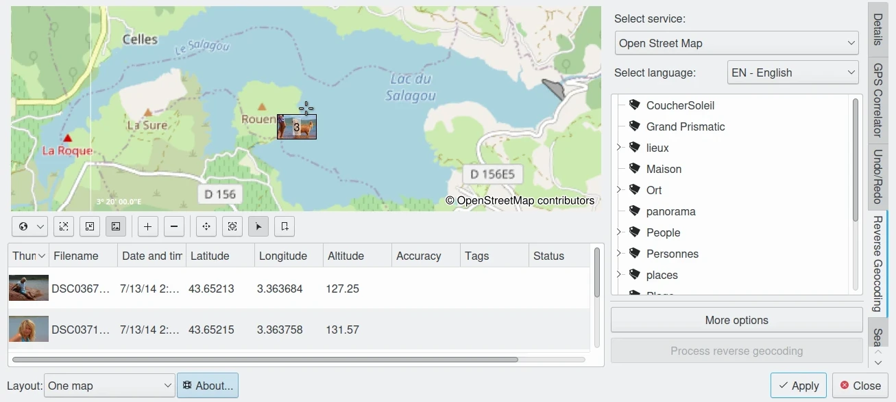

    Edit Geolocation Information to Search And Visualize Items on a Map

.. container:: toctile

    .. container:: tile no-descr

        :ref:`geoeditor_overview`

    .. container:: tile no-descr

        :ref:`geoeditor_map`

    .. container:: tile no-descr

        :ref:`geoeditor_coordinates`

    .. container:: tile no-descr

        :ref:`geoeditor_reverse`

    .. container:: tile no-descr

        :ref:`geoeditor_search`

    .. container:: tile no-descr

        :ref:`geoeditor_kmlexport`

.. toctree::
   :maxdepth: 2
   :hidden:

   geolocation_editor

#################
Maintenance Tools
#################
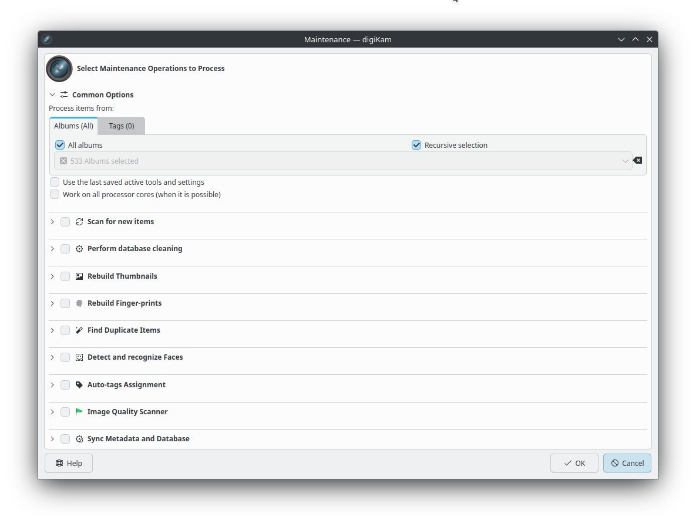

    Maintaining and Optimize Data From Your Collections

.. container:: toctile

    .. container:: tile no-descr

        :ref:`maintenance_overview`

    .. container:: tile no-descr

        :ref:`maintenance_common`

    .. container:: tile no-descr

        :ref:`maintenance_newitems`

    .. container:: tile no-descr

        :ref:`maintenance_database`

    .. container:: tile no-descr

        :ref:`maintenance_thumbnails`

    .. container:: tile no-descr

        :ref:`maintenance_fingerprints`

    .. container:: tile no-descr

        :ref:`maintenance_duplicates`

    .. container:: tile no-descr

        :ref:`maintenance_faces`

    .. container:: tile no-descr

        :ref:`maintenance_quality`

    .. container:: tile no-descr

        :ref:`maintenance_metadata`

.. toctree::
   :maxdepth: 2
   :hidden:

   maintenance_tools

###############
Post Processing
###############
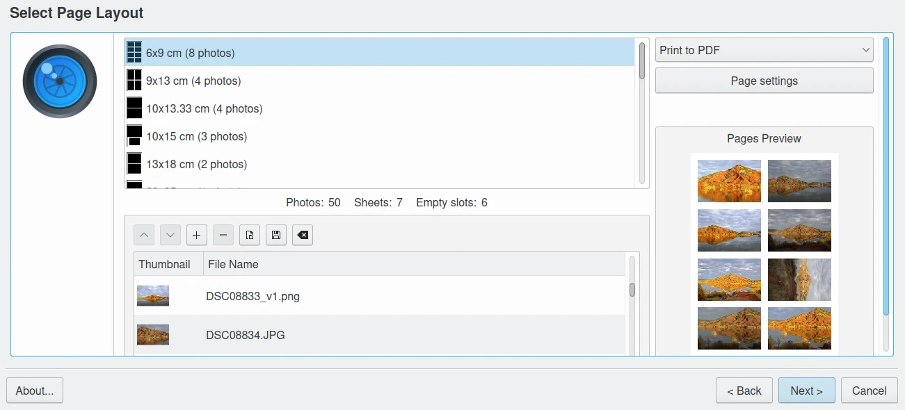

    Post Process Items From Your Collections

.. container:: toctile

    .. container:: tile no-descr

        :ref:`metadata_editor`

    .. container:: tile no-descr

        :ref:`html_gallery`

    .. container:: tile no-descr

        :ref:`media_server`

    .. container:: tile no-descr

        :ref:`send_images`

    .. container:: tile no-descr

        :ref:`print_creator`

.. toctree::
   :maxdepth: 2
   :hidden:

   post_processing

############
Export Tools
############
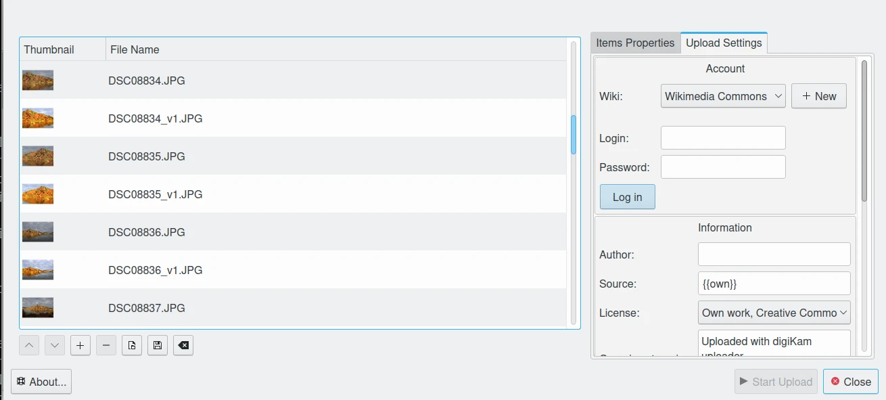

    Export Items From Your Collections To External Media

.. container:: toctile

    .. container:: tile no-descr

        :ref:`flickr_export`

.. toctree::
   :maxdepth: 2
   :hidden:

   export_tools

###############
Slideshow Tools
###############
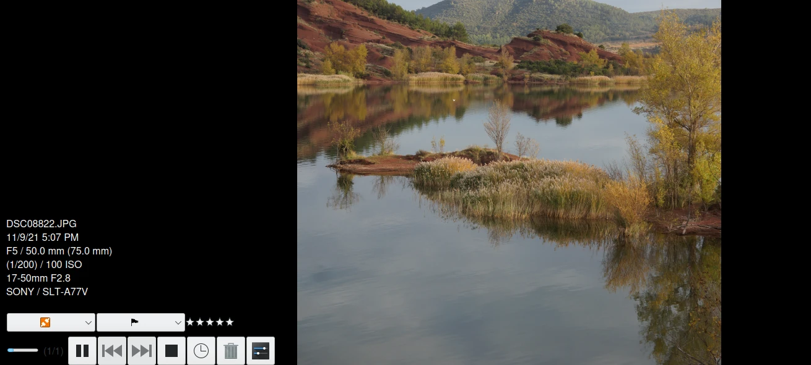

    How to Use Tools to Present Your Items

.. container:: toctile

    .. container:: tile no-descr

        :ref:`slide_tool`

    .. container:: tile no-descr

        :ref:`presentation_tool`

    .. container:: tile no-descr

        :ref:`opengl_viewer`

.. toctree::
   :maxdepth: 2
   :hidden:

   slideshow_tools

#################
Menu Descriptions
#################
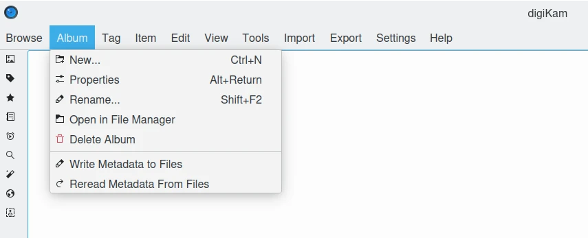

    Learn Details About All digiKam Menus

.. container:: toctile

    .. container:: tile no-descr

        :ref:`menu_mainwindow`

    .. container:: tile no-descr

        :ref:`menu_imageeditor`

.. toctree::
   :maxdepth: 2
   :hidden:

   menu_descriptions

###################
Credits and License
###################
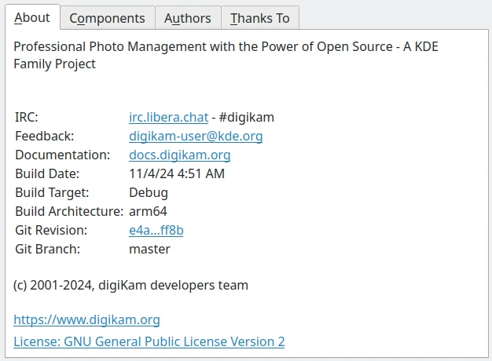

    Copyrights and Notices About This Document

.. container:: toctile

    .. container:: tile no-descr

        :ref:`credits_license`

.. toctree::
   :maxdepth: 2
   :hidden:

   credits_license
