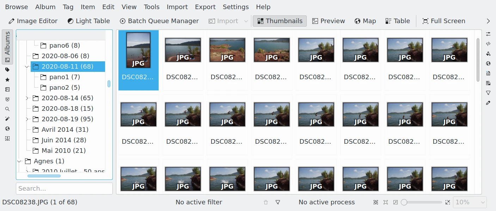

.. meta::
   :description: The digiKam User Manual
   :keywords: digiKam, documentation, user manual, photo management, open source, free, help, learn

.. metadata-placeholder

   :authors: - digiKam Team

   :license: see Credits and License page for details (https://docs.digikam.org/en/credits_license.html)

###############
digiKam Manual
###############

Welcome to the manual for `digiKam <https://www.digikam.org>`_, the free and open source photo management program.

You can download the current version of digiKam `here <https://www.digikam.org/download/>`_.

You can download this manual as an `EPUB <https://docs.digikam.org/en/epub/DigikamManual.epub>`_.

###############
Getting Started
###############
.. figure:: images/index_getting_started.webp
    :width: 300px
    :alt:
    :target: getting_started.html

    Your First Steps in the digiKam Photo Management Program

.. container:: toctile

    .. container:: tile no-descr

        :ref:`application_intro`

    .. container:: tile no-descr

        :ref:`application_install`

    .. container:: tile no-descr

        :ref:`quick_start`

    .. container:: tile no-descr

        :ref:`database_intro`

.. toctree::
   :maxdepth: 2
   :hidden:

   getting_started

###################
Supported Materials
###################
.. figure:: images/index_supported_materials.webp
    :width: 300px
    :alt:
    :target: supported_materials.html

    File Formats and Devices Supported in digiKam

.. container:: toctile

    .. container:: tile no-descr

        :ref:`image_formats`

    .. container:: tile no-descr

        :ref:`movie_formats`

    .. container:: tile no-descr

        :ref:`camera_devices`

.. toctree::
   :maxdepth: 2
   :hidden:

   supported_materials

###########
Main Window
###########
.. figure:: images/index_main_window.webp
    :width: 300px
    :alt:
    :target: main_window.html

    Using the digiKam Main Window to Show Collection Contents

.. container:: toctile

    .. container:: tile no-descr

        :ref:`interface_layout`

    .. container:: tile no-descr

        :ref:`image_view`

.. toctree::
   :maxdepth: 2
   :hidden:

   main_window

#############
Left Sidebar
#############

    Using the digiKam Left Sidebar to Display Views to Organize and Find Your Photos

.. container:: toctile

    .. container:: tile no-descr

        :ref:`albums_view`

    .. container:: tile no-descr

        :ref:`tags_view`

    .. container:: tile no-descr

        :ref:`labels_view`

    .. container:: tile no-descr

        :ref:`dates_view`

    .. container:: tile no-descr

        :ref:`timeline_view`

    .. container:: tile no-descr

        :ref:`search_view`

    .. container:: tile no-descr

        :ref:`similarity_view`

    .. container:: tile no-descr

        :ref:`mapsearch_view`

    .. container:: tile no-descr

        :ref:`people_view`

.. toctree::
   :maxdepth: 2
   :hidden:

   left_sidebar

#############
Right Sidebar
#############
.. figure:: images/index_right_sidebar.webp
    :width: 300px
    :alt:
    :target: right_sidebar.html

    Using the digiKam Right Sidebar to View Item Properties

.. container:: toctile

    .. container:: tile no-descr

        :ref:`sidebar_overview`

    .. container:: tile no-descr

        :ref:`properties_view`

    .. container:: tile no-descr

        :ref:`metadata_view`

    .. container:: tile no-descr

        :ref:`colors_view`

    .. container:: tile no-descr

        :ref:`maps_view`

    .. container:: tile no-descr

        :ref:`captions_view`

    .. container:: tile no-descr

        :ref:`versions_view`

    .. container:: tile no-descr

        :ref:`filters_view`

    .. container:: tile no-descr

        :ref:`tools_view`

.. toctree::
   :maxdepth: 2
   :hidden:

   right_sidebar

###########
Light Table
###########
.. figure:: images/index_light_table.webp
    :width: 300px
    :alt:
    :target: light_table.html

    Using the digiKam Light Table to Compare Items Side by Side

.. container:: toctile

    .. container:: tile no-descr

        :ref:`lighttable_overview`

    .. container:: tile no-descr

        :ref:`lighttable_operation`

    .. container:: tile no-descr

        :ref:`lighttable_advanced`

.. toctree::
   :maxdepth: 2
   :hidden:

   light_table

###################
Batch Queue Manager
###################
.. figure:: images/index_batch_queue.webp
    :width: 300px
    :alt:
    :target: batch_queue.html

    Using the digiKam Batch Queue Manager To Process Items in Parallel

.. container:: toctile

    .. container:: tile no-descr

        :ref:`batchqueue_overview`

    .. container:: tile no-descr

        :ref:`queue_settings`

    .. container:: tile no-descr

        :ref:`bqm_workflow`

    .. container:: tile no-descr

        :ref:`base_tools`

    .. container:: tile no-descr

        :ref:`raw_converter`

    .. container:: tile no-descr

        :ref:`dng_converter`

    .. container:: tile no-descr

        :ref:`metadata_tools`

    .. container:: tile no-descr

        :ref:`custom_script`

    .. container:: tile no-descr

        :ref:`watermark_tool`

.. toctree::
   :maxdepth: 2
   :hidden:

   batch_queue

############
Import Tools
############
.. figure:: images/index_import_tools.webp
    :width: 300px
    :alt:
    :target: import_tools.html

    How to Import New Items into Your digiKam Collections

.. container:: toctile

    .. container:: tile no-descr

        :ref:`import_overview`

    .. container:: tile no-descr

        :ref:`camera_import`

    .. container:: tile no-descr

        :ref:`advanced_import`

    .. container:: tile no-descr

        :ref:`scanner_import`

    .. container:: tile no-descr

        :ref:`remote_import`

    .. container:: tile no-descr

        :ref:`google_import`

    .. container:: tile no-descr

        :ref:`smugmug_import`

.. toctree::
   :maxdepth: 2
   :hidden:

   import_tools

########################
Digital Asset Management
########################
.. figure:: images/index_asset_management.webp
    :width: 300px
    :alt:
    :target: asset_management.html

    Learn to Safely Handle Large Digital Photography Collections

.. container:: toctile

    .. container:: tile no-descr

        :ref:`dam_overview`

    .. container:: tile no-descr

        :ref:`organize_find`

    .. container:: tile no-descr

        :ref:`authorship_copyright`

    .. container:: tile no-descr

        :ref:`data_protection`

    .. container:: tile no-descr

        :ref:`dam_workflow`

.. toctree::
   :maxdepth: 2
   :hidden:

   asset_management

################
Color Management
################
.. figure:: images/index_color_management.webp
    :width: 300px
    :alt:
    :target: color_management.html

    Learn The Fundamental Rules of Color Management

.. container:: toctile

    .. container:: tile no-descr

        :ref:`color_management_basis`

    .. container:: tile no-descr

        :ref:`working_space`

    .. container:: tile no-descr

        :ref:`camera_profiles`

    .. container:: tile no-descr

        :ref:`monitor_profiles`

    .. container:: tile no-descr

        :ref:`printer_profiles`

.. toctree::
   :maxdepth: 2
   :hidden:

   color_management

############
Image Editor
############
.. figure:: images/index_image_editor.webp
    :width: 300px
    :alt:
    :target: image_editor.html

    Using digiKam to Edit and Improve Your Photographs

.. container:: toctile

    .. container:: tile no-descr

        :ref:`editor_overview`

    .. container:: tile no-descr

        :ref:`basic_operations`

    .. container:: tile no-descr

        :ref:`workflow_tools`

    .. container:: tile no-descr

        :ref:`colors_tools`

    .. container:: tile no-descr

        :ref:`enhancement_tools`

    .. container:: tile no-descr

        :ref:`transform_tools`

    .. container:: tile no-descr

        :ref:`decorate_tools`

    .. container:: tile no-descr

        :ref:`effects_tools`

.. toctree::
   :maxdepth: 2
   :hidden:

   image_editor

#################
Setup Application
#################
.. figure:: images/index_setup_application.webp
    :width: 300px
    :alt:
    :target: setup_application.html

    Using the Configuration Panel to Customize digiKam

.. container:: toctile

    .. container:: tile no-descr

        :ref:`config_overview`

    .. container:: tile no-descr

        :ref:`database_settings`

    .. container:: tile no-descr

        :ref:`collections_settings`

    .. container:: tile no-descr

        :ref:`views_settings`

    .. container:: tile no-descr

        :ref:`tooltip_settings`

    .. container:: tile no-descr

        :ref:`metadata_settings`

    .. container:: tile no-descr

        :ref:`templates_settings`

    .. container:: tile no-descr

        :ref:`editor_settings`

    .. container:: tile no-descr

        :ref:`cm_settings`

    .. container:: tile no-descr

        :ref:`lighttable_settings`

    .. container:: tile no-descr

        :ref:`geolocation_settings`

    .. container:: tile no-descr

        :ref:`camera_settings`

    .. container:: tile no-descr

        :ref:`plugins_settings`

    .. container:: tile no-descr

        :ref:`miscs_settings`

    .. container:: tile no-descr

        :ref:`theme_settings`

    .. container:: tile no-descr

        :ref:`languages_settings`

    .. container:: tile no-descr

        :ref:`toolbars_settings`

    .. container:: tile no-descr

        :ref:`notifications_settings`

    .. container:: tile no-descr

        :ref:`shortcuts_settings`

.. toctree::
   :maxdepth: 2
   :hidden:

   setup_application

##################
Geolocation Editor
##################
.. figure:: images/index_geolocation_editor.webp
    :width: 300px
    :alt:
    :target: geolocation_editor.html

    Edit Geolocation Information to Search and Visualize Items on a Map

.. container:: toctile

    .. container:: tile no-descr

        :ref:`geoeditor_overview`

    .. container:: tile no-descr

        :ref:`geoeditor_map`

    .. container:: tile no-descr

        :ref:`geoeditor_coordinates`

    .. container:: tile no-descr

        :ref:`geoeditor_reverse`

    .. container:: tile no-descr

        :ref:`geoeditor_search`

    .. container:: tile no-descr

        :ref:`geoeditor_kmlexport`

.. toctree::
   :maxdepth: 2
   :hidden:

   geolocation_editor

#################
Maintenance Tools
#################
.. figure:: images/index_maintenance_tools.webp
    :width: 300px
    :alt:
    :target: maintenance_tools.html

    Maintaining and Optimizing Data for Your Collections

.. container:: toctile

    .. container:: tile no-descr

        :ref:`maintenance_overview`

    .. container:: tile no-descr

        :ref:`maintenance_common`

    .. container:: tile no-descr

        :ref:`maintenance_newitems`

    .. container:: tile no-descr

        :ref:`maintenance_database`

    .. container:: tile no-descr

        :ref:`maintenance_thumbnails`

    .. container:: tile no-descr

        :ref:`maintenance_fingerprints`

    .. container:: tile no-descr

        :ref:`maintenance_duplicates`

    .. container:: tile no-descr

        :ref:`maintenance_faces`

    .. container:: tile no-descr

        :ref:`maintenance_autotags`

    .. container:: tile no-descr

        :ref:`maintenance_quality`

    .. container:: tile no-descr

        :ref:`maintenance_metadata`

.. toctree::
   :maxdepth: 2
   :hidden:

   maintenance_tools

###############
Post Processing
###############
.. figure:: images/index_post_processing.webp
    :width: 300px
    :alt:
    :target: post_processing.html

    Post Process Items from Your Collections

.. container:: toctile

    .. container:: tile no-descr

        :ref:`metadata_editor`

    .. container:: tile no-descr

        :ref:`html_gallery`

    .. container:: tile no-descr

        :ref:`media_server`

    .. container:: tile no-descr

        :ref:`send_images`

    .. container:: tile no-descr

        :ref:`print_creator`

    .. container:: tile no-descr

        :ref:`time_adjust`

    .. container:: tile no-descr

        :ref:`pano_creator`

    .. container:: tile no-descr

        :ref:`calendar_tool`

    .. container:: tile no-descr

        :ref:`mjpeg_stream`

    .. container:: tile no-descr

        :ref:`expo_blending`

    .. container:: tile no-descr

        :ref:`video_slideshow`

    .. container:: tile no-descr

        :ref:`wall_paper`

    .. container:: tile no-descr

        :ref:`ocrtext_converter`

    .. container:: tile no-descr

        :ref:`jalbum_export`

    .. container:: tile no-descr

        :ref:`mosaicwall_tool`

.. toctree::
   :maxdepth: 2
   :hidden:

   post_processing

############
Export Tools
############
.. figure:: images/index_export_tools.webp
    :width: 300px
    :alt:
    :target: export_tools.html

    Export Items from Your Collections to External Media

.. container:: toctile

    .. container:: tile no-descr

        :ref:`flickr_export`

    .. container:: tile no-descr

        :ref:`google_export`

    .. container:: tile no-descr

        :ref:`media_wiki`

    .. container:: tile no-descr

        :ref:`inaturalist_export`

    .. container:: tile no-descr

        :ref:`twitter_export`

    .. container:: tile no-descr

        :ref:`imgur_export`

    .. container:: tile no-descr

        :ref:`pinterest_export`

    .. container:: tile no-descr

        :ref:`dropbox_export`

    .. container:: tile no-descr

        :ref:`box_export`

    .. container:: tile no-descr

        :ref:`one_drive`

    .. container:: tile no-descr

        :ref:`smugmug_export`

    .. container:: tile no-descr

        :ref:`image_shack`

    .. container:: tile no-descr

        :ref:`piwigo_export`

    .. container:: tile no-descr

        :ref:`file_transfer`

    .. container:: tile no-descr

        :ref:`local_export`

.. toctree::
   :maxdepth: 2
   :hidden:

   export_tools

###############
Slideshow Tools
###############
.. figure:: images/index_slideshow_tools.webp
    :width: 300px
    :alt:
    :target: slideshow_tools.html

    How to Use Tools to Present Your Items

.. container:: toctile

    .. container:: tile no-descr

        :ref:`slide_tool`

    .. container:: tile no-descr

        :ref:`presentation_tool`

    .. container:: tile no-descr

        :ref:`opengl_viewer`

.. toctree::
   :maxdepth: 2
   :hidden:

   slideshow_tools

########
Showfoto
########
.. figure:: images/index_showfoto_editor.webp
    :width: 300px
    :alt:
    :target: showfoto_editor.html

    Showfoto is a Stand Alone Version of the digiKam Image Editor

.. container:: toctile

    .. container:: tile no-descr

        :ref:`showfoto_overview`

    .. container:: tile no-descr

        :ref:`showfoto_differences`

    .. container:: tile no-descr

        :ref:`showfoto_leftsidebar`

    .. container:: tile no-descr

        :ref:`showfoto_setup`

    .. container:: tile no-descr

        :ref:`showfoto_tools`

.. toctree::
   :maxdepth: 2
   :hidden:

   showfoto_editor

#################
Menu Descriptions
#################
.. figure:: images/index_menu_descriptions.webp
    :width: 300px
    :alt:
    :target: menu_descriptions.html

    Learn About All digiKam Menus

.. container:: toctile

    .. container:: tile no-descr

        :ref:`menu_mainwindow`

    .. container:: tile no-descr

        :ref:`menu_imageeditor`

    .. container:: tile no-descr

        :ref:`menu_batchqueue`

    .. container:: tile no-descr

        :ref:`menu_lighttable`

    .. container:: tile no-descr

        :ref:`menu_importtool`

    .. container:: tile no-descr

        :ref:`menu_showfoto`

.. toctree::
   :maxdepth: 2
   :hidden:

   menu_descriptions

###################
Credits and License
###################
.. figure:: images/index_credits_license.webp
    :width: 300px
    :alt:
    :target: credits_license.html

    Copyrights and Notices for this Document

.. container:: toctile

    .. container:: tile no-descr

        :ref:`credits_license`

.. toctree::
   :maxdepth: 2
   :hidden:

   credits_license

############
Get Involved
############
.. figure:: images/index_get_involved.webp
    :width: 300px
    :alt:
    :target: get_involved.html

    Contribute to the digiKam project

.. container:: toctile

    .. container:: tile no-descr

        :ref:`get_involved`

.. toctree::
   :maxdepth: 2
   :hidden:

   get_involved
