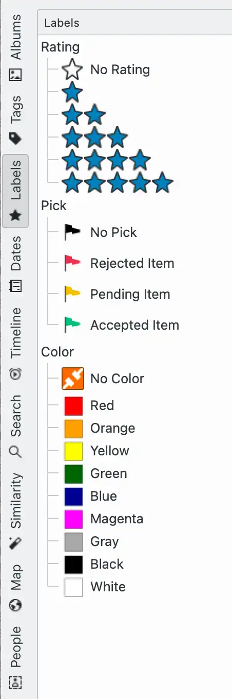

.. meta::
   :description: Using the digiKam Left Sidebar to Display Views to Organize and Find Your Photos
   :keywords: digiKam, documentation, user manual, photo management, open source, free, help, learn, sidebar, search, tags, labels, maps, date, timeline, similarity, face

.. metadata-placeholder

   :authors: - digiKam Team

   :license: see Credits and License page for details (https://docs.digikam.org/en/credits_license.html)

.. _left_sidebar:

#############
Left Sidebar
#############

This section explains how to use the digiKam left sidebar.

.. toctree::
   :maxdepth: 2
   :caption: Contents:
   :glob:

   left_sidebar/albums_view.rst
   left_sidebar/tags_view.rst
   left_sidebar/labels_view.rst
   left_sidebar/dates_view.rst
   left_sidebar/timeline_view.rst
   left_sidebar/search_view.rst
   left_sidebar/similarity_view.rst
   left_sidebar/mapsearch_view.rst
   left_sidebar/people_view.rst
