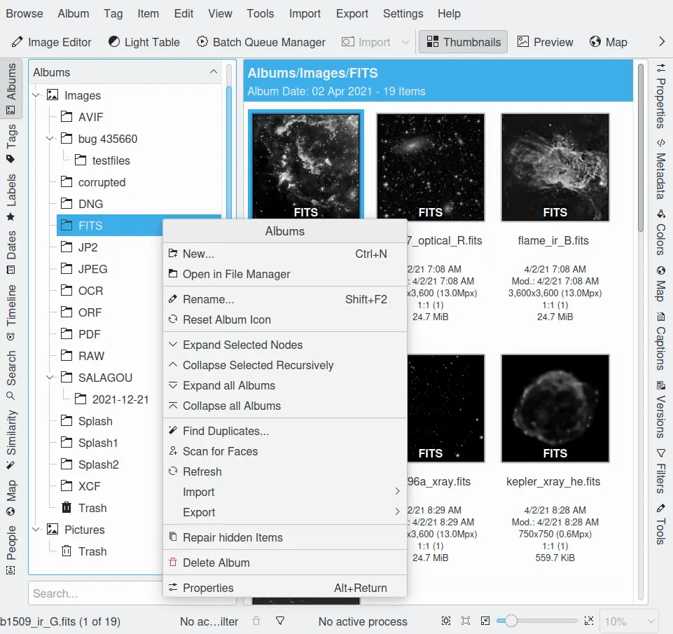
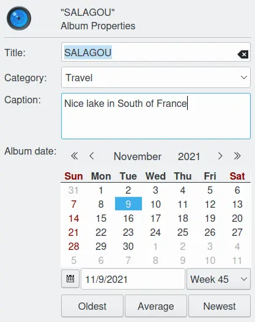

.. meta::
   :description: digiKam Main Window Albums View
   :keywords: digiKam, documentation, user manual, photo management, open source, free, learn, easy, album, properties, creating, moving

.. metadata-placeholder

   :authors: - digiKam Team

   :license: see Credits and License page for details (https://docs.digikam.org/en/credits_license.html)

.. _albums_view:

Albums View
===========

.. contents::

Overview
--------

    The digiKam Main Window Album-View

Clicking the **Albums** tab on the left side bar displays (or hides) the Albums View that provides an organized listing of collections, albums, and photographs. digiKam organizes one or more collections of albums of photographs, based on a folder structure on your hard disk, removable media or network shares. Collections are the top level folders. Each collection folder can contain subfolders that are called Albums. And the actual photographs are stored within the Album folders.

The top item in the Albums View is called Albums and just shows the **Welcome to digiKam** screen in the view area. The next level of the Albums tree shows your different Collections (marked by the icon |icon_collection|). digiKam always lists at least one collection, but you can add more in the **Collections** section of the  :menuselection:`Settings --> Configure digiKam...` menu. The lower levels of the Albums tree list the Albums in each Collection, and the photographs in each Album.

The albums can be sorted by their folder layout on the hard disk, by the Category that has been set in the :ref:`Album Properties <managing_albums>` or by the Date of each Album (this date can also be changed in the Properties of each Album). You can invert the sort order (ascending/descending) by clicking on the title bar of the Album tree.

You can switch between these sort orders using **Sort Albums** from the **View** menu.

.. note::

      An Album can only be in one Album Collection and Album Collections cannot be nested.

.. _creating_album:

Creating a New Album
--------------------

There are a number of ways to create a new Album. You can create a new Album when you upload new photographs from the Camera using :menuselection:`Import --> Cameras`. You can create a new empty Album with :menuselection:`Album --> New...` :kbd:`Ctrl+N` in the Albums view. You can also create a new Album by importing an existing folder of photographs from your computer; just select :menuselection:`Import --> Add Folders...` from the menu bar and select the folder that you want to import. An Album will be created with the same name as the hard disk folder. You can use drag and drop to import a folder. Drag a folder icon, using your preferred file-manager, then drop it on the Albums list on the left. A menu will then appear giving you the option to move or copy the folder into digiKam.

.. note::

    Each album is hosted in a collection root path registered in the database. If the permissions for the collection folder have changed or if the collection the collection folder is not accessible (for example due to the absence of removable media), then no new album can be created. In this case, check the collection properties in :ref:`the digiKam setup dialog <collections_settings>`.

.. important::

    File locking in Windows can introduce time latencies that lead to issues. digiKam uses low level file management with the Qt framework that cannot handle locked files. The following conditions must be met to assure there are no problems with digiKam:

        - Album monitoring in digiKam must be deactivated. See the :ref:`Collection Settings <collections_settings>` for details.
        - Folders must not be part of a Windows file or network share.
        - Folders or pictures must not be open in other programs that lock file and folder access such as Explorer.

.. _deleting_album:

Deleting an Album
-----------------

To delete an Album, click with the right mouse button over the Album in the Albums tree and select **Delete Album** from the context menu.

Albums deleted from digiKam are moved into the internal Trash Can. There is an option to change this behavior, so that delete will remove the Album and all of the photographs in it. This behavior can be changed by first selecting :menuselection:`Settings --> Configure digiKam...` , then selecting the **Miscellaneous** page. At the top of this page are the settings that control what happens when a photograph is deleted.

.. _adding_photograph:

Adding a Photograph to an Album
-------------------------------

Most of the time you will create new Albums and populate them with photographs directly from your camera using the Camera Tool. However, sometimes you may want to add a photograph that you already have on your computer to an existing Album. To add a photograph to an Album select :menuselection:`Import --> Add Images...` :kbd:`Alt+Shift+I` from the menu bar. Select a source folder from the dialog and click OK. An import window will open. Select the photographs that you want to add and choose **Download Selected** from the **Download** drop down menu. A dialog will open allowing you to select the destination album. The photographs will be copied into the selected Album. **Download New** :kbd:`Ctrl+N` from the same menu will copy only those images which are not yet in the destination folder.

You can also use drag and drop to import photographs. Drag the photograph icons using your preferred file manager. Then drop those icons onto the image list in the Right Sidebar.

If you have a scanner configured, you can also scan a photograph straight into an Album. Select menu entry :menuselection:`Import --> Import from Scanner...`.

.. _moving_copying:

Moving or Copying Photographs
-----------------------------

Between Albums
~~~~~~~~~~~~~~

Simply drag a photograph and drop it on the destination Album to move or copy it from one Album to another. A menu will appear that gives you the option to **Move** or **Copy** the photograph. You can move or copy multiple photographs the same way, just select all the photographs that you want to move and drag them on to the destination Album.

With Other Applications
~~~~~~~~~~~~~~~~~~~~~~~

You can also drag and drop photographs into other applications. The general behavior will be the same as copying between albums, but differences will occur depending on what information the target program takes from the clipboard. Copying a photograph into a text editor will paste the full file path for that picture. Copying a photograph into word processor is likely to insert the image into itself.

.. _managing_albums:

Managing Albums
---------------

Album Properties can help you remember which kind of photographs are in an Album and can also help you to organize the Albums tree. To access the Album Properties, click with the right mouse button on an Album and select **Properties** :kbd:`Alt+Enter` from the context menu.

    The digiKam Album Properties Dialog

The Album Properties dialog allows you to set:

    - The Album **Title**: Name of the Album, identical with the name of the folder on your hard disk. If you edit it here, the folder will also be renamed.

    - The Album **Category**: This is a way of grouping your Albums together by a common label. The Category you set will be used to order your albums when you select **By Category** from the drop down box in the tool bar or using :menuselection:`View --> Sort Albums --> By Category`. If you want to add and delete Category labels, choose from the menu entry :menuselection:`Settings --> Configure digiKam... --> Views page --> Categories tab`.

    - The **Caption** for the Album: Usually a short description of the content, but of course you are free to abuse it in any conceivable way. But beware: this will be shown in the banner at the top of the main Image Window ;-)

    - The Album **Date**: This will be used when you order your Albums by date using :menuselection:`View --> Sort Albums --> By Date`.

    - **Oldest**, **Average**, and **Newest** buttons: These will set the **Date** to the oldest, average or latest date of the images in that album. It will first try to calculate the average date of the images in the album based on the Exif-headers. If that fails it will fall back to the modification date of the files in that folder.

.. _album_icon:

Setting the Album Icon
----------------------

digiKam defaults to displaying the usual folder icon in the Albums list, but you can choose one of your photographs instead. This may help you to remember what kind of photographs are contained in each Album.

To select a photograph as the Album icon, click with the right mouse button on the photograph that you want to use as the Album icon and select **Set as Album Thumbnail** from the context menu. Additionally you can use drag and drop to set the Album icon. Drag the photograph's icon from the thumbnail area and drop it on the currently selected Album in the Album list.

.. note::

      digiKam also supports tagging individual photographs. Album Categories are different from photograph tagging because the Album Category applies to all the photographs in an Album rather than to individual photographs. You can use both Album Category and tagging to organize your photographs.
