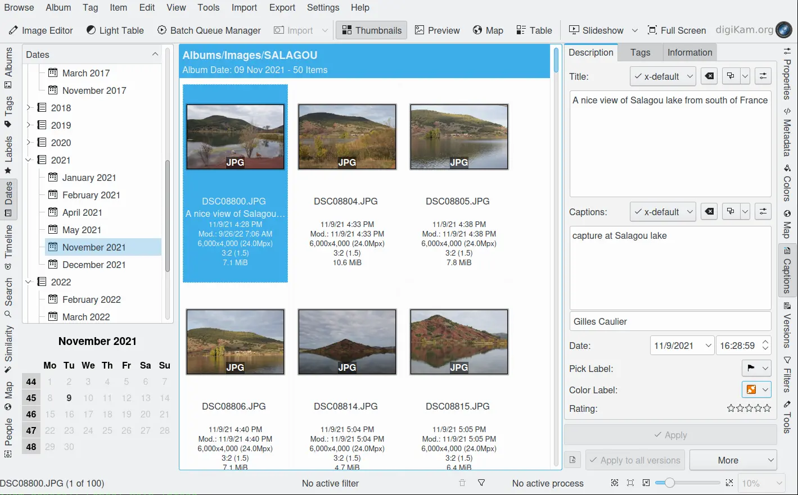

.. meta::
   :description: digiKam Main Window Dates View
   :keywords: digiKam, documentation, user manual, photo management, open source, free, learn, easy, dates, calendar, months, weeks, years

.. metadata-placeholder

   :authors: - digiKam Team

   :license: see Credits and License page for details (https://docs.digikam.org/en/credits_license.html)

.. _dates_view:

:ref:`Dates View <left_sidebar>`
================================

    The digiKam Date View from Left sidebar

The Dates View organizes your photographs based on the date of the photograph. digiKam uses either the Exif date or, if no Exif date is available, the last modification time of the file.

When you select a month from the list, all images from that month are displayed in the icon-View. You can select days or weeks in the calendar at the bottom of the Left Sidebar to show only the images from the selected dates.
