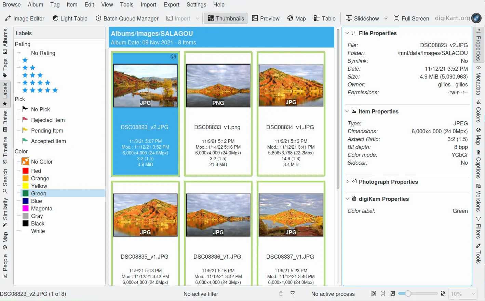
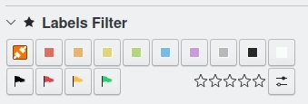

.. meta::
   :description: digiKam Main Window Labels View
   :keywords: digiKam, documentation, user manual, photo management, open source, free, learn, easy, labels, rating, colors, pick

.. metadata-placeholder

   :authors: - digiKam Team

   :license: see Credits and License page for details (https://docs.digikam.org/en/credits_license.html)

.. _labels_view:

Labels View
-----------

    The digiKam Labels View from Left Sidebar

The Labels View allows you to select photographs by the **Rating**, **Pick** and **Color** Labels you assigned to them previously either by using:

    - The context menu of a thumbnail.

    .. figure:: images/mainwindow_labels_context_menu.webp
        :alt:
        :align: center

        The digiKam Icon-View Context Menu and Labels Options

    - The **Description** tab of the **Captions** section on the Right Sidebar.

    .. figure:: images/mainwindow_labels_captions_tab.webp
        :alt:
        :align: center

        The digiKam Labels Options from Captions Right Sidebar Tab

You may select more than one label by :kbd:`Ctrl+left` click. The selected labels are connected by boolean AND, e.g. selecting Four Star and Yellow will display only photographs that have both labels assigned. You can perform even more sophisticated searches by using the **Filters** section of the :ref:`Right Sidebar <filters_view>`.

    The digiKam Labels Filter from Right Sidebar

.. note::

    The **Pick Labels** properties can be assigned automatically using the deep-learning tool **Image Quality Sorter** which works by analyzing the aesthetic score of items. See the :ref:`Maintenance Tool section <maintenance_quality>` for details.

The **Rating** and **Color** Labels can be used to sort items from your collection during your asset management workflow. See :ref:`this section <rating_ranking>` for details.
