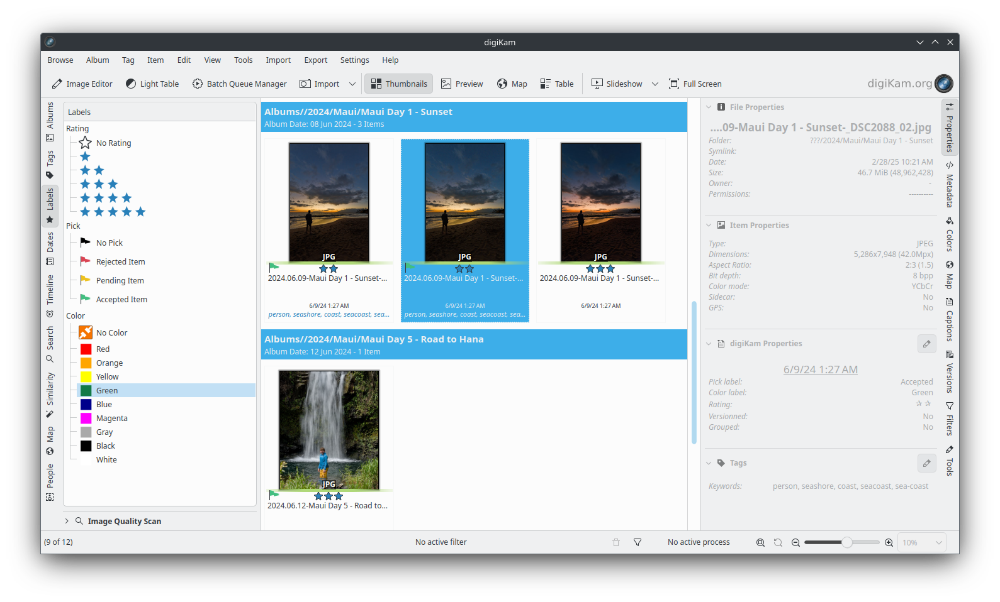

.. meta::
   :description: digiKam Main Window Labels View
   :keywords: digiKam, documentation, user manual, photo management, open source, free, learn, easy, labels, rating, colors, pick

.. metadata-placeholder

   :authors: - digiKam Team

   :license: see Credits and License page for details (https://docs.digikam.org/en/credits_license.html)

.. _labels_view:

:ref:`Labels View <left_sidebar>`
=================================

.. contents::

.. _labels_selection:

Label Selection
---------------

The Labels View allows you to select photographs by the **Rating**, **Pick** and **Color** Labels assigned to the image. 
    - **Ratings** are displayed by stars.
    - **Picks** are displayed by flags.
    - **Colors** are displayed by colored line under the image.

    The digiKam Labels View of Left Sidebar

To filter your collection based on a label, click on a label in the left sidebar. All images with a matching label will be displayed in the main view. To remove the filter, click on the label header of the label you want to remove, such as Rating, Pick, or Color.

You may select more than one label by :kbd:`Ctrl+left` click. The selected labels within the same type are connected by boolean OR, e.g. selecting Three Stars and Four Stars will display all photographs that have either label assigned. Different types of labels are connected by boolean AND, e.g. selecting Four Stars and Yellow will display only photographs that have both labels assigned. You can perform even more sophisticated searches by using the **Filters** section of the :ref:`Right Sidebar <filters_view>`.

    The digiKam Labels left sidebar

Using the image above as an example, digiKam will display all images Rated 3 OR 4 stars, AND with a Pick label of Pending OR Accepted. A color label was not selected, so all color labels are included in the search, including images with no color label assigned.

.. tip::
    The **Rating** and **Color** Labels can be used to sort items from your collection during your asset management workflow. See :ref:`this section <rating_ranking>` for details.

.. _labels_assignment:

Assigning Labels
----------------

There are two ways to assign labels to your photographs:

    - Right-clicking on an image or a thumbnail displays the context menu of a thumbnail. From the context menu, you can assign a **Rating**, **Pick**, or **Color** label.

    .. figure:: images/left_sidebar_labels_context_menu.webp
        :alt:
        :align: center

        The digiKam Icon-View Context Menu and Labels Options

    - The **Description** tab of the **Captions** section of the Right Sidebar.

    .. figure:: images/left_sidebar_labels_captions_tab.webp
        :alt:
        :align: center

        The digiKam Labels Options from Captions Right Sidebar Tab

.. _label_imagescan:

Automatically Assigning Pick Labels
-----------------------------------

digiKam can automatically assign **Pick Labels** to your images using the **Image Quality Scan** tool in the Labels View. The Image Quality Scan tool assess images using either a deep-learning neural network, or by using basic aesthetic factors. After scanning an image, digiKam will assign a **Pick Label** based on the quality of the image and the options you have selected in the **Settings** tab.

    - The **Red** flag for **Rejected**.

    - The **Yellow** flag for **Pending**.

    - The **Green** flag for **Accepted**.

To access the Image Quality Scan tool, click on **Image Quality Scan** at the bottom of the Labels View to expand the tool.

.. _labels_search_in_tab:

Search-in Tab
-------------

The **Search-in** tab lets you choose which albums and image tags to include in a scan.

    The digiKam Image Quality Scan Search-in View

.. _labels_settings_tab:

Settings Tab
------------

The **Settings** tab lets you control how the Image Quality Scan tool sets the **Pick** label. 

    The digiKam Image Quality Scan Settings View

Scan Mode:
~~~~~~~~~~

    - **All**: Scan all images in the selected albums and tags.
    - **Non-Assigned Only**: Scan only images that do not already have a Pick label in the selected albums and tags.

Assign labels:
~~~~~~~~~~~~~~

    - Select which pick labels to assign to images. This is useful for letting digiKam automatically reject images that do not meet your quality standards, but still allow you to manually assign the other labels. Un-checking all three options renders the Image Quality Scanner functionally useless.

Quality Engine:
~~~~~~~~~~~~~~~

    - **Detect Aesthetic Contents**: Uses the deep-learning neural network to assess the aesthetic quality of images.
    - **Detect by Basic Factors**: Uses basic factors such as blur, noise, and exposure to assess image quality.

**Detect Aesthetic Contents** uses an artificial intelligence engine based on `this model <https://expertphotography.com/aesthetic-photography/>`_ to predict an aesthetic score. As deep-learning is an end-to-end solution, it doesn’t require hyper-parameter settings, which makes this approach far easier to use.

.. important::

   The **Detect Aesthetic Contents** option needs to download the deep-learning model from the web. This file can either be downloaded when digiKam is first run (see :ref:`the Quick Start section <quick_start>` for details), or the file can be downloaded by clicking on the **Download required binary data** button on the :menuselection:`Settings --> Miscellaneous --> System` page.

Work on all processor cores
~~~~~~~~~~~~~~~~~~~~~~~~~~~

The Image Quality Scan can be a time-consuming task depending on the size of your library and filtering selected in **Search-in**. It is recommended to use all processor cores.  This will make the process run faster, but it can potentially make other processes run slower and make your computer feel unresponsive while images are being processed. You can uncheck **Work on all processor cores** if your machine is slow and you want to perform other tasks while the scan is running.

.. tip::
   Because of technical limitations on Windows, multi-core support for MySQL/MariaDB databases does not perform well. For better performance, we recommend using a SQLite database instead.

Basic Factors Tab
-----------------

The **Basic Factors** tab lets you control how the selected qualities influence the rating the **Pick** label. The basic factors are only used when the **Quality Engine** is set to **Detect by Basic Factors**.

    The digiKam Image Quality Scan Basic Factors View

The **Basic Factors** method uses four basic factors to rate each image: **Blur, Noise, Exposure, and Compression**. Using basic factors, however, requires fine-tuning by the user and it does not include any assessment of the aesthetic value of the image. Un-checking all four options in **Basic Factors** mode renders the Image Quality Scanner functionally useless.