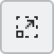
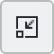
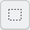
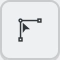
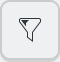
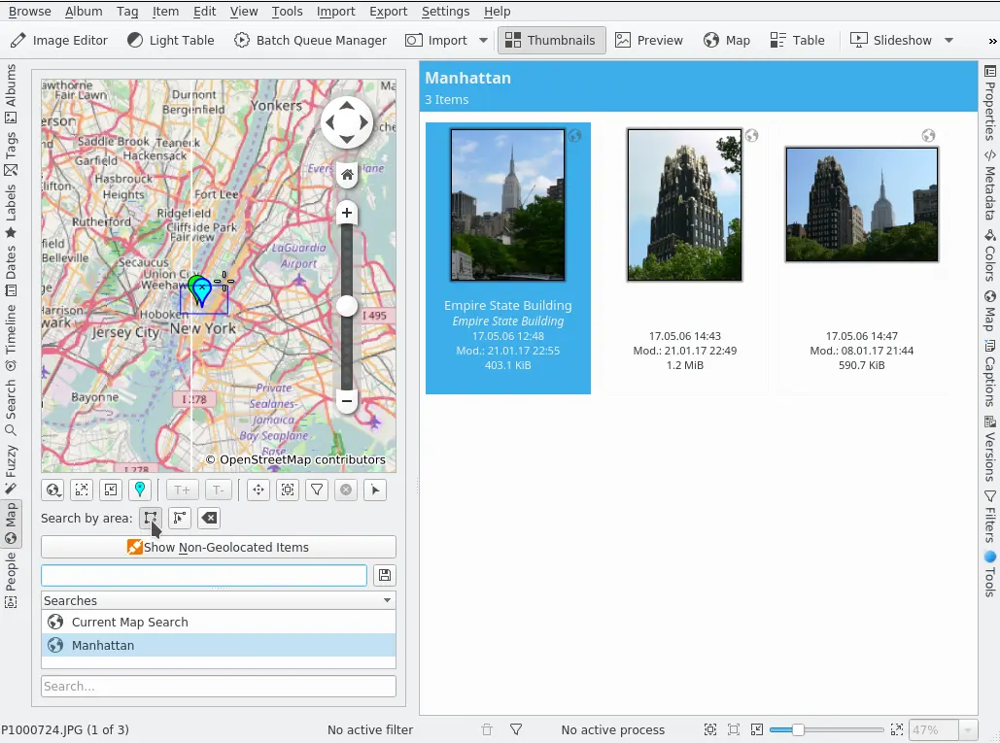

.. meta::
   :description: digiKam Main Window Map Search View
   :keywords: digiKam, documentation, user manual, photo management, open source, free, learn, easy, map, search, geolocation

.. metadata-placeholder

   :authors: - digiKam Team

   :license: see Credits and License page for details (https://docs.digikam.org/en/credits_license.html)

.. _mapsearch_view:

:ref:`Map Search View <left_sidebar>`
=====================================

There are four tools involving geolocation in digiKam:

    - The **Map Mode** of the Image Area displays the locations of geo-tagged images (images with GPS data) on a map depending on the selection in the Left Sidebar, e.g. the images in the album you selected in the Album View, the images with a specified tag (selected in the Tag View), images with a specified label, and so on.

    - The **Map** tab on the Left Sidebar, the topic of this section, is the search tool for selecting images based on their GPS data.

    - The :ref:`Geolocation Editor <geoeditor_overview>`, accessible via :menuselection:`Item --> Edit Geolocation...` :kbd:`Ctrl+Shift+G`, is the tool to set and to edit GPS data.

    - The :ref:`Map <maps_view>` tab on the Right Sidebar shows a map with a marker or a thumbnail to indicate the GPS location of the selected image. The map display is purely informative. The GPS coordinates are displayed below the map, along with the time the image was taken.

    The digiKam Map Search Tool from Left Sidebar

To access the Map Search Tool, click on the **Map** tab in the Left Sidebar.

The earth view is a topographical map of our beautiful home planet. Optional map overlays include the navigation control shown in the figure, along with a compass rose and a scale bar that are not shown.

Clicking on the navigation control's arrow buttons rotates the globe to move the map frame north/south or east/west. You can also move the map frame by using the keyboard arrow keys, or by clicking and dragging on the map. Navigating via click and drag is a particular easy and precise way to adjust the map frame.

Zoom in and out by moving the navigation control's vertical slider up and down, by clicking on the navigation control's + and - buttons, by using the Zoom in |zoom_in| and Zoom out |zoom_out| buttons just below the map, by scrolling the mouse wheel, or by using the :kbd:`+` and :kbd:`-` keys on the keyboard.

The map can be rotated from its center by click and dragging on the map while holding down the right mouse button.

Depending on the map's resolution, zooming in will provide you with more detail. Smaller cities will appear and using the topographic map you might notice that coastlines are provided as vector graphics.

In case you should get lost you can always reset the viewing angle and zoom level back to the point where we started off: Just press the Home button (or the Home button on your keyboard). To set the home location to the current position (center of the map) select the Bookmarks → Set Home Location menu item.

The meaning of “GPS”, as well as the detailed descriptions of the functions and buttons that apply to all three geolocation maps, are described in the :ref:`Geolocation Editor <geolocation_editor>` chapter of this manual. This applies to the context menu on the map and the first line of buttons under the map except for the last three on the right, which are related to filtering and selecting images based on location.

Usually you will begin searching for images by defining a region on the map. From the **Search by area** buttons click the left one, the **Select images by drawing a rectangle** |rectangle_select| button. Then draw a selection rectangle by clicking with the left mouse button at the location on the map of the first corner, move the mouse to the location of the second corner, and click a second time. All images that have been geo-tagged and that fall within the coordinates of that rectangle will be shown in the Image Area.

The next button to the right is the **Create a region selection from a thumbnail** |region_from_thumbnail| button which creates a small region around the position of any marker or thumbnail that you click on. This will display the image you clicked on in the Image Area, along with any images that have nearly the same position.

The last button in this row is the **Remove the current region selection** |remove_region| button. Well, do I still have to explain that after all? O.k., I should mention that it, of course, only removes the selection, not your precious pics.

Now let's have a look at the three buttons at the right end of the row right under the map. Let's begin with the one at the very end of the row, the **Select images** |select_images| button. When activated, clicking on a photograph (or a group of photographs if they are hidden behind each other) on the map will alternatively select or deselect those photographs. This can be helpful to fine tune your selection before carrying out operations from the Right Sidebar or the menus.

When the **Filter images** |filter_images| button (the one with the funnel on it) is activated, clicking on a photograph (or a group of photographs if they are hidden behind each other) will add a filter to view only those photographs in the Image Area. This is particular useful if the map is just showing markers or if the thumbnails are too small to clearly identify images.

The action of the **Remove the current filter** |remove_filter| button should be self evident. Note: These three last buttons won't affect your defined search region which means that once you make another selection, all images in that region should be displayed again in the Image Area.

The **Show Non Geolocated Items** button displays all images without GPS data in the Image Area. If this applies to many images from your collections it might be a good idea to also use the **Filters** tab of the Right Sidebar and/or the sorting and grouping functions in the **View** menu.

In the box below you can enter a name for your geo filter. It will be added to the list view below for future reference once you click the save button to the right of it, it acts as a live geo folder. The search field at the bottom searches in the Searches list above.
