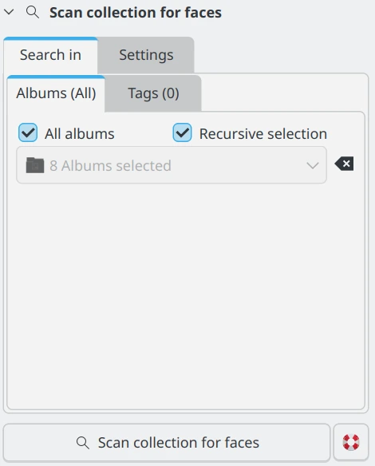

.. meta::
   :description: digiKam Main Window People View
   :keywords: digiKam, documentation, user manual, photo management, open source, free, learn, easy, faces, detection, recognition, management, deep-learning, people

.. metadata-placeholder

   :authors: - digiKam Team

   :license: see Credits and License page for details (https://docs.digikam.org/en/credits_license.html)

.. _people_view:

:ref:`People View <left_sidebar>`
=================================

.. contents::

If you’re not just photographing machines or stars, Face Management could be a useful feature for you (even machines might have a human operator). In digiKam, this feature involves two main tasks: **Face Detection** and **Face Recognition**.

The face management workflow helps you identify and recognize people in your photos by using deep-learning neural networks. **Face Detection** identifies faces that appear in your images, which is a necessary step before recognition. **Face Recognition** then automatically identifies people in your photos, but it requires initial training by labeling a few detected faces with the corresponding names.

.. important::

   For face management to work correctly, digiKam needs to download the deep-learning models from the web. These files can either be downloaded when digiKam is first run (see :ref:`the Quick Start section <quick_start>` for details), or the files can be downloaded by clicking on the **Download required binary data** button on the :menuselection:`Settings --> Miscellaneous --> System` page.

.. _face_detection:

Face Detection
--------------

The first step is to let digiKam locate all the photos containing faces, without yet identifying who they belong to. To begin, click on the **People** tab in the left sidebar. At the bottom, you’ll find a settings view. The settings view is divided into two tabs: **Search-in** and **Settings**. In the settings view, select the Settings tab to adjust the face detection and recognition settings.

    - **Scan new images**: Select this option for your first scan, or if you want to scan recently added images that have not been scanned before.

    - **Scan all images**: Select this option when you have changed settings. This will re-scan all images selected in the **Search in** tab, which can be time-consuming.

    - **Recognize faces only**: Select this option if you have already scanned your images and want to recognize faces in the images that have already been detected.

.. figure:: images/left_sidebar_faces_settings1.webp
    :alt:
    :align: center
    :width: 300px

    The digiKam Face Management Settings View

For normal operation, use the first option, which is set as the default. This is ideal for your initial face scan or when adding new images to your library. The second and third options should be utilized when you modify settings that impact face results. Regardless of the chosen option, the system will attempt to recognize faces.  The **Search-in** tab allows you to limit the scan to specific albums or tags. See the :ref:`Search-in <search_in_tab>` section for more information. After selecting your options, click **Scan collection for faces**. 

Depending on the scope of your selection, it may take a little while for the results to appear in the Image Area. In the Tags list on the Left Sidebar, you’ll see the **People** branch of your tag tree. To view the entire set of identified faces, ensure the topmost tag **People** is selected. You’ll also notice a new virtual tag called **Unknown**, which includes all images where faces have been detected but not yet assigned to a person. If this is your first scan, you’ll find the entire set of identified faces here as well.

.. figure:: videos/left_sidebar_faces_detection.webp
    :width: 600px
    :alt:
    :align: center

    Screencast of digiKam Faces Detection Process Running Over Collections and Populating the Database

Note that the thumbnails presented here do not show the whole image. They show the area of the image where the face detection model added a **Face Tag**. You can see the whole image if you click on the thumbnail. In the preview that opens, you will see the whole image with all the face tags on them. If you don't see them, click the people button |icon_showfacetags| in the upper left corner of the preview. If there is more than one face tag on the image it will also be represented by more than one thumbnail.

The list of detection samples below comes from a huge collection of photos scanned by digiKam.

==== ============================================================= =============================================
 ID  Face Detected Samples                                         Comments
==== ============================================================= =============================================
 01  .. figure:: images/left_sidebar_face_detection_sample_01.webp An under-exposed face
        :width: 64px
        :alt:
        :align: center
---- ------------------------------------------------------------- ---------------------------------------------
 02  .. figure:: images/left_sidebar_face_detection_sample_02.webp An animal face
        :width: 64px
        :alt:
        :align: center
---- ------------------------------------------------------------- ---------------------------------------------
 03  .. figure:: images/left_sidebar_face_detection_sample_03.webp A blurry child face
        :width: 64px
        :alt:
        :align: center
---- ------------------------------------------------------------- ---------------------------------------------
 04  .. figure:: images/left_sidebar_face_detection_sample_04.webp A non-human face
        :width: 64px
        :alt:
        :align: center
---- ------------------------------------------------------------- ---------------------------------------------
 05  .. figure:: images/left_sidebar_face_detection_sample_05.webp A very blurry and partial face
        :width: 64px
        :alt:
        :align: center
---- ------------------------------------------------------------- ---------------------------------------------
 06  .. figure:: images/left_sidebar_face_detection_sample_06.webp A rotated face
        :width: 64px
        :alt:
        :align: center
---- ------------------------------------------------------------- ---------------------------------------------
 07  .. figure:: images/left_sidebar_face_detection_sample_07.webp A face covered with a hood
        :width: 64px
        :alt:
        :align: center
---- ------------------------------------------------------------- ---------------------------------------------
 08  .. figure:: images/left_sidebar_face_detection_sample_08.webp A face in profile
        :width: 64px
        :alt:
        :align: center
---- ------------------------------------------------------------- ---------------------------------------------
 09  .. figure:: images/left_sidebar_face_detection_sample_09.webp An under-exposed and partial face
        :width: 64px
        :alt:
        :align: center
---- ------------------------------------------------------------- ---------------------------------------------
 10  .. figure:: images/left_sidebar_face_detection_sample_10.webp A false positive detection
        :width: 64px
        :alt:
        :align: center
---- ------------------------------------------------------------- ---------------------------------------------
 11  .. figure:: images/left_sidebar_face_detection_sample_11.webp An animal face
        :width: 64px
        :alt:
        :align: center
---- ------------------------------------------------------------- ---------------------------------------------
 12  .. figure:: images/left_sidebar_face_detection_sample_12.webp A face covered by a raquet
        :width: 64px
        :alt:
        :align: center
==== ============================================================= =============================================

Screenshots **02** and **11** were selected to highlight an important feature: the algorithm can detect animal faces. This is not a false positive, unless you specifically want to see only human faces in your collection.

Screenshot **10** is an incorrect (false positive) result, demonstrating that the algorithm sometimes identify details in an image that resemble a face but are not actually faces. This is where the Remove button comes in handy. It removes the face tag from the photograph, and if it is the only face tag remaining, the photograph will disappear from the scan results.

Screenshots **01**, **03**, **05**, **08**, **09**, and **12** may be considered non-faces or can be filtered out by increasing the **detection accuracy** setting in the face management **Settings** view. However, these examples demonstrate the algorithm’s ability to detect faces even in challenging conditions.

Screenshot **04** shows the model can detect other non-human faces in images, including statues, paintings, and pictures within images.

Once the scan is finished, a new tag labeled **Unknown** should appear under People in the People view. You will need to manually tag some of these faces before digiKam can begin automatically matching other unknown faces.

.. _face_tagging:

Face Tagging
------------

Assigning names to face tags is a crucial step for Face Recognition. digiKam can only recognize faces if it has reference faces for comparison. It’s your job to train it by identifying faces, such as labeling them as Lara, Juan, Peter, etc. Usually, you only need to manually tag one face for a person for the recognition process to identify additional faces.

After performing a scan as described in the previous section, you select the **Unknown** tag on the Left Sidebar.

.. figure:: images/left_sidebar_faces_tag_assigned_iconview.webp
    :alt:
    :align: center
    :width: 600px

    The digiKam Face Management Icon-View allows for multiple selections of similar faces to be tagged with the name **Adam**.

In the field labeled **Who Is This?** you can either type in the name of an existing People tag out of your tag tree or use the drop-down function to show your tag tree and select a tag. You can also apply the same tag to multiple faces at the same time. **Confirm** saves the name to the database and moves the thumbnail from **Unknown** to the face tag.

    The digiKam Face Management Icon-View displaying a confirmed set of 6 faces tagged with the name **Adam**.

.. note::

    Using the context menu item **Assign Tag** instead of the procedure described above will not assign a face tag. Instead, it will assign a regular tag to the entire image.

Once a face tag is confirmed, digiKam only shows the name without the buttons to remove, edit, or confirm. If you need to edit or remove a confirmed face tag, simply double-click on the name and the buttons will reappear.

For more information about automatic face tagging using digiKam's face recognition engine see :ref:`the next section <face_recognition>` of this manual.

You can manually tag people in different ways:

- From the **Unknown** tab in the **People** view: hover on any **Unknown** face from the icon-view and use the text box to assign a name. This will create a new face tag in the case of a person whose name hasn't already been entered.

    .. figure:: videos/left_sidebar_face_tagging.webp
        :alt:
        :align: center
        :width: 200px

        Screencast of Manual Face Tagging From Icon-View

- From Left Sidebar **People** tab: use drag and drop between the icon-view and the face-tags tree view. Select items labeled **Unknown** that you want to assign a face-tag. Perform a move with the mouse to the **People** items hierarchy. A pop-up menu will appear to confirm the face assignment.

    .. figure:: videos/left_sidebar_faces_drag_drop.webp
        :width: 600px
        :alt:
        :align: center

        Screencast of Manual Face Assignment Using Drag And Drop

- From keyboard shortcut: you can assign a magic key to a face-tag and quickly use the keyboard to assign the face-tag name to selected items.

    .. figure:: images/left_sidebar_face_tag_properties.webp
        :alt:
        :align: center

        The digiKam Face Tag Properties Dialog With a Keyboard Shortcut Assigned

In case there's a face you don't wish to be recognized, you can mark it as ignored. This leads to the creation of a new **Ignored** tag. This is reversible, you can later unmark the face if needed.

    .. figure:: images/left_sidebar_faces_tag_ignored_iconview.webp
        :alt:
        :align: center

        A Face Marked as **Ignored** From Icon-View

In addition to tagging auto-detected faces, you can manually add a face region:

- From **Preview Mode**: click on **Add a Face Tag** icon or select the option in the context menu, as highlighted in the screenshot below.

    .. figure:: images/left_sidebar_addfacetag.webp
        :alt:
        :align: center

        The digiKam Manual Face Tagging From Context Menu

    Then draw a rectangle around the face while holding the left mouse button followed by entering the person's name and pressing :kbd:`Enter` key. If you press :kbd:`Esc` key, this will exit the person's name editor.

    .. figure:: images/left_sidebar_face_region.webp
        :alt:
        :align: center

        The digiKam Manual Face Tagging Editor

    .. note::

        Instead of clicking on **Add A Face Tag** icon, you can draw a face region while holding :kbd:`Ctrl` key.

    The **Preview Mode** context menu also includes two other options for manual face tagging:

        - **Scan For Faces**: This option triggers the face detection algorithm to automatically identify and mark face areas on the image. By default, these faces are labeled as **Unknown** in the database. The process uses the most recent **Face Detection** settings. If faces are detected, you can manually edit the face names as previously described.

        - **Show Face Tags**: This displays the visible face tag areas and automatically switches to edit mode when the mouse hovers over them.

    .. note::

        In the :ref:`Miscs Behavior <behavior_settings>` view of the configuration dialog, an option can be turned on to only populate the tags tree-view with the face tags assigned to a face while you enter a name.

.. _face_recognition:

Face Recognition
----------------

Once you have assigned a tag to a few photographs, you can have digiKam try to match **Unknown** faces with similar faces that have already been confirmed (tagged). To start this process, go to the workflow tab, select **Recognize faces only**, and then click **Scan Collection For Faces**. The process will tag similar **detected** faces with the appropriate People tag from your tag tree, and the corresponding thumbnail will disappear from the **Unknown** tag selection. The thumbnail will appear in the **Unconfirmed** tag section and will be added to the suggested face tag section.

    The digiKam Face Management Icon-View with newly recognized faces with a suggested tag of **Adam**.

Face Recognition is faster than Face Detection but it still makes sense to use the **Search-in** tab to restrict the scan to certain albums or tags in the Albums tab, such as the **Unknown** tag. See the :ref:`Seach-in <search_in_tab>` tab.

    The digiKam Face Management Icon-View with newly recognized faces suggested as **Adam**.

The results of new facial recognition appear as **Unconfirmed** results. These results will be marked with the **Unconfirmed** tag and the tag of the person suggested for each face. To complete the recognition process, you need to **Confirm** the newly recognized faces. Once confirmed, these faces will be permanently moved to the appropriate face tag. Hovering over unconfirmed faces will display several options:

    - The **Confirm** button allows you to save the suggestion. This assigns the suggested name to the face.

    - The **Reject** button moves the face back to **Unknown** if the suggestion is incorrect.

    - The **Delete** button removes the face region from the database if the suggestion is not a face.

By default, faces are categorized based on their name. You can change this behavior by going to :menuselection:`View --> Separate Items`. Using a different categorization order will result in **Confirmed** and **Unconfirmed** faces appearing mixed together. To adjust this, you can modify the sorting order within each category by going to :menuselection:`View --> Sort Items --> By Face Type`.

.. note::
    digiKam does not keep a record of rejected faces. The same face might be suggested in future recognition scans. To avoid this, you can either label the face with a new name or choose to **ignore** it.

How recognition works
~~~~~~~~~~~~~~~~~~~~~

Face recognition in digiKam is cumulative. When more faces are confirmed to a tag name, digiKam can find more faces that are similar. When first building your library, it may take several recognition scans of your library to recognize all of the similar detected faces. This allows digiKam to learn different aspects of faces, and helps it to recognize the same person at different ages.

    * Example 1: A picture of a face from the front will match with similar faces turned slightly to the side.  Faces turned slightly to the side will match with similar faces turned mostly to the side. Faces turned mostly to the side will match with similar faces in full profile.
    * Example 2: A picture of a child will match with similar faces when the child is about the same age, and when the child is a year or two younger and older.  Faces of the child when they are a few years younger or older will match with similar faces when they are even younger or older.

.. important::
    It is recommended you run several **Recognize faces only** scans when you are first building your library. Carefully review and confirm the suggestions between each scan.

The accuracy of face recognition is very high once you have built and trained your library.

.. important::
    Carefully review face name suggestions before confirming them. A single incorrect confirmation can lead to numerous inaccurate suggestions from the face recognition system.

To improve face recognition results, in addition to adjusting the settings mentioned below, you can also improve accuracy by rebuilding the training data. This can be achieved by navigating to :menuselection:`Tools --> Maintenance --> Detect And Recognize Faces` and selecting **Rebuild all training data**.

.. _search_in_tab:

Search-in Tab
-------------

The **Search-in** tab lets you choose which albums and image tags to include in a scan. You can select specific albums or tags for detection and recognition.

- For **Scan all images** and **Scan new images** , digiKam will scan the images selected in the filter for faces.

- For **Recognize faces only**, digiKam will attempt to match **Unknown** and **Unconfirmed** face tags in the images included in the filter with all confirmed face tags.

    The digiKam Face Management Search-in View

.. _settings_tab:

Settings Tab
------------

The **Settings** tab lets you fine-tune the results from detection and recognition scans. Here, you can adjust the detection and recognition models, set the accuracy levels, and configure face detection for special cases. Additionally, you can control the processor load used for face detection and recognition. The default values have been carefully chosen for normal use after exhaustive testing on multiple datasets, including industry standard datasets such as `LFW <https://vis-www.cs.umass.edu/lfw/>`_, and personal datasets.

.. figure:: images/left_sidebar_faces_settings1.webp
    :alt:
    :align: center
    :width: 300px

    The digiKam Face Management Detection Settings View

Face Detection Settings
~~~~~~~~~~~~~~~~~~~~~~~

For Face Detection, there are 2 settings the user can adjust to control how digiKam determines if there is a face in an image.

- **Accuracy**: Lower accuracy settings may detect more faces in an image, but it will also increase the number of incorrect areas identified as faces (false positives). The default setting of 7 is recommended for normal use.

- **Face Size**: Larger face size settings increase the speed of face detection but may miss small faces in group photos or in the background of images. See the **Special Cases** section below for more details.

Face Recognition Settings
~~~~~~~~~~~~~~~~~~~~~~~~~

For Face Recognition, there is only one setting the user can adjust to control how digiKam matches **Unknown** faces to confirmed faces.

- **Accuracy**: Lower accuracy settings will produce more suggestions but will increase the number of incorrect suggestions. The default setting of 7 is recommended for normal use.

Work on all processor cores
~~~~~~~~~~~~~~~~~~~~~~~~~~~

Face detection and face recognition can be time-consuming tasks depending on the size of your library and filtering selected in **Search-in**. It is recommended to use all processor cores.  This will make the process run faster, but it can potentially make other processes run slower and make your computer feel unresponsive while faces are being processed. You can uncheck **Work on all processor cores** if your machine is slow and you want to perform other tasks while the face scan is running.

.. tip::
   Because of technical limitations on Windows, multi-core support for MySQL/MariaDB databases does not perform well. For better performance, we recommend using a SQLite database instead.

Special Cases
-------------

Occasionally, you may encounter special cases where the recommended face detection settings don't yield the best results. In those cases, you should tune the detection settings for a single image or small group of images.  It is not recommended to change the default settings for normal use, and it is recommended to change the settings back to their default values when you're done with special cases.

- **Large Group Photos**: You may have images of large groups of people, and you want to generate a face tag for every person in the image. Setting the **Detection Accuracy** to 1, and setting the **Face size** to **Extra Small** should detect most, if not all of the faces in the image.  This will also incorrectly tag more areas of the image as faces (false positives).

- **Portraits**: When shooting portraits from the shoulder up, especially with modern high-resolution cameras over 40 megapixels, face recognition may not detect the face or may tag multiple areas of a single face. Setting the **Detection Accuracy** to 8, and setting the **Face size** to **Extra Large** will detect only the face, and eliminate false positive tag regions.

- **Low Quality**: digiKam intentionally filters out faces that are too small, blurry, and of poor quality. This ensures that only high-quality samples are used to train the face recognition engine, improving accuracy and reliability. To optimize face recognition, use only high-quality images with clear, well-defined faces for training. Avoid including small, blurry, or low-resolution images in your workflow.

