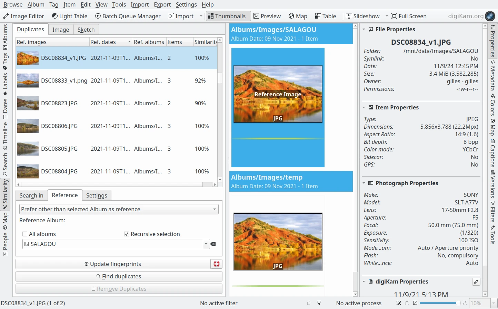
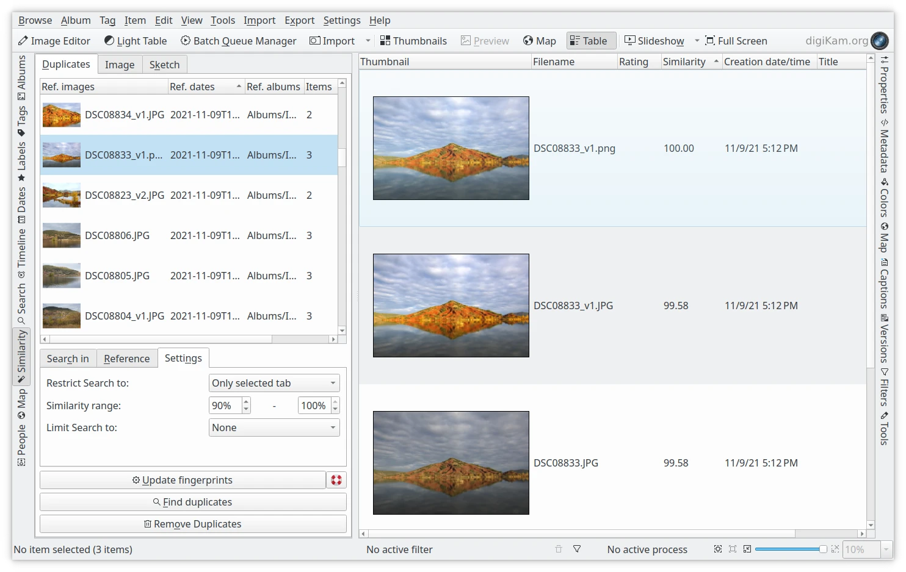
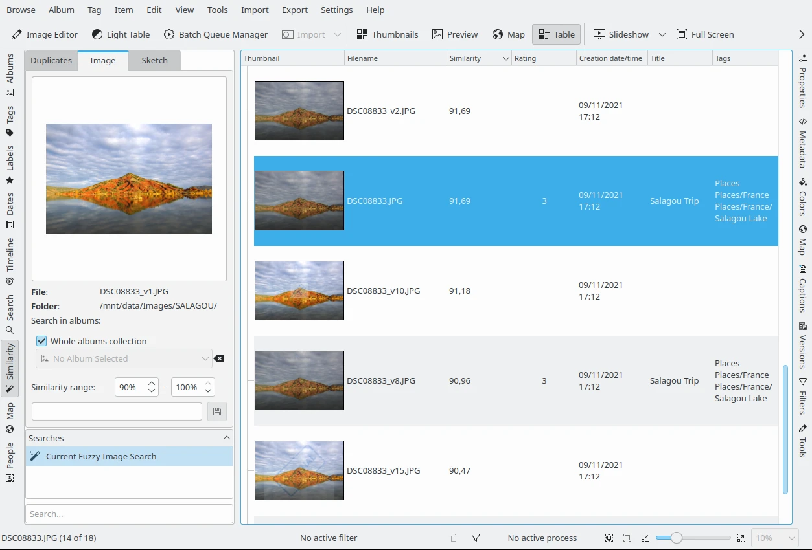
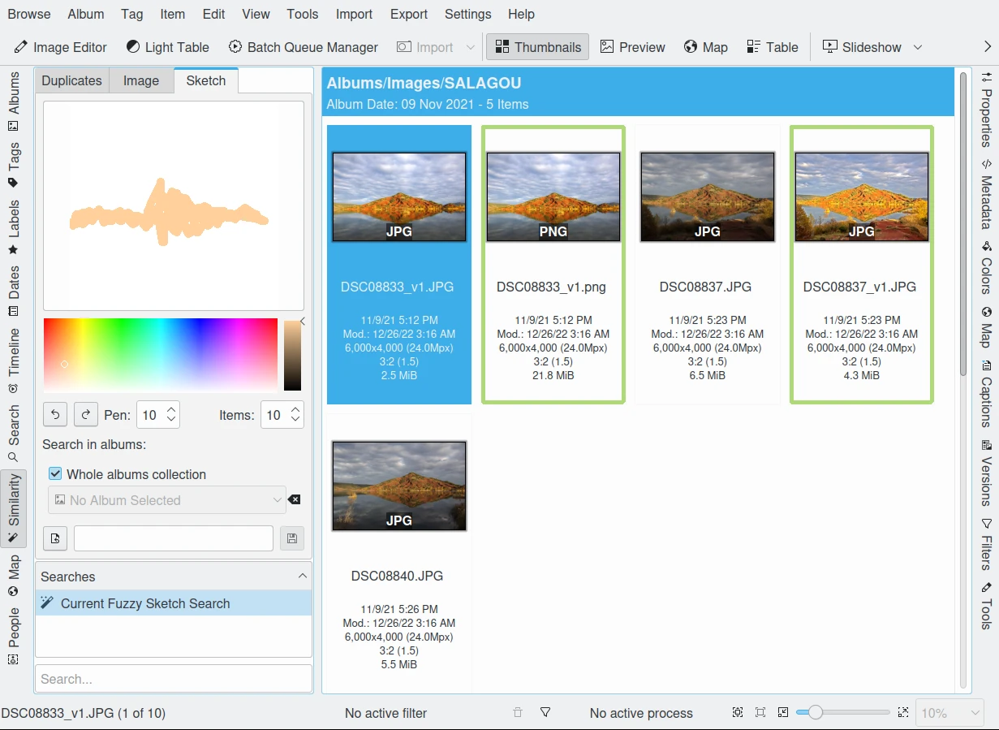

.. meta::
   :description: digiKam Main Window Similarity View
   :keywords: digiKam, documentation, user manual, photo management, open source, free, learn, easy, similarity, search, duplicates, sketch

.. metadata-placeholder

   :authors: - digiKam Team

   :license: see Credits and License page for details (https://docs.digikam.org/en/credits_license.html)

.. _similarity_view:

Similarity View
---------------

Overview
~~~~~~~~

If you have lost a picture because you can't remember its name or where you filed it, you might want to perform a *Similarity* search on your collections.

digiKam characterizes every image by a fingerprint (or signature), that is internally represented as a lengthy number. These fingerprints are computed in such a way that the less numerical difference there is between any two image fingerprints, the more the two images resemble each other. Comparison of these fingerprints thus make it possible to find similar images. This methodology is the core engine for three features in the Similarity View named find **Duplicates**, find similar **Image**, and find by **Sketch**.

.. note::

    digiKam uses Wavelets/Haar algorithms based on the `Fast Multi-Resolution Image Querying publication <https://grail.cs.washington.edu/wp-content/uploads/2015/08/jacobs-1995.pdf>`_ to compute fingerprints for every image in the database. These calculations are done in the background.

.. _similarity_duplicates:

Find Duplicates
~~~~~~~~~~~~~~~

Before you can have digiKam find duplicates, the fingerprints of the images within the collections have to be calculated. You can start that process with the button **Update Fingerprints** which initiates a total rebuild of the image fingerprint database. This may take hours if you have a large collection and slow storage devices. If you have already scanned your images for fingerprints, then you should skip this step.

.. tip::

    You can also perform fingerprint operations using :menuselection:`Tools --> Maintenance` and select **Rebuild Finger-prints** option. You can optionally choose if you want to rebuild the entire database or only scan your database for changed or new items, which is the default behavior. Scanning for changed or new items is naturally the faster option.

Once the fingerprints are calculated you can use **Find Duplicates**, but the calculation will take a long time since it has to compare every image with every other image. So it is often better to confine your search to certain **Albums** and/or **Tags**. The **All albums** and **All tags** check-boxes perform global searches in the database. Otherwise use the drop-down menu to specify which **Albums** and/or **Tags** to search.

The fundamental result of a **Find Duplicates** operation is a list of Reference images, which should be thought of as originals, and the number of images found that are duplicates of the reference image. A **Remove Duplicates** operation would then remove the duplicate images, without disturbing the reference images. But when digiKam identifies a group of duplicate images, how does it identify which is the reference image that should be maintained, and which are the duplicates?

The **Reference Image Selection Method** setting allows selection of how the reference image is determined.

    - **Older or Larger** is the method used prior to version 8.1.0. The reference image is the duplicate that is older or larger than the others
    - **Prefer selected folder as reference** means that the reference image is chosen from the selected album or albums
    - **Prefer other than selected folder as reference** means that the reference image is chosen from an album that has not been selected
    - **Prefer Newer Creation Date** means that the reference image is the duplicate that has the newest creation date
    - **Prefer Newer Modification Date**  means that the reference image is the duplicate that has the newest modification date

    Find Duplicates Tool Searching in Whole Albums Collection with the reference file not in the potential Duplicates folder. The results are displayed in Icon-View

The **Restrict to** setting limits the albums or tags used in the reference image selection. Possible options are listed below:

    - **One of** means that the reference images are either from the selected albums or have the selected tags.
    - **Both** means that the reference images are from the selected albums and have the selected tags.
    - **Albums but not tags** means that reference images must be in the selected albums but not have the selected tags.
    - **Tags but not albums** means that reference images must have the selected tags but not be in the selected albums.
    - **Only selected tab** means that only the selected tab applies to the reference image selection.

With the **Similarity Range** you can narrow down or enlarge the search result. A similarity of 100 % provides exact matches. Lower values indicate decreasing similarity. Note that by lowering the upper threshold a little bit below 100 % you can keep things like exact copies, images from series shots, etc. out of the search results.

The **Restriction** setting can be used to further restrict searches with respect to the specified folder. Possible options are listed below:

    - **None** means to search across all collections
    - **Restrict to reference album** means to only search in the selected album
    - **Exclude reference album** means to search in all albums excluding the selected album

The results of the search are displayed in the duplicate list-view near the top left sidebar. The first column shows the **Reference images** (Ref.) as a thumbnail for each single result. The **Items** column tells you how many images belong to each result including the **Reference image**. The last column shows the **Average similarity** which gives you an idea regarding the degree of similarity of each set of duplicate images. The reference image with its 100 % is not included in this average. Note that the results can be sorted by clicking on one of the column headers. **Reference dates** and **Reference albums** columns are the properties of the **Reference images**.

    Find Duplicates Tool Searching in Whole Tags Collection and Displaying Results in Table-View

Individual similarity values for each item can be obtained in the **Table-View** mode (**Table** button on the Main Toolbar). Click with the right mouse button over one of the column headers and select **Similarity** from **Item Properties** to display the similarity column. Clicking on the header of this column will sort results by similarity, grouped by the reference images. Clicking repeatedly on the header will toggle between ascending and descending order.

**Remove Duplicates** allows you to delete all duplicate images of the current selected item from the **Duplicates** list.

.. _similarity_image:

Find Similar Image
~~~~~~~~~~~~~~~~~~

This tool provides a drag and drop zone on the top-left where you can place any image to find similar images in the database. You can drag an image from anywhere, even from outside digiKam. You can also drag and hold an image from the album **Icon-View** over the **Similarity** search icon in the **Left Sidebar**. This will then open a dialog and you drop the image there. Finally, you can use **Find Similar...** entry from the context menu of a thumbnail in any other Icon-View.

.. figure:: videos/left_sidebar_similar_drag_drop.webp
    :alt:
    :align: center

    Screencast of Drag and Drop item from Album Icon-View to Find Similar using Left Sidebar

Like with **Find Duplicates**, you can restrict the search to a set of **Albums** or the whole collection. You can narrow down or enlarge the resulting selection with the **Similarity range** here as well.

The **Search in**, **Save**, and **Restore** previous searches features work the same as in the **Find Duplicates** tool.

After performing **Searches** you might want to save the results. In the field below you can enter a name for the search, and press the **Save** button. In the **Searches** list below you will find your saved searches. Clicking on the title bar of that list toggles the sorting order between ascending and descending. At the bottom you will find an adaptive search field which can help you to find a particular search. To **Restore** a result, just click on one item from the list.

    Searching Similar Items For a Single Image

.. _similarity_sketch:

Find by Sketch
~~~~~~~~~~~~~~

This tool is a free-hand color sketching editor. You can draw a quick sketch and digiKam will find corresponding images. You will find the same means to save your search as in the **Image** tab.

On the left hand side of digiKam, navigate to the tab **Sketch**. This view has a drawing area plus some settings below to set pencil and history tools. Choose a color that your image might contain, you can change the size of the pen which is on the scale of 1-10, and you can also choose the number of images that you want to be displayed during your fuzzy search, this can be set to a value between 1-50 items. As you sketch on the area you will see that the similarity search related images appears on the right hand side.

The **Search in**, **Save**, and **Restore** previous searches features works the same as in the  **Find Duplicates** tool.

    Searching Items by Drawing a Sketch
