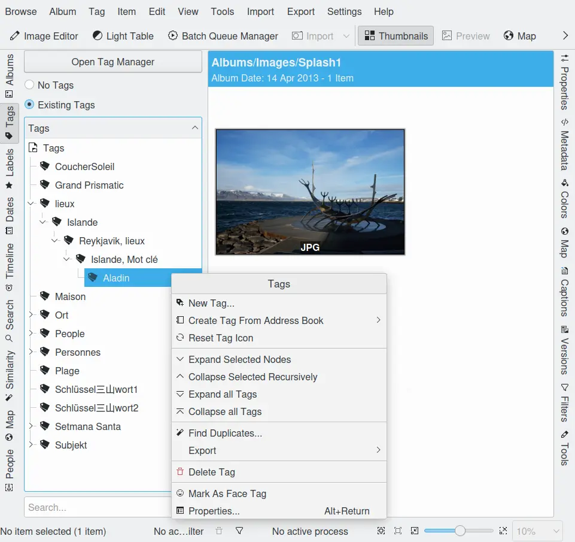
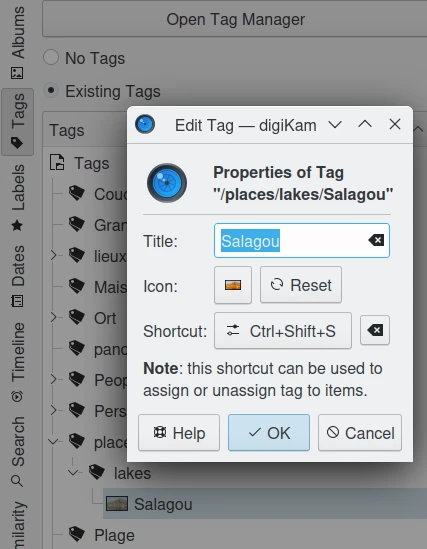
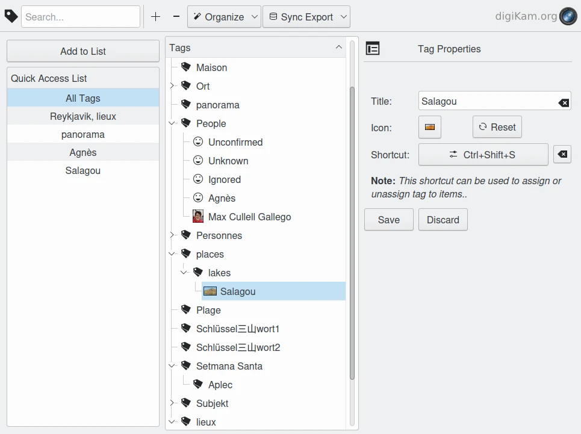
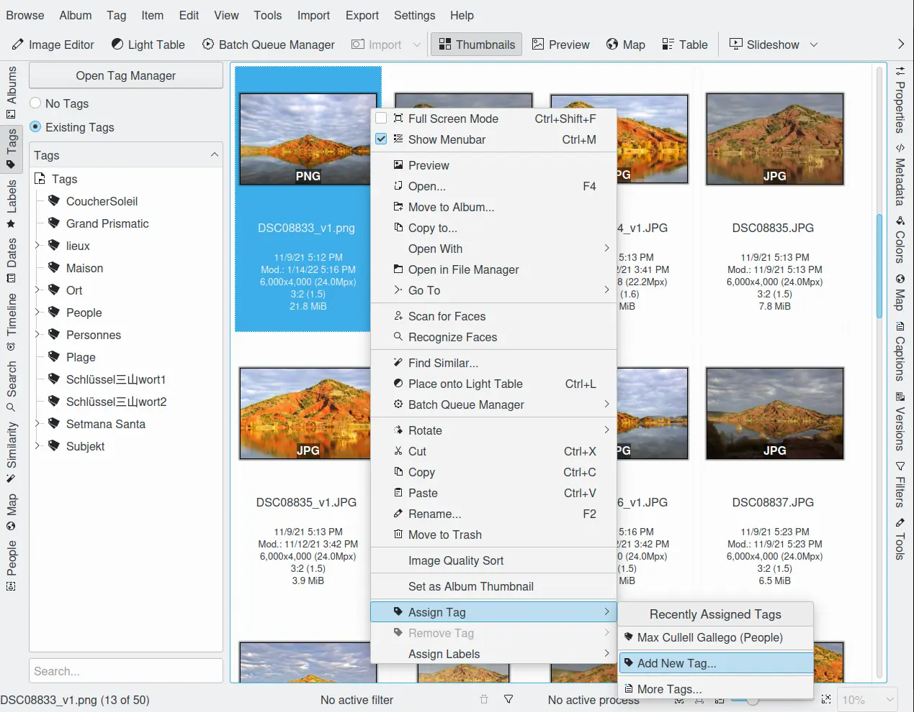

.. meta::
   :description: digiKam Main Window Tags View
   :keywords: digiKam, documentation, user manual, photo management, open source, free, learn, easy, tags, manager

.. metadata-placeholder

   :authors: - digiKam Team

   :license: see Credits and License page for details (https://docs.digikam.org/en/credits_license.html)

.. _tags_view:

Tags View
---------

Hierarchical tagging provides a flexible and powerful way to organize and catalog your images. Tags (also called *keywords* in other applications) are labels that can be applied to individual images or groups of images. Once a tag has been applied to an image the image can be found again by selecting the tag or doing a search.

Tags can be arranged in a hierarchical tree. This allows you to organize your tags in a logical manner. You can collapse parts of the tree in the **Tags** list so that you can easily find the tags that you are looking for.

    The digiKam Nested Tags Tree-View

When a tag is selected in the Left Sidebar, all of the images that are marked with that tag are displayed in the View Area.

But before assigning and using tags you first have to define them. If you import photographs that already have assigned tags, digiKam will build an appropriate tag tree during import. Other than that you have to manually define all tags. The context menu shown in the screenshot above provides an easy approach to managing tags.

.. _managing_tags:

Managing Tags
~~~~~~~~~~~~~

You can add new tags by clicking with the right mouse button on either the Tags label or an existing tag and selecting **New Tag...**. A dialog will open where you can type in the tag name (or even a whole hierarchy branch), and assign an icon and/or a shortcut to the tag. If you add a new tag by clicking with the right mouse button on an existing tag, your new tag will be created as a sub-tag.

You can delete a tag by clicking with the right mouse button on the tag you want to delete and selecting **Delete Tag**. When you delete a tag, the photographs themselves are not deleted. The tag is simply removed from those photographs.

You can move the position of a tag within the tree by dragging and dropping it into the desired position. A menu will appear giving you the option to **Move** the tag. This works in both the left and right sidebars. A tag can only be in one place in the tree at a time.

You can set the Tag Properties by clicking with the right mouse button on a tag and selecting **Properties...**. The Tag Properties allow you to change the name of the tag, the icon used in the Tags tree and the shortcut.

    The digiKam Tags Properties Dialog

To select a photograph as the tag icon, click with the right mouse button on the photograph that you want to use as the tag icon and select **Set as Tag Thumbnail** from the context menu. You can also use drag and drop to set the tag icon. Drag the image icon and drop it onto the currently selected tag in the tag list.

A tool for more elaborate work on big tag trees is the :ref:`Tag Manager <tag_manager>` which you can access by clicking the **Open Tag Manager** button at the top of the Tags tree.

The :ref:`Digital Asset Management (DAM) <asset_tags>` chapter of this manual provides some useful information about how to build your Tags tree.

It is not always easy to build a logical hierarchy from general and generic categories. You might run into a problem like this:

   - Animal
      - Domestic Animal
         - Cat
         - Cattle
         - Dog

      - Wild Animal
         - Bird
         - Cat
            - Cheetah
            - Lion
            - Tiger

      - Zoo Animal
         - Bird
         - Cat
            - Cheetah
            - Leopard

In this tag tree the keyword *Cat* appears three times. This will not cause a problem within digiKam, but there are quite a few views where the user cannot know which of the three is applied to an image because they might not be able to see the whole tag hierarchy. In a case like this, also tagging the image with the parent tag or even the whole hierarchy often becomes quite unwieldy, particularly in the display of image tags within the image icon. The second *Cat* could be avoided by calling it *Wild Cat*, but calling the third one *Zoo Cat* seems a bit excessive, I think. And there would still be two *Cheetah*!

A more viable solution would be to replace the *Zoo Animal* branch by a single tag *Zoo* which you use in addition to the tag(s) you choose from the two remaining branches. You could even put it on the top level of your hierarchy, if you have photographs taken in a zoo but not showing animals.

.. _tag_manager:

Tag Manager
~~~~~~~~~~~~

While digiKam allows you to manage tags from the context menu accessible from the tags views in the digiKam sidebars, the Tag Manager offers an easier and more comprehensive way to organize your tags. For general information about tags, including why and how to use them, see the beginning sections of :ref:`this page <tags_view>`.

    The digiKam Tag Manager Window

The toolbar at the top of the Tag Manager offers:

    - An adaptive search field to find selected tags in a big tree.

    - A button to add a tag as a sub-tag to the current (last clicked) tag.

    - A button to delete a tag or a selection of tags.

    - The drop down menu **Organize** which contains:

        - **Edit Tag Title** :kbd:`F2` to modify a tag name.

        - **Reset Tag Icon** to reset the standard tag icon.

        - **Create Tag from Address Book** to import address book items as new tags.

        - **Mark Unassigned Tags** to mark all tags that are unassigned.

        - **Invert Selection**, which is useful if you want to select most but not all of your tags.

        - **Expand Selected Nodes** to expand only the selected nodes from the tag tree.

        - **Expand Tag Tree** to expand all of the nodes of the tag tree.

        - **Collapse Tag Tree** to collapse all of the nodes of the tag tree.

        - **Remove Tag from Images** to remove selected tag(s) from all images.

    - And the drop down menu **Sync Export** which contains:

        - **Write Tags from Database to Image** to sync image metadata with tags from the database.

        - **Read Tags from Image** to write tags in the database using image metadata.

        - **Wipe all Tags from Database only**.

The **Tag Manager** window consists of three parts, the **Quick Access List** to the left, the **Tags** tree (or parts of it) in the middle and the **Tag Properties** to the right that shows the prperties for the selected tag.

The Quick Access List allows you to display only a certain node (and its sub-nodes) in the tag tree window. Select a tag in the tag tree and click on **Add to List** button. The tag will appear in the Quick Access List. If you select the tag there, the tag tree will show only the selected node which can still be expanded to see the sub-nodes. Note that the entering text into the search field will also limit the tag tree to only display those tags that contain the string in the search field.

The Tag Properties dialog allows you to change the name of the tag, the icon used in the Tag tree and the shortcut.

Tagging Photographs
~~~~~~~~~~~~~~~~~~~

Before you can get the most out of digiKam's tagging capabilities, you must first tag your photographs. There are a few methods for that task. Once you have identified the photographs that you want to tag you can either drag and drop them onto the tag in the Tags tree or, by clicking with the right mouse button on the selected photographs in the Image Window, you can use the **Assign Tag** menu to select the tags you wish to set.

Drag and Drop works with any visible tags and photographs in both sidebars. With the Right Sidebar it works the obvious way: you drag the tag and drop it onto the photograph or selection of photographs you want to tag. With the Left Sidebar you have to drag the photographs to the tags. You want to know why? Just try it the other way and you will see.

.. tip::

    You can also use drag and drop between tabs from same sidebar, for example dragging a icon-view item from **Albums** to the **Tags** view. To switch from one tab to another one, just move the mouse over the tab title for a few seconds while dragging, the new view will be enabled and dragging operation can continue.

Shortcuts: as mentioned earlier in this chapter you can assign keyboard shortcuts to the Tag Properties. Such shortcuts could then be used to assign or un-assign a tag to the selected photograph(s).

Context menu: by clicking with the right mouse button on the selected photographs and choosing **Assign Tag** you will see a list of the ten most recently used tags, **Add New Tag...**, described at the beginning of the :ref:`previous section <managing_tags>`, and **More Tags...** which leads to what is described in the next paragraph. This context menu may be the easiest method to add a limited number of tags to one or more images.

    Tagging Image With Context Menu From Icon-View

You can remove a tag from a photograph by clicking with the right mouse button on the photograph and select **Remove Tag** submenu from the context menu. This submenu will only show those tags that have been set on this photograph.

The Right Sidebar: this is what manu use as their standard method for assigning tags. Click **Captions** tab from the Right Sidebar and then the **Tags** tab from the top of the sidebar to display the whole tags tree. Simply check/un-check the boxes of the tags you want to assign/un-assign and then click **Apply**. If you change focus without clicking Apply, you will be asked whether you want to apply the changes. This request for confirmation can be disabled either by checking **Always apply changes without confirmation** or by checking **Do not confirm when applying changes in the right sidebar** in the Miscellaneous section of :menuselection:`Settings --> Configure digiKam...`. More details about the other buttons and fields in the **Tags** tab are provided in :ref:`digiKam sidebar <tags_tree>`.

You can label a photograph with as many tags as you like. The photograph will appear when you select any of the tags that are applied to it. This way you can set a tag for each person in a photograph, as well as the place the photograph was taken, the event it was taken at, etc.

Once you have tagged a photograph, the tag name will appear under the thumbnail in the Image Area.

.. tip::

      Tags are stored in a database for fast access, and, the applied tags are written into IPTC data fields of the image (at least for JPEG). So you can use your tags with other programs or, in case of loss of that data in the database, the tags will be restored when the image is re-imported into digiKam.
