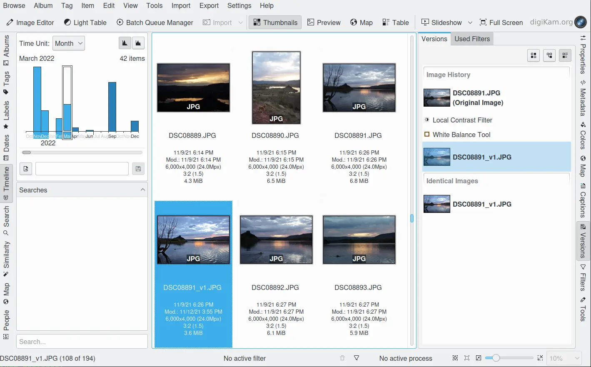
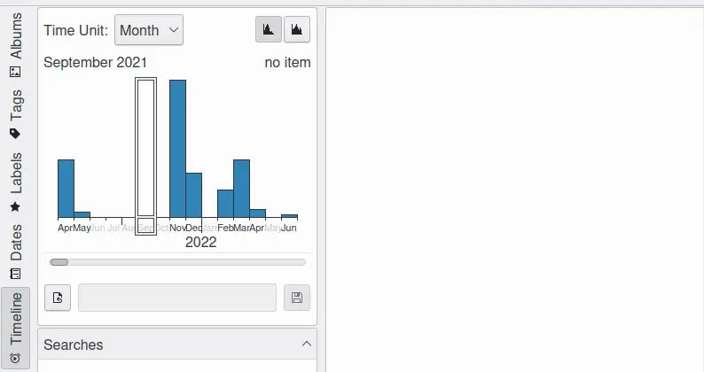

.. meta::
   :description: digiKam Main Window Timeline View
   :keywords: digiKam, documentation, user manual, photo management, open source, free, learn, easy, timeline, days, weeks, months, years

.. metadata-placeholder

   :authors: - digiKam Team

   :license: see Credits and License page for details (https://docs.digikam.org/en/credits_license.html)

.. _timeline_view:

Time-Line View
--------------

    The Timeline View

The Timeline View shows a timescale-adjustable histogram of the numbers of images per **Time Unit** which is selectable from a drop down field. Available time increments are **Day**, **Week**, **Month**, and **Year**.

The scaling buttons on the top right allow you to choose between a **Linear** or **Logarithmic** histogram. Click and drag over the histogram to display the photographs from a certain time frame, or just click on the corresponding histogram bar. You are not restricted to a single bar: :kbd:`Shift+left` click to select a range of bars from the histogram, and :kbd:`Ctrl+left` click to add additional bars to those already selected.

    Timeline Selection Screencast

In the text field below you can enter a title and save your selection. It will then appear in the **Searches** list field at bottom of the sidebar. But the best is still to come: the Timeline View offers a search within a search. If you have many searches saved in the database, the adaptive search field at the very bottom may help to find a certain entry in the list.

The date-range of the histogram is determined by the time stamp of items registered in the database. The height of the bars within the histogram are based on the number of items with dates within the time-resolution of each bar. Tall bars correspond to dates where a lots of photographs were taken during the same time-span.

The icon-view gives the search results of the selection of a dates. You can select items to post-process contents using the batch queue manager or export items to the Internet. You can also use the Right sidebar to further filter the icon view contents based on database properties.
