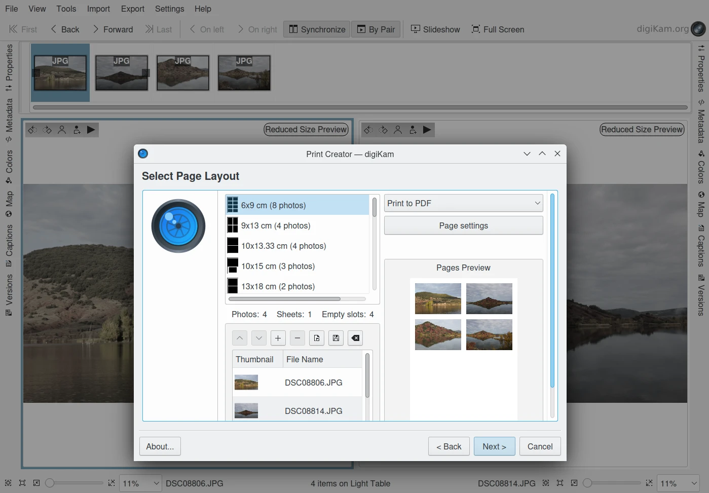

.. meta::
   :description: Overview to digiKam Light Table Advanced Features
   :keywords: digiKam, documentation, user manual, photo management, open source, free, learn, easy, light table, focus, points

.. metadata-placeholder

   :authors: - digiKam Team

   :license: see Credits and License page for details (https://docs.digikam.org/en/credits_license.html)

.. _lighttable_advanced:

:ref:`Advanced Features <light_table>`
======================================

.. contents::

.. _comparing_focuspoints:

Comparing The Focus Points
--------------------------

digiKam Light Table inherits some capabilities from the **Preview Mode** since it shares many of the same tools used in the **Main Window**. One very powerful feature is the Focus Points visualization that can be used when comparing images side by side.

Cameras can use some points (called auto focus or AF points) to assure that a specific region of the image is in focus. A well-focused image may also contain regions that are out-of-focus due to a limited depth of field, an effect that is often used artistically. The AF points can often be pre-defined by the camera or by the user, depending on the model of the camera.

There are only two cases supported by digiKam for AF points: in-focused points and selected points. In-focus points are the AF points determined by the camera, and selected points are the AF points set by the user. An AF point can also be both in-focus and selected, or neither.

.. figure:: images/light_table_comparing_focus_points.webp
    :alt:
    :align: center

    The digiKam Light Table Comparing Focus Points from a Series of Shots

On many cameras, each focus point is not just a point, but a rectangular region in the image. Focus Point displays an overlay of the focus region of image, the region that the camera was using to focus. Using the focus points visualization while previewing images side-by-side allows you to easily locate where the images should be in focus.

To Show the focus points over the preview image, select **Show Focus Points** from the context menu.

.. figure:: images/light_table_preview_context_menu.webp
    :alt:
    :align: center

    The digiKam Light Table Preview Canvas Context Menu

Comparing The Sidebars Contents
-------------------------------

One feature of the digiKam Light Table is the sidebar views available on the right and left sides. While the two sidebars are different in the Main Window, both sidebars in Light Table provide the same contents as provided in the **Main Window** right sidebar:

    - :ref:`Properties <properties_view>`: File and image properties, key shooting parameters.

    - :ref:`Metadata <metadata_view>`: Exif, Makernotes, IPTC, XMP, and ExifTool data.

    - :ref:`Colors <colors_view>`: Histograms and embedded ICC profiles.

    - :ref:`Maps <maps_view>`: View to show GPS location.

    - :ref:`Captions <captions_view>`: Comments, Date & Time setting, Labels, Rating, Tags, selected metadata.

    - :ref:`Versions <versions_view>`: Image history.

If both left and right sidebars are visible in Light Table, they can be used to compare information on left and right images on the Light Table. The metadata for the left image is shown in the left sidebar, and for the right image in the right sidebar. So selecting the same tab view in both sidebars, makes it easy to visually compare the differences in the metadata between the two images.

.. figure:: images/light_table_comparing_sidebars.webp
    :alt:
    :align: center

    The digiKam Light Table Used to Compare Left and Right Metadata Contents

Asset Management In Light Table
-------------------------------

As with the **Main Window** **Preview** Mode, the left and right Light Table preview images support a set of standard options from the context menu to apply :ref:`digital asset management <organize_find>` to your images.

Face Tagging
~~~~~~~~~~~~

The options below are available to help manage face detection and tagging:

- **Show Face Tags** to highlight face areas in the image.
- **Scan For Faces** to automatically detect faces in the image.
- **Add a Face Tag** to manually add a face area to an image.

.. figure:: images/light_table_face_management.webp
    :alt:
    :align: center

    The digiKam Light Table Editing a Face Tag from the Preview Canvas

The toolbar in the top left corner of the preview area also provides the same options to manage face detection and tagging. For more details about manual face tagging, please consult :ref:`the relevant section <face_tagging>` of this manual.

Assigning Ratings, Labels and Tags
~~~~~~~~~~~~~~~~~~~~~~~~~~~~~~~~~~

You can use the context menu on a preview image to easily assign Ratings, Labels, and Tags. Of course this menu is available in both the left and right pane. You can also use the **Caption** tab available on the left sidebar and on the right sidebar. More details about this tab is given in the :ref:`Captions View <captions_view>` section of this manual.

After assigning these kinds of properties, you can find the marked items using the **Labels** and **Tags** tabs in the Main Window left sidebar. This will allow you to quickly post-process items that you tagged during your review of the items in Light Table.

.. figure:: images/light_table_assign_labels.webp
    :alt:
    :align: center

    The digiKam Light Table Assigning a Color Label on the Left Context Menu

Working With Tools From Light Table
-----------------------------------

Similar to **Main Window**, the digiKam Light Table allows you to apply tools from the **View**, **Tools**, **Import**, or **Export** menus. Unlike Main Window, Light Table does not have the concept of albums or an icon-view where you can select items to process. Light Table has a thumbbar which is a flat list of items to review with the left and right panes.

If you preselected a list of items from the Main Window icon-view to view within Light Table, then any tools selected from the **View**, **Tools**, and **Export** menus will be applied to the current contents of the thumbbar. Nothing changes for tools that work with albums, since albums are still selectable in the tool session, independent of the thumbbar content.

The **Import** tools will simply append the new contents to the thumbbar.

    The digiKam Light Table Running the Print Creator Tool
