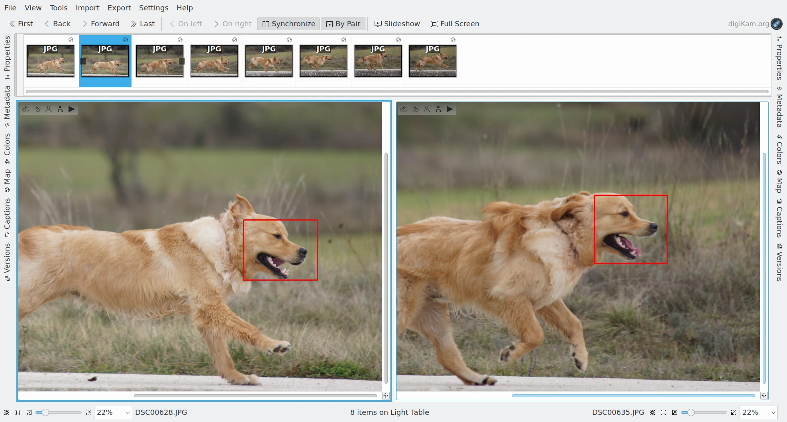
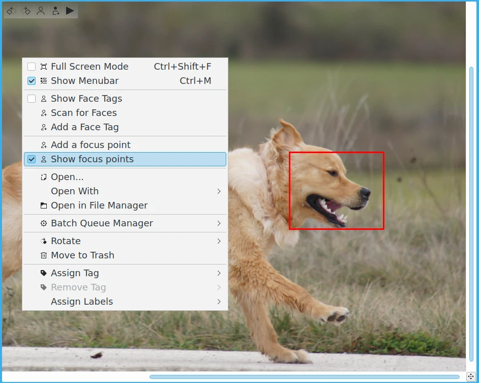
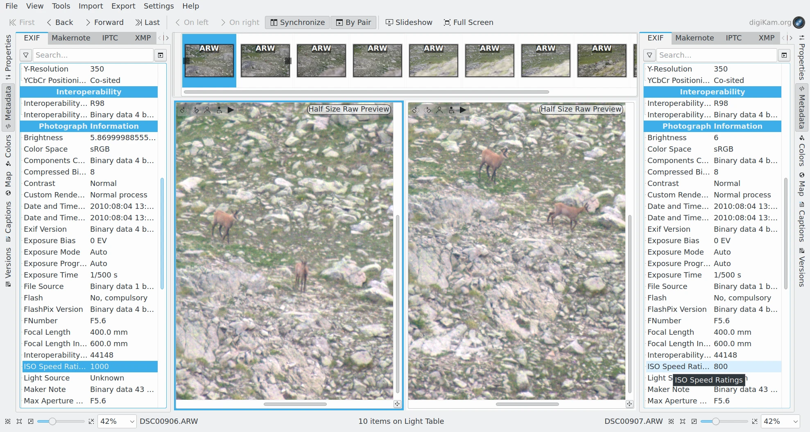
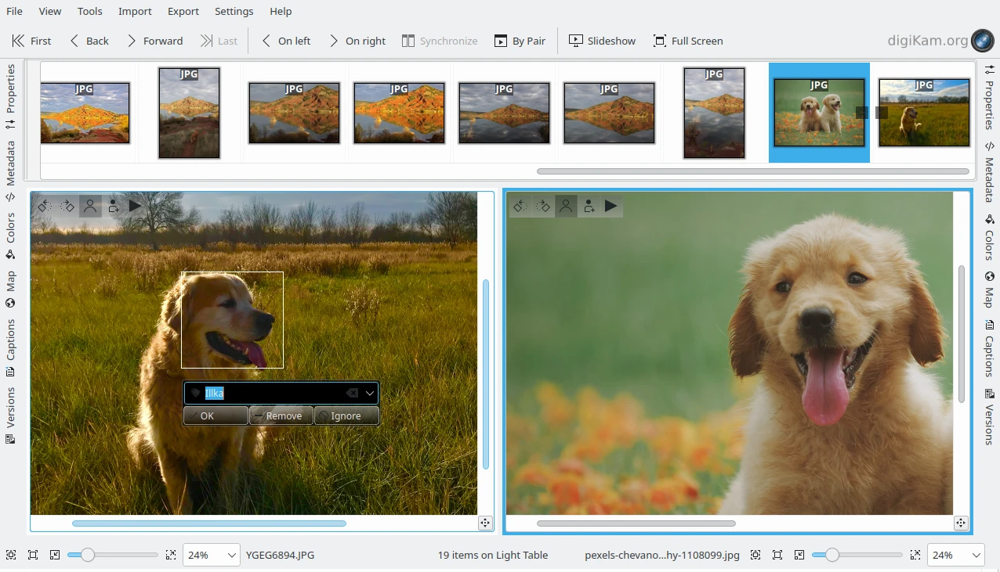
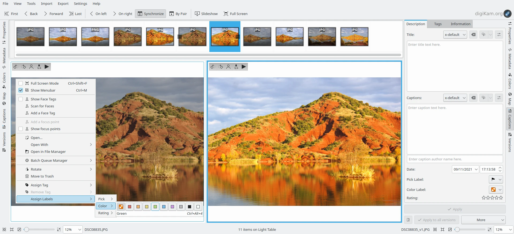

.. meta::
   :description: Overview to digiKam Light Table
   :keywords: digiKam, documentation, user manual, photo management, open source, free, learn, easy, light table, focus, points

.. metadata-placeholder

   :authors: - digiKam Team

   :license: see Credits and License page for details (https://docs.digikam.org/en/credits_license.html)

.. _lighttable_advanced:

Advanced Features
=================

.. contents::

.. _comparing_focuspoints:

Comparing The Focus Points
--------------------------

digiKam Light Table inherits of the **Preview Mode** capabilities as it share same tools used in background by **Main Window**. One very powerful feature is the Focus Points visualization while comparing images side by side.

Camera can use some points (name auto focus points) on image to make the region around sharper. Besides, it blurs the further region, in order to make an artistic product. These points are named AF points. They can be pre-defined by camera or by user, depend on model of camera. There are only two cases supported by digiKam for AF points: infocused and selected. Infocuses points are the points sharpened by camera, when selected points are the points expected to be clear by user. An point can be both in 2 cases (infocus-selected) or neither both (inactive).

    The digiKam Light Table Comparing Focus Points From a Series Of Shots

Each point is not only a point on the image but a rectangle. FocusPoint is used to recognized focus region of image. This is a region where user expected to be clear. Using the focus points visualization while previewing image side by side allows to be sure that the best image was taken with right in-focus shot conditions.

To Show the focus points over the preview canvas, select **Show Focus Points** from context menu.

    The digiKam Light Table Preview Canvas Context Menu

Comparing The Sidebars Contents
-------------------------------

One particularity on digiKam Light Table is the sidebar views available on the right and on the left sides. Both visualize provide the same contents as with **Main Window** right sidebar:

    - :ref:`Properties <properties_view>`: File and image properties, key shooting parameters.

    - :ref:`Metadata <metadata_view>`: Exif, Makernotes, IPTC, XMP, and ExifTool data.

    - :ref:`Colors <colors_view>`: Histograms and embedded ICC profiles.

    - :ref:`Maps <maps_view>`: View to show GPS location.

    - :ref:`Captions <captions_view>`: Comments, Date & Time setting, Labels, Rating, Tags, selected metadata.

    - :ref:`Versions <versions_view>`: Image history.

If both left and right sidebar are visible in Light Table, they can be used to compare images information loaded in left and right canvas preview. When you change the item on the right side, right sidebar contents will be updated. In opposite, left side contents will still the same. If both sidebar show the same tab view (as metadata for example), they can be used to compare visually the differences and select the best shot to mark in your workflow.

    The digiKam Light Table Used To Compare Left And Right Metadata Contents

Asset Management In Light Table
-------------------------------

As with the **Main Window** **Preview** Mode, the left and right Light Table preview canvas propose the standard options from the context menu to apply the :ref:`digital asset management <organize_find>` with your images.

Faces Tagging
~~~~~~~~~~~~~

To manage faces information, the options below are available:

- **Show Face Tags** to highlight face areas over the image.
- **Scan For Faces** to start an automatic faces detection on image.
- **Add a Face Tag** to add manually a face area over the image.

    The digiKam Light Table Editing A Face Tag From The Preview Canvas

The tool-bar on top left corner of preview canvas provide also the same options to manage faces. For more details about the manual face tagging, please consult :ref:`the relevant section <manual_face_tagging>` of this manual.

Assigning Rate Labels and Tags
~~~~~~~~~~~~~~~~~~~~~~~~~~~~~~

To manage Rate, Labels, and Tags, you can use the preview canvas context menu where the relevant entries allows to assign easily this properties. Of course this menu is available to the left and right pane. You can also use the **Caption** tab avaialble on the left sidebar and on the right sidebar. More details about this tab is given in the :ref:`Caption View section <captions_view>` of this manual.

After assigning these kind of properties, you can found the marked items to the **Labels** and **Tags** tabs from the Main Window left sidebar. This will allows you to post-process quickly these items in your workflow, after a triaging with the Light table.

    The digiKam Light Table Assigning A Color Label On The Left Context Menu
