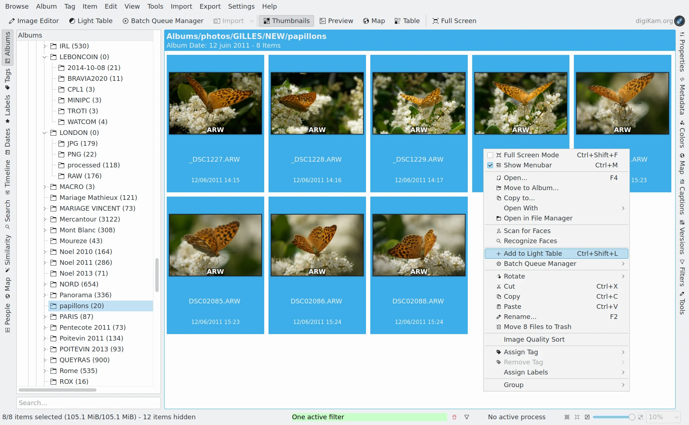

.. meta::
   :description: Overview to digiKam Light Table
   :keywords: digiKam, documentation, user manual, photo management, open source, free, learn, easy, light table, synchronize, by-pair, compare, preview, canvas

.. metadata-placeholder

   :authors: - digiKam Team

   :license: see Credits and License page for details (https://docs.digikam.org/en/credits_license.html)

.. _lighttable_overview:

:ref:`Overview <light_table>`
=============================

.. figure:: images/light_table_main_view.webp
    :alt:
    :align: center

    Comparing Two RAW Files Side by Side in the Light Table

digiKam's Light Table feature works in a separate window to easily compare images. It works with all supported image formats including RAW files.

    The Main Icon-View Context Menu Used to Add Items to the Light Table

To use the Light Table you must first select a set of images to examine with Light Table. Select one or several images in any view from the main window, then select :menuselection:`Item --> Place onto Light Table` :kbd:`CTRL+L` to place the selected images on the Light Table and open the Light Table window. Selecting :menuselection:`Item --> Add to Light Table` :kbd:`CTRL+SHIFT+L` will add the selected images to the images that are already on the Light Table. You can also select **Add to Light Table** from the context menu for the selected images.

You can quickly access the Light Table from the digiKam main window using :menuselection:`Tools --> Light Table` :kbd:`SHIFT+L` or by clicking the **Light Table** button in the Main Toolbar.

.. figure:: videos/light_table_item_selection.webp
    :width: 600px
    :alt:
    :align: center

    Screencast of the digiKam Light Table Item Selection from the Thumbbar
