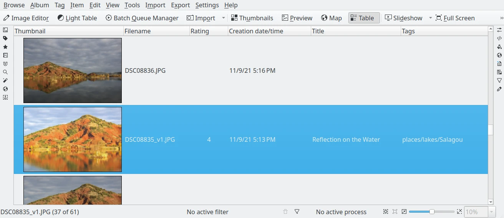

.. meta::
   :description: Using the digiKam Main Window to Show Collection Contents
   :keywords: digiKam, documentation, user manual, photo management, open source, free, help, learn, main window, management

.. metadata-placeholder

   :authors: - digiKam Team

   :license: see Credits and License page for details (https://docs.digikam.org/en/credits_license.html)

.. _main_window:

###########
Main Window
###########

This section explains how to use the digiKam main window.

.. toctree::
   :maxdepth: 2
   :caption: Contents:
   :glob:

   main_window/interface_layout.rst
   main_window/image_view.rst
