.. meta::
   :description: digiKam Main Window Image View
   :keywords: digiKam, documentation, user manual, photo management, open source, free, learn, easy, image, view, tooltip, table, group

.. metadata-placeholder

   :authors: - digiKam Team

   :license: see Credits and License page for details (https://docs.digikam.org/en/credits_license.html)

.. _image_view:

Image View
----------

General Information
~~~~~~~~~~~~~~~~~~~

In all eight areas the Image View shows the result of your selection or search on the Left Sidebar in the Icon Area. Each image is displayed as a thumbnail. You can alter the size of the thumbnails using the magnifier slider close to the right end of the status bar.

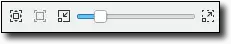

    The digiKam Main Window Zoom Bar Located in Status Bar

The first time you select an Album you may have to wait briefly while the thumbnails are generated.

Information about each photograph is displayed below each thumbnail. You can control what information is displayed from the :menuselection:`Settings --> Configure digiKam...` dialog. Select the **Album View** page and look for the **Icon-View Options** section.

The thumbnails have Tool Tips which will pop up if you allow the mouse to dwell over a thumbnail for a moment. The Tool Tip shows the most important properties of the photograph including any tags that you have applied.

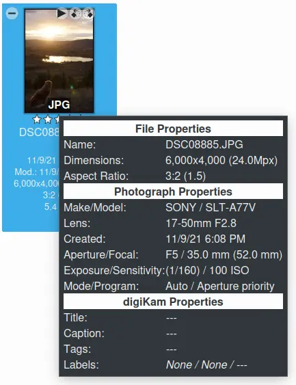

    The digiKam Main Window Tool Tip

The content of the Tool Tips can be configured in :menuselection:`Settings --> Configure digiKam...` from the **Tool Tip** dialog page.

As an alternative you can display the photographs in a table by hitting the **Table** button on the Main Toolbar or by selecting :menuselection:`View --> Table` menu from the menu bar. This allows to see a lot of photographs at the same time (Tip: leave away the thumbnail column) in a way you can customize the usual way by clicking with the right mouse button on the headline bar and choosing the information you want to see. Clicking with the left mouse button on a line in the table will open the preview of that photograph.

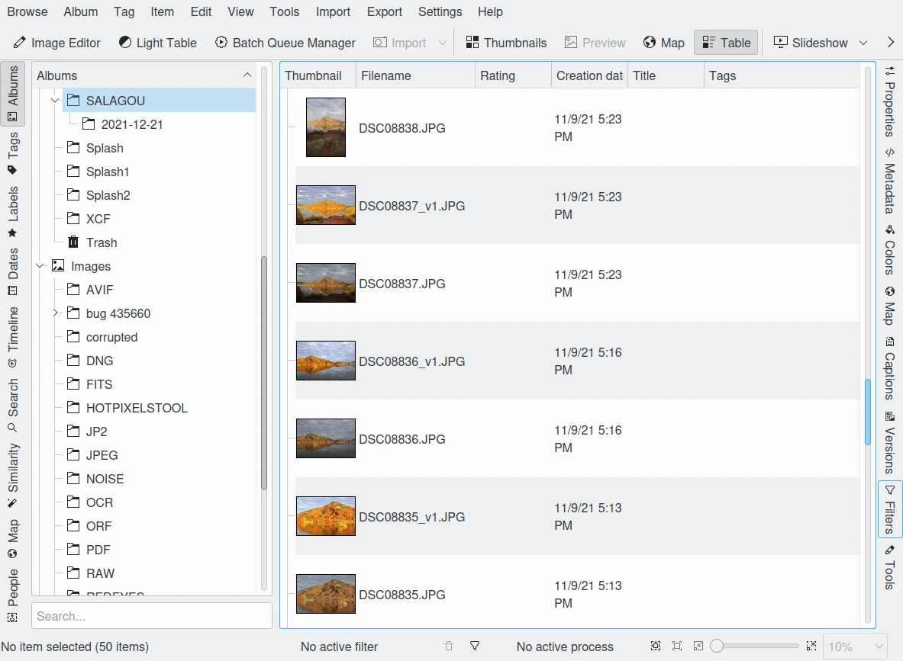

    The digiKam Main Window Table Mode

You can access most of the functions that digiKam can perform on a photograph by clicking with the right mouse button over the thumbnail or line in the table (context menu) or by selecting from the **Item** menu in the menu bar.

.. _viewing_photograph:

Viewing an Image
~~~~~~~~~~~~~~~~

There are several possibilities to view an image. You can either click on it, select :menuselection:`View --> Preview` :kbd:`F3` from the menu bar or select **Preview** from the context menu. The Preview Area will open and the Icon Area will be reduced to one line. For viewing it larger, click the sidebars away (by just clicking on the active button on them). An even larger view you can achieve by clicking the **Show Fullscreen** icon |icon_fullscreen| either on the thumbnail or on the preview. While viewing images you can take action from the context menu at any time (not in fullscreen mode). To close the preview, just click again or press :kbd:`Esc` or :kbd:`F3` or click the **Table** or **Thumbnails** button on the Main Toolbar.

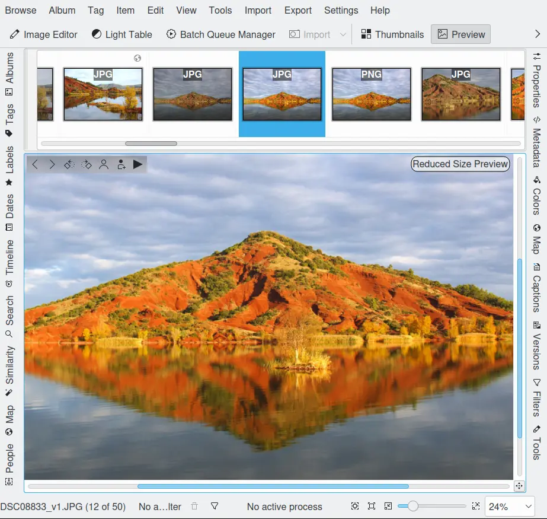

    The digiKam Main Window Preview Mode

.. note::

    The thumb bar located on top of preview canvas (optional - see Settings menu entry) can be relocated on left, right, or bottom side. An anchor on the left side of thumb bar allows to move it with the mouse at the wanted place.

You can also view your images in a :ref:`slideshow <slide_tool>` using the **Slideshow** drop down menu from the Main Toolbar. You have the choice to start a slideshow with a selection of photographs, the whole content of the folder (or search result) or even including all subfolders.

.. _editing_photograph:

Editing a Photograph
~~~~~~~~~~~~~~~~~~~~

You can open the Image Editor on a photograph either clicking the **Image Editor** button on the Main Toolbar or by selecting :menuselection:`Item --> Open...` :kbd:`F4` from the menu bar or clicking with the right mouse button and selecting **Open...** from the context menu. See the digiKam :ref:`Image Editor <image_editor>` section for instructions on how to edit your photographs. The Image Editor offers a wide range of tools to enhance, decorate and/or modify your photographs.

.. _editing_external:

Viewing or Editing a Photograph With Another Application
~~~~~~~~~~~~~~~~~~~~~~~~~~~~~~~~~~~~~~~~~~~~~~~~~~~~~~~~

Sometimes digiKam may not provide all of the capabilities you need. You can open a photograph in another application by clicking with the right mouse button on it and selecting from the **Open With...** sub-menu. The list of applications that appear in this menu is controlled by the standard desktop file associations for the image format type of this photograph. Consult the desktop manual for instructions on changing these file associations if the application that you need is not listed.

Note that there can be a problem with meta-data embedded in photographs when they are edited by other image manipulation applications. Some applications do not retain the photograph's meta-data when you save a modified image. This means that if you modify a photograph using one of these programs you will lose information such as orientation, aperture etc. that are stored in the Exif, IPTC, and XMP tags.

.. _lossless_rotation:

Lossless Image Rotation
~~~~~~~~~~~~~~~~~~~~~~~

.. note::

     There is a difference between rotating a photograph in one of the Views of digiKam or in the Image Editor. The Image Editor uses a different method of rotating an image, you may not notice any difference but the Image Editor method can cause some loss of quality in the photograph when saving the picture as JPEG. The rotation methods described here preserve the original quality of the photograph also in JPEG - Files.

digiKam provides two ways to get your photographs the right way up. The simplest method is to click one of the rotate icons on the thumbnail or the preview or to click with the right mouse button for the context menu and select **Rotate** and then pick the direction of rotation needed.

The second method is to select :menuselection:`Item --> Auto Rotate/Flip Using Exif Information` from the menu bar. Most digital cameras have an orientation sensor. This sensor can detect how you hold the camera while taking an image. It stores this orientation information inside the image. This meta data is stored in an embedded meta-data section called Exif. The cameras could rotate the image themselves right away, but they have limited processing power, so they leave this job to an application like digiKam. If the camera is storing the orientation, then digiKam can use it to automatically rotate your photographs so that they are the correct way up when you display them. digiKam will rotate the image on disk according to this orientation information.

The photograph is rotated without loss of quality and the orientation information is set to normal, so that other Exif-aware applications will handle it correctly. The :ref:`Import Tool <advanced_import>` can perform this operation automatically when it uploads the photographs from your camera which will ensure that your photographs are always the right way up. The rotate operation will do nothing if your camera does not include this information in the photos.

.. _renaming_photograph:

Renaming a Photograph
~~~~~~~~~~~~~~~~~~~~~

You can change the filename for a photograph by clicking with the right mouse button over a thumbnail and selecting **Rename...** :kbd:`F2`. You can also select multiple photographs to batch rename files. A dialog will open showing the list of selected photographs with their current name and the new name.

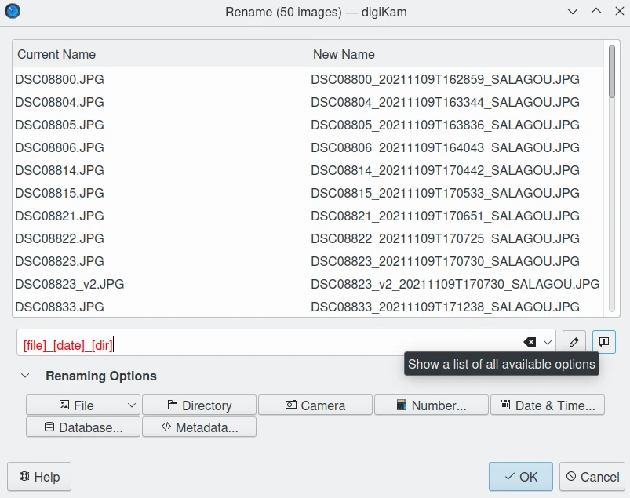

    The digiKam Advanced Rename Tool Dialog

The renaming pattern can be customize with the **Renaming Options** collection on the bottom which contains original file name, file extension, owner and group, directory, a dialog for defining a sequence number and a dialog for adding date and time information, either fixed or based on the time information written by the camera into the image file. Each option appended to the renaming pattern can be customized with the **Modifier** button on the right side of renaming pattern editor.

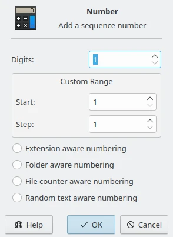

    The Advanced Rename Sequence Number Dialog to Setup Modifiers in Renaming Pattern

In the sequence **Number** dialog you will find following options:

- **Extension aware numbering**: will start a new sequence for every file extension.
- **Folder aware numbering**: will start a new sequence for every folder.
- **File Counter aware numbering**: will searches for the highest used counter in the filename from the image's directory and continues it.
- **Random text aware numbering**: will generate a hexadecimal random numeric code string for the numbering. It is a random number with up to 31 digits. Use many *#* to render a unique code in your renaming scheme.

The **Date and Time** selection dialog looks like this:

.. figure:: images/mainwindow_advanced_rename_date_selector.webp
    :alt:
    :align: center

    The Advanced Rename Date Selector to Setup Modifiers in Renaming Pattern

The calendar is active only if **Fixed Date** is selected from the **Source** drop down field. This way you can add the same date and time information to the filenames of all imported images or videos. If **Image** is selected instead digiKam will use the time information from the metadata of the image files. With the **Format** drop down field you can choose from several standard date/time formats and a custom format. For the latter choose **Custom** in **Format** drop-down list and fill in.

The **Format** string from **Date and Time** dialog determines the content of the date generated during download. Any sequence of characters enclosed in single quotes will be included verbatim in the output string, even if it contains formatting characters. Two consecutive single quotes ("''") are replaced by a single quote in the output. All other characters in the format string are included verbatim in the output string.

Formats without separators (e.g. *ddMM*) are supported but must be used with care, as the resulting strings aren't always reliably readable (e.g. if *dM* produces *212* it could mean either the 2nd of December or the 21st of February). Example format strings, assumed that the date is *21 May 2001 14:13:09.120*:

============== =============
Format         Result
============== =============
dd.MM.yyyy     21.05.2001
ddd MMMM d yy  Tue May 21 01
hh:mm:ss.zzz   14:13:09.120
hh:mm:ss.z     14:13:09.12
h:m:s ap       2:13:9 pm
============== =============

The **Database** dialog allows to select items information registered in database as **Modifiers**.

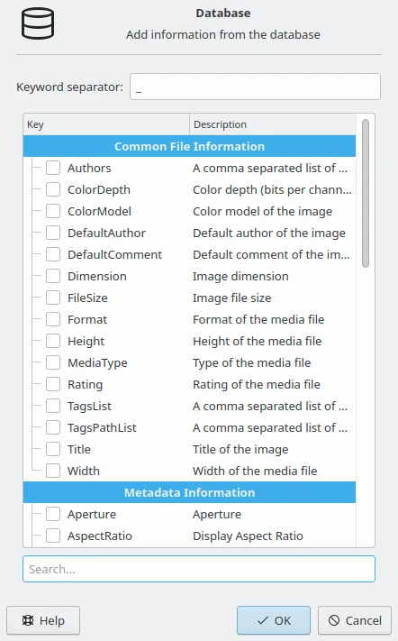

    The Advanced Rename Database Dialog to Setup Modifiers in Renaming Pattern

The **Metadata** dialog allows to select files metadata information taken from **Exif**, **IPTC**, **XMP**, etc, as **Modifiers**.

.. figure:: images/mainwindow_advanced_rename_metadata.webp
    :alt:
    :align: center

    The Advanced Rename Metadata Dialog to Setup Modifiers in Renaming Pattern

In addition these options can be customized further with the help of a number of **Modifiers**. To apply a modifier, append it to the option, for instance ``[file]{upper}``. A list of all **Options** and **Modifiers** together with a short explanations will open when clicking the info button.

======================= =============================================================================================================================================================================
Options                 Description
======================= =============================================================================================================================================================================
[file]                  File name
[ext]                   File extension, prepend with a '.' character, to modify the real file extension
[user]                  Owner of the file
[group]                 Group of the file
[dir]                   Directory name
[dir.]                  Name of the parent directory, additional '.' characters move up in the directory hierarchy
[cam]                   Camera name
#                       Sequence number
#[options]              Sequence number (options: c = file counter aware, e = extension aware, f = folder aware, r = random aware, ce = counter and extension aware, re = random and extension aware)
#[options,start]        Sequence number (custom start)
#[options,step]         Sequence number (custom step)
#[options,start,step]   Sequence number (custom start and step)
[date]                  Date and time (Standard format)
[date:key]              Date and time (key = Standard|ISO|UnixTimeStamp|Text)
[date:format]           Date and time (format settings)
[meta:key]              Add metadata information
======================= =============================================================================================================================================================================

=============================== ===============================================================================================================================================================================================================
Modifiers                       Description
=============================== ===============================================================================================================================================================================================================
{upper}                         Convert to uppercase
{lower}                         Convert to lowercase
{firstupper}                    Convert the first letter of each word to uppercase
{trim}                          Remove leading, trailing and extra whitespace
{unique}                        Add a suffix number to have unique strings in duplicate values
{unique:n}                      Add a suffix number, n specifies the number of digits to use
{unique:n,c}                    Add a suffix number, n specifies the number of digits to use, c specifies the separator char before the numbers, a optional to include all options for uniqueness, 0 optional to always pad with n zero digits
{removedoubles}                 Remove duplicate words
{default:"value"}               Set a default value for empty strings
{replace:"old","new",options}   Replace text (options: r = regular expression, i = ignore case)
{range:from,to}                 Extract a specific range (if to is omitted, go to the end of string)
=============================== ===============================================================================================================================================================================================================

.. tip::

    The sequence number may be needed if you have a camera with a very fast multi-shoot mode where it is possible to get two photographs with exactly the same data and time.

    To apply a modifier, append it to the option, for instance: [file]{upper}.

    Modifiers can be applied to every renaming option.

    It is possible to assign multiple modifiers to an option, they are applied in the order you assign them.

    Be sure to use the quick access buttons: They might provide additional information about renaming and modifier options.

    The file list can be sorted, just right-click on it to see the sort criteria (album view only).

You can also batch rename photographs using the :ref:`Batch Queue Manager <batch_queue>` :kbd:`B`, or with the :ref:`Import Tool <advanced_import>` during downloads from camera. These two are mostly the same. Place the cursor in the renaming pattern editor, type in something and/or select **Modifiers** and **Options** from the buttons.

.. _deleting_photograph:

Deleting a Photograph
~~~~~~~~~~~~~~~~~~~~~

When you delete a photograph from digiKam with :menuselection:`Item --> Move to Trash` :kbd:`Del` it will be moved from its folder on the hard disk to the internal **Trash** Can.

Deleting works from anywhere in any digiKam window.

digiKam will ask you confirmation before to move items to trash with the dialog below.

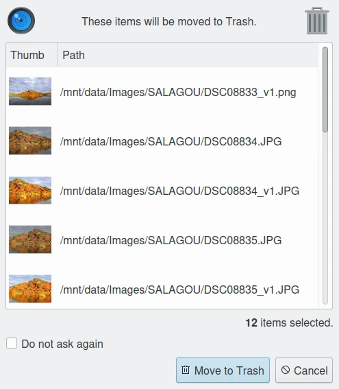

    The digiKam Move to Trash Dialog

For each collection registered in the database, digiKam handles an internal trash-bin. Physically, the trash is located at the root album corresponding to the collection entry. It's an hidden folder :file:`.dtrash` storing deleted items in a subdirectory named :file:`files`, and information about the deletion stored in another subdirectory named :file:`info` with Json sidecars (:file:`.dtrashinfo`). Deleting a file in the collection does not remove the file from the media, but moves the file into this container, and the items are not registered anymore in the digiKam database.

The trash-bin is accessible from the left sidebar tab **Albums** as the last entry of the tree-view corresponding to a collection and is named **Trash**. As the trash-view is a special container in digiKam, the layout of the trash-bin contents is a list based on a table-view and it cannot be changed. The trash-bin items details can always be displayed in the right sidebar using **Properties**, **Metadata**, **Colors**, and **Map** tabs but information are taken from the files, not the database, and cannot be editable from the **Captions** tab. **Versions** and **Filters** tabs cannot be used too with the trash-bin.

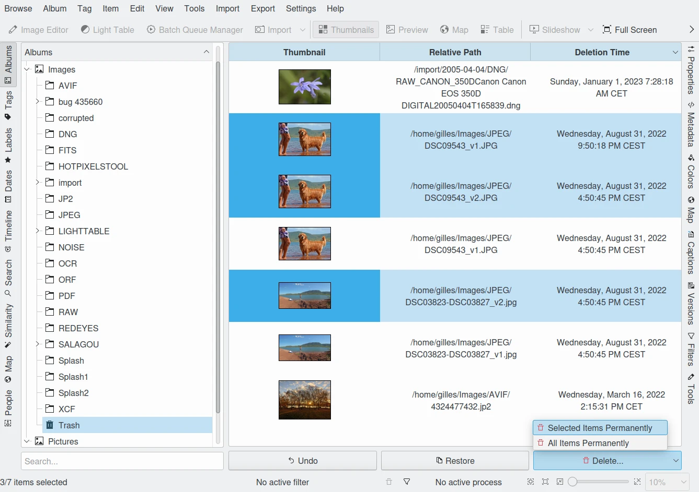

    The digiKam Internal Trash-Bin Exists for All Collections Registered in the Database

.. note::

    digiKam does not use the Desktop recycler as operations to move files to delete from a network collection will take a while. It will be exactly the same problem with a collection hosted in a different disk partition than your home directory managed by the Desktop. Moving items to delete to a self-contained trash-bin from the collection will be universal and fast.

On the bottom of the trash-bin view, a series of buttons allows to restore files in collection or delete them permanently. These are:

    - **Undo**: to restore only the last entry in the trash-bin.
    - **Restore**: to restore selection of files from the trash-bin.
    - **Delete**: to remove **permanently** the items selection or all items from the trash-bin.

All these options are also available on the context menu from the list of trash-bin. When one **Delete** option is selected, the relevant operation processed on trash-bin items will be confirmed to the user.

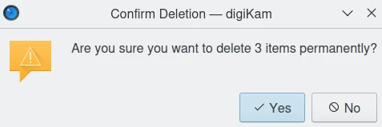

    The digiKam Internal Trash-Bin Asks to Confirm the Permanently Deletion of Items

.. important::

    As physically the trash-bin container is located in the root album from a collection, if you backup a collection on a separated media, you will backup also the corresponding trash-bin container safety.

.. _grouping_photograph:

Grouping Photographs
~~~~~~~~~~~~~~~~~~~~

Grouping items is a very useful way to organize Photographs and/or videos that are related to each other and to adjust the way they are displayed in the image area. This function is available through the context menu on a selection of items (more than one item selected).

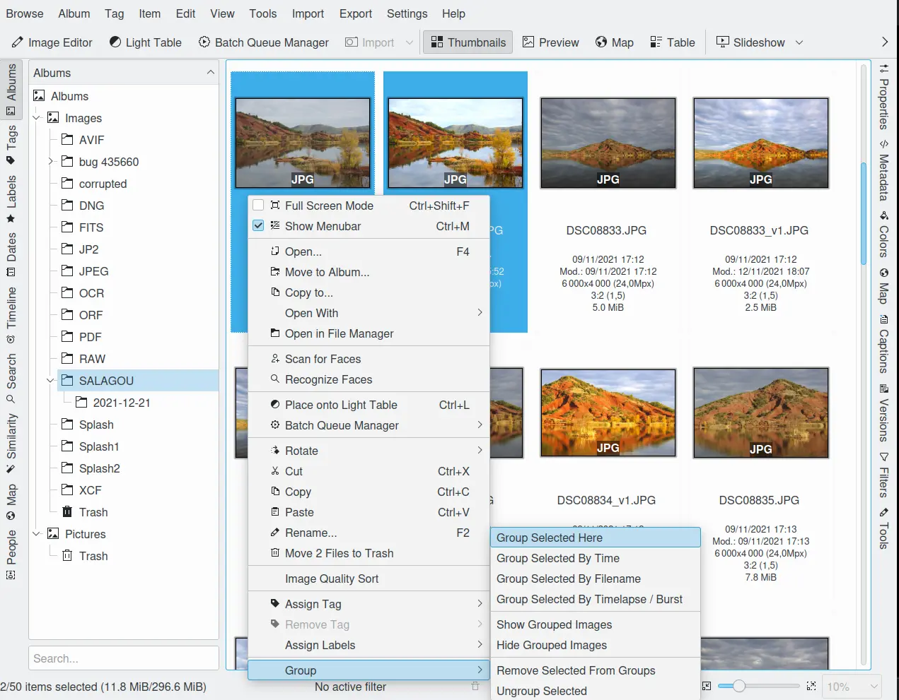

    The digiKam Icon-View Grouped Items Options From Context Menu

You can put the whole selection into one group using **Group Selected Here** or you can create more than one group determined by time (seconds will be ignored) or by file name. Note that the latter will put items with the same name but different file types into one group. Use case see further below.

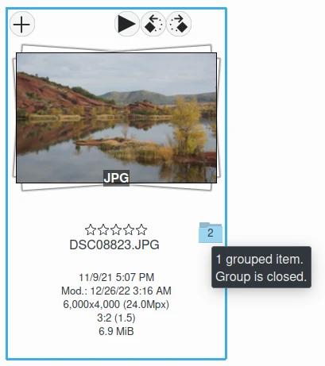

    The digiKam Icon-View Grouped Mode From Icon-View

.. important::

    If you group files automatically based on filename, the smaller file size from the group is preferred as the leading item. The idea is that when previewing, faster loading of the image will allow for a quick preview.

    If you group files manually from icon-view, the selected item used to show context menu and group files will be used as leading item.

The next group in the menu is to control whether only the reference icon of the group (the first of the group according to the sorting order at the moment of grouping) is displayed or all of them. These two functions can also be accessed by the little grouping indicator (folder symbol with number) on the reference icon.

.. note::

    In Icon-View, you can turn on/off the frame over groupped item thumbnails with an option from :ref:`Setup/Miscs/Appearance <appearance_settings>` settings.

While the mouse pointer is hovering over it there will pop up an information **n grouped items. Group is closed/open.** where *n* indicates the number of items in the group which are invisible if the group is closed. Clicking on the indicator toggles between **open** and **closed**.

In the **Table Mode** of the Image Area groups are indicated the way we know from many other lists and tables: with a little triangle in front of the reference item. Clicking on this triangle will fold out/in the grouped items.

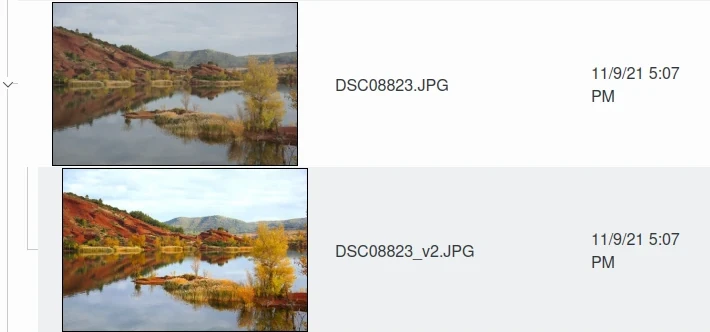

    The digiKam Icon-View Grouped Mode From Table View

The last group in the **Group** context menu allows to remove individual items from the group or to disband the whole group. The content of the menu will change depending on whether you use it on a selection of still un-grouped items, on a group or on single items of a group.

What can you do with a group? In terms of functions of digiKam you can perform a lot of operations like copy, delete, move, rotate on the whole group by selecting only the reference icon provided the group is closed. The same way you can load the whole group into tools like Light Table or the Batch Queue Manager, even into the Image Editor where you can navigate through the group members with the page keys on your keyboard. You can assign tags and labels (see further in this manual) and also write descriptions (see :ref:`Captions <captions_view>`). Give it a try.

.. note::

    Operations to perform over grouped items are managed by Setup/Miscs/Grouping settings. See :ref:`this section <grouping_settings>` from the manual for details.

In terms of use cases you can for instance group videos together with the .jpg - images related to them which most cameras provide or RAW images with their JPG counterpart. This is made easy by **Group Selected By Filename**. In the screenshot above exposure bracketed images are being grouped. One could do the same for archiving purposes with images used for a panorama. If you have very specific requirements for documenting of editing steps the :ref:`Versions <versions_view>` function of digiKam cannot meet you may find a solution using grouping. We can think of more use cases for grouping but We don't want to overload this section of the handbook here. Maybe a last hint for your own ideas: grouping is not restricted to items out of the same album. The whole group (open or closed) will only be visible in the album of the reference item. The other members of the group will be visible in their own albums only if the group is open. Can be confusing, use with care.

.. note::

     Everything described in this Grouping section has nothing to do with **Group Images** in the **View** menu. That function doesn't form permanent groups of items, it only organizes the way icons are displayed in the Icon-View.
