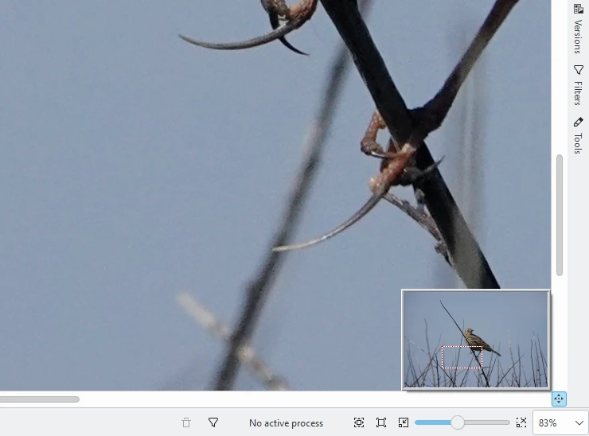
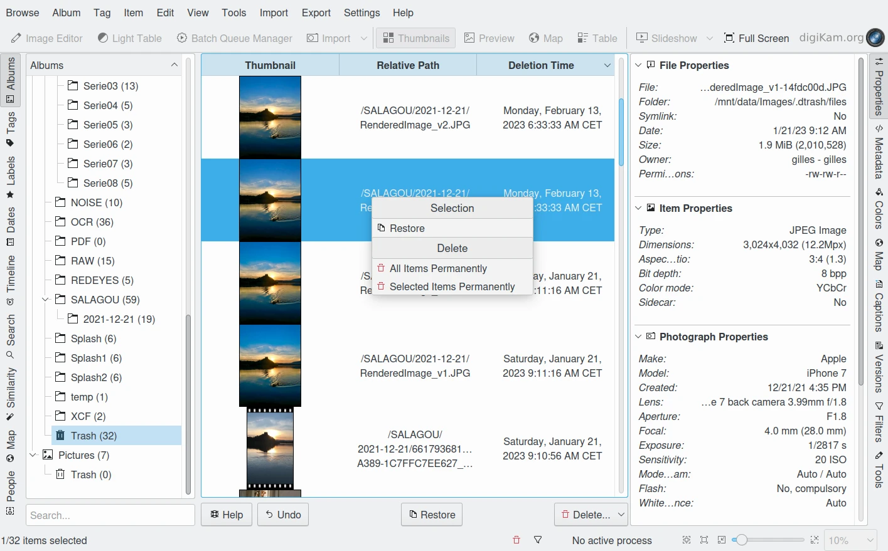

.. meta::
   :description: digiKam Main Window Image View
   :keywords: digiKam, documentation, user manual, photo management, open source, free, learn, easy, image, view, tooltip, table, group

.. metadata-placeholder

   :authors: - digiKam Team

   :license: see Credits and License page for details (https://docs.digikam.org/en/credits_license.html)

.. _image_view:

:ref:`Image View <main_window>`
===============================

.. contents::

General Information
-------------------

Image thumbnails are shown in the Icon Area of the Image View for all images selected from either the Left or Right Sidebar. You can alter the size of the thumbnails using the magnifier slider close to the right end of the status bar. All eight areas are updated based on any selection of thumbnails within the Icon Area.

.. figure:: images/mainwindow_zoombuttons.webp
    :alt:
    :align: center

    The digiKam Main Window Zoom Bar Located in Status Bar

The first time you select an Album you may have to wait briefly while the thumbnails are generated.

Information about each photograph is displayed below each thumbnail. You can control what information is displayed from the :menuselection:`Settings --> Configure digiKam...` dialog. Select the **Album View** page and look for the **Icon-View Options** section.

The thumbnails have Tool Tips which will pop up if you allow the mouse to dwell over a thumbnail for a moment. The Tool Tip shows the most important properties of the photograph including any tags that you have applied.

.. figure:: images/mainwindow_tooltip.webp
    :alt:
    :align: center

    The digiKam Main Window Tool Tip

The content of the Tool Tips can be configured in :menuselection:`Settings --> Configure digiKam...` from the **Tool Tip** dialog page.

As an alternative you can display the photographs in a table view by hitting the **Table** button on the Main Toolbar or by selecting the :menuselection:`View --> Table` item from the menu bar. This allows you to see a lot of photographs at the same time. Click with the left mouse button on the column headers to sort the table. Right click on a header to add or remove columns. (Tip: Using right click to remove the thumbnail column will make the list far more compact.) Clicking with the left mouse button on a line in the table will open the preview of that photograph.

.. figure:: images/mainwindow_table_view.webp
    :alt:
    :align: center

    The digiKam Main Window Table Mode

You can access most of the functions that digiKam can perform on a photograph by clicking with the right mouse button over the thumbnail, or line in the table (context menu), or by selecting from the **Item** menu in the menu bar.

.. _viewing_photograph:

Viewing an Image
----------------

.. |icon_fullscreen| image:: images/mainwindow_icon_fullscreen.webp

There are several ways to view an image. You can either click on it, select :menuselection:`View --> Preview` :kbd:`F3` from the menu bar, or select **Preview** from the context menu. The Preview Area will open and the Icon Area will be reduced to a single line. To increase the size of the Preview image, collapse the sidebar areas (by just clicking on the active tab on each sidebar). An even larger view can be achieved by clicking the **Show Fullscreen** icon |icon_fullscreen| either on the thumbnail, or on the preview. While viewing images you can take action from the context menu at any time, except in fullscreen mode. To close the preview, just click again or press :kbd:`Esc` or :kbd:`F3` or click the **Table** or **Thumbnails** button on the Main Toolbar.

.. figure:: images/mainwindow_preview.webp
    :alt:
    :align: center

    The digiKam Main Window Preview Mode

Each time digiKam starts, the zoom in Preview mode will be adjusted to allow the image to have as much space as possible. The zoom control in the status bar controls the size of thumbnails in thumbnail mode, and the size of the Preview image in Preview mode. When zoom is used in Preview mode, a zoom mark appears at the bottom right of the windows at the intersection of the scroll bars. Clicking on the zoom mark will bring up a small display with the overall image and an inset red rectangle representing the viewed portion of the image. Drag the mouse over the displayed image to move the view port to where you want and release the mouse.
This same tool is also available in the Light Table and Image Editor.

    Detail of the zoom locator in Preview Mode

.. note::

    On some systems, the scroll bar located on top of the preview canvas (optional - see Settings menu entry) can be relocated to the left, right, or bottom side. Grab the anchor on the left side of scroll bar with the mouse to move the scroll bar to the desired window edge.

You can also view your images in a :ref:`slideshow <slide_tool>` using the **Slideshow** drop down menu from the Main Toolbar. You have the choice to start a slideshow with a selection of photographs, the whole content of the folder (or search result) or even including all subfolders.

.. _editing_photograph:

Editing a Photograph
--------------------

You can open the Image Editor on a photograph by either clicking the **Image Editor** button on the Main Toolbar, or by selecting :menuselection:`Item --> Open...` :kbd:`F4` from the menu bar, or by clicking with the right mouse button and selecting **Open...** from the context menu. See the digiKam :ref:`Image Editor <image_editor>` section for instructions on how to edit your photographs. The Image Editor offers a wide range of tools to enhance, decorate and/or modify your photographs.

.. _editing_external:

Viewing or Editing a Photograph With Another Application
--------------------------------------------------------

When digiKam does not provide all of the capabilities you need, you can open a photograph in another application by clicking on the photograph with the right mouse button and selecting from the **Open With...** sub-menu. The list of applications that appear in this menu is controlled by the standard operating system file associations for the image format type of this photograph. If the application that you need is not listed, consult the operating system manuals for instructions on changing these file associations .

Note that there can be a problem with metadata embedded in photographs when they are edited by other image editing applications. Some applications do not retain the photograph's metadata when you save a modified image. This means that if you modify a photograph using one of these programs you will lose information such as orientation, aperture etc. that are stored in the Exif, IPTC, and XMP tags. These metadata will still be stored in the digiKam database, so you can select :menuselection:`Item --> Write Metadata to File` to rewrite the metadata into the image file.

.. _lossless_rotation:

Lossless Image Rotation
-----------------------

.. note::

     There is a difference between rotating a photograph in one of the Views of digiKam or in the Image Editor. While you may not notice the difference, the rotation method used in the Image Editor can cause some loss of quality in the photograph when saving the picture as JPEG. The rotation methods used in the rest of digiKam that are described here preserve the original quality of the photograph in all file formats, including JPEG.

digiKam provides two ways to get your photographs the right way up. The simplest method is to click one of the rotate icons on the thumbnail or the preview, or to click with the right mouse button for the context menu and select **Rotate** and then pick the desired direction of rotation.

The second method is to select :menuselection:`Item --> Auto Rotate/Flip Using Exif Information` from the menu bar. Most digital cameras have an orientation sensor. This sensor can detect how you hold the camera while taking an image. It stores this orientation information inside the image. This metadata is stored in an embedded metadata section called Exif. The cameras could rotate the image themselves right away, but many have limited processing power, so they leave this job to an application like digiKam. If your camera stores the orientation, then digiKam can use it to automatically rotate your photographs so that they are the correct way up when you display them. digiKam will rotate the image on disk according to this orientation information.

The photograph is rotated without loss of quality and the orientation information is set to normal, so that other Exif-aware applications will handle it correctly. The :ref:`Import Tool <advanced_import>` can perform this operation automatically when it uploads the photographs from your camera which will ensure that your photographs are always the right way up. The rotate operation will do nothing if your camera does not include this information in the photos.

.. _renaming_photograph:

Renaming a Photograph
---------------------

You can change the filename for a photograph by clicking with the right mouse button over a thumbnail and selecting **Rename...** :kbd:`F2`. You can also select multiple photographs to batch rename files. A dialog will open showing the list of selected photographs with their current name and the new name.

.. figure:: images/mainwindow_advanced_rename.webp
    :alt:
    :align: center

    The digiKam Advanced Rename Tool Dialog

The renaming pattern can be customized with the **Renaming Options** collection on the bottom which contains the original file name, file extension, owner and group, directory, a dialog for defining a sequence number, and a dialog for adding date and time information, either based on a fixed date or based on the time information written by the camera into the image file. Each option appended to the renaming pattern can be customized with the **Modifier** button on the right side of the renaming pattern editor.

.. figure:: images/mainwindow_advanced_rename_number.webp
    :alt:
    :align: center

    The Advanced Rename Sequence Number Dialog to Setup Modifiers in Renaming Pattern

The sequence **Number** dialog includes the following options:

- **Extension aware numbering**: will start a new sequence for every file extension.
- **Folder aware numbering**: will start a new sequence for every folder.
- **File Counter aware numbering**: will search for the highest used counter in the filename from the image's directory and continues it.
- **Random text-aware numbering**: will generate a hexadecimal random numeric code string for the numbering. It is a random number with up to 31 digits. You can use many digits to help insure each code in your renaming scheme is unique.

The **Date and Time** selection dialog looks like this:

.. figure:: images/mainwindow_advanced_rename_date_selector.webp
    :alt:
    :align: center

    The Advanced Rename Date Selector to Setup Modifiers in Renaming Pattern

The calendar is active only if **Fixed Date** is selected from the **Source** drop down field. This way you can add the same date and time information to the filenames of all imported images or videos. If **Image** is selected instead, digiKam will use the time information from the metadata of the image files. With the **Format** drop down field you can choose from several standard date/time formats and a custom format. For the latter choose **Custom** in the **Format** drop-down list to enter a desired format string.

The **Format** string from **Date and Time** dialog determines the content of the date generated during download. Any sequence of characters enclosed in single quotes will be included verbatim in the output string, even if it contains formatting characters. Two consecutive single quotes ('') are replaced by a single quote in the output. All other characters in the format string are included verbatim in the output string.

Formats without separators (e.g. *ddMM*) are supported but must be used with care, as the resulting strings aren't always reliably readable (e.g. if *dM* produces *212* it could mean either the 2nd of December or the 21st of February). Here are some example format strings, assuming that the date is *21 May 2001 14:13:09.120*:

============== =============
Format         Result
============== =============
dd.MM.yyyy     21.05.2001
ddd MMMM d yy  Tue May 21 01
hh:mm:ss.zzz   14:13:09.120
hh:mm:ss.z     14:13:09.12
h:m:s ap       2:13:9 pm
============== =============

The **Database** dialog allows you to select items of information registered in the database as **Modifiers**.

.. figure:: images/mainwindow_advanced_rename_database.webp
    :alt:
    :width: 400px
    :align: center

    The Advanced Rename Database Dialog to Setup Modifiers in Renaming Pattern

The **Metadata** dialog allows you to select file metadata fields taken from **Exif**, **IPTC**, **XMP**, etc, to be used as **Modifiers**.

.. figure:: images/mainwindow_advanced_rename_metadata.webp
    :alt:
    :width: 400px
    :align: center

    The Advanced Rename Metadata Dialog to Setup Modifiers in Renaming Pattern

In addition, these options can be customized further with the help of a number of **Modifiers**. To apply a modifier, append it to the option, for instance ``[file]{upper}``. A list of all **Options** and **Modifiers** together with a short explanations can be opened by clicking the info button.

======================= =============================================================================================================================================================================
Options                 Description
======================= =============================================================================================================================================================================
[file]                  File name
[ext]                   File extension, prepend with a '.' character, to modify the real file extension
[user]                  Owner of the file
[group]                 Group of the file
[dir]                   Directory name
[dir.]                  Name of the parent directory, additional '.' characters move up in the directory hierarchy
[cam]                   Camera name
#                       Sequence number
#[options]              Sequence number (options: c = file counter aware, e = extension aware, f = folder aware, r = random aware, ce = counter and extension aware, re = random and extension aware)
#[options,start]        Sequence number (custom start)
#[options,step]         Sequence number (custom step)
#[options,start,step]   Sequence number (custom start and step)
[date]                  Date and time (Standard format)
[date:key]              Date and time (key = Standard|ISO|UnixTimeStamp|Text)
[date:format]           Date and time (format settings)
[meta:key]              Add metadata information
======================= =============================================================================================================================================================================

=============================== =========================================================================================================================================================================================================================
Modifiers                       Description
=============================== =========================================================================================================================================================================================================================
{upper}                         Convert to uppercase
{lower}                         Convert to lowercase
{firstupper}                    Convert the first letter of each word to uppercase
{trim}                          Remove leading, trailing and extra whitespace
{unique}                        Add a suffix number to have unique strings in duplicate values
{unique:n}                      Add a suffix number, n specifies the number of digits to use
{unique:n,c,0a}                 Add a suffix number, n specifies the number of digits to use, c optional specifies the separator char before the numbers, a optional to include all options for uniqueness, 0 optional to always pad with n zero digits
{removedoubles}                 Remove duplicate words
{default:"value"}               Set a default value for empty strings
{replace:"old","new",options}   Replace text (options: r = regular expression, i = ignore case)
{range:from,to}                 Extract a specific range (if to is omitted, go to the end of string)
=============================== =========================================================================================================================================================================================================================

.. tip::

    The sequence number may be needed if you have a camera with a fast frame rate, since it is possible to take two photographs that have exactly the same data and time.

    To apply a modifier, append it to the option, for instance: [file]{upper}.

    Modifiers can be applied to every renaming option.

    It is possible to assign multiple modifiers to an option - they are applied in the order you assign them.

    Be sure to use the quick access buttons. They might provide additional information about renaming and modifier options.

    The file list can be sorted, just right-click on it to see the sort criteria (album view only).

You can also batch rename photographs using the :ref:`Batch Queue Manager <batch_queue>` :kbd:`B`, or with the :ref:`Import Tool <advanced_import>` during downloads from camera. These two options are mostly the same. Place the cursor in the renaming pattern editor, type in something and/or select **Modifiers** and **Options** from the buttons.

.. _deleting_photograph:

Deleting a Photograph
---------------------

When you delete a photograph from digiKam with :menuselection:`Item --> Move to Trash` :kbd:`Del` it will be moved from its folder on the hard disk to the internal **Trash** Can.

Deleting works from anywhere in any digiKam window.

digiKam will ask for confirmation with the dialog below before it moves items to the trash.

.. figure:: images/mainwindow_move_trash.webp
    :alt:
    :align: center

    The digiKam Move to Trash Dialog

For each collection registered in the database, digiKam maintains an internal trash-bin. Physically, the trash is located at the root album corresponding to the collection entry. It's a hidden folder :file:`.dtrash`, storing deleted items in a subdirectory named :file:`files`, and information about the deletion is stored in another subdirectory named :file:`info` with Json sidecars (:file:`.dtrashinfo`). Deleting a file in the collection does not remove the file from the media, but moves the file into this container and removes any reference to the item from the digiKam database.

The trash-bin is accessible from the left sidebar tab **Albums** as the last entry of the tree-view corresponding to a collection and is named **Trash**. As the trash-view is a special container in digiKam, the layout of the trash-bin contents is a list based on a table-view and this view cannot be changed. The details of items in the trash-bin can always be displayed in the right sidebar using the **Properties**, **Metadata**, **Colors**, and **Map** tabs but information are taken from the files, not the database, and cannot be edited from the **Captions** tab. The **Versions** and **Filters** tabs can also not be used with the trash-bin.

    The digiKam Internal Trash-Bin Exists for All Collections Registered in the Database

.. note::

    digiKam does not use the Desktop recycler since operations to move and delete files from a network collection can take a while. The same problem can also occur with a collection hosted in a different disk partition than your home directory that is managed by the Desktop. Moving items to delete to a self-contained trash-bin from the collection is both operating system independent and fast.

A series of buttons on the bottom of the trash-bin view allow you to restore files to the collection or delete them permanently. These are:

    - **Undo**: to restore only the last entry in the trash-bin.
    - **Restore**: to restore a selection of files from the trash-bin.
    - **Delete**: to **permanently remove** the items selected, or all items from the trash-bin.

These same options are also available in the trash-bin list's context menu. When the **Delete** option is selected, the user must confirm the request before the deletion is made.

.. figure:: images/mainwindow_trashbin_confirm.webp
    :alt:
    :align: center

    The digiKam Internal Trash-Bin Asks to Confirm the Permanent Deletion of Items

.. important::

    Since the trash-bin container is physically located in the root album of a collection, backups of a collection onto separated media, will also safely backup the corresponding trash-bin container.

.. _grouping_photograph:

Grouping Photographs
--------------------

Grouping items is a very useful way to organize Photographs and/or videos that are related to each other, and adjusts the way they are displayed in the image area. This function is available through the context menu on a selection of items (more than one item selected).

.. figure:: images/mainwindow_group_menu.webp
    :alt:
    :align: center

    The digiKam Icon-View Grouped Items Options From Context Menu

With the **Group Selected Here** option, you can put the whole selection into one group without constraints.

The **Group Selected by Time** option allows you to create more than one group determined by the Exif or Xmp time-stamps (seconds will be ignored). Each group of items is created by reading the date for each item and looking if it's included in a range of plus or minus two seconds from the selection.

The **Group Selected by Filename** option will put items with the same name but different file types into one group. This is particularly handy, as explained below, for grouping images that have been stored in both JPEG and RAW formats.

The last option **Group Selected by Timelapse / Burst** put the whole selection into groups created with a minimum of three items when differences of Exif or Xmp time-stamps for each item do not exceed one second.

.. figure:: images/mainwindow_grouped_items.webp
    :alt:
    :align: center

    The digiKam Icon-View Grouped Mode From Icon-View

.. important::

    If you group files automatically based on filename, the smaller file size from the group is preferred as the leading item. The idea is that when previewing, faster loading of the image will allow for a quicker preview.

    If you group files manually from the icon-view, the selected item used to show the context menu that was used to group the files will be used as the leading item.

The **Show/Hide Grouped Images** menu items control whether only the reference icon of the group (the first of the group according to the sorting order at the moment of grouping) is displayed, or all of the images are displayed. These two functions can also be accessed by the little grouping indicator (folder symbol with number) on the reference icon.

.. note::

    In Icon-View, you can turn on/off the frame over grouped item thumbnails with an option from :ref:`Settings/Miscellaneous/Appearance <appearance_settings>`.

While the mouse pointer is hovering over a grouped item, a box will pop up stating **# grouped items. Group is closed/open.** where *#* indicates the number of items in the group which are invisible if the group is closed. Clicking on the indicator toggles between **open** and **closed**.

Groups are indicated in the **Table Mode** of the Image Area using the standard approach for other lists and tables: a little triangle in front of the reference item. Clicking on this triangle will collapse or expand the grouped items.

.. figure:: images/mainwindow_grouped_table.webp
    :alt:
    :align: center

    The digiKam Icon-View Grouped Mode From Table View

The last items in the **Group** context menu allows you to remove individual items from the group or to disband the whole group. The content of the menu will change depending on whether you use it on a selection of still un-grouped items, on a group, or on single items of a group.

What can you do with a group? In terms of functions of digiKam you can perform a lot of operations like copy, delete, move, and rotate on the whole group by selecting only the reference icon provided that the group is closed. You can also load the whole group into tools like Light Table or the Batch Queue Manager, even into the Image Editor where you can navigate through the group members with the page keys on your keyboard. You can assign tags and labels (see further in this manual) and also write descriptions (see :ref:`Captions <captions_view>`). Give it a try.

.. note::

    Operations to perform over grouped items are managed by the options in Settings/Miscellaneous/Grouping. See :ref:`this section <grouping_settings>` of the manual for details.

There are multiple use cases for grouping items. One common use is to group JPG and RAW images together since many cameras allow for the recording of a single frame in both RAW and JPG formats. This is made easy by **Group Selected By Filename**.

.. tip::

    Applying **Group Selected By Filename** to 4 images: **[1.JPG 1.RAW 2.JPG 2.RAW]**, will produce 2 groups **[1.JPG + 1.RAW]** and **[2.JPS + 2.RAW]**.

You can also use grouping to group videos with associated still frames. In the screenshot above, exposure bracketed images are being grouped. One could do the same for archiving purposes with images used for a panorama.

If you have very specific requirements for documenting steps taken in editing, and the :ref:`Versions <versions_view>` function of digiKam cannot meet your needs, you may find a solution using grouping. We can think of more use cases for grouping but we don't want to overload this section of the manual. Maybe a last hint for stimulating your own ideas: grouping is not restricted to items out of the same album. The whole group (open or closed) will only be visible in the album of the reference item. The other members of the group will be visible in their own albums *only if the group is open*. Groups that span albums can be confusing, so use with care.

.. note::

     Everything described in this Grouping section has nothing to do with **Group Images** in the **View** menu. That function doesn't form permanent groups of items, it only organizes the way icons are displayed in the Icon-View.
