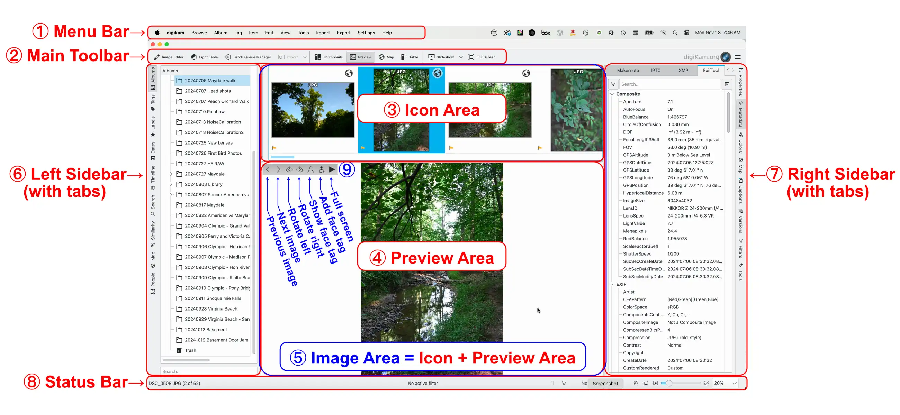
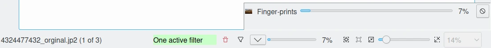

.. meta::
   :description: digiKam Main Window Interface Layout
   :keywords: digiKam, documentation, user manual, photo management, open source, free, learn, easy, main, window, tool-bar, icon-view, status-bar

.. metadata-placeholder

   :authors: - digiKam Team

   :license: see Credits and License page for details (https://docs.digikam.org/en/credits_license.html)

.. _interface_layout:

Interface Layout
================

.. contents::

Areas and Bars
--------------

digiKam's main window has two areas in the center showing your photographs. One is the **Icon Area ③**, showing thumbnails of the content of the selected album or of a search result, and the other one the **Preview Area ④**, showing the selected image. Together let's call them the :ref:`Image Area <image_view>` ⑤. In the top left corner of the preview we have a few buttons ⑨ for moving back and forth through the content of the album, for rotating the image, for showing or adding face tags and to switch to full screen mode. Clicking on the preview makes the preview disappear, and clicking on the picture area of a thumbnail makes the preview appear again.

    The digiKam Main Window

Interface Areas, Toolbars and Buttons in the Main Window::

    ① Menu Bar
    ② Main Toolbar
    ③ Icon (Thumbnail) Area
    ④ Preview Area
    ⑤ Image Area = Icon + Preview Area
    ⑥ Left Sidebar (with tabs)
    ⑦ Right Sidebar (with tabs)
    ⑧ Status Bar
    ⑨ Buttons: Navigation, Rotation, Face Tags, Full Frame

The Image Area in the center is surrounded by the menu bar ① and the :ref:`Main Toolbar <main_toolbar>` ② at the top, the :ref:`Status Bar <status_bar>` ⑧ at the bottom, as well as the :ref:`Left Sidebar <left_sidebar>` ⑥ and :ref:`Right Sidebar <right_sidebar>` ⑦. The Left Sidebar lets you switch between nine “Views”: Albums (shown here), Tags, Labels, Dates, Timeline, Search, Similarity, Map and People. The Right Sidebar can be used to show information about your images, to apply filters to select images, and to select actions to be applied to selected images. You can use all these views to organize and find your photographs. You can collapse or expand the sidebar areas by clicking on the sidebar tabs.

Don't worry if your main window looks different than the image above. You will soon learn how to switch the different areas on and off and at some point you might get a look very similar to the above screenshot.

Drag & Drop of images works about everywhere: Drag & Drop an image into another branch of the album tree, across the horizontal album separation line, or to another application window. The only restriction is that you cannot Drag & Drop into tag, date or searches.

.. _status_bar:

The Status Bar
--------------

    The digiKam Main Window Status-Bar

The status bar at the bottom shows:

    - The file name when selecting a single file.

    - Selection information when several items are selected.

    - Quick filters:

        - Information on how many filters are active.

        - A trash bin button to reset all active filters.

        - A funnel button to open the filter settings panel.

    - A progress bar for batch processes, such as assigning tags or rebuild fingerprints.

    - A thumbnail and preview image size slider with buttons for "Fit to Window" and "Zoom to 100%".

    - A size selection pop up list measured in % for the preview image.

.. _main_toolbar:

Main Toolbar
------------

The Main Toolbar appears at the top of the window.

.. figure:: images/mainwindow_toolbar.webp
    :alt:
    :align: center

    The digiKam Main Window Tool Bar

1. Open :ref:`Image Editor <image_editor>` with the selected image

2. Open :ref:`Light Table <light_table>` :kbd:`L`

3. Open :ref:`Batch Queue Manager <batch_queue>` :kbd:`B`

4. Import (drop down menu showing all connected cameras and mass storage devices)

5. Switch to thumbnail view

6. Toggle preview of selected image

7. Switch to map view to display images with geolocation data

8. Switch to configurable table view

9. Slideshow drop down menu

10. Toggle Full Screen :kbd:`Ctrl+Shift+F`

11. Link to digikam.org, also an indicator for ongoing processes

You can customize the Toolbar by choosing :menuselection:`Settings --> Configure Toolbars...` or click on the Toolbar with the right mouse button and choose **Configure Toolbars...** from the context menu.
