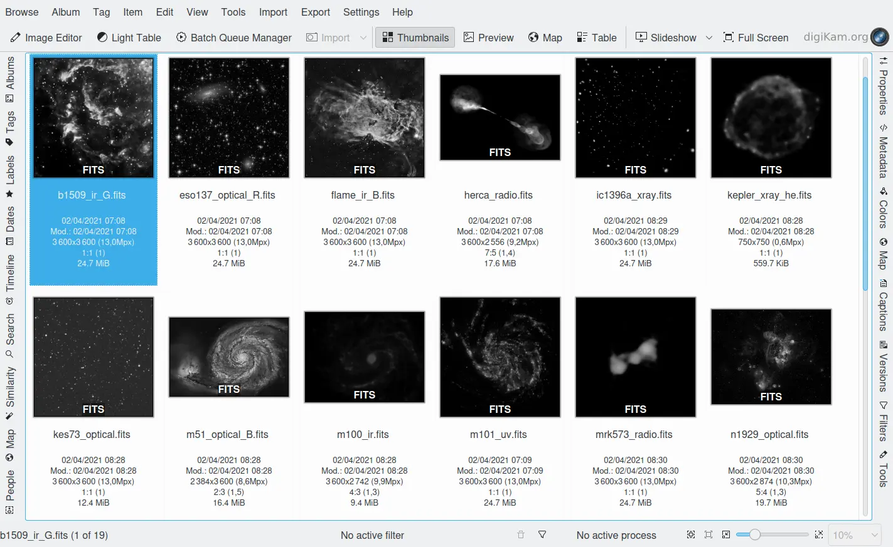
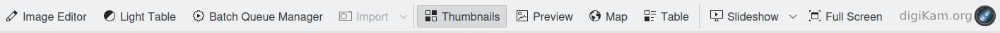

.. meta::
   :description: digiKam Main Window Interface Layout
   :keywords: digiKam, documentation, user manual, photo management, open source, free, learn, easy

.. metadata-placeholder

   :authors: - digiKam Team (see Credits and License for details)

   :license: Creative Commons License SA 4.0

.. _interface_layout:

Interface Layout
================

.. contents::

Areas and Bars
--------------

digiKam's main window has two areas in the center showing your photographs. One is the Icon Area, showing thumbnails of the content of the selected album or of a search result, and the other one the Preview, showing the selected image. Together let's call them the Image Area. In the top left corner of the Preview we have a few buttons for moving back and forth through the content of the album, for rotating the image, for showing or adding face tags and to switch to full screen mode. By clicking on the preview you can make it disappear and by clicking on the picture area of a thumbnail open it again.

The Image Area in the center is surrounded by the menu bar and the Main Toolbar at the top, the Status Bar at the bottom and the Left and Right Sidebar. The Left Sidebar lets you switch between nine “Views”: Albums (shown here), Tags, Labels, Dates, Timeline, Search, Fuzzy (Search), Map and People (Tags). The Right Sidebar can be used to show all information about your images and partly also to edit them. You can use all these views to organize and find your photographs. If you click on one of the buttons on the sidebars there will fold out another area, offering possibilities to select, to make inputs, e.g. for searches, to edit data and to show information.

Don't worry if your main window looks quite different at the moment. You will soon learn how to switch the different areas on and off and at some point you might get a look very similar to the above screenshot.

Drag & Drop of images works about everywhere: d&d an image into another branch of the album tree, across the horizontal album separation line, or to another application window. The only restriction is that you cannot d&d into tag, date or searches.

The Status Bar
--------------

The status bar at the bottom shows in all eight views:

    - The file name when selecting a single file.

    - Selection information when several items are selected.

    - Quick filters:

        - Information how many filters are active.

        - A trash bin button to reset all active filters.

        - A funnel button to open the filter settings panel.

    - A progress bar for batch processes, e.g. assigning tags.

    - A thumbnail and preview size slider with buttons for "Fit to Window" and "Zoom to 100%".

    - A size selection pop up list in % for the preview.

Main Toolbar
------------

The window top shows the Menu Bar and the Main Toolbar below.

1. Open Image Editor with the selected image

2. Open Light Table (L)

3. Open Batch Queue Manager (B)

4. Import (drop down menu showing all connected cameras and mass storage devices)

5. Switch to thumbnail view

6. Toggle preview of selected image

7. Switch to map view to display images with geolocation data

8. Switch to configurable table view

9. Slideshow drop down menu

10. Toggle Full Screen (Ctrl+Shift+F)

11. Link to digikam.org, also an indicator for ongoing processes

You can customize the Toolbar by choosing Settings --> Configure Toolbars... or click with the right mouse button on it and choose Configure Toolbars... from the context menu.
