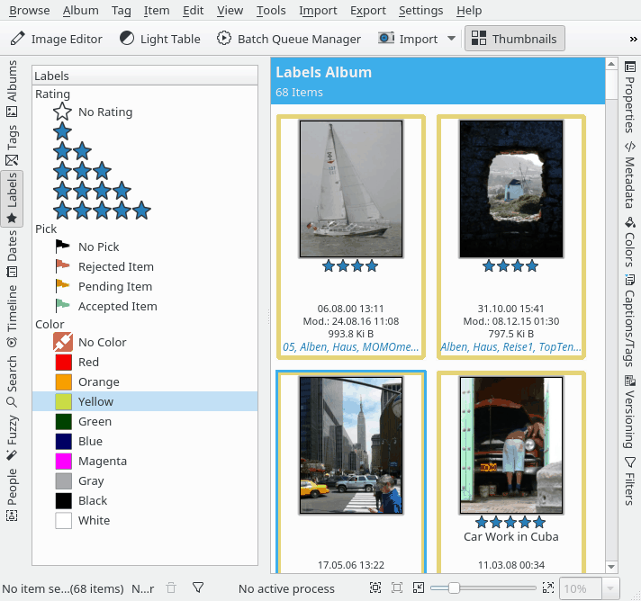

.. meta::
   :description: digiKam Main Window Labels View
   :keywords: digiKam, documentation, user manual, photo management, open source, free, learn, easy

.. metadata-placeholder

   :authors: - Gilles Caulier <caulier dot gilles at gmail dot com>

   :license: Creative Commons License SA 4.0

.. _labels_view:

Labels View
-----------

The Labels View allows you to select photographs by the Rating, Pick and Color labels you assigned to them previously either by using the context menu of a thumbnail or the Description tab of the Captions/Tags section on the Right Sidebar.

 You may select more than one label by Ctrl+left click. The selected labels are connected by boolean AND, e.g. selecting Four Star and Yellow will display only photographs that have both labels assigned. You can perform even more sophisticated searches by using the Filters section of The Right Sidebar.