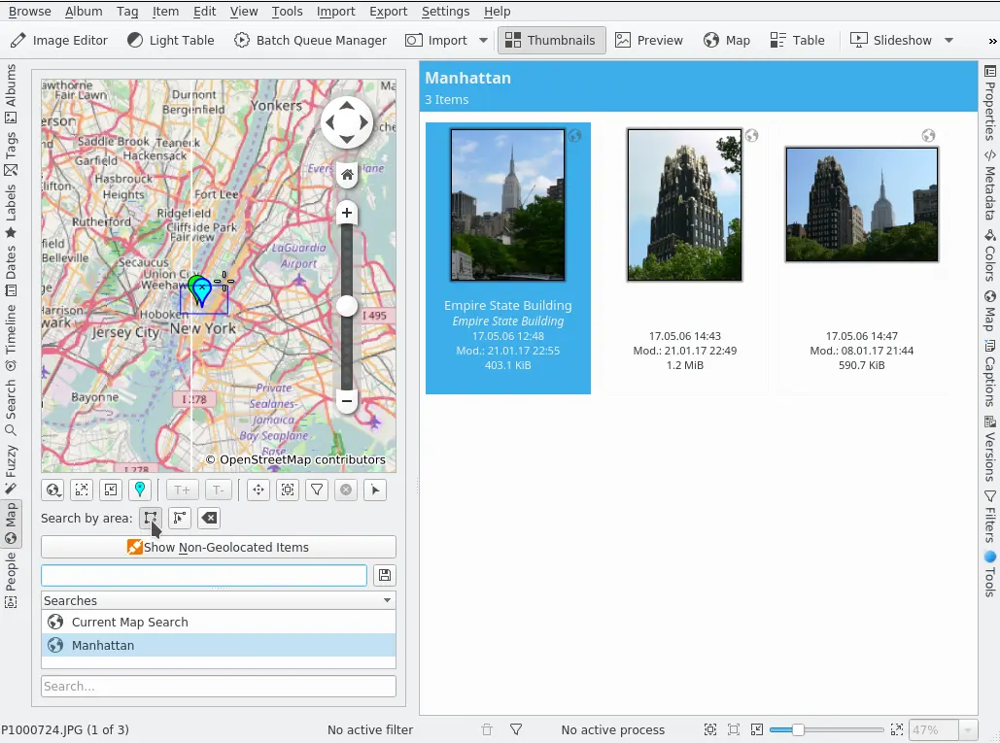

.. meta::
   :description: digiKam Main Window Map View
   :keywords: digiKam, documentation, user manual, photo management, open source, free, learn, easy

.. metadata-placeholder

   :authors: - digiKam Team (see Credits and License for details)

   :license: Creative Commons License SA 4.0

.. _map_view:

Map View
---------

 The whole digiKam geolocation suite consists of four parts:

    - The Map mode of the Image Area which displays images with GPS data on a map depending on the selection on the Left Sidebar, e.g. the images in the album you selected in the Album View, the images with a certain tag assigned (selected in the Tag View), with a certain label and so on.

    - This view which is the search tool for finding images by their GPS data.

    - The Geolocation Editor which is accessible via Item → Edit Geolocation... (Ctrl+Shift+G) and allows to set and to edit GPS data.

    - The Map tab on the Right Sidebar which shows the location of the image on a map and is purely informative.

All four are based on the Marble widget.

For navigating on the map refer to Marble handbook, Chapter 2. The meaning of “GPS” and functions and buttons that apply to all three geolocation parts are described in the Geolocation Editor chapter of this handbook. This applies to the context menu on the map and the first line of buttons under the map except the last three. The designations I use here for the buttons is the content of the respective tooltip.

Usually you will begin searching for images by defining a region on the map. From the “Search by area:” buttons click the left one, the Select-images-by-drawing-a-rectangle button, then click with the left mouse button over one corner on the map, draw open a rectangle and click with the left mouse button over another corner. All images falling within the coordinates of that rectangle will be shown in the Image Area (provided your images have been geo-coded of course).

The next button to the right is the Create-a-region-selection-from-a-thumbnail button which creates a small region around the position of a marker or thumbnail if you click on it. If there are other images hidden behind it because they have the same position or one very close to the image you click on they will be shown in the Image Area.

The last button in this row is the Remove-the-current-region-selection button. Well, do I still have to explain that after all? O.k., I should mention that it, of course, only removes the selection, not your precious pics.

Now let's have a look on the three buttons at the right end of the row right under the map. They control which images you see in the Image Area out of your defined region. Let's begin with the one at the very end of the row, the Select-images button. If you activate it, it will toggle the selection of a photograph (or a group of photographs if they are hidden behind each other) once you click on it on the map. This can be helpful to fine tune your selection before carrying out operations from the Right Sidebar or the menus.

The Filter-images button (the one with the funnel on it) will, other than the Select-images button who leaves all images from your defined region visible in the Image Area, switch off all other images and show only the one you clicked on. This is particular useful if the map is just showing markers or if the thumbnails are too small to clearly identify images.

The Remove-the-current-filter button is self explaining but I want to mention here that these three last buttons won't affect your defined search region which means that once you click the button with the white cross in a red circle all images in that region should be displayed again in the Image Area.

The Show Non-Geolocated Items button displays all images without GPS data in the Image Area. If this applies to many images from your collections it might be a good idea to use the Filters tab of the Right Sidebar and/or the sorting and grouping functions in the View menu additionally.

In the box below you can enter a name for your geo filter. It will be added to the list view below for future reference once you click the save button to the right of it, it acts as a live geo folder. The search field at the bottom searches in the Searches list above.
