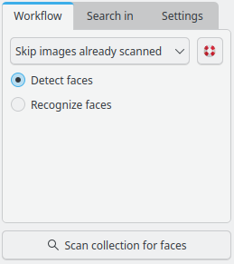
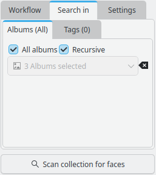
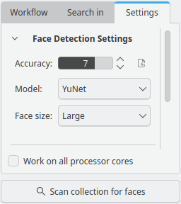

.. meta::
   :description: digiKam Main Window People View
   :keywords: digiKam, documentation, user manual, photo management, open source, free, learn, easy, faces, detection, recognition, management, deep-learning, people

.. metadata-placeholder

   :authors: - digiKam Team

   :license: see Credits and License page for details (https://docs.digikam.org/en/credits_license.html)

.. _people_view:

People View
-----------

As long as you are not just taking pictures from machines or stars or something like that, Face Management might be an interesting feature for you (even with a machine there might be a human being operating it). In digiKam it consists of two tasks: **Face Detection** and **Face Recognition**.

The face management workflow allows you to detect and recognize people in your photographs. Both features use a deep learning neural network in background. **Face Detection** allows digiKam to detect faces in your images. This step is required before being able to recognize faces. **Face Recognition** will automatically recognize people in your images, but it needs few items already trained for a same face name to be able to recognize new ones.

.. important::

   To run properly, the face management needs the deep-learning models to download at the first run of digiKam. See :ref:`the Quick Start section <quick_start>` for details.

.. _face_detection:

Face Detection
~~~~~~~~~~~~~~

The first step is to have digiKam finding all those pics that show faces not even knowing yet who's face it is. To prepare that process you click on **People** tab from left sidebar. On the bottom you have a settings view with a drop down menu where you can choose between:

    - **Skip Images Already Scanned**: choose this option if you haven't scanned yet or if the last scan yielded good results but you would like to scan new images.

    - **Scan Again And Merge Results**: choose this option if the results of the previous scan weren't accurate. This would rescan all images again, and is time consuming.

    - **Clear Unconfirmed Results And Rescan**: remove all faces registered in database with no name and process again an analysis.

    The digiKam Face Management Workflow View

The first option you would choose if you didn't scan yet or if you did with a satisfying result but added new photographs since then or if you already improved a search result, e.g. by removing face tags which obviously don't show a face. The second you would choose if you want the images already scanned to be included in the next scan. The third is more interesting in the context of Face Recognition since **Unconfirmed results** means face tags that don't have a name assigned to them yet.

After the Face Scan is complete, you should see a new tag **Unknown** where the results of the face scan will appear. You may now manually identify a few of these faces and then proceed for face recognition. At least a minimum of **4 similar faces tagged** in different images must be trained for an automatic recognition workflow.

.. note::

   In the **Settings** tab, you can also decide if you want to scan for face detection or for faces recognition.

The **Settings** tab has another tab to tune where to search for new faces. You can make a selection of albums or tags to process the detection.

    The digiKam Face Management Search-In View

The last tab from the settings view allows to tune advanced configuration, as the accuracy used to identify a face in image, the deep-learning model to use for the faces workflow, and the ability to use all CPU core while computing.

    The digiKam Face Management Settings View

.. note::

   The deep-learning YOLO v3 model is more powerful for face workflow but it's time and CPU consuming. Only turn on this option if you hardware can supports intensive computations.

For the task we are talking about you check **Detect Faces**, of course. Since face detection is a time-consuming task you better don't hit **Scan** right away, rather **Options**. An additional area will fold out organized with three tabs. In **Search-In** you can confine the scan to certain albums or tags. In **Settings** you can adjust the **Face Accuracy** with a balance between **Sensitivity** and **Specificity** that suits your needs. A higher specificity implies higher accuracy, however this results in a smaller set of results. Under Advanced you will find two checkboxes. The first is explained by the text above it. The second is for face recognition, see next article.

Once you have chosen your options carefully you click **Scan** and after a while, depending on the scope of your selection, the result will be presented in the Image Area. In the Tags list of the Left Sidebar you will see the People branch of your tag tree. You will see the whole scan result only if the topmost tag **People** is selected. In the tree you will see a new virtual tag called **Unknown** which will show all those images where faces are recognized but not yet connected to a person. If you just scanned for the first time you will find the whole result also here.

.. figure:: videos/mainwindow_faces_detection.webp
    :width: 600px
    :alt:
    :align: center

    Screencast of digiKam Faces Detection Process Running Over Collections and Populating the Database

Note that the thumbnails presented here are not showing the whole image. They show the area of the image where the scan algorithm put down a **Face Tag**. You can see that if you click on the thumbnail. In the preview that opens you will see the whole image with all the face tags on them.

.. |icon_showfacetags| image:: images/mainwindow_icon_showfacetags.webp

If you don't see them, click the people button |icon_showfacetags| in the upper left corner of the preview. If there is more than one face tag on the image it will also be represented by more than one thumbnail. This is the case with the screenshot above take in preview mode.

.. figure:: images/mainwindow_face_tag_editor_iconview.webp
    :alt:
    :align: center

    The digiKam Face Tags Edit From Icon-View

If it really is a face the field labeled **Who Is This?** comes into play. Here you can either type in the name of an existing People tag out of your tag tree or use the drop down function to show your tag tree and select a tag. With **Confirm** you can save that to the database. If it was the only face tag (left) the image will disappear from the **Unknown** selection and you will find it once you select either the **People** tag or one of the tags you assigned to one of the face tags in that image.

The list of detection samples below come from a huge collection of photo scanned with the Yolo v3 deep-learning model.

==== =========================================================== =============================================
 ID  Face Detected Samples                                       Comments
==== =========================================================== =============================================
 01  .. figure:: images/mainwindow_face_detection_sample_01.webp An under-exposed face
        :width: 64px
        :alt:
        :align: center
---- ----------------------------------------------------------- ---------------------------------------------
 02  .. figure:: images/mainwindow_face_detection_sample_02.webp A closed dog face
        :width: 64px
        :alt:
        :align: center
---- ----------------------------------------------------------- ---------------------------------------------
 03  .. figure:: images/mainwindow_face_detection_sample_03.webp A blured child face
        :width: 64px
        :alt:
        :align: center
---- ----------------------------------------------------------- ---------------------------------------------
 04  .. figure:: images/mainwindow_face_detection_sample_04.webp A non human face
        :width: 64px
        :alt:
        :align: center
---- ----------------------------------------------------------- ---------------------------------------------
 05  .. figure:: images/mainwindow_face_detection_sample_05.webp A very blured and partial face
        :width: 64px
        :alt:
        :align: center
---- ----------------------------------------------------------- ---------------------------------------------
 06  .. figure:: images/mainwindow_face_detection_sample_06.webp A rotated face
        :width: 64px
        :alt:
        :align: center
---- ----------------------------------------------------------- ---------------------------------------------
 07  .. figure:: images/mainwindow_face_detection_sample_07.webp A covered face with a hood
        :width: 64px
        :alt:
        :align: center
---- ----------------------------------------------------------- ---------------------------------------------
 08  .. figure:: images/mainwindow_face_detection_sample_08.webp An aside face
        :width: 64px
        :alt:
        :align: center
---- ----------------------------------------------------------- ---------------------------------------------
 09  .. figure:: images/mainwindow_face_detection_sample_09.webp An under-exposed and partial face
        :width: 64px
        :alt:
        :align: center
---- ----------------------------------------------------------- ---------------------------------------------
 10  .. figure:: images/mainwindow_face_detection_sample_10.webp A false positive detection
        :width: 64px
        :alt:
        :align: center
---- ----------------------------------------------------------- ---------------------------------------------
 11  .. figure:: images/mainwindow_face_detection_sample_11.webp A puppy's mouth
        :width: 64px
        :alt:
        :align: center
---- ----------------------------------------------------------- ---------------------------------------------
 12  .. figure:: images/mainwindow_face_detection_sample_12.webp A face covered by a racket
        :width: 64px
        :alt:
        :align: center
==== =========================================================== =============================================

The screenshots **02** and **11** have been chosen because they show one important feature: the algorithm is able to find animal faces, and this is not a false positive, except if you want to see only human faces on your collection of course.

The screenshot **10** is another example shows one important issue: the algorithm will find inevitably details in an image that resemble a face but are actually something else. That's what the **Remove** button is for. It will remove the face tag from the photograph and if it is the only face tag (left) the photograph will disappear from the scan result.

The screenshots **01**, **03**, **05**, **08**, **09**, and **12** can be considered as non faces, or be prevented by reducing the **Accuracy** of detection in face management **Settings** view. But these examples prove the capability of algorithm to detect faces in critical shots conditions.

The screenshots **04** and **10** are definitively false positive results.

In the context menu of the preview there are two more items related to face tags: **Add A Face Tag** and **Clear All Faces** on this image.

.. _face_recognition:

Face Recognition
~~~~~~~~~~~~~~~~

Assigning People tags to face tags is an important prerequisite to Face Recognition. Very obviously digiKam can only recognize faces if it has something to compare with. So it's up to you to show it the ropes, which means in this case to tell digiKam: This is Lara, this is Juan, this is Peter and so forth. For that you would, after performing a Face Detection as described in the previous article, typically select the **Unknown** tag on the Left Sidebar, click on a thumbnail and click, if necessary, on the Show Face Tags button |icon_showfacetags|.

.. figure:: images/mainwindow_faces_tag_assigned_iconview.webp
    :alt:
    :align: center

    The digiKam Face Management Icon-View With Multiple Selection of Similar Faces to Tag With The Same **Agnès** Name

Now you should see the face tags of that photograph. Those which have a people (or other) tag already assigned will simply show the name of that tag. The others, showing **Unknown** faces, will show a field and two buttons as in the screenshot of the previous article. In the field labeled **Who Is This?** you can either type in the name of an existing People tag out of your tag tree or use the drop down function to show your tag tree and select a tag. With **Confirm** you can save that to the database.

.. figure:: images/mainwindow_faces_tag_confirmed_iconview.webp
    :alt:
    :align: center

    The digiKam Face Management Icon-View With a Confirmed Set of 12 Faces Using **Agnès** Name

.. note::

    If you use the context menu item **Assign Tag** instead of the procedure described above that will not assign a face tag. It will assign an ordinary tag and it will assign it to the whole image.

If a face tag is confirmed and thus showing only the name of the tag but not the buttons to remove, edit or confirm it, but you need this buttons because e.g. it's wrong and you want to edit or remove it, just double-click on the name and the buttons will re-appear.

Once you have a tag assigned to a few photographs you can have digiKam looking if it can find more photographs showing the same face. To prepare that process you click **Scan Collection For Faces** but this time you select **Recognize Faces**.

.. important::

    To be able to recognize a new face automatically, a minimum of 4 similar faces tagged in different images need to be previously trained to the deep-learning engine using manual face management workflow.

To start the Face Recognition you click **Scan Collection For Faces** button. The process will tag every recognized face with the appropriate People tag out of your tag tree and the corresponding thumbnail will disappear from the **Unknown** tag selection.

.. figure:: images/mainwindow_faces_tag_recognized_iconview.webp
    :alt:
    :align: center

    The digiKam Face Management Icon-View With New Recognized Automatically Faces as **Agnès** Name

Face Recognition is faster than Face Detection but it still makes sense to click **Settings** and confine the scan to certain albums or tags in the Albums tab, e.g. to the **Unknown** tag. In the **Settings** tab we can play with the balance between speed and accuracy and two checkboxes. The first is explained by the text above it.

In case of unsatisfying results it might be helpful to use **Clear And Rebuild All Training Data**. One reason can be that there are too many face tags assigned to a person which shows this person in a way that doesn't really help the search algorithm, e.g. with sunglasses, blurred, unusual colors, carnival make up, dark shaded areas in the face, baby/kid/adult photographs mixed... Another reason to use that option can be false face recognition due to a wrong accuracy value in the **Settings** tab.

.. figure:: images/mainwindow_faces_tag_validate_iconview.webp
    :alt:
    :align: center

    The digiKam Face Management Icon-View With New Recognized Faces to Confirm as **Agnès** Name

To Complete the Recognition Process, you will need to **Confirm** the new recognized faces. By applying the properties, new faces will be moved to the face tag definitively.

The results of facial recognition appear in the form of unconfirmed results. These results will show up in the **Unconfirmed** tag, as well as in the tag of the person suggested for each face. Hovering over unconfirmed faces will display a few options:

    - The **Confirm** button allows you to confirm the suggestion. This would assign the suggested name to the face.
    - Use the **Reject** button, if the suggestion is incorrect. This would move the face back to **Unknown**.
    - Use the **Delete** button, if the suggestion is not a face. This will remove the face region from the database.

About the face categorization and sorting, faces will appear by default categorized based on their name. You may change this behavior, by going to :menuselection:`View --> Separate Items`. Note that using a different categorization order will lead to **Confirmed** and **Unconfirmed** faces appearing mixed with one another. To change this behaviour you may modify the sorting order within each category by going to :menuselection:`View --> Sort Items --> By Face Type`.

To improve results of face recognition, apart from using the settings mentioned previously, face results may also be improved by rebuilding the training data. This may be done through :menuselection:`Tools --> Maintenance --> Detect And Recognize Faces -> Clear And Rebuild All Training Data`.

.. _manual_face_tagging:

Manual Face Tagging
~~~~~~~~~~~~~~~~~~~

digiKam allows for either manual face tagging.

For more information about automatic face tagging using digiKam's face recognition engine see :ref:`the previous section <face_recognition>` of this manual.

You can tag people manually by different way:

- From **Preview Mode**: click on **Add a Face Tag** icon or select option on context menu, as highlighted on the screenshot below.

    .. figure:: images/mainwindow_addfacetag.webp
        :alt:
        :align: center

        The digiKam Manual Face Tagging From Context Menu

    And then draw a rectangle around the face while holding left mouse button followed by entering the person's name and pressing :kbd:`Enter` key. If you press :kbd:`Esc` key, this will leaves the person's name editor.

    .. figure:: images/mainwindow_face_region.webp
        :alt:
        :align: center

        The digiKam Manual Face Tagging Editor

    .. note::

        Instead of clicking on **Add A Face Tag** icon you can draw a face region while holding :kbd:`Ctrl` key.

    The **Preview Mode** context menu include also two other options to use during manual face tagging:

        - **Scan For Faces**: this option will call the face detection algorithm to set face areas automatically over the image. The faces are assigned by default to **Unknown** in the database. The last used **Faces Detection** settings will configure the process. If faces are found, you can edit manually the face name as explained previously.

        - **Show Face Tags**: this show the face areas visible and switch automatically in edit mode when mouse move over the areas.

- From Left Sidebar **People** tab: use drag and drop between icon-view and face-tags tree-view. Select items labeled **Unknown** that you want to assign a face-tag. Perform a move with the mouse to the **People** items hierarchy. A pop-up menu will appears to confirm face assignment.

    .. figure:: videos/mainwindow_faces_drag_drop.webp
        :width: 600px
        :alt:
        :align: center

        Screencast of Manual Faces Assignment Using Drag And Drop

- From keyboard shortcut: you can assign a magic key to a face-tag and quickly uses the keyboard to switch on the face-tag name to selected items.

    .. figure:: images/mainwindow_face_tag_properties.webp
        :alt:
        :align: center

        The digiKam Face Tag Properties Dialog With a Keyboard Shortcut Assigned

- From The **Unknown** tag from **People** view: to manually identify a face, hover on any **Unknown** face from icon-view and use the text box to give it a name. This will lead to the creation of a face tag in case a person of that name doesn't exist already. For best results identify at least 4 faces for each person you want the scan to recognize.

    .. figure:: videos/mainwindow_face_tagging.webp
        :alt:
        :align: center

        Screencast of Manual Face Tagging From Icon-View

    .. note::

        In the :ref:`Miscs Behavior <behavior_settings>` view of the configuration dialog, an option can be turned on to only populate the tags tree-view with the face tags assigned to a face while you enter a name.

In case there's a face you don't wish to be recognized, you can mark it as ignored. This leads to the creation of a new **Ignored** tag, you can later unmark the face if needed.

    .. figure:: images/mainwindow_faces_tag_ignored_iconview.webp
        :alt:
        :align: center

        A Face Marked as **Ignored** From Icon-View
