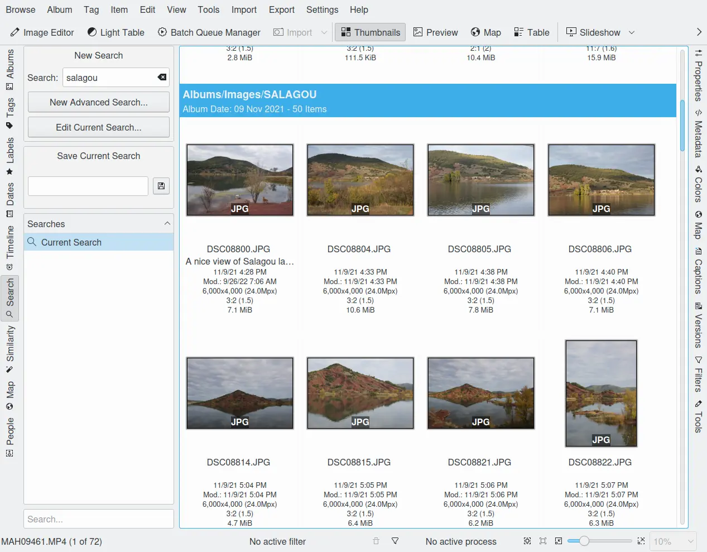

.. meta::
   :description: digiKam Main Window Search View
   :keywords: digiKam, documentation, user manual, photo management, open source, free, learn, easy

.. metadata-placeholder

   :authors: - digiKam Team

   :license: see Credits and License page for details (https://docs.digikam.org/en/credits_license.html)

.. _search_view:

Search View
-----------

We talked about quite a few views already and their searching capabilities, which are all kind of specialized. The Search View now offers a more versatile and general way of searching. There are two different approaches.

In the field right below you can enter a title and save your selection. It will then appear in the **Searches** list field below. But the best is still to come: the Timeline View offers a search for a search! If you have a lot more searches saved than my ridiculous four in the screenshot the adaptive search field at the bottom may help to find a certain search.

The Quick Search
~~~~~~~~~~~~~~~~

Quick Search is the adaptive search box at the top of the search dialog (Left Sidebar) and provides you with a simple means to search the digiKam database with a single query. You can enter any arguments in the **Search** text field and it will be used to determine the results. For instance, you can enter the string "birthday" to search the complete database for occurrences of the word "birthday" in all metadata text fields, or "05.webp" to search for a specific image file name "05.webp" (no escaping as in reg-expressions needed).

Search Properties:

    - Searches are case insensitive.

    - Blank separated search terms are boolean AND combinations.

    - Special characters are literal and not interpreted ( . * ? / etc.).

    - Include all elements of the database: names, rating, keywords, tags, albums, collections, dates (and more in the future).

You can save your searches as a live folder that always filters for what you entered as search criteria. Just type a name for the search into the **Save Current Search** field and click the **Save** button to the right of it. When saved, the filter will appear in the **Searches** list. By clicking the title bar of this list you can invert the sorting order. Once you select one of your saved searches, the search result will be presented in the Image Area immediately and the **Save Current Search** field will convert into a **Edit Stored Search** field where you can edit your search criteria. The name of the saved search will be used to label the search result in the Image Area.

If you want to delete or rename a saved search from the list, click with the right mouse button on it and select from the context menu.

The Advanced Search Tool
~~~~~~~~~~~~~~~~~~~~~~~~

Advanced Search tool provides an extended search form which can be used to search in specific fields of the digiKam database in a more sophisticated way. Click the **Advanced Search...** button and it will come up like this:

.. figure:: images/mainwindow_advancedsearchtool.webp

The field labeled **Find items that have associated all these words:** is just a duplicate of the Quick Search field.

Click on one of the blue categories and there will fold out an area with all the fields you can search for in that very category. Depending on the kind of data each field contains different input fields for your search, sometimes more than one type for the same field. Simplest are selection buttons, e.g. for colors. Then you have plain fields of the “The field content contains type", drop down lists and checkboxes. Many fields have two input fields allowing you to define a range, e.g. **Find items with a width between**. And often you find a link type thing called "Any" which opens a drop down field with checkboxes for the possible contents of that field.

.. figure:: images/mainwindow_advancedsearchtool2.webp
            :alt: Advanced Search Criteria

Thanks to the labeling of the search fields they are pretty much self explaining. What we have to talk about is how they work together if you fill in or select more than one. On the right side of the header (blue area at the top) you find a little link **Options**. If you click on that one the header will change and you see four options.

    - **Meet All of the following conditions** means that your different search parameters will be connected by boolean AND for the search. Example: if you selected Album name “Holidays” and color “red” the search will find all pictures labeled with “red” out of the Album “Holidays”.

    - **Meet Any of the following conditions** means that your different search parameters will be connected by boolean OR for the search. Example: if you selected Album name “Holidays” and color “red” the search will find the content of the Album “Holidays” and all pictures labeled with “red” out of your whole collection.

    - **None of these conditions are met** means that your different search parameters will be connected by boolean NAND for the search. Again our example: if you selected Album name “Holidays” and color “red” the search will find all pictures of your collection except those labeled with “red” and except those out of the Album “Holidays”.

    - **At least one of these conditions is not met** means that your different search parameters will be connected by boolean NOR for the search. One more example: if you selected Album name “Holidays” and color “red” the search will find all pictures of your collection except those labeled with “red” out of the Album “Holidays”. 

Complicated? No, good! Because the real stuff is yet to come. Have a look at the footer of the Advanced Search Tool. Here you find **+ Add Search Group**. If you hit this button another list with the same categories of search fields will open below the first one (scroll down in case you don't see it right away) separated by a blue header showing the same options we were just talking about. On top of them you see an underlined OR meaning that this list is connected to the first one by boolean OR. You can change that to AND by clicking on it.

To explain how it works let's make another example based on one of those we had already. I want to use the second one. That means: in the first group you checked **Meet Any of the following conditions** and you selected Album name “Holidays” and color “red”. As we said already this will produce all pictures labeled with “red” out of your whole collection and the content of the Album “Holidays”. Now let's assume for some reason you want to exclude all rejected files and all files with a rating lower than three stars. So you open a second group, click on the underlined OR in the header in order to change it to AND, select **None of these conditions are met**, fold out the **Picture Properties**, check under **Labels** the red flag (rejected) and select under **Rating** no star (five white stars) in the first field and two stars in the second field. Note that there is a difference between **No star** and **No Rating assigned**! If you want to exclude the pictures without any rating as well you got to open another Search Group, click on the underlined OR in the header in order to change it to AND, select **None of these conditions are met** and select **No Rating assigned** in the **Picture Properties** category.

Which brings us to the fact that you can open as many additional Search Groups as you need to formulate your query. But since the purpose of this handbook is not to open a competition in creating the most sophisticated queries I leave it to you to figure out how far you have to go or can go in this respect and rather finish this section with a few hints about the other buttons in the Advanced Search Tool. Beside the **+ Add Search Group** button you see Reset. This removes all additional Search Groups and clears all the fields in the remaining one. It's a good policy to use this button before starting to create a new search, in particular when you leave the Advanced Search Tool with the intention to use the Quick Search for your next query, because otherwise the search criteria remain active even if you don't see them and screw up your new search. Try carries out the search but leaves the Advanced Search Tool window open, OK does the same but closes the window. **Remove Group** in the header of the additional Search Groups doesn't need an explanation.
