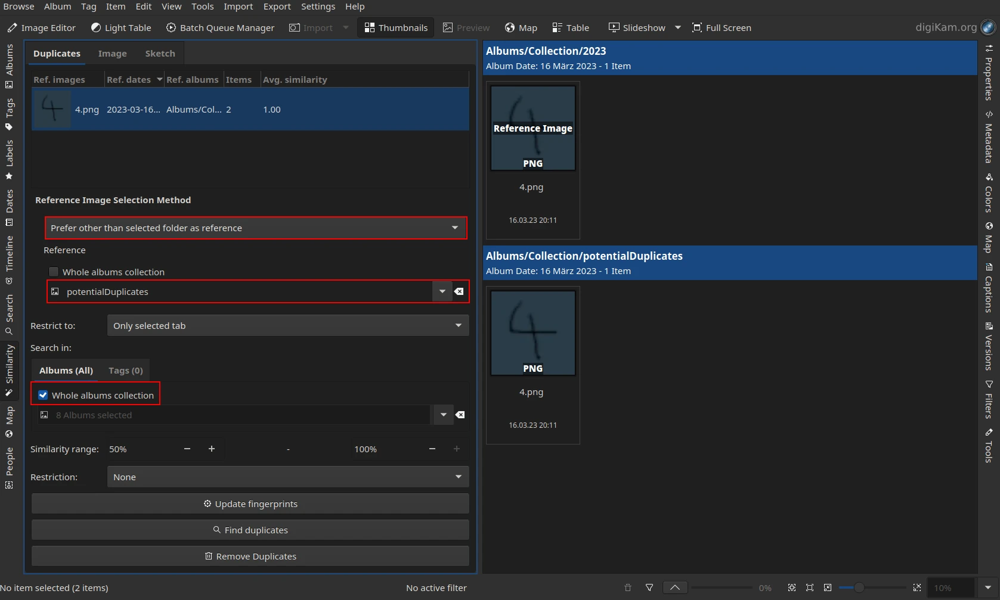
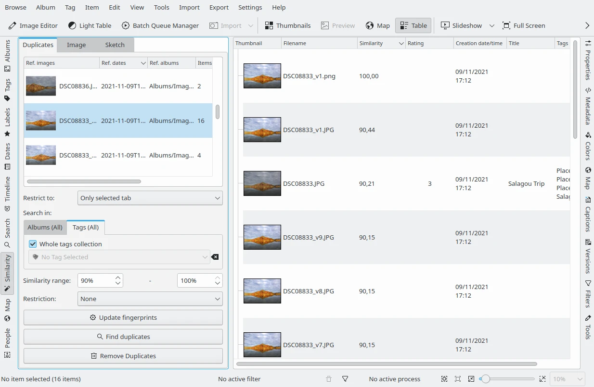
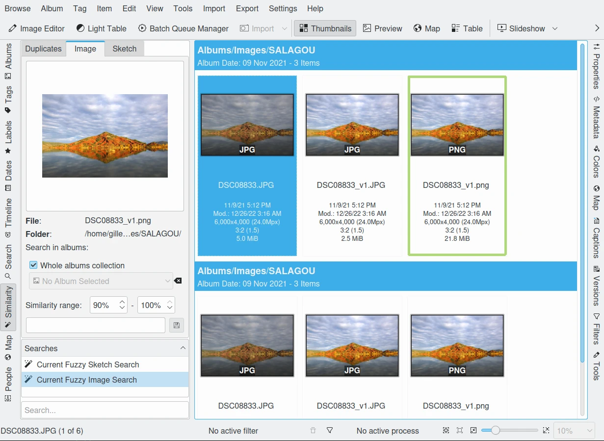
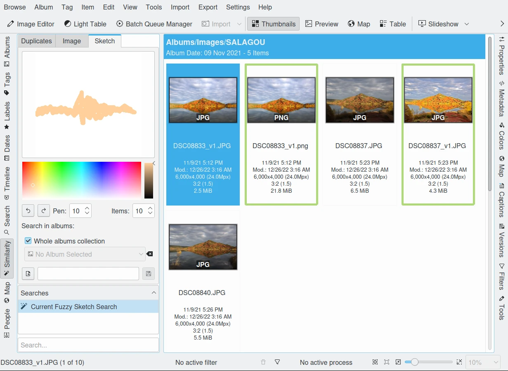

.. meta::
   :description: digiKam Main Window Similarity View
   :keywords: digiKam, documentation, user manual, photo management, open source, free, learn, easy, similarity, search, duplicates, sketch

.. metadata-placeholder

   :authors: - digiKam Team

   :license: see Credits and License page for details (https://docs.digikam.org/en/credits_license.html)

.. _similarity_view:

Similarity View
---------------

Overview
~~~~~~~~

You have lost a picture because you can't remember its name or where you filed it? You need to perform a *fuzzy search* on your collections.

digiKam characterizes every image by a lengthy number that makes it possible to find similar images by comparing this calculated signature. The less numerical difference there is between any two image signatures, the more they resemble each other. This methodology is the core engine to three features named find **Duplicates**, find similar **Image**, and find by **Sketch**.

.. note::

    digiKam uses in background Wavelets/Haar algorithms based on the `Fast Multi-Resolution Image Querying publication <https://grail.cs.washington.edu/wp-content/uploads/2015/08/jacobs-1995.pdf>`_

.. _similarity_duplicates:

Find Duplicates
~~~~~~~~~~~~~~~

Before you can have digiKam finding duplicates the signatures (or fingerprints) have to be calculated. You can start that process with the button **Update Fingerprints** which initiates a total rebuild of the image signatures (may take hours if you have a large collection and slow storage devices). If you have already scanned your images for fingerprints then you should skip this step.

.. tip::

    You can perform fingerprint operations using :menuselection:`Tools --> Maintenance` and select **Rebuild Finger-prints** option. You can additionally choose if you want to rebuild the entire database or only scan your database for missing fingerprint (default behavior). Choosing the Faster option is quicker as it only searches for missing fingerprints.

Once the fingerprints are calculated you can use **Find Duplicates**, but it will take a long time too as it has to compare every image with any other image. So the way to go in both cases is to confine your search to certain **Albums** and/or **Tags**. **Whole albums collection** and **Whole tags collection** check-box perform global searches in the database. Else uses the drop-down menu like where you will be asked which **Albums** and/or **Tags** to search.

**Reference Image Selection Method** setting allows to to select the method how the reference image is determined. This is important if you are using the **Remove Duplicates** function to steer which image shall be deleted. One usecase is, if you are copying newly imported files into its own folder in the collection (unsorted photos), then you run the duplicates and delete all photos which are already sorted into the collection. After that you just have to sort in the new photos.

    - **Older or Larger** is the method used prior 8.1.0. The reference image is the one of the duplicates, which is older or larger than the others
    - **Prefer selected folder as reference** means that in the newly appeared album selection, albums can be selected and if a duplicate occurs it uses the image found in one of those folders as reference
    - **Prefer other than selected folder as reference** means that in the newly appeared album selection, albums can be selected and if a duplicate occurs it uses the image **not** found in one of those folders as reference
    - **Prefer Newer Creation Date** means that the duplicates which is newer in the sense of the creation date is used as reference
    - **Prefer Newer Modification Date**  means that the duplicates which is newer in the sense of the modification date is used as reference

    Find Duplicates Tool Searching in Whole Albums Collection and prefer file not in the potentialDuplicates folder. The results are displayed in Icon-View

**LIMITATION:** Currently when selecting an album with subalbums only the album, but not the subalbums are searched through, so all subfolders have to be selected as well

**LIMITATION:** The folders selected as reference must be also in the search path otherwise the duplicates get not

**Restrict to** setting allows apply criteria over the duplicate search, as to limit search to the album of reference image, to exclude the album of reference image of the search, or to not include restriction.

With the **Similarity Range** you can narrow down or enlarge the search result. Note that by lowering the upper threshold a little bit below 100 % you can keep things like exact copies, images from series shots, etc. out of the search result if you want.

**Restriction** setting is a feature to decide about the relation of the selected **Albums** and **Tags** while to perform searches. Possible options are listed below:

    - **One of** means that the images are either in the selected albums or tags.
    - **Both** means that the images are both in the selected albums and tags.
    - **Albums but not tags** means that images must be in the selected albums but not tags.
    - **Tags but not albums** means that images must be in the selected tags but not albums.
    - **Only selected tab** means that only the selected tab is used.

An overview of the result will be given in the duplicate list-view from the left side. The first column shows the **Reference images** (Ref.) as thumbnail for each single result. The **Items** column tells you how many images belong to each result including the **Reference image**. The last column shows the **Average similarity** which gives you an idea about how similar the images of every result might be. The reference image with its 100 % is not included in the average. Note that the results can be sorted by clicking on one of the column headers. **Reference dates** and **Reference albums** columns are the properties of the **Reference images**.

    Find Duplicates Tool Searching in Whole Tags Collection and Displaying Results in Table-View

Individual similarity values for each item can be obtained in the **Table-View** mode (**Table** button on the Main Toolbar). Click with the right mouse button over one of the column headers and select **Similarity** from **Item Properties** to display the similarity column. By clicking on the header of this column then the results will be sorted by similarity grouped by reference images. Clicking repeatedly on the header will toggle between ascending and descending order.

**Remove Duplicates** allows to delete all duplicate images of the current selected item from **Duplicates** list.

 After performing **Searches** you might want to save the results. In the field below you can enter a name for the search, and press the **Save** button. In the **Searches** list below you will find your saved searches. Clicking on the title bar of that list toggles the sorting order between ascending and descending. At the bottom you will find an adaptive search field which can help you to find a particular search. To **Restore** a result, just click on one item from the list.

.. _similarity_image:

Find Similar Image
~~~~~~~~~~~~~~~~~~

This tool provides a drag and drop zone on the top-left where you can place any image to find a similar one. You can drag an image from anywhere, even from outside digiKam as file manager or other programs. You can also drag over the **Similarity** search icon in the **Left Sidebar**, as from album **Icon-View**, this will open a dialog and you drop it there. Finally, you can use **Find Similar...** entry from the context menu of a thumbnail in any other Icon-View.

.. figure:: videos/mainwindow_similar_drag_drop.webp
    :alt:
    :align: center

    Screencast of Drag and Drop item from Album Icon-View to Find Similar using Left Sidebar

Like with **Find Duplicates**, you can restrict the search to a set of **Albums** or the whole collection. You can narrow down or enlarge the resulting selection with the **Similarity range** here as well.

The **Search in**, **Save**, and **Restore** previous searches features works as **Find Duplicates** tool.

    Searching Similar Items For a Single Image

.. _similarity_sketch:

Find by Sketch
~~~~~~~~~~~~~~

This tool is a free hand color sketching editor. You can draw a quick sketch and digiKam will find corresponding images. You will find the same means to save your search as in the **Image** tab.

On the left hand side of digiKam, navigate to the tab **Sketch**. This view has a drawing area plus some settings below to set pencil and history tools. Choose a color that your image might contain, you can change the size of the pen which is on the scale of 1-10, and you can also choose the number of images that you want to be displayed during your fuzzy search, this can be set to a value between 1-50 items. As you sketch on the area you will see that the fuzzy search related images appears on the right hand side.

The **Search in**, **Save**, and **Restore** previous searches features works as **Find Duplicates** tool.

    Searching Items by Drawing a Sketch
